# CloudOS System Architecture

> **Document ID:** CLOUDOS-ARCH-001  
> **Status:** v1.0 — Approved  
> **Classification:** Public — Open Source  
> **Last Updated:** 2026-06-29  
> **Audience:** Engineers, Architects, Contributors, DevOps, Platform Teams  
> **Depends On:** [01_MASTER_SPEC.md](./01_MASTER_SPEC.md), [04_FEATURES.md](./04_FEATURES.md)

---

## Table of Contents

1. [Executive Summary](#1-executive-summary)
2. [Architecture Goals](#2-architecture-goals)
3. [Design Principles](#3-design-principles)
4. [High-Level Architecture](#4-high-level-architecture)
5. [System Layers](#5-system-layers)
   - [5.1 Kernel Layer](#51-kernel-layer)
   - [5.2 Capability Layer](#52-capability-layer)
   - [5.3 Provider Layer](#53-provider-layer)
   - [5.4 Application Layer](#54-application-layer)
   - [5.5 AI Orchestrator Layer](#55-ai-orchestrator-layer)
6. [Kernel Subsystems](#6-kernel-subsystems)
   - [6.1 Kernel Process Manager](#61-kernel-process-manager)
   - [6.2 Plugin Runtime](#62-plugin-runtime)
   - [6.3 Event Bus](#63-event-bus)
   - [6.4 Configuration Manager](#64-configuration-manager)
   - [6.5 Secrets Manager](#65-secrets-manager)
   - [6.6 Authentication Engine](#66-authentication-engine)
   - [6.7 Authorization Engine](#67-authorization-engine)
   - [6.8 Audit Engine](#68-audit-engine)
   - [6.9 Scheduler](#69-scheduler)
   - [6.10 Health Monitor](#610-health-monitor)
   - [6.11 State Store](#611-state-store)
   - [6.12 Service Registry](#612-service-registry)
7. [Capability Interfaces](#7-capability-interfaces)
   - [7.1 Compute Capability](#71-compute-capability)
   - [7.2 Storage Capability](#72-storage-capability)
   - [7.3 Database Capability](#73-database-capability)
   - [7.4 AI Capability](#74-ai-capability)
   - [7.5 Identity Capability](#75-identity-capability)
   - [7.6 Networking Capability](#76-networking-capability)
   - [7.7 DNS Capability](#77-dns-capability)
   - [7.8 Monitoring Capability](#78-monitoring-capability)
   - [7.9 Search Capability](#79-search-capability)
   - [7.10 Messaging Capability](#710-messaging-capability)
   - [7.11 Email Capability](#711-email-capability)
   - [7.12 Billing Capability](#712-billing-capability)
8. [Provider Layer](#8-provider-layer)
9. [API Gateway](#9-api-gateway)
10. [Event-Driven Architecture](#10-event-driven-architecture)
    - [10.1 Commands](#101-commands)
    - [10.2 Events](#102-events)
    - [10.3 Queries](#103-queries)
    - [10.4 State Changes](#104-state-changes)
    - [10.5 Internal Messaging](#105-internal-messaging)
    - [10.6 Plugin Events](#106-plugin-events)
11. [Communication Patterns](#11-communication-patterns)
    - [11.1 Plugin ↔ Kernel Communication](#111-plugin--kernel-communication)
    - [11.2 Plugin ↔ Plugin Communication](#112-plugin--plugin-communication)
    - [11.3 AI ↔ Capability Communication](#113-ai--capability-communication)
    - [11.4 UI ↔ Backend Communication](#114-ui--backend-communication)
    - [11.5 CLI ↔ Backend Communication](#115-cli--backend-communication)
    - [11.6 SDK ↔ Backend Communication](#116-sdk--backend-communication)
12. [System Flows](#12-system-flows)
    - [12.1 Startup Sequence](#121-startup-sequence)
    - [12.2 Shutdown Sequence](#122-shutdown-sequence)
    - [12.3 Configuration Flow](#123-configuration-flow)
    - [12.4 Authentication Flow](#124-authentication-flow)
    - [12.5 Authorization Flow](#125-authorization-flow)
    - [12.6 Deployment Flow](#126-deployment-flow)
    - [12.7 AI Request Flow](#127-ai-request-flow)
    - [12.8 Plugin Loading Flow](#128-plugin-loading-flow)
    - [12.9 Plugin Lifecycle](#129-plugin-lifecycle)
    - [12.10 Error Handling Flow](#1210-error-handling-flow)
    - [12.11 Logging Flow](#1211-logging-flow)
    - [12.12 Backup Flow](#1212-backup-flow)
    - [12.13 Restore Flow](#1213-restore-flow)
13. [Deployment Architecture](#13-deployment-architecture)
    - [13.1 Single Node](#131-single-node)
    - [13.2 Multi-Node Cluster](#132-multi-node-cluster)
    - [13.3 Edge Computing](#133-edge-computing)
    - [13.4 Offline Mode](#134-offline-mode)
    - [13.5 Synchronization Strategy](#135-synchronization-strategy)
14. [Scalability Strategy](#14-scalability-strategy)
15. [High Availability Strategy](#15-high-availability-strategy)
16. [Security Architecture](#16-security-architecture)
17. [Service Discovery](#17-service-discovery)
18. [Future Architecture](#18-future-architecture)
19. [Glossary](#19-glossary)

---

## 1. Executive Summary

CloudOS is an AI-first, plugin-based cloud operating system architected from first principles to eliminate the complexity tax of traditional cloud platforms. Its architecture is modeled on the operating system paradigm: a minimal **Kernel** provides foundational runtime services, abstract **Capabilities** define what the system can do, swappable **Providers** implement those capabilities, user-facing **Applications** provide interaction surfaces, and the **AI Orchestrator** serves as the intelligent coordinator that understands user intent and orchestrates capabilities to achieve outcomes.

This document defines the complete system architecture — the layers, subsystems, interfaces, communication patterns, flows, deployment topologies, and design decisions that govern every line of code written in the project. It is the authoritative technical reference for engineers, architects, and contributors.

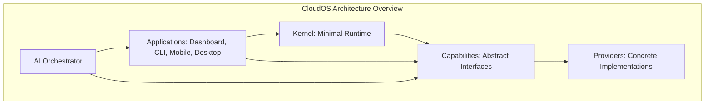

---

## 2. Architecture Goals

| Goal | Description | Target Metric |
|------|-------------|---------------|
| **Simplicity** | Minimize moving parts; every component has a single responsibility | New developer understands full architecture in < 1 hour |
| **Modularity** | Every component is swappable via the capability interface | Provider switch requires zero code changes, one config value |
| **Scalability** | From Raspberry Pi to multi-region cluster with the same binary | 100,000+ users per instance, 1M+ concurrent connections |
| **Resilience** | Failure isolation at every boundary; no cascading failures | Kernel survives any single plugin crash |
| **Performance** | Sub-100ms API p95, sub-500ms CLI startup, sub-2s dashboard TTI | Measured via distributed tracing pipeline |
| **Security** | Zero-trust architecture, defense in depth, encryption everywhere | Zero critical vulnerabilities in production |
| **Portability** | Run on any cloud, any hardware, any OS | 7 platform tiers supported with identical API |
| **Observability** | Metrics, logs, traces, and alerts are built-in, not bolted-on | Every component exports OpenTelemetry by default |
| **Extensibility** | Plugin system supports WASM, native, and HTTP runtimes | 1,000+ community plugins by end of Year 2 |
| **AI Readiness** | AI is the primary interface, not an add-on | 50%+ of operations via natural language by v2 |

---

## 3. Design Principles

### 3.1 Kernel Minimalism

The Kernel provides only what is absolutely necessary: process management, event bus, configuration, secrets, auth/authorization, audit, scheduling, and health monitoring. Nothing more. All functionality beyond these primitives lives in capabilities and providers. The Kernel does not know about compute, storage, databases, AI, or any specific domain. This ensures the Kernel remains stable, secure, and small (< 50MB binary).

### 3.2 Dependency Direction

Dependencies flow strictly inward. Applications depend on Capabilities. Capabilities depend on the Kernel. The Kernel depends on nothing outside itself. Providers implement Capabilities. No layer depends on a layer above it.

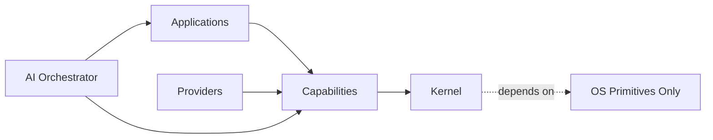

### 3.3 Capability Abstraction

Every category of functionality (compute, storage, AI, etc.) is defined by an abstract Go interface in the Capability Layer. This interface is the contract. Providers implement this interface. Applications consume it. The Kernel is never aware of which provider is active. This is the mechanism that enables zero-code provider switching.

### 3.4 Plugin Isolation

Plugins never import other plugins. Plugins never import the Kernel. All communication between plugins and between plugins and the Kernel flows through the Event Bus or through gRPC calls to capability interfaces. Community plugins run in WASM sandboxes with memory limits, CPU quotas, and no filesystem access except through capability interfaces.

### 3.5 API First

Every feature exists as a GraphQL mutation, query, or subscription before any UI is built. The CLI, dashboard, mobile app, and AI assistant all consume the same GraphQL API. There is no hidden internal API that the UI uses but external consumers cannot.

### 3.6 Event-Driven Everything

All state changes flow through the Event Bus as typed events. Components communicate asynchronously by publishing and subscribing to events. This decouples producers from consumers, enables horizontal scaling of event handlers, and provides a natural audit trail.

### 3.7 Failure Isolation

The Kernel is a single Go process. Plugins run as separate OS processes (native) or WASM sandboxes. A crash in any plugin must never affect the Kernel or any other plugin. The Kernel monitors plugin health via gRPC heartbeats and restarts failed plugins automatically. If a plugin fails to restart after a configurable threshold, the Kernel escalates to the AI Orchestrator for human notification.

### 3.8 Intelligent by Default

The AI Orchestrator is not a separate mode — it is woven into every layer. Every API response includes an `aiContext` field with AI-generated insights. Every dashboard screen has an AI assistant. Every CLI command accepts natural language. The AI Orchestrator monitors all events and proactively suggests optimizations.

---

## 4. High-Level Architecture

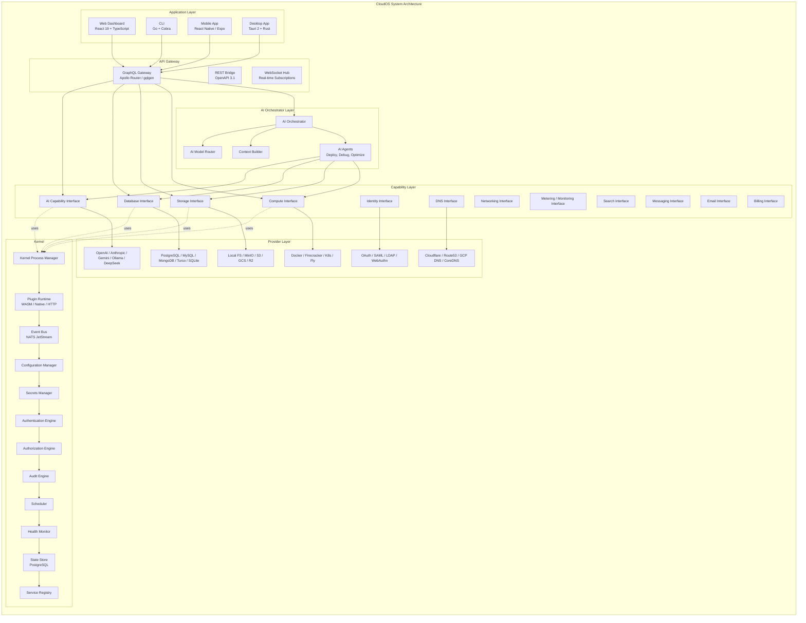

### Architectural Summary

| Layer | Responsibility | Language | Deployment |
|-------|---------------|----------|------------|
| **Kernel** | Process management, event bus, config, secrets, auth, audit, scheduling, health | Go 1.24+ | Single binary, embedded or standalone |
| **Capabilities** | Abstract interface definitions for all functionality domains | Go interfaces | Compiled into Kernel or distributed as SDK |
| **Providers** | Concrete implementations of capability interfaces | Go / WASM / Any | As plugins (.cosp packages) |
| **Applications** | User-facing interaction surfaces | TS / Go / Swift/Kotlin | Separate processes, consume API Gateway |
| **AI Orchestrator** | Intent understanding, capability coordination, proactive intelligence | Go + Python (for ML) | Separate process, communicates via gRPC + Event Bus |
| **API Gateway** | External-facing API, GraphQL federation, rate limiting, auth enforcement | Go (gqlgen + Apollo Router) | Stateless, horizontally scalable |

---

## 5. System Layers

### 5.1 Kernel Layer

**Purpose:** The Kernel is the minimal trusted computing base of CloudOS. It provides the foundational runtime services that every other component depends on. Like the Linux kernel, it manages processes, provides communication primitives, stores configuration, enforces security, and monitors health — but it has no awareness of what capabilities are running on top of it.

**What the Kernel does NOT do:**
- Does not know about compute, storage, databases, AI, or any domain
- Does not run user workloads
- Does not store user data
- Does not implement business logic
- Does not import any plugin code
- Does not depend on any external service for core operation

**Key properties:**
- Single Go binary, statically linked
- Sub-50MB on disk
- Starts in < 500ms
- Zero external dependencies for basic operation (SQLite for state when PostgreSQL is unavailable)
- OpenTelemetry instrumentation built-in
- Graceful shutdown with drain timeouts

### 5.2 Capability Layer

**Purpose:** The Capability Layer defines what CloudOS can do. Each capability is a Go interface that declares a set of operations (e.g., `ComputeCapability` defines `RunContainer`, `StopContainer`, `GetLogs`, `Scale`). These interfaces are the contracts that providers implement and that applications consume.

**Key properties:**
- Pure Go interfaces — no implementation logic
- Versioned independently from Kernel (v1, v2, etc.)
- Backward-compatible by convention (new methods are additive)
- Cross-cutting concerns (auth, audit, tracing) are handled by wrappers, not baked into interfaces
- Each capability has a corresponding protobuf service definition for gRPC

### 5.3 Provider Layer

**Purpose:** Providers are concrete implementations of capability interfaces. A provider is packaged as a `.cosp` (CloudOS Plugin) file and registered with the Kernel's Plugin Runtime. Multiple providers can implement the same capability; the active provider is selected by configuration.

**Key properties:**
- Packaged as self-contained `.cosp` archives
- Include manifest, WASM binary or native executable, UI assets, and configuration schema
- Signed with developer keys for authenticity verification
- Resource-limited via cgroups (Linux) or equivalent (macOS, Windows)
- Communicate with Kernel via gRPC over Unix domain sockets (local) or TCP (remote)
- Health-checked every 5 seconds by the Kernel

### 5.4 Application Layer

**Purpose:** Applications are the user-facing surfaces of CloudOS. They consume the API Gateway and provide interaction for humans. Every application has access to the same set of operations — no surface is second-class.

| Application | Technology | Primary Use Case |
|-------------|------------|------------------|
| **Web Dashboard** | React 19 + TypeScript + Tailwind v4 | Daily management, visual operations |
| **CLI** | Go + Cobra + charm.sh libraries | Automation, scripting, power users |
| **Mobile App** | React Native / Expo 52 | On-the-go management, incident response |
| **Desktop App** | Tauri 2 + Rust + React | Native experience, system tray, offline |
| **AI Chat** | Integrated into all surfaces | Natural language operations |

### 5.5 AI Orchestrator Layer

**Purpose:** The AI Orchestrator is the intelligence layer that coordinates capabilities to fulfill user intent. It is a separate process from the Kernel. It listens to the Event Bus for user requests (typed as `ai.request` events), builds context from capability states, selects the optimal AI model, executes AI reasoning, and dispatches commands back to capabilities.

**Key components:**
- **Context Builder:** Gathers relevant state from all capabilities (current deployments, logs, metrics, config) to provide the AI with full context
- **Model Router:** Selects the optimal AI provider and model based on task type, cost constraints, latency requirements, and privacy needs
- **Agent Framework:** Specialized AI agents for deployment, troubleshooting, cost optimization, and security
- **Tool Executor:** Translates AI-decided actions into capability API calls with safety checks
- **Safety Layer:** Enforces read-only-by-default, permission checks, destructive action confirmation, and content filtering

**The AI Orchestrator is NOT inside the Kernel.** This is a deliberate architectural decision:
- The Kernel must remain stable and minimal — AI is a capability, not a primitive
- AI providers change rapidly; the Kernel should not be coupled to their release cycles
- The AI Orchestrator can be scaled independently (more AI queries → more orchestrator replicas)
- Air-gapped deployments can run AI with local models while the Kernel remains identical

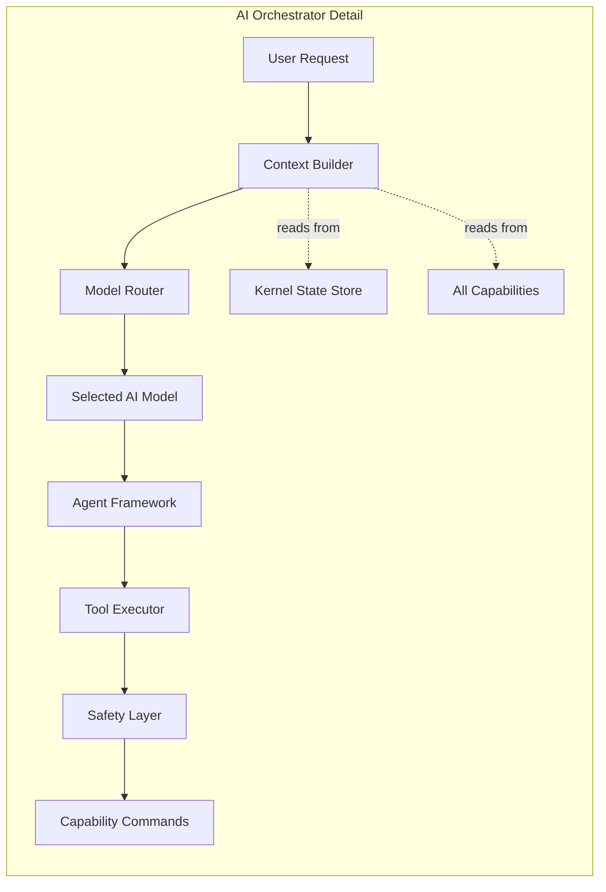

---

## 6. Kernel Subsystems

Each subsystem below follows this format: **Purpose**, **Responsibilities**, **Interfaces**, **Dependencies**, **Failure Modes**, **Scaling Strategy**, **Future Extensions**.

### 6.1 Kernel Process Manager

**Purpose:** The Process Manager is the Kernel's core orchestrator. It manages the lifecycle of all Kernel subsystems and plugins — starting, stopping, restarting, and monitoring them. It ensures that all components start in the correct order during boot and shut down gracefully during termination.

**Responsibilities:**
- Bootstrap sequence: start subsystems in dependency order
- Plugin process lifecycle: spawn, monitor, restart
- Graceful shutdown: send SIGTERM, wait for drain, force-kill after timeout
- Resource limits: enforce CPU, memory, and file descriptor limits on plugin processes
- Crash detection: detect plugin crashes via process exit signals and gRPC heartbeat failures
- Automatic restart: restart failed plugins up to configurable `maxRestarts` within a window
- Dead plugin detection: escalate if a plugin fails to start after exhausting retries

**Interfaces:**
- Internal Go interface: `ProcessManager` with `Start(name string, cmd ExecSpec)`, `Stop(name string)`, `Restart(name string)`, `List() []ProcessStatus`
- Exposes gRPC: `ProcessManagerService` for plugin registration and health reporting

**Dependencies:**
- OS process primitives (syscall.Exec, os.Process)
- Configuration Manager (for restart policies and timeouts)
- Audit Engine (for lifecycle events)

**Failure Modes:**
| Failure | Impact | Mitigation |
|---------|--------|------------|
| Plugin process crashes | Single capability unavailable | Automatic restart within 2 seconds |
| Plugin fails to start repeatedly | Capability permanently unavailable | Escalate to Health Monitor → AI Orchestrator |
| Kernel OOM | Entire platform down | Kernel memory budget; plugins are separate processes |
| Start order race | Capability registered before dependency | Retry with exponential backoff; dependency graph validation at boot |

**Scaling Strategy:**
- Local: all plugins run as child processes of the Kernel
- Distributed: plugins run on remote nodes, connected via gRPC to the Kernel's Process Manager proxy
- The Process Manager API is stateless and can be fronted by a load balancer for multi-node

**Future Extensions:**
- Dynamic resource reallocation between plugins based on usage
- Live migration of plugin processes between nodes
- Hot-swapping plugin binaries without service interruption

### 6.2 Plugin Runtime

**Purpose:** The Plugin Runtime is the sandboxed execution environment for CloudOS plugins. It supports three runtime modes: WASM (for community plugins), Native (for official and performance-critical plugins), and HTTP (for remote plugins). The Plugin Runtime enforces resource limits, capability permissions, and communication boundaries.

**Responsibilities:**
- Plugin binary extraction and verification (signature check)
- Sandbox creation with resource limits (CPU, memory, disk, network)
- gRPC server for plugin↔Kernel communication
- Health check endpoint (gRPC ping every 5 seconds)
- Resource usage reporting (CPU, memory, goroutines, open FDs)
- Plugin metadata exposure (version, permissions, capabilities provided)
- Permission enforcement: block capability calls that the plugin is not registered for

**Interfaces:**
- `PluginRuntime` Go interface: `Load(manifest PluginManifest)`, `Unload(id PluginID)`, `GetStats(id PluginID) PluginStats`
- gRPC `PluginRuntimeService`: `Register(plugin PluginInfo) returns RegistrationAck`, `Heartbeat(pid PluginID) returns HealthStatus`

**Dependencies:**
- Kernel Process Manager (for native plugin lifecycle)
- WASM runtime (wazero) for WASM plugins
- Configuration Manager (sandbox size limits)
- Secrets Manager (inject secrets into plugin at startup)

**Failure Modes:**
| Failure | Impact | Mitigation |
|---------|--------|------------|
| WASM sandbox memory exceeded | Plugin terminated, capability unavailable | Configurable memory limit; limits exposed during installation |
| Native plugin panic | Plugin process exits | Process Manager restarts; panic log captured to Audit Engine |
| HTTP plugin timeout | Single request fails | Request-level timeout; circuit breaker after N failures |
| Plugin signature invalid | Plugin refused (install fails) | Error message with reason; registry lookup for correct key |

**Scaling Strategy:**
- WASM plugins are single-threaded by design; scale by running multiple instances
- Native plugins can use goroutine concurrency within their process
- HTTP plugins scale horizontally behind their own load balancer

**Future Extensions:**
- WebAssembly System Interface (WASI) preview 2 support for filesystem access
- eBPF-based sandboxing for Linux native plugins
- Plugin hot-reload without traffic loss

### 6.3 Event Bus

**Purpose:** The Event Bus is the central nervous system of CloudOS. All asynchronous communication between components flows through it — state changes, commands, queries, audit events, and health signals. It provides at-least-once delivery guarantees, ordered delivery per partition, and durable storage for replay.

**Responsibilities:**
- Publish events from any component to named subjects
- Subscribe to subjects with push or pull consumers
- Durable message storage with configurable retention
- Exactly-once delivery semantics for critical event streams
- Message ordering within a subject partition
- Dead-letter queues for failed message processing
- Schema validation for all event types

**Interfaces:**
- `EventBus` Go interface: `Publish(subject string, event Event) error`, `Subscribe(subject string, handler Handler) Subscription`, `Request(subject string, event Event, timeout Duration) (Response, error)`
- Underlying: NATS JetStream with cluster mode for HA
- Schema registry integration: events are typed protobuf messages registered in the Schema Registry

**Dependencies:**
- Configuration Manager (NATS cluster addresses, auth credentials)
- Secrets Manager (NATS auth token if required)
- State Store (for subscription state in pull-based consumers)

**Failure Modes:**
| Failure | Impact | Mitigation |
|---------|--------|------------|
| NATS cluster unavailable | Async communication degraded | In-memory buffer; queue outgoing events until reconnection |
| Message delivery failure | Subscriber misses event | At-least-once delivery; retry with backoff; dead-letter queue |
| Schema mismatch | Event cannot be deserialized | Schema registry enforces compatibility; error logged to Audit |
| Network partition between NATS nodes | Split-brain in event ordering | NATS Raft consensus; only leader accepts publishes |

**Scaling Strategy:**
- NATS cluster with Raft-based replication for durability
- Subject partitioning by event type for parallel consumption
- Pull-based consumers for work-queue patterns (deployments, backups)
- Push-based consumers for real-time subscribers (dashboard, logs stream)

**Future Extensions:**
- Event sourcing: all state as immutable event streams
- Cross-instance event bridging for multi-region deployments
- Event replay marketplace for debugging and audit

### 6.4 Configuration Manager

**Purpose:** The Configuration Manager provides a unified, hierarchical configuration system that spans user, project, organization, and platform levels. It supports hot-reload: configuration changes take effect without restarting any component. Configuration is validated against schemas and audited.

**Responsibilities:**
- Store and retrieve configuration values from the State Store
- Hierarchical resolution: user → project → organization → platform defaults
- Schema validation: every config key has a registered JSON Schema
- Hot-reload: publish config change events on update
- Change history: every mutation is recorded with who changed what and when
- Default injection: provide sensible defaults for all unset values
- Export/import: full configuration snapshot for backup and migration

**Interfaces:**
- `ConfigManager` Go interface: `Get(key string) Value`, `Set(key string, value Value, user UserID) error`, `Watch(keyPattern string, handler ChangeHandler) Subscription`, `Schema(key string) JSONSchema`
- gRPC `ConfigService`: `GetConfig(GetConfigRequest) returns ConfigValue`, `SetConfig(SetConfigRequest) returns ConfigValue`, `WatchConfig(WatchConfigRequest) stream ConfigChangeEvent`

**Dependencies:**
- State Store (PostgreSQL for persistent config, Redis for cache)
- Event Bus (for hot-reload notifications)
- Audit Engine (for all Set operations)

**Failure Modes:**
| Failure | Impact | Mitigation |
|---------|--------|------------|
| State Store unavailable | Reads use cached values; writes queued | In-memory cache with TTL; write-back queue |
| Schema validation failure | Config change rejected | Clear error message with schema violation details |
| Hot-reload notification lost | Some components miss config update | Periodic full-config sync; poll interval configurable |

**Scaling Strategy:**
- Reads scale horizontally via Redis cache
- Writes go through PostgreSQL (linearizable)
- Watch mechanism uses NATS JetStream push consumers

**Future Extensions:**
- Feature flags as a first-class config type with gradual rollout
- Config drift detection across environments
- AI-suggested configuration optimizations

### 6.5 Secrets Manager

**Purpose:** The Secrets Manager provides secure storage, rotation, and injection of sensitive values (API keys, passwords, tokens, certificates). Secrets are encrypted at rest using AES-256-GCM, encrypted in transit via TLS 1.3, and never logged or displayed after creation.

**Responsibilities:**
- Encrypted storage of secret values in the State Store
- Secret creation with automatic value generation (for passwords, API keys)
- Secret rotation on configurable schedules (30, 60, 90 days)
- Secret injection into plugin environments at startup
- Access audit logging: every read is logged with actor and reason
- Version tracking: each secret has a version history with rollback support
- Integration with external secret stores (HashiCorp Vault, AWS Secrets Manager)

**Interfaces:**
- `SecretsManager` Go interface: `Create(key string, value SecretValue, policy SecretPolicy) (SecretID, error)`, `Read(id SecretID, reason string) (SecretValue, error)`, `Rotate(id SecretID) error`, `List() []SecretMetadata`
- gRPC `SecretsService`: `CreateSecret`, `ReadSecret`, `RotateSecret`, `ListSecrets`

**Dependencies:**
- State Store (encrypted at rest via pgcrypto or application-level AEAD)
- Key Management: Kernel derives encryption key from cluster master key
- Audit Engine (all Read and Create operations)
- Event Bus (rotation notifications)

**Failure Modes:**
| Failure | Impact | Mitigation |
|---------|--------|------------|
| Master key lost | All secrets unrecoverable | Key escrow; HSM integration for enterprise |
| External vault unavailable | Falls back to local encrypted store | Secrets Manager caches decrypted values (in-memory, encrypted) |
| Rotation failure | Secret expires; dependent services fail | Rotation is atomic with verification; rollback on failure |

**Scaling Strategy:**
- Reads are served from in-memory encrypted cache
- Writes go through the Kernel's State Store with encryption
- External vault integration for enterprise scale

**Future Extensions:**
- Dynamic secrets with TTL (generate on-demand, expire automatically)
- Secret-less trust (mutual TLS, workload identity)
- Cross-cluster secret replication for DR

### 6.6 Authentication Engine

**Purpose:** The Authentication Engine verifies identity. It supports multiple authentication methods (password, OAuth, SAML, WebAuthn, API keys) through a common interface and issues signed JWT tokens for session management.

**Responsibilities:**
- Verify credentials against configured identity providers
- Issue JWT access tokens (short-lived, 15 minutes default)
- Issue refresh tokens (long-lived, 7 days default, rotation on use)
- Validate tokens on every API request
- Support multiple authentication methods via the Identity Capability
- Rate-limit failed login attempts per user and per IP
- Session management: list active sessions, revoke sessions

**Interfaces:**
- `AuthenticationEngine` Go interface: `Authenticate(method AuthMethod, credentials Credentials) (Session, error)`, `ValidateToken(token string) (Claims, error)`, `RefreshToken(token string) (Session, error)`, `RevokeSession(sessionID SessionID) error`
- gRPC `AuthService`: `Login`, `Logout`, `Validate`, `Refresh`, `ListSessions`, `RevokeSession`

**Dependencies:**
- Identity Capability (for OAuth, SAML, LDAP provider plugins)
- State Store (for session records, refresh token hashes)
- Secrets Manager (for JWT signing key)
- Audit Engine (all login attempts, success or failure)

**Failure Modes:**
| Failure | Impact | Mitigation |
|---------|--------|------------|
| Identity provider unavailable | OAuth/SAML login degraded | Fallback to local password auth if configured |
| JWT signing key compromised | Tokens can be forged | Immediate key rotation via Secrets Manager; blacklist all current tokens |
| Session store unavailable | New sessions cannot be created | In-memory session cache with degraded operation warning |

**Scaling Strategy:**
- Token validation is stateless (JWT verification via public key) — no session store lookup for read operations
- Session creation goes through State Store (PostgreSQL) with Redis caching
- Refresh token rotation minimizes long-term session storage

**Future Extensions:**
- Continuous authentication (risk-based session scoring)
- Passkey-first authentication (WebAuthn as primary)
- Decentralized identity (DID, Verifiable Credentials)

### 6.7 Authorization Engine

**Purpose:** The Authorization Engine determines whether an authenticated actor (user, service, plugin) is permitted to perform a specified action on a specified resource. It implements Role-Based Access Control (RBAC) with Attribute-Based Access Control (ABAC) extensions.

**Responsibilities:**
- Evaluate access requests against policies
- Support role-based permissions (RBAC): roles assigned to users, permissions assigned to roles
- Support attribute-based conditions (ABAC): time-of-day, IP range, resource tags, data classification
- Policy inheritance: organization → project → resource
- Deny by default: any request not explicitly allowed is denied
- Policy caching for fast evaluation
- Policy change propagation with near-realtime latency

**Interfaces:**
- `AuthorizationEngine` Go interface: `Check(actor Actor, action Action, resource Resource, context Context) (Decision, error)`, `AddPolicy(policy Policy) error`, `RemovePolicy(policy Policy) error`, `ListPolicies() []Policy`
- gRPC `AuthzService`: `Authorize`, `AddPolicy`, `RemovePolicy`, `ListPolicies`, `BulkCheck`

**Dependencies:**
- Authentication Engine (for identity verification before authorization)
- State Store (for policy storage)
- Event Bus (policy change notifications)
- Audit Engine (all authorization decisions, especially denials)

**Failure Modes:**
| Failure | Impact | Mitigation |
|---------|--------|------------|
| Policy store unavailable | Cached policy decision used; new policies cannot be added | Fallback to last cached policy; deny-all for uncached requests |
| Policy cache miss under load | Increased latency for authorization decisions | Pre-warm cache at startup; LRU with generous capacity |

**Scaling Strategy:**
- Authorization is a read-heavy workload; scales horizontally with policy cache
- Policy writes are infrequent and go through State Store
- Bulk authorization for batch operations (deploying 10 services)

**Future Extensions:**
- Relationship-Based Access Control (ReBAC) for fine-grained resource hierarchies
- Policy as code (OPA/Rego integration)
- Time-bound, delegatable permissions

### 6.8 Audit Engine

**Purpose:** The Audit Engine provides an immutable, cryptographically verifiable record of every significant operation in CloudOS. Every authentication, authorization decision, configuration change, secret access, deployment, and resource lifecycle event is recorded with who, what, when, where, and outcome.

**Responsibilities:**
- Capture audit events from all Kernel subsystems and capabilities
- Immutable append-only storage with cryptographic chaining
- Integrity verification (detect tampering)
- Search and export via API
- Configurable retention policies
- Real-time stream to SIEM systems for enterprise deployments

**Interfaces:**
- `AuditEngine` Go interface: `Record(event AuditEvent) error`, `Query(filter AuditFilter) ([]AuditEvent, error)`, `VerifyIntegrity(from Time, to Time) (bool, error)`, `Export(format ExportFormat, filter AuditFilter) ([]byte, error)`
- gRPC `AuditService`: `Record`, `Query`, `VerifyIntegrity`, `StreamAuditEvents` (server-streaming)

**Dependencies:**
- Event Bus (consume all mutation events from the bus; every mutation publishes an audit event)
- State Store (immutable audit log storage, append-only table)
- Configuration Manager (retention policies)

**Failure Modes:**
| Failure | Impact | Mitigation |
|---------|--------|------------|
| Audit storage full | New audit events lost | Alert on storage capacity threshold; rotation to cold storage |
| Cryptographic chain broken (tamper detected) | Integrity check fails | Alert with tamper evidence; isolate compromised records |
| SIEM stream unavailable | Enterprise audit pipeline delayed | Buffer events locally with backpressure |

**Scaling Strategy:**
- Write-heavy: append-only, no updates or deletes
- Partitioned by time (daily or hourly partitions)
- Cold storage for records older than retention period
- Write-ahead buffer for batching

**Future Extensions:**
- Blockchain-anchored audit trails (publish chain hashes to public ledger)
- AI-powered anomaly detection on audit patterns
- Automated compliance report generation from audit data

### 6.9 Scheduler

**Purpose:** The Scheduler handles time-based execution of tasks within the CloudOS platform. It manages cron jobs, one-time delayed tasks, recurring maintenance operations, and automated workflow triggers.

**Responsibilities:**
- Cron expression parsing and validation
- Task scheduling with configurable timezone
- Distributed task execution (which node runs the task)
- Execution history and status tracking
- Missed execution detection and recovery
- Task dependency management (task B runs after task A completes)

**Interfaces:**
- `Scheduler` Go interface: `Schedule(spec ScheduleSpec) (JobID, error)`, `Cancel(id JobID) error`, `List() []JobStatus`, `GetHistory(id JobID) []ExecutionRecord`
- gRPC `SchedulerService`: `Schedule`, `Cancel`, `ListJobs`, `GetExecutionHistory`

**Dependencies:**
- Event Bus (publish `scheduler.tick` events; execute tasks asynchronously)
- State Store (persist schedule definitions and execution state)
- Health Monitor (ensure scheduled node is healthy before assigning tasks)

**Failure Modes:**
| Failure | Impact | Mitigation |
|---------|--------|------------|
| Scheduler node fails | Scheduled tasks miss execution window | Leader election among Scheduler replicas; tasks are picked up by new leader |
| Task execution timeout | Task fails silently | Configurable timeout with dead-letter notification |
| Cron expression error | Task never fires | Schema validation on Schedule; clear error on invalid expression |

**Scaling Strategy:**
- Single active scheduler per cluster (leader election via NATS Key-Value store)
- Multiple standby schedulers for HA
- Task execution is distributed across the node pool

**Future Extensions:**
- Calendar-based scheduling (business days, holidays)
- AI-optimized scheduling for cost (run during off-peak pricing windows)
- Interdependent workflow scheduling (DAG-based execution)

### 6.10 Health Monitor

**Purpose:** The Health Monitor provides continuous health checking for all Kernel subsystems, plugins, and infrastructure dependencies. It aggregates health signals, maintains cluster-wide health status, triggers alerts on degradation, and feeds health data into the AI Orchestrator for incident response.

**Responsibilities:**
- Periodic health checks (TCP, HTTP, gRPC ping) for all components
- Health status aggregation into cluster-wide view
- Degradation detection (latency spikes, error rate increases)
- Alert triggering via Event Bus (`health.alert`)
- Health data exposure via API and dashboard
- Integration with self-healing automation (auto-restart unhealthy plugins)

**Interfaces:**
- `HealthMonitor` Go interface: `RegisterCheck(name string, check HealthCheck)`, `Status() HealthReport`, `History(name string, duration Duration) []HealthRecord`
- gRPC `HealthService`: `Check(HealthCheckRequest) returns HealthCheckResponse`, `Watch(HealthWatchRequest) stream HealthEvent`

**Dependencies:**
- Event Bus (publish health events)
- Configuration Manager (check intervals, thresholds)
- Audit Engine (health state transitions)

**Failure Modes:**
| Failure | Impact | Mitigation |
|---------|--------|------------|
| Health check false positive | Unnecessary alert and possible auto-remediation | Multiple check samples before declaring unhealthy; configurable threshold |
| Health check false negative | Degradation goes undetected | Redundant health checks from multiple sources |
| Health Monitor itself fails | No health data available | Redundant Health Monitor instances; self-monitoring via external watchdog |

**Scaling Strategy:**
- Health checks are local to each node
- Cluster-wide health view aggregated via Event Bus subscriptions
- External health checks from global vantage points for public endpoints

**Future Extensions:**
- Predictive health (ML models forecasting degradation before it occurs)
- Dependency health propagation (if database is slow, mark dependent services as degraded)
- Automated runbook execution triggered by health state

### 6.11 State Store

**Purpose:** The State Store is the persistent storage system for all Kernel data — configuration, secrets (encrypted), audit logs, schedule definitions, session records, plugin metadata, service registry entries, and health history. PostgreSQL is the default implementation with SQLite as the embedded fallback for single-node deployments.

**Responsibilities:**
- Persistent storage with ACID transactions for Kernel state
- Connection pooling for concurrent access
- Migration management (schema versioning, auto-migrate on upgrade)
- Read replica support for query scaling
- Point-in-time recovery for disaster scenarios

**Interfaces:**
- Accessed through subsystem-specific DAOs (Data Access Objects); no direct SQL access from Kernel subsystems
- Migration interface: `ApplyMigrations() error`, `Version() int`, `Rollback(toVersion int) error`

**Dependencies:**
- Kernel startup sequence (State Store must be available before most subsystems)

**Failure Modes:**
| Failure | Impact | Mitigation |
|--------|--------|------------|
| PostgreSQL unavailable | Kernel operates in degraded mode (SQLite fallback) | Automatic failover to embedded SQLite; sync when PostgreSQL recovers |
| Connection pool exhausted | New requests blocked | Pool monitoring; auto-scale pool size; queue with backpressure |
| Migration failure | Kernel cannot start | Migration runs in transaction; rollback on failure; manual intervention |

**Scaling Strategy:**
- Write master with read replicas for query load
- Connection pooling via PgBouncer for high-concurrency scenarios
- Horizontal sharding for audit logs (by time partition)

**Future Extensions:**
- Distributed SQL (CockroachDB, YugabyteDB) for multi-region active-active
- Event sourcing as primary storage pattern
- Automated query performance optimization

### 6.12 Service Registry

**Purpose:** The Service Registry maintains a real-time directory of all active services, plugins, and their network endpoints within a CloudOS cluster. It enables service discovery for inter-plugin communication and provides health-aware routing.

**Responsibilities:**
- Register services with their gRPC/HTTP endpoints and capability interfaces
- Deregister services on graceful shutdown
- Health-aware lookups (only return healthy instances)
- Watch-based subscription for service change notifications
- Metadata storage (version, capabilities, labels)

**Interfaces:**
- `ServiceRegistry` Go interface: `Register(spec ServiceSpec) error`, `Deregister(id ServiceID) error`, `Lookup(capability CapabilityName) ([]ServiceEndpoint, error)`, `Watch(capability CapabilityName, handler ChangeHandler) Subscription`
- gRPC `RegistryService`: `Register`, `Deregister`, `Lookup`, `Watch`

**Dependencies:**
- Health Monitor (for health-aware lookups)
- Event Bus (for service change notifications)
- State Store (for persistent service records)

**Failure Modes:**
| Failure | Impact | Mitigation |
|---------|--------|------------|
| Registry service unavailable | New services cannot register; lookups use cache | Client-side cache with TTL; retry registration |
| Stale registration (plugin crashed without deregistering) | Traffic routed to dead endpoint | Heartbeat-based expiration; stale entries removed after grace period |

**Scaling Strategy:**
- Local registry on each node (cached, watches for changes)
- Central registry backed by State Store for cluster-wide discovery
- Client-side caching with server-sent invalidation

**Future Extensions:**
- gRPC resolver integration (built-in client-side load balancing)
- Mesh-level service discovery for cross-cluster communication
- Weighted routing for canary deployments

---

## 7. Capability Interfaces

Each capability interface defines an abstract contract. The format below applies to all capabilities in sections 7.1 through 7.12.

### 7.1 Compute Capability

**Purpose:** The Compute Capability abstracts the execution of user workloads — containers, serverless functions, and virtual machines. It provides a unified interface for running, stopping, scaling, and monitoring workloads regardless of the underlying orchestration technology.

**Responsibilities:**
- Run workloads from container images or function code
- Stop, restart, and delete workloads
- Scale workloads (vertical: resize resources; horizontal: change replica count)
- Stream logs from workload stdout/stderr
- Report resource usage (CPU, memory, network)
- Provide health status for each workload instance

**Interfaces:**
- `ComputeCapability`: `Run(spec WorkloadSpec) (WorkloadID, error)`, `Stop(id WorkloadID) error`, `GetStatus(id WorkloadID) WorkloadStatus`, `GetLogs(id WorkloadID, opts LogOptions) stream LogEntry`, `Scale(id WorkloadID, replicas int) error`

**Dependencies:**
- Kernel Event Bus (publish workload state changes)
- Kernel Health Monitor (report compute node health)
- Networking Capability (for workload network configuration)

**Failure Modes:**
| Failure | Impact | Mitigation |
|---------|--------|------------|
| Provider down (Docker daemon fails) | No workloads can run on node | Failover to another compute provider in the pool |
| Workload OOM | Single workload killed | Automatic restart with backoff; adjust memory limits |
| Image pull failure | Workload cannot start | Retry with backoff; fallback to cached image |

**Scaling Strategy:**
- Workload distribution across provider instances
- Horizontal scaling of workload replicas based on metrics
- Provider health-based load shedding

**Future Extensions:**
- GPU workload scheduling
- Spot/preemptible instance support
- WebAssembly workload execution alongside containers

### 7.2 Storage Capability

**Purpose:** The Storage Capability provides object storage with an S3-compatible API. It abstracts away the underlying storage provider while presenting a consistent interface for buckets, objects, access control, and lifecycle management.

**Responsibilities:**
- Create, list, delete buckets
- Upload, download, delete objects
- Generate pre-signed URLs for temporary access
- Set bucket policies (public, private, custom)
- Manage object lifecycle rules (expiration, transitions)
- Static website hosting from buckets

**Interfaces:**
- `StorageCapability`: `CreateBucket(name string, opts BucketOptions) error`, `ListBuckets() []Bucket`, `PutObject(bucket string, key string, data io.Reader, opts PutOptions) (ObjectInfo, error)`, `GetObject(bucket string, key string) (io.Reader, ObjectInfo, error)`, `DeleteObject(bucket string, key string) error`, `PresignURL(bucket string, key string, expiry Duration) (string, error)`

**Dependencies:**
- Kernel Event Bus (publish storage events for audit and notifications)
- Kernel Secrets Manager (storage provider credentials)

**Failure Modes:**
| Failure | Impact | Mitigation |
|---------|--------|------------|
| Provider unavailable (S3 outage) | Storage reads/writes fail | Failover to secondary provider with replication lag |
| Quota exceeded | Writes rejected | Pre-quota alerting; auto-expand if configured |
| Data corruption detected | Object integrity compromised | Checksum verification on all operations; auto-repair from replicas |

**Scaling Strategy:**
- Provider-level scaling (S3 is infinitely scalable)
- Multi-region replication for cross-region access patterns
- Cache layer for frequently accessed objects

**Future Extensions:**
- Content-addressed storage (IPFS integration)
- Storage class transitions (hot → warm → cold → archive)
- File versioning and soft-delete with recycle bin

### 7.3 Database Capability

**Purpose:** The Database Capability provides managed relational and NoSQL database provisioning, connection management, backup orchestration, and scaling. PostgreSQL is the primary supported engine; additional engines are available through provider plugins.

**Responsibilities:**
- Provision database instances with specified engine, version, and resources
- Generate connection strings with auto-rotated credentials
- Manage read replicas for horizontal read scaling
- Orchestrate backups (snapshot-based for databases)
- Scale resources (CPU, memory, storage) without downtime
- Provide query performance metrics

**Interfaces:**
- `DatabaseCapability`: `Create(spec DatabaseSpec) (DatabaseID, error)`, `GetConnectionString(id DatabaseID) (string, error)`, `CreateReadReplica(id DatabaseID, region string) (DatabaseID, error)`, `Scale(id DatabaseID, resources ResourceSpec) error`, `GetMetrics(id DatabaseID) DatabaseMetrics`, `CreateBackup(id DatabaseID) (BackupID, error)`

**Dependencies:**
- Compute Capability (for running database containers)
- Storage Capability (for backup storage)
- Kernel Secrets Manager (for credential generation and storage)
- Kernel Event Bus (backup completion, failover events)

**Failure Modes:**
| Failure | Impact | Mitigation |
|---------|--------|------------|
| Primary database failure | All dependent applications affected | Automatic failover to replica; connection string update propagated |
| Backup failure | No new backup for retention window | Alert with retry; fallback to WAL-based recovery |
| Connection pool exhaustion | New connections rejected | Auto-scale pool; alert on utilization threshold |

**Scaling Strategy:**
- Read replicas for horizontal read scaling
- Vertical scaling for CPU/memory (no-downtime resize if provider supports it)
- Connection pooling via PgBouncer for high connection counts

**Future Extensions:**
- Sharding for write scaling (Citus, pg_partman)
- Cross-region replication for disaster recovery
- Query performance insights with AI-powered optimization suggestions

### 7.4 AI Capability

**Purpose:** The AI Capability provides a unified interface for AI model inference, embeddings, and completions. It abstracts away the differences between AI providers (OpenAI, Anthropic, Gemini, Ollama, etc.) behind a single API, enabling provider-agnostic AI features.

**Responsibilities:**
- Text completions and chat completions
- Embedding generation for vector search
- Model selection (model name, provider routing)
- Streaming responses (SSE)
- Context window management
- Provider failover on errors or rate limits

**Interfaces:**
- `AICapability`: `ChatCompletion(req ChatRequest) (ChatResponse, error)`, `ChatCompletionStream(req ChatRequest) stream ChatChunk`, `GenerateEmbedding(req EmbeddingRequest) (EmbeddingResponse, error)`, `ListModels() []ModelInfo`

**Dependencies:**
- Kernel Configuration Manager (AI provider selection, API keys)
- Kernel Secrets Manager (AI provider API keys)
- Kernel Event Bus (token usage tracking events for billing)

**Failure Modes:**
| Failure | Impact | Mitigation |
|---------|--------|------------|
| Primary provider rate-limited | Request delayed or fails | Automatic failover to secondary provider |
| Provider API outage | AI features unavailable | Failover chain; fallback to local Ollama if configured |
| Token limit exceeded | Request truncated | Automatic context compression; retry with shorter input |
| Cost spike (model upgrade changes pricing) | Unexpected billing | Cost tracking per request; budget alerts; model selection respects cost constraints |

**Scaling Strategy:**
- Stateless: AI capability instances scale horizontally
- Provider-level round-robin for load distribution
- Request queuing with priority for burst management

**Future Extensions:**
- Multi-modal model support (image, audio, video input)
- Fine-tuned model deployment
- AI agent registry for specialized agents
- Token-level billing with per-request cost awareness

### 7.5 Identity Capability

**Purpose:** The Identity Capability provides authentication against external identity providers — OAuth 2.0 providers, SAML 2.0 identity providers, LDAP directories, and WebAuthn/FIDO2 authenticators. Each provider is a plugin that implements this interface.

**Responsibilities:**
- Initiate OAuth 2.0 authorization flows
- Verify SAML 2.0 assertions
- Authenticate against LDAP/Active Directory
- Validate WebAuthn assertions
- Return user identity information (email, name, groups)

**Interfaces:**
- `IdentityCapability`: `Authenticate(method AuthMethod, credentials bytes) (Identity, error)`, `InitiateOAuth(provider string, redirectURL string) (AuthURL string, state string, error)`, `HandleOAuthCallback(provider string, code string, state string) (Identity, error)`, `VerifySAMLAssertion(assertion string) (Identity, error)`, `VerifyWebAuthn(credential WebAuthnCredential) (Identity, error)`

**Dependencies:**
- Kernel Authentication Engine (receives verified identities)
- Kernel Secrets Manager (OAuth client secrets, SAML private keys)
- Kernel Audit Engine (all authentication events)

**Failure Modes:**
| Failure | Impact | Mitigation |
|---------|--------|------------|
| External IdP unavailable | SSO login fails | Fallback to local password auth if configured |
| OAuth token expired | Cannot refresh session | Redirect user through re-authentication flow |
| SAML certificate rotated without notice | SAML assertions rejected | Auto-fetch new certificate; alert on mismatch |

**Scaling Strategy:**
- Stateless: identity verification is CPU-bound cryptographic work
- Scale horizontally behind the API Gateway

**Future Extensions:**
- Decentralized identity (DID, Verifiable Credentials)
- Continuous authentication (biometric re-verification during session)
- Passkey-first identity with WebAuthn as primary

### 7.6 Networking Capability

**Purpose:** The Networking Capability manages network infrastructure — firewalls, load balancers, VPNs, and traffic routing. It abstracts cloud-provider-specific networking constructs behind a policy-driven interface.

**Responsibilities:**
- Create and manage firewall rules (allow/deny by IP, port, protocol)
- Provision and configure load balancers
- Manage SSL/TLS termination at the network edge
- Configure VPN connections and private networks
- Monitor traffic patterns and bandwidth usage

**Interfaces:**
- `NetworkingCapability`: `CreateFirewallRule(spec FirewallRuleSpec) (RuleID, error)`, `DeleteFirewallRule(id RuleID) error`, `ProvisionLoadBalancer(spec LBSpec) (LBID, error)`, `GetLoadBalancerStatus(id LBID) LBStatus`, `CreateVPNConnection(spec VPNSpec) (VPNID, error)`, `GetTrafficMetrics(id ResourceID) TrafficMetrics`

**Dependencies:**
- Compute Capability (for load balancer instances)
- DNS Capability (for routing traffic to load balancers)
- Kernel Configuration Manager (network policies, defaults)
- Kernel Audit Engine (all firewall and network changes)

**Failure Modes:**
| Failure | Impact | Mitigation |
|---------|--------|------------|
| Firewall provider misconfiguration | Services unreachable or insecure | Immutable firewall history with instant rollback |
| Load balancer health check failure | Traffic routed to unhealthy instance | Health check gating; auto-drain unhealthy instances |
| VPN tunnel failure | Private network connectivity lost | Automatic failover to secondary tunnel |

**Scaling Strategy:**
- Load balancers scale horizontally behind anycast IP
- Firewall rules are distributed to edge nodes
- VPN concentrators scale with node pool

**Future Extensions:**
- Service mesh (mTLS, traffic splitting, request-level routing)
- DDoS mitigation automation
- Intent-based networking (natural language firewall policy)

### 7.7 DNS Capability

**Purpose:** The DNS Capability manages domain name resolution — record creation, propagation, health-check-based failover, and DNSSEC signing. It abstracts different DNS providers behind a unified interface.

**Responsibilities:**
- Create, update, delete DNS records (A, AAAA, CNAME, MX, TXT, NS, SRV)
- Monitor DNS propagation status
- Implement health-check-based DNS failover
- Manage DNSSEC key signing
- Provide secondary DNS for redundancy

**Interfaces:**
- `DNSCapability`: `CreateRecord(zone string, record DNSRecord) error`, `UpdateRecord(zone string, record DNSRecord) error`, `DeleteRecord(zone string, recordID RecordID) error`, `ListRecords(zone string) []DNSRecord`, `CheckPropagation(zone string, record DNSRecord) PropagationStatus`

**Dependencies:**
- Kernel Configuration Manager (DNS provider credentials)
- Health Monitor (for health-check-based record updates)
- Networking Capability (IP address allocation)

**Failure Modes:**
| Failure | Impact | Mitigation |
|---------|--------|------------|
| DNS provider API rate-limited | Record updates delayed | Queue updates; batch operations |
| Propagation delay | Traffic to old IP after change | Estimated propagation time in API response |
| DNSSEC signing failure | DNS resolution fails for DNSSEC-aware clients | Alert; auto-disable DNSSEC if unrecoverable |

**Scaling Strategy:**
- DNS is inherently distributed (authoritative nameservers)
- Provider-level redundancy (primary + secondary DNS)

**Future Extensions:**
- Geo-aware DNS routing for latency optimization
- DNS-based service discovery for internal microservices
- Blockchain-based DNS for decentralized domains

### 7.8 Monitoring Capability

**Purpose:** The Monitoring Capability provides centralized metrics collection, alert evaluation, and dashboard rendering for all CloudOS resources. It is the observability foundation that all other capabilities and applications depend on for operational visibility.

**Responsibilities:**
- Collect metrics from all resources (CPU, memory, request rate, error rate, latency)
- Evaluate alert rules against metrics
- Deliver alerts through notification channels
- Serve pre-built and custom dashboards
- Provide metrics API for the AI Orchestrator
- Retain metric history with configurable retention

**Interfaces:**
- `MonitoringCapability`: `RecordMetric(name string, value float64, labels map[string]string, timestamp Time) error`, `QueryMetrics(query MetricQuery) ([]MetricSeries, error)`, `CreateAlertRule(spec AlertRuleSpec) (RuleID, error)`, `GetDashboard(id DashboardID) Dashboard`, `ListAlerts(filter AlertFilter) []Alert`

**Dependencies:**
- Event Bus (consume metrics events from all sources)
- Kernel Configuration Manager (alert thresholds, notification channels)
- Kernel Health Monitor (infrastructure-level metrics)

**Failure Modes:**
| Failure | Impact | Mitigation |
|---------|--------|------------|
| Metrics store unavailable | New metrics not recorded; dashboards stale | In-memory buffer with spill-to-disk; replay on recovery |
| Alert evaluation node fails | Alerts not evaluated for period | Leader election among alert evaluators |
| Notification channel down | Alert not delivered | Fallback channel (e.g., Slack fails → email, email fails → SMS) |

**Scaling Strategy:**
- Metrics ingestion scales horizontally via partitioning
- Alert evaluation is a stateful workload with leader election
- Dashboard queries go through read replicas

**Future Extensions:**
- AI-powered anomaly detection (adaptive baselines)
- Predictive alerting (alert before threshold is crossed)
- Custom metric DSL for advanced aggregation

### 7.9 Search Capability

**Purpose:** The Search Capability provides full-text and semantic search across all CloudOS resources, logs, documentation, and marketplace content. It powers the global search bar, log search, and AI context building.

**Responsibilities:**
- Index all CloudOS resources for full-text search
- Provide typo-tolerant fuzzy matching
- Support faceted search with filtering
- Rank results by relevance
- Re-index on resource changes (near-real-time)
- Provide search API for AI Orchestrator context building

**Interfaces:**
- `SearchCapability`: `Index(resourceType string, id string, data SearchableData) error`, `Delete(resourceType string, id string) error`, `Search(query string, filters SearchFilter) SearchResults`, `ReindexAll() error`

**Dependencies:**
- Event Bus (consume resource change events for index updates)
- State Store (search index storage, or delegate to provider)

**Failure Modes:**
| Failure | Impact | Mitigation |
|---------|--------|------------|
| Search index unavailable | Search functionality degraded | Fallback to database full-text search (slower) |
| Index synchronization lag | Results slightly stale | Near-real-time indexing with sub-second latency target |

**Scaling Strategy:**
- Search index scales horizontally with sharding
- Read replicas for query load
- Index write master with replica sync

**Future Extensions:**
- Vector/semantic search via pgvector or dedicated vector DB
- Cross-instance search federation
- Natural language query parsing

### 7.10 Messaging Capability

**Purpose:** The Messaging Capability provides asynchronous publish-subscribe messaging for real-time features — WebSocket connections, event streaming, notification delivery, and inter-service communication within user applications.

**Responsibilities:**
- Pub/sub messaging with subject-based routing
- WebSocket endpoint for client-side subscriptions
- Message persistence with replay capability
- At-least-once delivery guarantees
- Dead-letter queue management

**Interfaces:**
- `MessagingCapability`: `Publish(subject string, message Message) error`, `Subscribe(subject string, handler MessageHandler) Subscription`, `Unsubscribe(sub Subscription) error`, `QueueSubscribe(queue string, subject string, handler MessageHandler) Subscription`

**Dependencies:**
- Kernel Event Bus (extend event bus pattern to user-facing messaging)
- Authentication Engine (WebSocket authentication)
- Kernel Audit Engine (message publishing events for compliance)

**Failure Modes:**
| Failure | Impact | Mitigation |
|---------|--------|------------|
| Message broker unavailable | Real-time features degraded | Client-side reconnection with backoff; message buffering |
| High message volume | Delivery latency increases | Auto-scaling consumer groups; backpressure mechanisms |

**Scaling Strategy:**
- NATS cluster for horizontal scalability
- Consumer group partitioning for parallel processing
- WebSocket connections distributed across gateway instances

**Future Extensions:**
- Exactly-once delivery semantics
- Message schema registry with evolution support
- Event bridge to external message systems (Kafka, SQS, RabbitMQ)

### 7.11 Email Capability

**Purpose:** The Email Capability provides transactional email sending for platform notifications and user application needs. It abstracts multiple email providers behind a unified interface with deliverability optimization built-in.

**Responsibilities:**
- Send transactional emails (HTML, plain text, with attachments)
- Manage email templates with variable interpolation
- Configure DKIM, SPF, DMARC for sending domains
- Track delivery status (sent, delivered, bounced, opened, clicked)
- Handle bounce processing and list cleaning

**Interfaces:**
- `EmailCapability`: `Send(spec EmailSpec) (MessageID, error)`, `SendTemplate(templateID string, data TemplateData, to Recipient) (MessageID, error)`, `GetDeliveryStatus(id MessageID) DeliveryStatus`, `ListTemplates() []Template`

**Dependencies:**
- Kernel Configuration Manager (SMTP settings, provider selection)
- Kernel Secrets Manager (SMTP credentials, API keys)
- Kernel Audit Engine (email sending audit log)

**Failure Modes:**
| Failure | Impact | Mitigation |
|---------|--------|------------|
| SMTP relay unavailable | Emails queued but not sent | Automatic failover to secondary provider |
| Bounce rate too high | Sending reputation damaged | Automatic sending pause; alert to admin |
| DKIM misconfiguration | Emails marked as spam | Pre-flight validation on domain configuration |

**Scaling Strategy:**
- Provider-level round-robin for volume distribution
- Dedicated IP pools for high-volume senders
- Queue-based sending with rate limiting per provider limits

**Future Extensions:**
- AI-optimized send times per recipient
- Automated deliverability monitoring and remediation
- Multi-language template support

### 7.12 Billing Capability

**Purpose:** The Billing Capability tracks usage, calculates costs, generates invoices, and processes payments. It provides real-time cost visibility and budget enforcement across all CloudOS resources.

**Responsibilities:**
- Meter resource usage across all capabilities
- Calculate costs based on configurable pricing tiers
- Generate invoices on billing cycles
- Process payments through configured payment providers
- Enforce spending caps (hard and soft limits)
- Provide cost breakdowns by project, environment, resource, and user

**Interfaces:**
- `BillingCapability`: `RecordUsage(metric UsageMetric, value float64, timestamp Time) error`, `GetCurrentCosts(filter CostFilter) CostBreakdown`, `GenerateInvoice(period InvoicePeriod) Invoice`, `SetBudget(budget Budget) (BudgetID, error)`, `GetBudgetStatus(id BudgetID) BudgetStatus`

**Dependencies:**
- Event Bus (consume usage events from all capabilities)
- Kernel Configuration Manager (pricing configuration)
- Kernel Secrets Manager (payment provider credentials)
- State Store (usage records, invoice history)

**Failure Modes:**
| Failure | Impact | Mitigation |
|---------|--------|------------|
| Usage metering pipeline fails | Revenue leakage (unmetered usage) | In-memory buffer with disk spill; retry on recovery |
| Payment provider unavailable | Invoices cannot be processed | Retry with backoff; extend payment due dates |
| Cost calculation error | Incorrect billing | Double-entry verification; manual reconciliation process |

**Scaling Strategy:**
- Usage events are high-volume; batch processing at scale
- Cost calculation runs on schedule (not real-time)
- Invoice generation is a batch workload with scheduled execution

**Future Extensions:**
- Usage-based pricing with per-second billing granularity
- Marketplace revenue sharing (plugin developer payouts)
- Commitment-based discounts (reserved capacity pricing)

---

## 8. Provider Layer

The Provider Layer is where capability interfaces meet real-world infrastructure. Providers are the concrete implementations that actually do the work — running containers, storing files, provisioning databases, calling AI APIs.

### Provider Packaging

Every provider is distributed as a `.cosp` (CloudOS Plugin) package:

```
my-provider.cosp
├── manifest.yaml          # Name, version, author, capabilities provided
├── provider.wasm          # WASM binary (or native binary for system plugins)
├── config.schema.json     # JSON Schema for provider configuration
├── ui/                    # Optional: custom dashboard panels
│   ├── panel.js
│   └── panel.css
├── assets/                # Icons, screenshots
│   ├── icon.svg
│   └── screenshot.png
└── permissions.yaml       # Required Kernel permissions
```

### Provider Types

| Type | Runtime | Security | Performance | Use Case |
|------|---------|----------|-------------|----------|
| **System** | Native (Go) | Process-level isolation | Native speed | Built-in capabilities |
| **Official** | WASM | Memory-sandboxed, no FS | Near-native (WASI) | CloudOS-maintained providers |
| **Community** | WASM | Full sandbox, resource limits | Moderate (WASM) | Community-contributed providers |
| **HTTP** | Remote process | Network-level isolation | Depends on network | External service integrations |
| **Enterprise** | Native or WASM | Custom security profile | Configurable | Enterprise private providers |

### Provider Registration and Lifecycle

1. User installs provider plugin via `cloudos plugin install <provider.cosp>`
2. Kernel extracts and verifies signature against registry
3. Kernel reads `manifest.yaml` to determine which capabilities this provider implements
4. Kernel creates sandbox (WASM, native process, or HTTP proxy)
5. Kernel sends configuration (from `config.schema.json`) via gRPC `Configure` call
6. Provider responds with `Ready` signal
7. Kernel registers provider with Service Registry as an implementation of its capability
8. Kernel begins health-checking provider every 5 seconds
9. On deactivation, Kernel sends `Shutdown` gRPC call with grace period

### Provider Selection

The active provider for each capability is determined by configuration:

```yaml
# config.yaml
capabilities:
  storage:
    provider: s3
    config:
      region: us-east-1
      bucket_prefix: cloudos-prod
  compute:
    provider: docker
    config:
      socket: /var/run/docker.sock
```

Changing a provider requires only a config change. If the capability interface is satisfied, no code changes are needed.

### Provider Chain and Fallback

For high availability, multiple providers can be configured in a chain:

```yaml
capabilities:
  ai:
    primary: openai
    fallback: 
      - anthropic
      - ollama
    selection_strategy: cost_optimized  # or: latency_optimized, random
```

The AI Orchestrator and capability wrappers handle automatic failover when a provider returns errors or exceeds latency thresholds.

---

## 9. API Gateway

The API Gateway is the single entry point for all external client traffic. It handles authentication, rate limiting, request routing, GraphQL federation, and protocol translation (REST ↔ GraphQL).

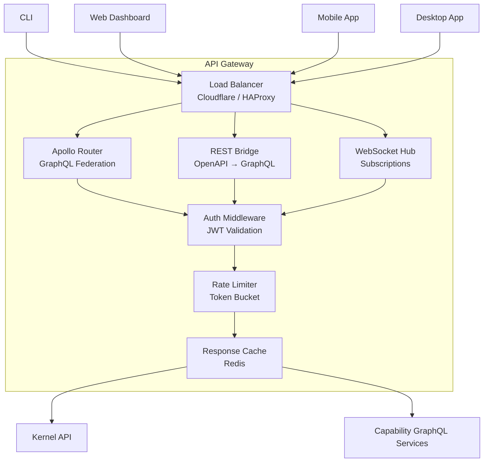

### Gateway Responsibilities

| Function | Implementation | Details |
|----------|---------------|---------|
| **Authentication** | JWT validation middleware | Validates access tokens; injects user context into request |
| **Rate Limiting** | Token bucket per user/IP | Configurable limits per endpoint category |
| **GraphQL Federation** | Apollo Router | Composes subgraph schemas from Kernel and capability services |
| **REST Bridge** | Custom OpenAPI → GraphQL | Auto-generates REST endpoints from GraphQL schema annotations |
| **WebSocket Hub** | NATS → WebSocket bridge | Subscribes to event bus subjects; forwards to authenticated WebSocket clients |
| **Response Caching** | Redis cache with TTL | Caches read queries; invalidates on mutation events |
| **Request Logging** | Structured JSON to stdout | Every request logged with duration, status, user, resource |

### GraphQL Schema Design

The GraphQL schema follows these conventions:
- **Queries** for read operations (always cacheable)
- **Mutations** for write operations (always audited)
- **Subscriptions** for real-time events (always authenticated)
- Every mutation returns the affected resource state
- Every query supports pagination via `first`/`after` (cursor-based) and `offset`/`limit`
- Every resource has an `aiContext` field for AI-generated insights
- Errors follow the `errors[]` array pattern with `code`, `message`, and `path`

---

## 10. Event-Driven Architecture

CloudOS is fundamentally event-driven. All significant state changes and communication between components flow through the Event Bus (NATS JetStream). This section defines the event taxonomy: the different types of messages that flow through the system and how they are structured.

### Event Bus Topology

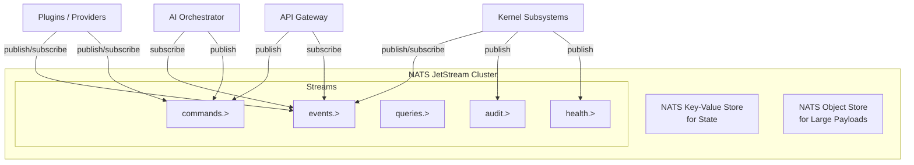

### 10.1 Commands

Commands represent requests for action. They are imperative: "do this thing." Commands are always directed at a specific capability or subsystem.

**Characteristics:**
- Always name a specific action (`deploy.application`, `create.database`, `scale.compute`)
- Include a target resource identifier
- May include parameters/configuration for the action
- Expect a response (success or failure acknowledgment)
- Are validated before execution
- Are audited on execution

**Examples:**
| Command | Publisher | Consumer | Description |
|---------|-----------|----------|-------------|
| `commands.deploy.application` | API Gateway / AI Orchestrator | Compute Capability | Deploy a new version of an application |
| `commands.database.create` | API Gateway | Database Capability | Provision a new database |
| `commands.storage.bucket.create` | CLI | Storage Capability | Create a new storage bucket |
| `commands.compute.scale` | AI Orchestrator | Compute Capability | Scale a workload to N replicas |
| `commands.secrets.rotate` | Scheduler | Secrets Manager | Rotate secrets on schedule |

### 10.2 Events

Events represent facts about things that have already happened. They are past-tense and immutable. Once published, an event cannot be changed.

**Characteristics:**
- Past-tense name (`deployment.completed`, `database.created`, `auth.failed`)
- Include the state after the event (or a reference to the state)
- Can have zero to many subscribers
- No response expected (fire-and-forget)
- Stored durably for replay and audit
- Schema-validated against the Schema Registry

**Examples:**
| Event | Publisher | Subscribers | Description |
|-------|-----------|-------------|-------------|
| `events.deployment.started` | Compute Capability | AI Orchestrator, Monitor, Audit | A deployment has begun |
| `events.deployment.completed` | Compute Capability | AI Orchestrator, Notifications, Audit | A deployment finished successfully |
| `events.deployment.failed` | Compute Capability | AI Orchestrator, Notifications, Audit | A deployment failed |
| `events.database.created` | Database Capability | AI Orchestrator, Notifications, Audit | A new database was provisioned |
| `events.secrets.rotated` | Secrets Manager | Audit, Notifications | A secret was rotated |
| `events.auth.login.failed` | Auth Engine | Audit, Security | A login attempt failed |
| `events.health.degraded` | Health Monitor | AI Orchestrator, Notifications | A component health state degraded |

### 10.3 Queries

Queries represent requests for information. They are read-only and never cause side effects.

**Characteristics:**
- Go through the API Gateway as GraphQL queries
- Cached where appropriate
- No Event Bus involvement (direct gRPC to capability)
- Filtered by authorization (user must have read permission)

**Examples:**
- `query { application(id: "abc") { name, status, deployments { ... } } }`
- `query { logs(service: "api", since: "1h") { ... } }`
- `query { metrics(resource: "database-1", metric: "cpu") { ... } }`

### 10.4 State Changes

State changes are a special category of event that represents a mutation to a resource's state. They are used to:
- Keep the State Store consistent
- Inform the AI Orchestrator of changes
- Trigger automated workflows
- Update the search index
- Invalidate caches
- Update dashboards in real-time

**State change propagation flow:**
1. A command is executed by a capability
2. The capability updates the resource state
3. The capability publishes a state change event to the Event Bus
4. The State Store subscribes and persists the new state
5. The Search Capability subscribes and updates its index
6. The Monitoring Capability subscribes and records the change
7. The AI Orchestrator subscribes and updates its context
8. WebSocket subscribers receive the change in real-time

### 10.5 Internal Messaging

Internal messaging covers all communication between Kernel subsystems that is not a command, event, or query. This includes:
- Heartbeat signals (plugin → Kernel: "I'm alive")
- Health status updates (Health Monitor → other subsystems)
- Configuration hot-reload notifications (Config Manager → all)
- Plugin lifecycle signals (Process Manager → Plugin Runtime)
- Service registry updates (Service Registry → all)

These messages use NATS core (not JetStream) for low-latency, fire-and-forget delivery.

### 10.6 Plugin Events

Plugins can define and publish their own custom event types. These are namespaced to the plugin:

```
events.plugins.<plugin-name>.<event-name>
```

Example events from a hypothetical `github-deploy` plugin:
- `events.plugins.github-deploy.push.detected` — New push to branch
- `events.plugins.github-deploy.pr.opened` — Pull request opened
- `events.plugins.github-deploy.deployment.triggered` — Auto-deployment started

Plugins can subscribe to any event in the system (subject to permissions declared in `manifest.yaml`).

---

## 11. Communication Patterns

### 11.1 Plugin ↔ Kernel Communication

**Protocol:** gRPC over Unix domain socket (local) or mTLS TCP (remote)

**Pattern:** Request-response for commands, server-streaming for events, bidirectional streaming for health

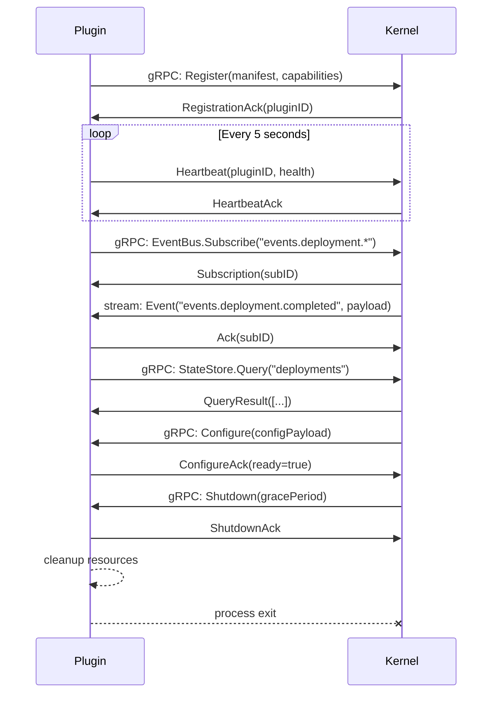

**Key characteristics:**
- All Kernel services are available to plugins via gRPC
- Plugins cannot initiate connections to other plugins
- Plugins use the Event Bus for all asynchronous communication
- Every gRPC call includes auth metadata (pluginID, capability scopes)
- Streaming responses are used for logs, events, and large result sets

### 11.2 Plugin ↔ Plugin Communication

**Pattern:** Plugins never communicate directly. All cross-plugin communication goes through the Event Bus.

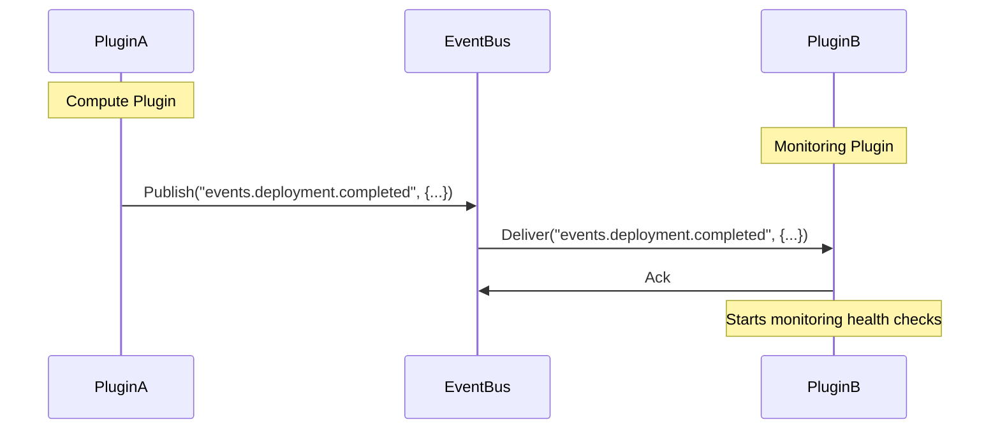

**Key rules:**
- No direct gRPC or HTTP calls between plugins
- No shared memory or filesystem access between plugins
- Communication is always asynchronous via Event Bus subjects
- For request-response patterns, plugins use the NATS `Request`/`Reply` pattern (a subject with a reply subject header)
- The Kernel enforces these rules via the gRPC gateway and sandbox restrictions

### 11.3 AI ↔ Capability Communication

**Pattern:** The AI Orchestrator communicates with capabilities through two channels:
1. **Read channel:** Direct gRPC queries to capability services (for context building)
2. **Write channel:** Publish commands to the Event Bus (for actions)

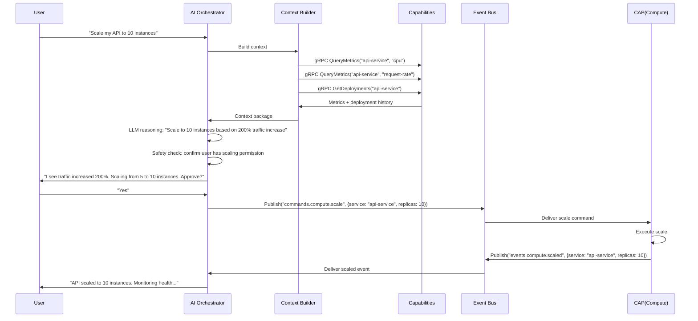

### 11.4 UI ↔ Backend Communication

**Protocol:** GraphQL over HTTPS, WebSocket for subscriptions

**Pattern:** 
- Queries: HTTP GET with `application/json` body
- Mutations: HTTP POST with `application/json` body
- Subscriptions: WebSocket with `graphql-ws` protocol
- File uploads: HTTP POST multipart/form-data

**Authentication:**
- Access token in `Authorization: Bearer <token>` header
- Token validated by API Gateway middleware
- User context injected into GraphQL resolvers

**Caching:**
- GraphQL queries are cacheable via `@cacheControl` directive
- Response Cache Header (REST bridge) for HTTP caching
- Client-side Apollo cache for optimistic UI updates

### 11.5 CLI ↔ Backend Communication

**Protocol:** GraphQL over HTTPS (same as UI)

**Pattern:**
- Short-lived commands: single GraphQL mutation, poll for completion
- Long-running commands: GraphQL mutation + WebSocket subscription for progress
- Log streaming: WebSocket subscription
- Interactive commands: GraphQL mutations with local state management

**CLI specific behavior:**
- CLI caches user session token locally (encrypted)
- CLI supports offline command queuing (store commands, execute when connected)
- CLI emits structured JSON for pipe/script consumption (`--json` flag)
- Spinner/progress bar for long-running operations

### 11.6 SDK ↔ Backend Communication

**Protocol:** GraphQL (primary) + gRPC (advanced use cases)

**Pattern:**
- SDKs wrap GraphQL operations in typed client libraries
- Rate limiting and retry with exponential backoff built into SDK
- Automatic token refresh
- Pagination helpers for cursor-based and offset-based pagination
- Event subscription via WebSocket (graphql-ws)

**SDK languages:**
| Language | Package | Status |
|----------|---------|--------|
| Go | `github.com/cloudos/cloudos-sdk-go` | ✅ v1 |
| TypeScript | `@cloudos/sdk` | ✅ v1 |
| Python | `cloudos-sdk` | 🚧 v2 |
| Rust | `cloudos-sdk` | 🔮 v3 |
| Java | `com.cloudos:sdk` | 🔮 v3 |

---

## 12. System Flows

### 12.1 Startup Sequence

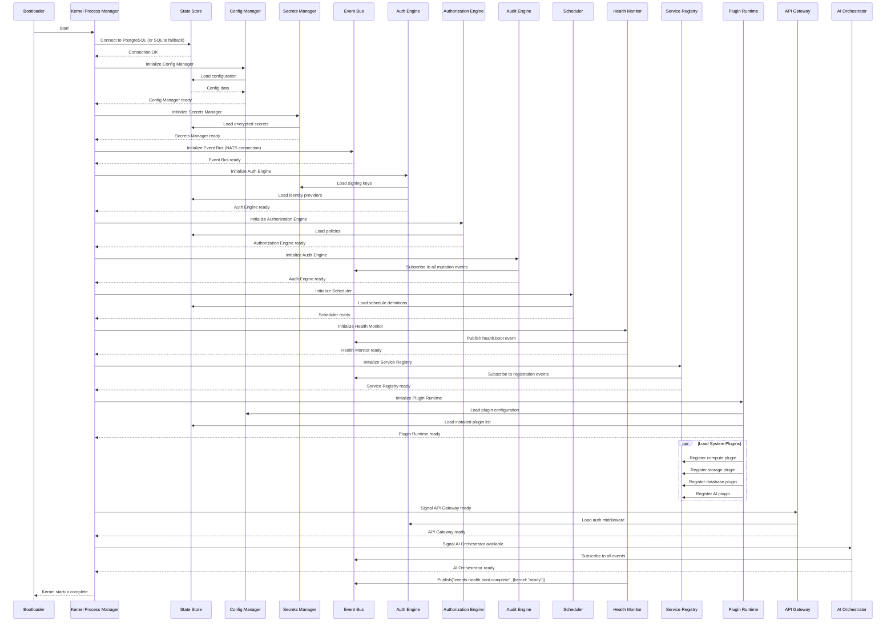

**Startup sequence summary:**
1. Bootloader starts Kernel Process Manager
2. State Store connects (PostgreSQL or SQLite fallback)
3. Configuration Manager loads config
4. Secrets Manager initializes
5. Event Bus connects to NATS
6. Auth Engine initializes with keys and providers
7. Authorization Engine loads policies
8. Audit Engine starts (subscribes to all mutation events)
9. Scheduler loads schedule definitions
10. Health Monitor starts
11. Service Registry initializes
12. Plugin Runtime loads system plugins
13. API Gateway becomes available
14. AI Orchestrator connects
15. Health Monitor publishes boot complete event

**Total target time:** < 3 seconds (cold start), < 1 second (warm restart)

### 12.2 Shutdown Sequence

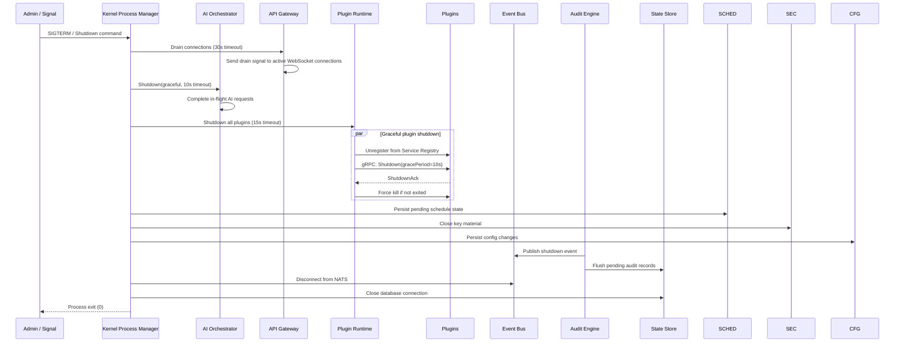

**Shutdown guarantees:**
- All in-flight requests complete or timeout
- Plugins receive graceful shutdown signal
- Pending audit records are flushed
- State Store connections are cleanly closed
- Event Bus reconnects for remaining cluster nodes

### 12.3 Configuration Flow

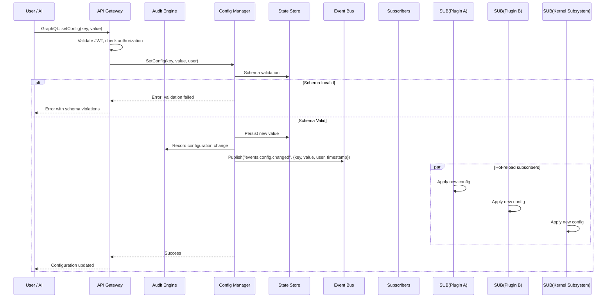

### 12.4 Authentication Flow

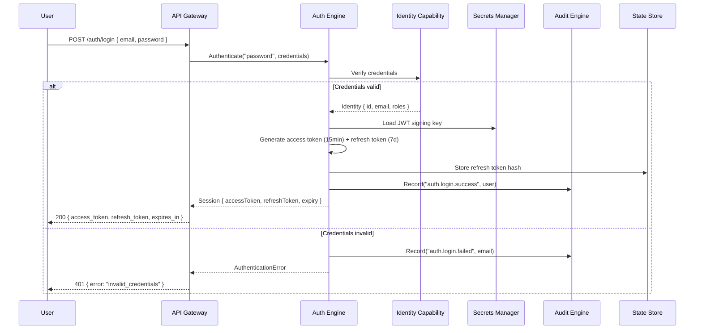

### 12.5 Authorization Flow

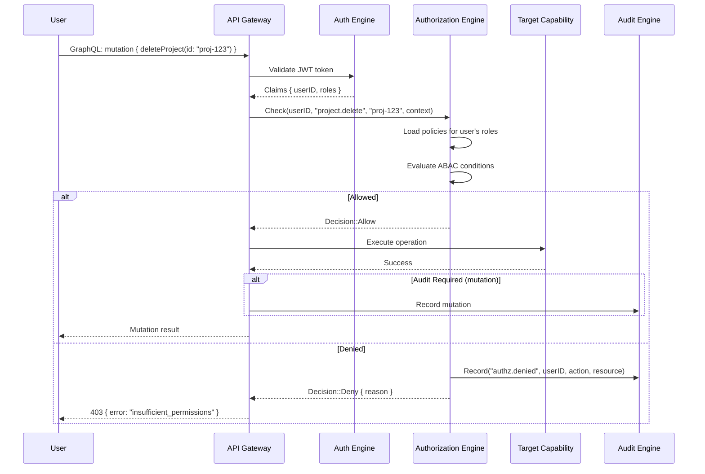

### 12.6 Deployment Flow

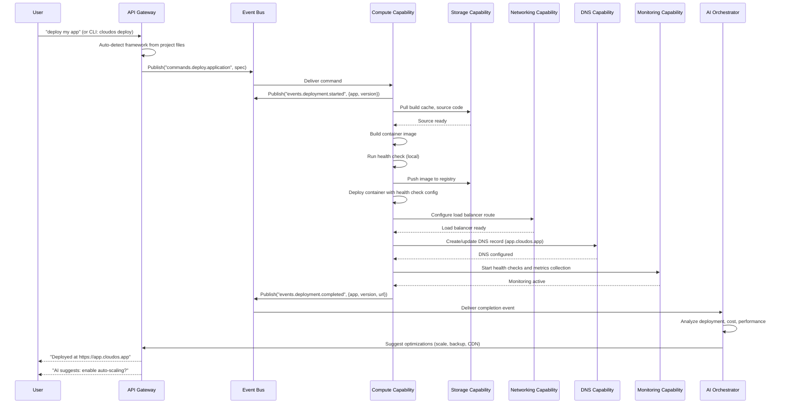

### 12.7 AI Request Flow

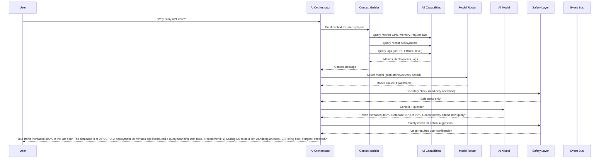

### 12.8 Plugin Loading Flow

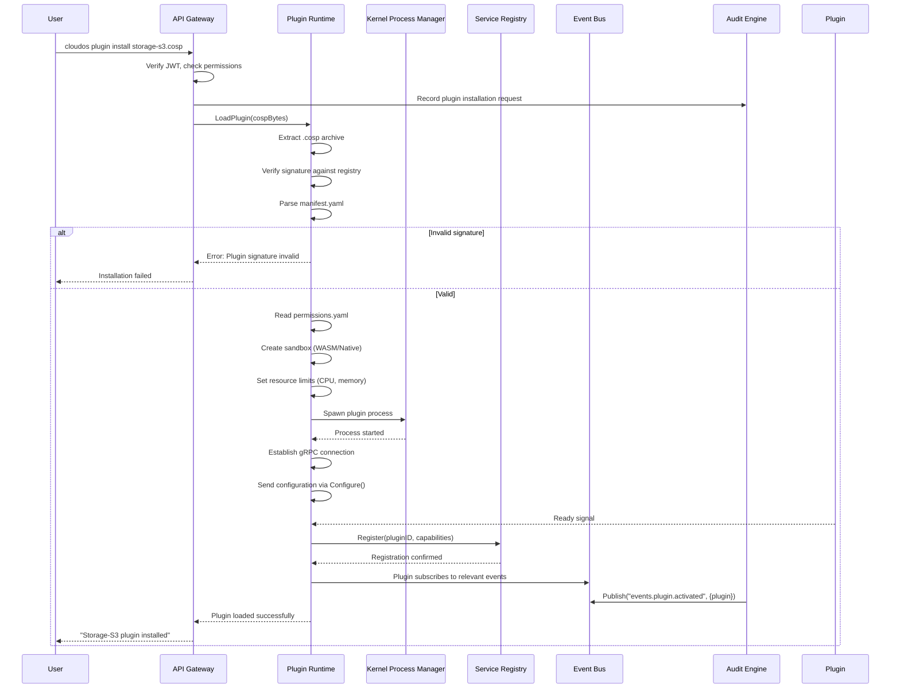

### 12.9 Plugin Lifecycle

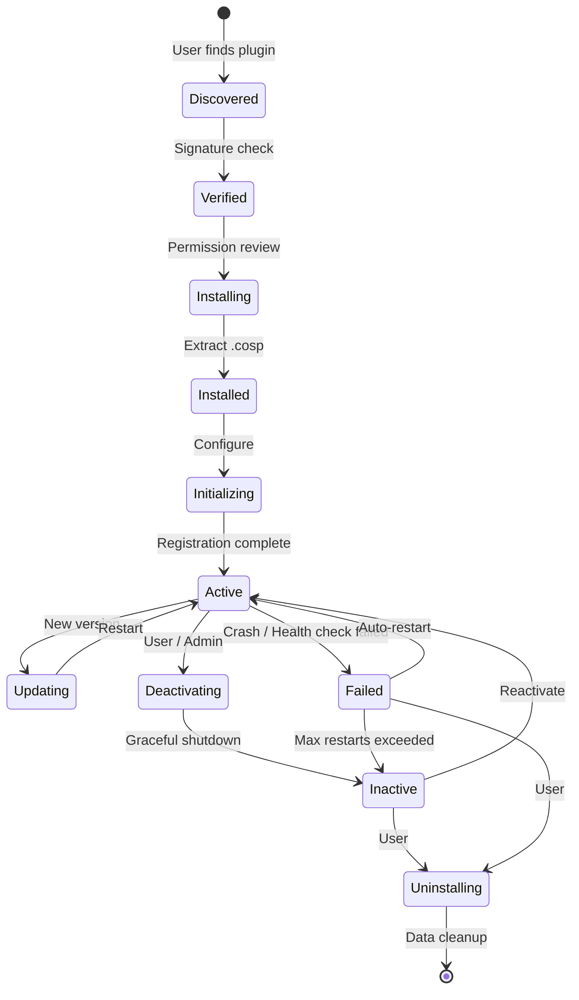

| State | Description | Duration |
|-------|-------------|----------|
| **Discovered** | Plugin found in marketplace or local filesystem | Instant |
| **Verified** | Cryptographic signature verified against plugin registry | < 100ms |
| **Installing** | `.cosp` extracted to plugin directory | < 1s |
| **Initializing** | gRPC Configure sent; plugin initializes internal state | < 2s |
| **Active** | Plugin registered in Service Registry, accepting requests | Indefinite |
| **Updating** | New version downloaded; plugin restarted with new binary | < 3s |
| **Deactivating** | Graceful shutdown signal sent; drain in-flight work | < 10s |
| **Inactive** | Plugin not running but configuration persists | Indefinite |
| **Failed** | Plugin process crashed or health check failed repeatedly | Until restart/uninstall |
| **Uninstalling** | Plugin data cleaned up; configuration removed | < 2s |

### 12.10 Error Handling Flow

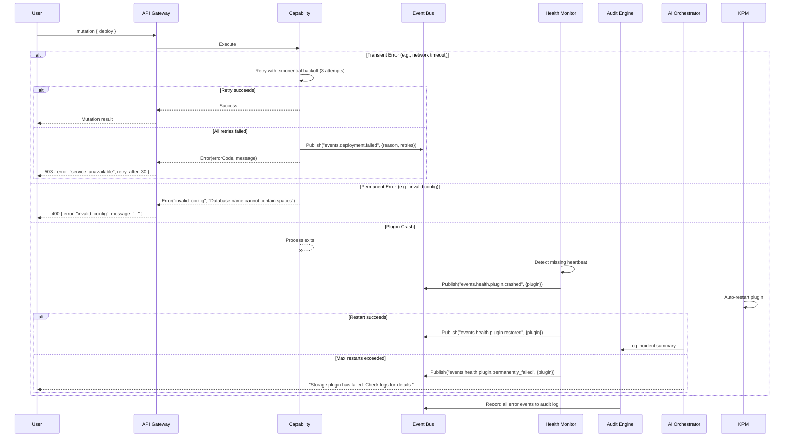

### 12.11 Logging Flow

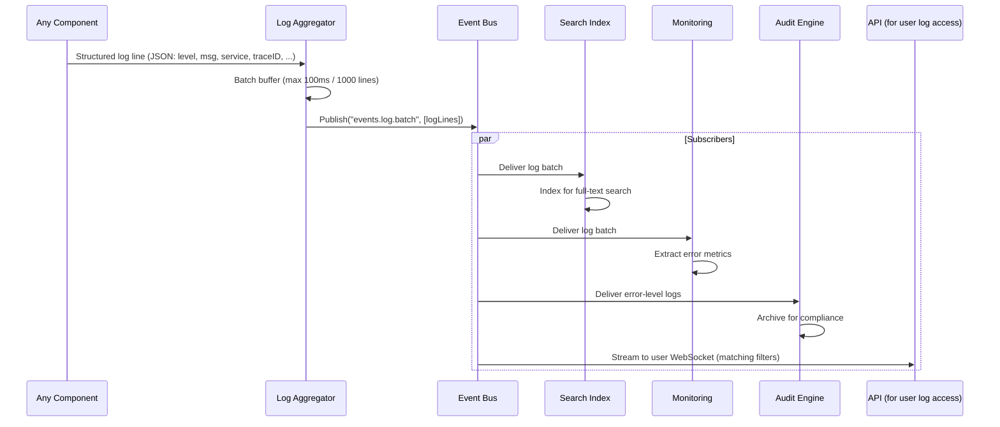

### 12.12 Backup Flow

```mermaid
sequenceDiagram
    participant SCHED as Scheduler
    participant EB as Event Bus
    participant DB_CAP as Database Capability
    participant STOR as Storage Capability
    participant MON as Monitoring
    participant AUDIT as Audit Engine
    
    SCHED->>EB: Publish("scheduler.tick", {job: "daily-backup"})
    
    EB->>DB_CAP: Trigger backup
    
    DB_CAP->>DB_CAP: Lock database for consistent snapshot
    
    DB_CAP->>STOR: Upload backup to storage bucket
    STOR-->>DB_CAP: Backup stored (backup-2026-06-29.sql.gz)
    
    DB_CAP->>DB_CAP: Verify backup integrity (checksum)
    
    DB_CAP->>STOR: Store checksum alongside backup
    
    DB_CAP->>EB: Publish("events.backup.completed", {db, size, checksum})
    
    MON->>EB: Record backup success metric
    AUDIT->>EB: Record backup audit event
    
    DB_CAP->>DB_CAP: Clean up old backups per retention policy
```

### 12.13 Restore Flow

```mermaid
sequenceDiagram
    participant USER as User
    participant GW as API Gateway
    participant DB_CAP as Database Capability
    participant STOR as Storage Capability
    participant AUDIT as Audit Engine
    participant MON as Monitoring
    
    USER->>GW: graphql: restoreDatabase(id, backupID)
    GW->>GW: Check authorization
    
    GW->>DB_CAP: Restore(id, backupID)
    
    DB_CAP->>DB_CAP: Validate backup exists and integrity check passes
    
    DB_CAP->>DB_CAP: Stop application connections (pg_terminate_backend)
    
    DB_CAP->>STOR: Download backup file
    
    DB_CAP->>DB_CAP: Restore from backup dump
    DB_CAP->>DB_CAP: Verify data integrity post-restore
    
    alt Restore successful
        DB_CAP->>DB_CAP: Re-enable application connections
        DB_CAP->>MON: Reset monitoring baselines
        DB_CAP->>AUDIT: Record restore event
        
        DB_CAP-->>GW: Success
        GW-->>USER: "Database restored to backup backup-2026-06-29"
    else Restore failed
        DB_CAP-->>GW: Error with details
        GW-->>USER: Error message with remediation steps
    end
```

---

## 13. Deployment Architecture

CloudOS supports seven deployment tiers, from a single Raspberry Pi to a multi-region cluster. The architecture scales by adding nodes, not by changing the software.

### 13.1 Single Node

```mermaid
graph TB
    subgraph "Single Node (Raspberry Pi / VPS / Laptop)"
        K[Kernel<br/>Go Binary]
        SQ[SQLite<br/>Embedded State Store]
        PR[Plugin Runtime<br/>WASM + Native]
        GW[API Gateway<br/>Embedded]
        
        K --> PR
        K --> SQ
        GW --> K
    end
    
    CLI --> GW
    WEB[Web Dashboard] --> GW
```

**Characteristics:**
- Single Go binary includes embedded SQLite and API Gateway
- All processes run within the Kernel process group
- No external dependencies (no NATS, no PostgreSQL required)
- SQLite for state, local filesystem for storage
- Suitable for development, homelab, and small projects
- Total memory usage: ~256MB minimum, 512MB recommended

### 13.2 Multi-Node Cluster

```mermaid
graph TB
    subgraph "Load Balancer Layer"
        LB[Load Balancer<br/>HAProxy / Cloudflare]
    end
    
    subgraph "API Layer"
        GW1[API Gateway 1]
        GW2[API Gateway 2]
        GW3[API Gateway 3]
    end
    
    subgraph "Kernel Layer"
        K1[Kernel Node 1]
        K2[Kernel Node 2]
        K3[Kernel Node 3]
    end
    
    subgraph "Data Layer"
        PG[(PostgreSQL<br/>Primary)]
        PG_R[(PostgreSQL<br/>Read Replica)]
        RD[(Redis Cluster)]
        NATS[NATS JetStream<br/>Cluster]
    end
    
    subgraph "Compute Pool"
        DOCKER1[Docker Host 1]
        DOCKER2[Docker Host 2]
        DOCKER3[Docker Host 3]
    end
    
    LB --> GW1
    LB --> GW2
    LB --> GW3
    
    GW1 --> K1
    GW2 --> K2
    GW3 --> K3
    
    K1 --> PG
    K2 --> PG
    K3 --> PG
    
    K1 --> PG_R
    K2 --> PG_R
    K3 --> PG_R
    
    K1 --> RD
    K2 --> RD
    K3 --> RD
    
    K1 --> NATS
    K2 --> NATS
    K3 --> NATS
    
    K1 --> DOCKER1
    K2 --> DOCKER2
    K3 --> DOCKER3
```

**Characteristics:**
- 3+ Kernel nodes for high availability
- External PostgreSQL with read replicas
- Redis Cluster for cache and session storage
- NATS JetStream cluster for event bus durability
- Separate compute pool for workload execution
- API Gateway is stateless and horizontally scalable
- All nodes are identical; no master/slave (leader-election only for Scheduler)

### 13.3 Edge Computing

```mermaid
graph TB
    subgraph "Cloud Region (Central)"
        CLOUD[CloudOS Cluster<br/>Full Kernel + Capabilities]
    end
    
    subgraph "Edge Locations"
        E1[Edge Agent<br/>Lightweight Kernel<br/>Local SQLite<br/>Local Cache]
        E2[Edge Agent<br/>Lightweight Kernel<br/>Local SQLite<br/>Local Cache]
        E3[Edge Agent<br/>Lightweight Kernel<br/>Local SQLite<br/>Local Cache]
    end
    
    subgraph "End Users"
        U1[Users]
        U2[Users]
        U3[Users]
    end
    
    CLOUD <-->|Sync| E1
    CLOUD <-->|Sync| E2
    CLOUD <-->|Sync| E3
    
    U1 --> E1
    U2 --> E2
    U3 --> E3
```

**Characteristics:**
- Edge agents are sub-50MB Kernel binaries with embedded SQLite
- Edge agents cache configuration and serve read queries locally
- Write operations are forwarded to the central cluster or queued for sync
- Offline-capable: agents continue operating during network partitions
- Edge agents auto-discover the central cluster via DNS or configured endpoint

### 13.4 Offline Mode

CloudOS is designed to operate without continuous internet connectivity.

**Local-first architecture:**
- The Kernel operates entirely locally with no cloud dependency
- Plugin data is stored in the local State Store
- All API endpoints work offline (though some provider operations require connectivity)
- Configuration changes are applied locally and synced when connectivity returns
- The AI Orchestrator uses local models (Ollama) when cloud AI providers are unavailable

**Offline capabilities:**
| Feature | Online | Offline |
|---------|--------|---------|
| Dashboard viewing | ✅ Live data | ✅ Cached data |
| Configuration changes | ✅ Apply immediately | ✅ Queue for sync |
| Deployment management | ✅ Full | ✅ Manage existing; queue new |
| Log viewing | ✅ Real-time stream | ✅ Cached logs |
| AI operations | ✅ Any provider | ✅ Local Ollama only |
| Plugin management | ✅ Full marketplace | ✅ Local .cosp files only |
| Metrics monitoring | ✅ Real-time | ✅ Cached metrics |

### 13.5 Synchronization Strategy

When an offline instance reconnects to a central cluster:

1. **Conflict detection:** Timestamp-based and vector-clock-based conflict detection
2. **Last-writer-wins** for configuration values (user-configurable)
3. **Append-only merge** for audit logs and events (no conflicts possible)
4. **User notification** of any conflicts and their resolution
5. **Selective sync:** Users choose which data to sync first (critical → non-critical)
6. **Bandwidth-aware:** Sync adapts to available network speed

---

## 14. Scalability Strategy

### 14.1 Horizontal Scaling

| Component | Strategy | Considerations |
|-----------|----------|----------------|
| **Kernel (stateless)** | Add nodes behind load balancer | No session affinity needed (JWT sessions) |
| **API Gateway** | Stateless; any number of instances | Rate limiting state in Redis |
| **State Store (PostgreSQL)** | Read replicas; PgBouncer pooling | Write master handles all mutations |
| **Cache (Redis)** | Redis Cluster with automatic sharding | Key design accounts for hot keys |
| **Event Bus (NATS)** | NATS cluster with Raft-based replication | Subjects partition by capability |
| **Plugin Runtime** | Distribute plugins across node pool | Each node runs a subset of plugin instances |
| **Compute Pool** | Orchestrator distributes workloads | Provider-aware scheduling |
| **AI Orchestrator** | Stateless; model routing distributes load | Context building is CPU-bound; model inference is API-call-bound |

### 14.2 Vertical Scaling

For single-node deployments, vertical scaling involves:
- Increasing CPU and memory allocation to the Kernel process
- Tuning connection pool sizes (PgBouncer, NATS, Redis)
- Adjusting plugin sandbox resource limits
- Enabling SQLite WAL mode for concurrent read performance

### 14.3 Caching Strategy

| Cache | Technology | What | TTL | Invalidation |
|-------|-----------|------|-----|-------------|
| **Session** | Redis | Refresh token hashes, user claims | Until session expiry | On logout / token rotation |
| **Policy** | In-memory (LRU) | Authorization policies | 5 minutes | Event Bus policy change event |
| **Config** | In-memory + Redis | Configuration values | 30 seconds | Event Bus config change event |
| **API Response** | Redis | GraphQL query results | Per-query (via @cacheControl) | Event Bus mutation event |
| **Plugin State** | In-memory | Active plugin health, metadata | Plugin heartbeat interval | On plugin deregistration |

### 14.4 Database Scaling Roadmap

| Stage | Strategy | When |
|-------|----------|------|
| 1 | Single PostgreSQL instance | < 1,000 users |
| 2 | PostgreSQL + read replicas | 1,000 - 10,000 users |
| 3 | Read replicas + PgBouncer + query optimization | 10,000 - 100,000 users |
| 4 | Horizontal sharding (by organization) | 100,000+ users |
| 5 | Distributed SQL (CockroachDB) for multi-region | Global scale |

---

## 15. High Availability Strategy

### 15.1 Availability Targets

| Tier | Uptime Target | Max Downtime/Year | Recovery Model |
|------|---------------|-------------------|----------------|
| **Self-hosted** | 99.9% | 8.76 hours | Best effort |
| **Managed** | 99.99% | 52.56 minutes | Automated failover |

### 15.2 Component-Level HA

| Component | HA Strategy | Recovery Time |
|-----------|-------------|---------------|
| **Kernel** | Active-active (N nodes) | N/A (no single point) |
| **PostgreSQL** | Streaming replication + Patroni | < 30 seconds |
| **Redis** | Redis Cluster with replicas | < 5 seconds |
| **NATS** | Raft-based cluster (3+ nodes) | < 1 second |
| **Plugins** | N+1 instances per capability | < 5 seconds (health check) |
| **API Gateway** | Stateless, behind load balancer | N/A |

### 15.3 Failure Domains

| Failure | Impact | Protection |
|---------|--------|------------|
| Single process crash | One capability degraded | Process Manager auto-restart |
| Single node failure | N-1 capacity for all capabilities | Load balancer removes node from rotation |
| Single AZ failure | Partial capacity | Multi-AZ deployment |
| Region failure | Catastrophic without DR | Cross-region DR plan |
| PostgreSQL failure | Write operations degraded | Automatic failover to replica |
| NATS cluster failure | Async communication lost | In-memory buffer; reconnect |

### 15.4 Disaster Recovery

| Scenario | RTO | RPO | Procedure |
|----------|-----|-----|-----------|
| Single node failure | < 5s | 0% | Load balancer routes around failed node |
| Multi-node failure | < 5min | 0% | Replace nodes; restore from State Store replicas |
| PostgreSQL failure | < 30s | < 1min | Patroni failover to replica |
| Region failure | < 15min | < 5min | Route traffic to secondary region; restore from replicated state |
| Data corruption | < 1hr | < 24hr | Point-in-time recovery from backup |

---

## 16. Security Architecture

### 16.1 Zero-Trust Principles

CloudOS implements zero-trust architecture:
- **Verify explicitly:** Every request is authenticated and authorized, regardless of source network
- **Least privilege:** Every plugin and user has minimum required permissions
- **Assume breach:** Encrypt everything; log everything; audit everything

### 16.2 Security Layers

```mermaid
graph TB
    subgraph "Layer 1: Network Security"
        TLS[TLS 1.3 Everywhere]
        WAF[WAF + DDoS Protection]
        FW[Firewall: Default-Deny]
    end
    
    subgraph "Layer 2: Authentication"
        MFA[MFA / WebAuthn]
        JWT[JWT with RS256]
        API_KEY[API Key Authentication]
    end
    
    subgraph "Layer 3: Authorization"
        RBAC[Role-Based Access Control]
        ABAC[Attribute-Based Conditions]
        POLICY[Policy Engine]
    end
    
    subgraph "Layer 4: Data Security"
        ENC_AT_REST[AES-256-GCM at Rest]
        ENC_IN_TRANSIT[TLS 1.3 in Transit]
        SEC_MGR[Secrets Manager]
        KM[Key Management]
    end
    
    subgraph "Layer 5: Audit & Monitoring"
        AUDIT[Immutable Audit Log]
        SIEM[SIEM Integration]
        ANOMALY[Anomaly Detection]
    end
    
    subgraph "Layer 6: Isolation"
        WASM[WASM Sandbox]
        PROCESS[Process-Level Isolation]
        CGROUP[cgroups Resource Limits]
    end
    
    TLS --> MFA
    MFA --> RBAC
    RBAC --> ENC_AT_REST
    ENC_AT_REST --> AUDIT
    AUDIT --> WASM
```

### 16.3 Security Controls by Layer

| Layer | Control | Implementation |
|-------|---------|----------------|
| **Network** | Encryption in transit | TLS 1.3 minimum; mTLS for inter-service |
| **Network** | DDoS protection | Cloudflare / built-in rate limiting |
| **Network** | Firewall | Default-deny; allow-list only |
| **Auth** | Password policy | 12 char minimum; bcrypt with cost 12 |
| **Auth** | MFA | TOTP, WebAuthn, SMS backup codes |
| **Auth** | Session management | 15min access tokens; 7d refresh tokens; rotation on use |
| **Authz** | Authorization | RBAC + ABAC; deny by default |
| **Data** | Encryption at rest | AES-256-GCM; per-tenant keys |
| **Data** | Secrets management | Auto-rotation; never logged; never displayed |
| **Audit** | Audit logging | Immutable append-only; cryptographic chaining |
| **Audit** | Log retention | 90 days standard; 7 years compliance |
| **Isolation** | Plugin sandbox | WASM for community; native for system; no filesystem |
| **Isolation** | Resource limits | CPU quotas; memory limits; FD limits |
| **Supply chain** | Plugin signing | Ed25519 signatures; registry-based verification |

### 16.4 Compliance Readiness

| Standard | Status | Key Requirements |
|----------|--------|------------------|
| **SOC 2** | 🚧 v5 | Audit log, access controls, encryption, change management |
| **GDPR** | ✅ v1 | Data export, deletion, privacy by design, consent management |
| **HIPAA** | 🚧 v6 | BAA support, audit controls, integrity controls, access controls |
| **PCI-DSS** | 🔮 v7 | Encryption, access control, logging, vulnerability management |
| **ISO 27001** | 🚧 v6 | ISMS, risk management, security controls, continuous improvement |

---

## 17. Service Discovery

### 17.1 Local Discovery

On a single node, plugins discover the Kernel via a well-known Unix domain socket:
```
/tmp/cloudos/kernel.sock
```

### 17.2 Cluster Discovery

In multi-node mode, service discovery uses the Service Registry backed by the State Store:

```mermaid
sequenceDiagram
    participant P as Plugin (starting up)
    participant K as Kernel (local)
    participant SR as Service Registry
    participant K2 as Kernel (remote node)
    participant P2 as Plugin (remote)
    
    P->>K: gRPC: Register("compute-s3", {capabilities: ["storage"]})
    K->>SR: Register(pluginID, capabilities, endpoint)
    
    P2->>K2: gRPC: Lookup("storage", filter: healthy)
    K2->>K2: Check local cache
    
    alt Cache hit
        K2-->>P2: Cached endpoints
    else Cache miss
        K2->>SR: Query healthy storage providers
        SR-->>K2: [storage-s3@10.0.1.5:9090, storage-minio@10.0.1.6:9090]
        K2->>K2: Cache result
        K2-->>P2: Endpoints
    end
    
    P2->>P2: gRPC to storage-s3@10.0.1.5:9090
```

### 17.3 DNS-Based Discovery (Future)

For large clusters, CloudOS will support DNS-based service discovery:
```
compute.cloudos.svc → 10.0.1.10, 10.0.1.11, 10.0.1.12
storage.cloudos.svc → 10.0.1.20, 10.0.1.21
```

This enables standard Kubernetes-style discovery for integrated environments.

---

## 18. Future Architecture

### 18.1 Multi-Region Active-Active

```mermaid
graph TB
    subgraph "Region US-East"
        CLUSTER1[CloudOS Cluster]
        PG1[(PostgreSQL)]
    end
    
    subgraph "Region EU-West"
        CLUSTER2[CloudOS Cluster]
        PG2[(PostgreSQL)]
    end
    
    subgraph "Region AP-Southeast"
        CLUSTER3[CloudOS Cluster]
        PG3[(PostgreSQL)]
    end
    
    CLUSTER1 <-->|Event Bus Bridge| CLUSTER2
    CLUSTER2 <-->|Event Bus Bridge| CLUSTER3
    CLUSTER1 <-->|Event Bus Bridge| CLUSTER3
    
    PG1 <-->|CockroachDB Replication| PG2
    PG2 <-->|CockroachDB Replication| PG3
```

### 18.2 Event Sourcing

Future versions may adopt event sourcing as the primary persistence pattern:
- All state is derived from immutable event streams
- No mutable state in the database (except materialized views)
- Complete audit trail by design
- Time-travel queries (show state at any point in history)
- Simplified conflict resolution for offline sync

### 18.3 Federated Architecture

Multiple CloudOS instances can be federated:
- Cross-instance resource sharing (share a database across clusters)
- Unified search across all instances
- Cross-instance event bus bridging
- Centralized management plane for fleet administration

### 18.4 Quantum Computing Integration (2030+)

Future architecture will support quantum computing resource orchestration:
- Quantum provider capability interface
- Hybrid classical-quantum workflow scheduling
- Quantum resource broker for HPC integration

---

## 19. Glossary

| Term | Definition |
|------|------------|
| **AI Orchestrator** | The separate process layer that coordinates capabilities to fulfill user intent via natural language |
| **Capability** | An abstract interface defining a category of functionality (Compute, Storage, AI, etc.) |
| **Command** | An imperative message requesting an action, published to the Event Bus |
| **COSP** | CloudOS Plugin — the standard plugin packaging format (.cosp file) |
| **Event** | A past-tense notification about something that has happened, published to the Event Bus |
| **Event Bus** | The NATS JetStream-based async messaging backbone of CloudOS |
| **Kernel** | The minimal trusted computing base — manages processes, events, config, secrets, auth, audit, scheduling, health |
| **Plugin Runtime** | The sandboxed execution environment for WASM, native, and HTTP plugins |
| **Process Manager** | Kernel subsystem that manages the lifecycle of all child processes |
| **Provider** | A concrete implementation of a Capability (e.g., S3 provider for Storage capability) |
| **Query** | A read-only request for information, typically via GraphQL |
| **Sandbox** | The isolation boundary around a plugin (WASM memory sandbox, OS process, or cgroup) |
| **Service Registry** | Kernel subsystem maintaining a real-time directory of all active services and their endpoints |
| **State Store** | The persistent storage layer (PostgreSQL or SQLite) for all Kernel data |
| **Stream** | A logical channel in NATS JetStream for ordered, durable message delivery |
| **Subject** | A named endpoint in NATS for publish-subscribe messaging |

---

> **This document defines the authoritative technical architecture for CloudOS. All implementation must conform to these layer boundaries, communication patterns, and subsystem responsibilities.**
>
> **Next:** [12_UI_SYSTEM.md](./12_UI_SYSTEM.md) — Design language and user experience
