# CloudOS Kernel & Plugin Architecture

> **Document ID:** CLOUDOS-ARCH-002  
> **Status:** v1.0 — Approved  
> **Classification:** Public — Open Source  
> **Last Updated:** 2026-06-29  
> **Audience:** Engineers, Architects, Plugin Developers, Platform Teams, Contributors  
> **Depends On:** [01_MASTER_SPEC.md](./01_MASTER_SPEC.md), [05_SYSTEM_ARCHITECTURE.md](./05_SYSTEM_ARCHITECTURE.md)

---

## Table of Contents

1. [Executive Summary](#1-executive-summary)
2. [Architecture Overview](#2-architecture-overview)
3. [Architecture Layers](#3-architecture-layers)
   - [3.1 Kernel Layer](#31-kernel-layer)
   - [3.2 Capability Layer](#32-capability-layer)
   - [3.3 Provider Layer](#33-provider-layer)
   - [3.4 Plugin Layer](#34-plugin-layer)
   - [3.5 Application Layer](#35-application-layer)
   - [3.6 SDK Layer](#36-sdk-layer)
   - [3.7 Marketplace Layer](#37-marketplace-layer)
   - [3.8 AI Orchestrator Layer](#38-ai-orchestrator-layer)
4. [Kernel Deep Dive](#4-kernel-deep-dive)
   - [4.1 Kernel Design Principles](#41-kernel-design-principles)
   - [4.2 Kernel Subsystems](#42-kernel-subsystems)
   - [4.3 What the Kernel Does NOT Do](#43-what-the-kernel-does-not-do)
   - [4.4 Kernel Boundaries & Extension Points](#44-kernel-boundaries--extension-points)
   - [4.5 Kernel Startup Sequence](#45-kernel-startup-sequence)
5. [Capability Layer Deep Dive](#5-capability-layer-deep-dive)
   - [5.1 Why Capabilities Exist](#51-why-capabilities-exist)
   - [5.2 Capability Interface Catalog](#52-capability-interface-catalog)
   - [5.3 Capability Versioning](#53-capability-versioning)
   - [5.4 Cross-Cutting Concerns](#54-cross-cutting-concerns)
6. [Provider Layer Deep Dive](#6-provider-layer-deep-dive)
   - [6.1 Provider Packaging (`.cosp`)](#61-provider-packaging-cosp)
   - [6.2 Provider Types](#62-provider-types)
   - [6.3 Provider Lifecycle](#63-provider-lifecycle)
   - [6.4 Provider Selection & Chaining](#64-provider-selection--chaining)
   - [6.5 Provider Catalog](#65-provider-catalog)
7. [Plugin System](#7-plugin-system)
   - [7.1 Plugin Manifest](#71-plugin-manifest)
   - [7.2 Plugin Metadata & Versioning](#72-plugin-metadata--versioning)
   - [7.3 Plugin Dependencies](#73-plugin-dependencies)
   - [7.4 Plugin Permissions Model](#74-plugin-permissions-model)
   - [7.5 Plugin Lifecycle](#75-plugin-lifecycle)
   - [7.6 Plugin Configuration](#76-plugin-configuration)
   - [7.7 Plugin Events](#77-plugin-events)
   - [7.8 Plugin API](#78-plugin-api)
   - [7.9 Plugin Health](#79-plugin-health)
   - [7.10 Plugin Isolation & Sandboxing](#710-plugin-isolation--sandboxing)
   - [7.11 Plugin Communication](#711-plugin-communication)
   - [7.12 Plugin Discovery](#712-plugin-discovery)
   - [7.13 Plugin Categories](#713-plugin-categories)
   - [7.14 Plugin Signing & Verification](#714-plugin-signing--verification)
   - [7.15 Plugin Trust Model](#715-plugin-trust-model)
8. [The Intent-Driven Flow](#8-the-intent-driven-flow)
   - [8.1 From Service-Oriented to Intent-Driven](#81-from-service-oriented-to-intent-driven)
   - [8.2 The Complete Flow](#82-the-complete-flow)
   - [8.3 Example: Deploy Laravel Application](#83-example-deploy-laravel-application)
   - [8.4 Why This Architecture Matters](#84-why-this-architecture-matters)
9. [Dependency Rules & Enforcement](#9-dependency-rules--enforcement)
   - [9.1 Dependency Direction](#91-dependency-direction)
   - [9.2 Enforcement Mechanisms](#92-enforcement-mechanisms)
   - [9.3 Common Violations & Prevention](#93-common-violations--prevention)
10. [Marketplace Architecture](#10-marketplace-architecture)
    - [10.1 Registry Design](#101-registry-design)
    - [10.2 Publishing Pipeline](#102-publishing-pipeline)
    - [10.3 Installation & Updates](#103-installation--updates)
    - [10.4 Security Scanning](#104-security-scannings)
    - [10.5 Ratings & Reviews](#105-ratings--reviews)
    - [10.6 Enterprise vs Community Plugins](#106-enterprise-vs-community-plugins)
11. [SDK Design](#11-sdk-design)
    - [11.1 SDK Languages](#111-sdk-languages)
    - [11.2 Core Plugin Interface](#112-core-plugin-interface)
    - [11.3 Capability Registrar](#113-capability-registrar)
    - [11.4 Development Workflow](#114-development-workflow)
12. [Plugin Categories](#12-plugin-categories)
13. [Future Strategy](#13-future-strategy)
    - [13.1 Phase 2: Plugin Hot-Reload](#131-phase-2-plugin-hot-reload)
    - [13.2 Phase 3: Multi-Region Plugin Sync](#132-phase-3-multi-region-plugin-sync)
    - [13.3 Phase 4: Plugin Dependency Graphs](#133-phase-4-plugin-dependency-graphs)
    - [13.4 Phase 5: Decentralized Plugin Registry](#134-phase-5-decentralized-plugin-registry)
    - [13.5 Phase 6: AI-Generated Plugins](#135-phase-6-ai-generated-plugins)
14. [Connection to Other Documents](#14-connection-to-other-documents)

---

## 1. Executive Summary

CloudOS is **not** a monolithic application. CloudOS is a **modular Cloud Operating System** where everything outside the Kernel is replaceable.

This document defines the complete architecture for the CloudOS Kernel and Plugin System — the foundational layer that determines whether CloudOS becomes a maintainable platform or turns into an unmaintainable monolith.

### The Core Insight

Most platforms draw this dependency chain:

```
Plugin → API → Database
```

CloudOS inverts this:

```
User → AI → Intent Engine → Capability Engine → Provider → Execution → Events → UI
```

The AI Orchestrator **never talks to providers directly**. It only understands **Capabilities**. This means swapping PostgreSQL for SQLite, Docker for Firecracker, or OpenAI for Ollama requires **zero code changes** in the AI layer, the application layer, or any other capability.

### The Fundamental Rule

> **The Kernel knows nothing about:**
> SQLite, PostgreSQL, AWS, Google Cloud, Firebase, OpenAI, Gemini, Claude, Docker, Kubernetes, Redis, MinIO, Cloudflare — or any other specific provider.
>
> These are **Providers**. They implement **Capability interfaces**. The Kernel defines the contract. Providers fulfill it.

---

## 2. Architecture Overview


```mermaid
graph TB
    subgraph "CloudOS — Complete Layered Architecture"
        direction TB

        subgraph "Application Layer"
            DASH[Web Dashboard<br/>React 19 + TypeScript]
            CLI[CLI<br/>Go + Cobra]
            MOBILE[Mobile App<br/>React Native / Expo]
            DESKTOP[Desktop App<br/>Tauri 2 + Rust]
        end

        subgraph "AI Orchestrator Layer"
            AIO[AI Orchestrator]
            INTENT[Intent Engine]
            CONTEXT[Context Builder]
            AGENTS[Agent Framework]
            SAFETY[Safety Layer]
        end

        subgraph "API Gateway"
            GW[GraphQL Gateway<br/>Apollo Router / gqlgen]
            REST[REST Bridge]
            WS[WebSocket Hub]
        end

        subgraph "Capability Layer — Abstract Interfaces"
            COMP[Compute Interface]
            STOR[Storage Interface]
            DB[Database Interface]
            AI_CAP[AI Capability Interface]
            ID[Identity Interface]
            NET[Networking Interface]
            DNS_CAP[DNS Interface]
            MON[Monitoring Interface]
            SRCH[Search Interface]
            MSG[Messaging Interface]
            EMAIL[Email Interface]
            BILL[Billing Interface]
        end

        subgraph "Kernel — Minimal Trusted Computing Base"
            KPM[Kernel Process Manager]
            PR[Plugin Runtime<br/>WASM / Native / HTTP]
            EB[Event Bus<br/>NATS JetStream]
            CFG[Configuration Manager]
            SEC[Secrets Manager]
            AUTH[Authentication Engine]
            AUTHZ[Authorization Engine]
            AUDIT[Audit Engine]
            SCHED[Scheduler]
            HM[Health Monitor]
            SS[State Store]
            SR[Service Registry]
        end

        subgraph "Provider Layer — Concrete Implementations"
            P_COMP[Docker / Firecracker / K8s / Fly Machines]
            P_STOR[Local FS / MinIO / S3 / GCS / R2]
            P_DB[PostgreSQL / MySQL / MongoDB / Turso / SQLite]
            P_AI[OpenAI / Anthropic / Gemini / Ollama / DeepSeek]
            P_ID[OAuth / SAML / LDAP / WebAuthn]
            P_NET[Cloudflare / Route53 / GCP DNS / CoreDNS]
        end

        subgraph "Plugin Marketplace"
            REG[Registry]
            PUB[Publisher Portal]
            SCAN[Security Scanner]
            REVIEW[Ratings & Reviews]
        end

        DASH --> GW
        CLI --> GW
        MOBILE --> GW
        DESKTOP --> GW

        GW --> AIO
        GW --> COMP
        GW --> STOR
        GW --> DB

        AIO --> INTENT
        INTENT --> CONTEXT
        INTENT --> AGENTS
        AGENTS --> SAFETY
        SAFETY --> COMP
        SAFETY --> STOR
        SAFETY --> DB
        SAFETY --> AI_CAP

        COMP --> P_COMP
        STOR --> P_STOR
        DB --> P_DB
        AI_CAP --> P_AI
        ID --> P_ID
        DNS_CAP --> P_NET

        KPM --> PR
        PR --> EB
        EB --> CFG
        CFG --> AUTH
        AUTH --> AUTHZ
        AUTHZ --> AUDIT
        AUDIT --> SCHED
        SCHED --> HM
        HM --> SS
        SS --> SR

        REG --> SCAN
        REG --> REVIEW
        REG --> PUB
    end

    style KPM fill:#1a1a2e,stroke:#e94560,stroke-width:3px
    style PR fill:#1a1a2e,stroke:#e94560,stroke-width:3px
    style EB fill:#1a1a2e,stroke:#e94560,stroke-width:3px
    style COMP fill:#16213e,stroke:#0f3460,stroke-width:2px
    style STOR fill:#16213e,stroke:#0f3460,stroke-width:2px
    style DB fill:#16213e,stroke:#0f3460,stroke-width:2px
```

### Layer Responsibilities Summary

| Layer | Responsibility | Language | Deployment |
|-------|---------------|----------|------------|
| **Kernel** | Process management, event bus, config, secrets, auth, audit, scheduling, health | Go 1.24+ | Single binary, embedded or standalone |
| **Capabilities** | Abstract interface definitions for all functionality domains | Go interfaces | Compiled into Kernel or distributed as SDK |
| **Providers** | Concrete implementations of capability interfaces | Go / WASM / Any | As plugins (`.cosp` packages) |
| **Applications** | User-facing interaction surfaces | TypeScript / Go / Swift / Kotlin | Separate processes, consume API Gateway |
| **AI Orchestrator** | Intent understanding, capability coordination, proactive intelligence | Go + Python | Separate process, communicates via gRPC + Event Bus |
| **SDK** | Plugin development toolkit | Go (primary), Rust, TypeScript, Python | Library, CLI tooling |
| **Marketplace** | Plugin distribution, discovery, security scanning | Go backend, React frontend | Cloud-hosted service |

---

## 3. Architecture Layers

### 3.1 Kernel Layer

**Purpose:** The Kernel is the minimal trusted computing base of CloudOS. It provides the foundational runtime services that every other component depends on. Like the Linux kernel, it manages processes, provides communication primitives, stores configuration, enforces security, and monitors health — but it has **no awareness** of what capabilities are running on top of it or which providers implement them.

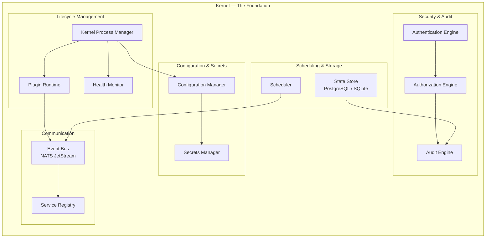
```mermaid
graph TB
    subgraph "Kernel — The Foundation"
        direction TB

        subgraph "Lifecycle Management"
            KPM[Kernel Process Manager]
            PR[Plugin Runtime]
            HM[Health Monitor]
        end

        subgraph "Communication"
            EB[Event Bus<br/>NATS JetStream]
            SR[Service Registry]
        end

        subgraph "Configuration & Secrets"
            CFG[Configuration Manager]
            SEC[Secrets Manager]
        end

        subgraph "Security & Audit"
            AUTH[Authentication Engine]
            AUTHZ[Authorization Engine]
            AUDIT[Audit Engine]
        end

        subgraph "Scheduling & Storage"
            SCHED[Scheduler]
            SS[State Store<br/>PostgreSQL / SQLite]
        end

        KPM --> PR
        KPM --> HM
        PR --> EB
        EB --> SR
        KPM --> CFG
        CFG --> SEC
        AUTH --> AUTHZ
        AUTHZ --> AUDIT
        SCHED --> EB
        SS --> AUDIT
    end
```

**Key properties:**
- Single Go binary, statically linked
- Sub-50MB on disk
- Starts in < 500ms
- Zero external dependencies for basic operation (SQLite for state when PostgreSQL is unavailable)
- OpenTelemetry instrumentation built-in
- Graceful shutdown with drain timeouts

### 3.2 Capability Layer

**Purpose:** The Capability Layer defines **what CloudOS can do**. Each capability is a Go interface that declares a set of operations (e.g., `ComputeCapability` defines `RunContainer`, `StopContainer`, `GetLogs`, `Scale`). These interfaces are the contracts that providers implement and that applications consume.


```mermaid
graph LR
    subgraph "Why Capabilities Exist"
        APP[Application] -- uses --> COMP[Compute Capability<br/>Interface]
        COMP -- implemented by --> DOCKER[Docker Provider]
        COMP -- implemented by --> K8S[K8s Provider]
        COMP -- implemented by --> FIRE[Firecracker Provider]
    end

    style COMP fill:#16213e,stroke:#0f3460,stroke-width:3px
```

**Why the Kernel depends on Capabilities instead of Providers:**

| If the Kernel depended on Providers | If the Kernel depends on Capabilities |
|-------------------------------------|----------------------------------------|
| Every new provider requires Kernel changes | New providers require no Kernel changes |
| Provider-specific bugs crash the Kernel | Provider crashes are isolated |
| Kernel binary grows with every provider | Kernel binary is fixed size |
| Cannot swap providers without Kernel rebuild | Swap providers with one config value |
| Community cannot add providers | Anyone can write a provider via the SDK |

### 3.3 Provider Layer

**Purpose:** Providers are concrete implementations of capability interfaces. A provider is packaged as a `.cosp` (CloudOS Plugin) file and registered with the Kernel's Plugin Runtime. Multiple providers can implement the same capability; the active provider is selected by configuration.


```mermaid
graph TB
    subgraph "Provider Layer — Multiple Implementations Per Capability"
        STOR_INTERFACE[Storage Capability Interface]

        STOR_LOCAL[Local FS Provider<br/>Built-in, zero-config]
        STOR_MINIO[MinIO Provider<br/>Self-hosted S3-compatible]
        STOR_S3[AWS S3 Provider<br/>Cloud-native]
        STOR_GCS[GCS Provider<br/>Google Cloud]
        STOR_R2[Cloudflare R2 Provider<br/>Edge storage]

        STOR_INTERFACE --> STOR_LOCAL
        STOR_INTERFACE --> STOR_MINIO
        STOR_INTERFACE --> STOR_S3
        STOR_INTERFACE --> STOR_GCS
        STOR_INTERFACE --> STOR_R2
    end

    style STOR_INTERFACE fill:#16213e,stroke:#0f3460,stroke-width:3px
```

### 3.4 Plugin Layer

**Purpose:** The Plugin Layer is the execution environment for all third-party and community code in CloudOS. It provides sandboxing, resource limits, lifecycle management, and communication primitives. Everything that extends CloudOS is a plugin — providers, hooks, extensions, UI panels.

### 3.5 Application Layer

**Purpose:** Applications are the user-facing surfaces of CloudOS. They consume the API Gateway and provide interaction for humans. Every application has access to the same set of operations — **no surface is second-class**.

| Application | Technology | Primary Use Case |
|-------------|------------|------------------|
| **Web Dashboard** | React 19 + TypeScript + Tailwind v4 | Daily management, visual operations |
| **CLI** | Go + Cobra + charm.sh libraries | Automation, scripting, power users |
| **Mobile App** | React Native / Expo 52 | On-the-go management, incident response |
| **Desktop App** | Tauri 2 + Rust + React | Native experience, system tray, offline |
| **AI Chat** | Integrated into all surfaces | Natural language operations |

### 3.6 SDK Layer

**Purpose:** The SDK provides everything needed to build a CloudOS plugin. It abstracts the complexity of gRPC communication, sandbox compliance, event subscription, and capability registration behind a clean developer API.

### 3.7 Marketplace Layer

**Purpose:** The Marketplace is the distribution platform for CloudOS plugins. It provides discovery, installation, updates, security scanning, and trust management for the entire plugin ecosystem.

### 3.8 AI Orchestrator Layer

**Purpose:** The AI Orchestrator is the intelligence layer that coordinates capabilities to fulfill user intent. It is a **separate process** from the Kernel. It listens to the Event Bus for user requests, builds context from capability states, selects the optimal AI model, executes AI reasoning, and dispatches commands back to capabilities.

**The AI Orchestrator is NOT inside the Kernel:**
- The Kernel must remain stable and minimal — AI is a capability, not a primitive
- AI providers change rapidly; the Kernel should not be coupled to their release cycles
- The AI Orchestrator can be scaled independently
- Air-gapped deployments can run AI with local models while the Kernel remains identical

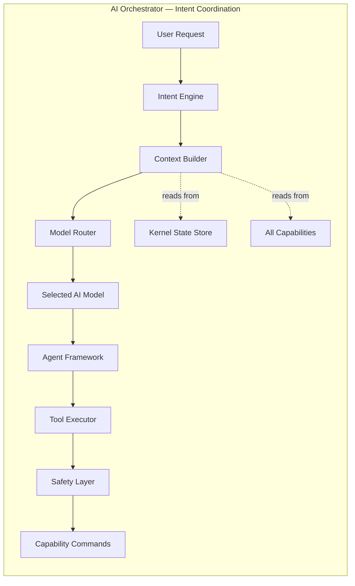
```mermaid
graph LR
    subgraph "AI Orchestrator — Intent Coordination"
        USER[User Request] --> INTENT[Intent Engine]
        INTENT --> CB[Context Builder]
        CB --> MR[Model Router]
        MR --> LLM[Selected AI Model]
        LLM --> AG[Agent Framework]
        AG --> TE[Tool Executor]
        TE --> SL[Safety Layer]
        SL --> CMD[Capability Commands]

        CB -.->|reads from| K[Kernel State Store]
        CB -.->|reads from| CAPS[All Capabilities]
    end
```

---

## 4. Kernel Deep Dive

### 4.1 Kernel Design Principles

| # | Principle | Description |
|---|-----------|-------------|
| 1 | **Minimal Surface Area** | The Kernel does only what nothing else can do. Everything else lives in capabilities or providers. |
| 2 | **Zero Provider Awareness** | The Kernel never imports, references, or depends on any provider implementation. Providers are strangers that implement Kernel-defined interfaces. |
| 3 | **Crash Isolation** | No plugin crash can affect the Kernel. The Kernel is a single Go process; plugins run in separate OS processes or WASM sandboxes. |
| 4 | **Self-Healing** | The Kernel monitors all subsystems and plugins. Failed components are automatically restarted. Only persistent failures escalate to the AI Orchestrator. |
| 5 | **Observability by Default** | Every Kernel operation emits metrics, logs, and traces via OpenTelemetry. Nothing is hidden. |
| 6 | **Graceful Degradation** | If PostgreSQL is unavailable, the Kernel falls back to embedded SQLite. If NATS is down, events are buffered in memory. The Kernel never hard-fails on dependency loss. |
| 7 | **Hot-Reloadable Configuration** | The Kernel never requires a restart for configuration changes. Every subsystem watches for config change events and applies them live. |
| 8 | **Immutable Audit Trail** | Every mutation in the Kernel is recorded in an append-only, cryptographically linked audit log. No operation is invisible. |

### 4.2 Kernel Subsystems

The Kernel comprises 12 subsystems, each with a single responsibility:


```mermaid
graph TB
    subgraph "Kernel Subsystems & Their Interactions"
        direction TB

        BOOT[Bootloader] --> KPM

        subgraph "Core Runtime"
            KPM[1. Kernel Process Manager]
            PR[2. Plugin Runtime]
            HM[10. Health Monitor]
        end

        subgraph "Communication"
            EB[3. Event Bus]
            SR[12. Service Registry]
        end

        subgraph "Data & Configuration"
            CFG[4. Configuration Manager]
            SEC[5. Secrets Manager]
            SS[11. State Store]
        end

        subgraph "Security"
            AUTH[6. Authentication Engine]
            AUTHZ[7. Authorization Engine]
            AUDIT[8. Audit Engine]
        end

        subgraph "Automation"
            SCHED[9. Scheduler]
        end

        KPM --> PR
        KPM --> CFG
        KPM --> AUTH
        KPM --> SS

        PR --> EB
        PR --> SR

        CFG --> SEC

        AUTH --> AUTHZ
        AUTHZ --> AUDIT

        EB --> SCHED
        EB --> HM

        HM --> SR
        SS --> AUDIT
    end

    style KPM fill:#1a1a2e,stroke:#e94560,stroke-width:2px
    style PR fill:#1a1a2e,stroke:#e94560,stroke-width:2px
    style EB fill:#1a1a2e,stroke:#e94560,stroke-width:2px
```

| # | Subsystem | Primary Responsibility | Dependencies |
|---|-----------|----------------------|--------------|
| 1 | **Kernel Process Manager** | Start, stop, restart all Kernel subsystems and plugins in dependency order | OS primitives, Config Manager, Audit Engine |
| 2 | **Plugin Runtime** | Sandboxed execution environment for plugins (WASM, Native, HTTP) | KPM, Configuration Manager, Secrets Manager |
| 3 | **Event Bus** | Central nervous system — async communication via NATS JetStream | Configuration Manager, Secrets Manager, State Store |
| 4 | **Configuration Manager** | Unified hierarchical configuration with hot-reload, schema validation | State Store, Event Bus, Audit Engine |
| 5 | **Secrets Manager** | Encrypted storage, rotation, and injection of secrets | State Store, Key Management, Audit Engine |
| 6 | **Authentication Engine** | Identity verification — JWT issuance, token validation, multi-method auth | Identity Capability, State Store, Secrets Manager |
| 7 | **Authorization Engine** | Permission evaluation — RBAC with ABAC extensions | Auth Engine, State Store, Event Bus, Audit Engine |
| 8 | **Audit Engine** | Immutable, append-only, cryptographically verified event log | Event Bus, State Store |
| 9 | **Scheduler** | Cron jobs, delayed tasks, workflow triggers | Event Bus, State Store, Health Monitor |
| 10 | **Health Monitor** | Continuous health checking, degradation detection, alert triggering | Event Bus, Config Manager, Audit Engine |
| 11 | **State Store** | Persistent storage (PostgreSQL default, SQLite fallback) | OS filesystem, network |
| 12 | **Service Registry** | Real-time directory of active services, plugins, and endpoints | Health Monitor, Event Bus, State Store |

### 4.3 What the Kernel Does NOT Do

This list is as important as the list of what the Kernel does. Every item below is explicitly outside the Kernel's responsibility:

| Not in Kernel | Where It Lives |
|---------------|----------------|
| Run user workloads (containers, VMs, functions) | Compute Capability → Docker/Firecracker/K8s Provider |
| Store user files (uploaded assets, backups) | Storage Capability → S3/MinIO/LocalFS Provider |
| Provision databases | Database Capability → PostgreSQL/SQLite Provider |
| Execute AI model inference | AI Capability → OpenAI/Anthropic/Ollama Provider |
| Send emails | Email Capability → SendGrid/SMTP/Resend Provider |
| Manage DNS records | DNS Capability → Cloudflare/Route53 Provider |
| Render dashboard UI panels | Application Layer / UI Plugins |
| Process payments | Billing Capability → Stripe/Lemon Squeezy Provider |
| Display notifications | Notification hooks / UI layer |
| Implement business logic for any specific domain | Capability → Provider chain |
| Import any plugin code | Kernel stays import-free of all plugins |
| Know about any specific cloud provider | Kernel has no AWS/GCP/Azure references |

### 4.4 Kernel Boundaries & Extension Points

The Kernel defines several extension points where capabilities and plugins hook in:

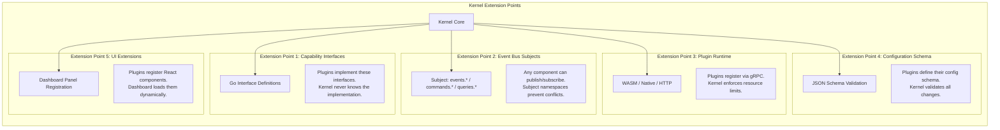
```mermaid
graph TB
    subgraph "Kernel Extension Points"
        direction TB

        KRN[Kernel Core]

        subgraph "Extension Point 1: Capability Interfaces"
            EP1[Go Interface Definitions]
            EP1_NOTE["Plugins implement these interfaces.<br/>Kernel never knows the implementation."]
        end

        subgraph "Extension Point 2: Event Bus Subjects"
            EP2[Subject: events.* / commands.* / queries.*]
            EP2_NOTE["Any component can publish/subscribe.<br/>Subject namespaces prevent conflicts."]
        end

        subgraph "Extension Point 3: Plugin Runtime"
            EP3[WASM / Native / HTTP]
            EP3_NOTE["Plugins register via gRPC.<br/>Kernel enforces resource limits."]
        end

        subgraph "Extension Point 4: Configuration Schema"
            EP4[JSON Schema Validation]
            EP4_NOTE["Plugins define their config schema.<br/>Kernel validates all changes."]
        end

        subgraph "Extension Point 5: UI Extensions"
            EP5[Dashboard Panel Registration]
            EP5_NOTE["Plugins register React components.<br/>Dashboard loads them dynamically."]
        end

        KRN --> EP1
        KRN --> EP2
        KRN --> EP3
        KRN --> EP4
        KRN --> EP5
    end
```

### 4.5 Kernel Startup Sequence

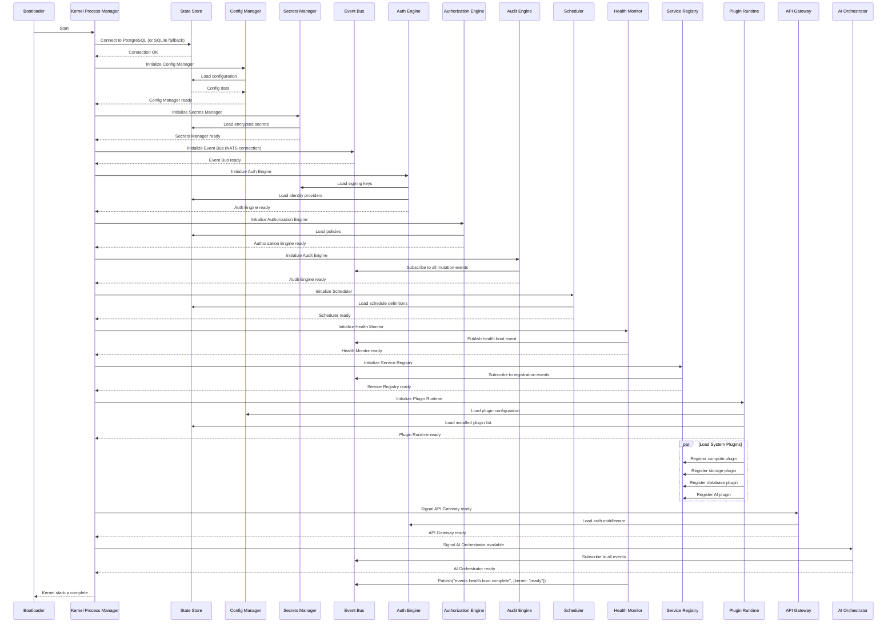
```mermaid
sequenceDiagram
    participant BOOT as Bootloader
    participant KPM as Kernel Process Manager
    participant SS as State Store
    participant CFG as Config Manager
    participant SEC as Secrets Manager
    participant EB as Event Bus
    participant AUTH as Auth Engine
    participant AUTHZ as Authorization Engine
    participant AUDIT as Audit Engine
    participant SCHED as Scheduler
    participant HM as Health Monitor
    participant SR as Service Registry
    participant PR as Plugin Runtime
    participant GW as API Gateway
    participant AIO as AI Orchestrator

    BOOT->>KPM: Start

    KPM->>SS: Connect to PostgreSQL (or SQLite fallback)
    SS-->>KPM: Connection OK

    KPM->>CFG: Initialize Config Manager
    CFG->>SS: Load configuration
    SS-->>CFG: Config data
    CFG-->>KPM: Config Manager ready

    KPM->>SEC: Initialize Secrets Manager
    SEC->>SS: Load encrypted secrets
    SEC-->>KPM: Secrets Manager ready

    KPM->>EB: Initialize Event Bus (NATS connection)
    EB-->>KPM: Event Bus ready

    KPM->>AUTH: Initialize Auth Engine
    AUTH->>SEC: Load signing keys
    AUTH->>SS: Load identity providers
    AUTH-->>KPM: Auth Engine ready

    KPM->>AUTHZ: Initialize Authorization Engine
    AUTHZ->>SS: Load policies
    AUTHZ-->>KPM: Authorization Engine ready

    KPM->>AUDIT: Initialize Audit Engine
    AUDIT->>EB: Subscribe to all mutation events
    AUDIT-->>KPM: Audit Engine ready

    KPM->>SCHED: Initialize Scheduler
    SCHED->>SS: Load schedule definitions
    SCHED-->>KPM: Scheduler ready

    KPM->>HM: Initialize Health Monitor
    HM->>EB: Publish health.boot event
    HM-->>KPM: Health Monitor ready

    KPM->>SR: Initialize Service Registry
    SR->>EB: Subscribe to registration events
    SR-->>KPM: Service Registry ready

    KPM->>PR: Initialize Plugin Runtime
    PR->>CFG: Load plugin configuration
    PR->>SS: Load installed plugin list
    PR-->>KPM: Plugin Runtime ready

    par Load System Plugins
        PR->>SR: Register compute plugin
        PR->>SR: Register storage plugin
        PR->>SR: Register database plugin
        PR->>SR: Register AI plugin
    end

    KPM->>GW: Signal API Gateway ready
    GW->>AUTH: Load auth middleware
    GW-->>KPM: API Gateway ready

    KPM->>AIO: Signal AI Orchestrator available
    AIO->>EB: Subscribe to all events
    AIO-->>KPM: AI Orchestrator ready

    HM->>EB: Publish("events.health.boot.complete", {kernel: "ready"})
    KPM-->>BOOT: Kernel startup complete
```

**Total target time:** < 3 seconds (cold start), < 1 second (warm restart)

---

## 5. Capability Layer Deep Dive

### 5.1 Why Capabilities Exist

Capabilities are the **critical abstraction** that makes CloudOS provider-agnostic. Without capabilities, every layer of the system would need to know about every possible provider — creating tight coupling and making provider swaps impossible.

**The Problem Capabilities Solve:**


```mermaid
graph LR
    subgraph "Without Capabilities (Tight Coupling)"
        APP[Application] --> DOCKER[Docker API]
        APP --> S3[AWS S3 API]
        APP --> PG[PostgreSQL API]
        APP --> OAI[OpenAI API]
        APP --> CF[Cloudflare API]
        APP --> REDIS[Redis API]
    end

    subgraph "With Capabilities (Loose Coupling)"
        APP2[Application] --> COMP[Compute Capability]
        APP2 --> STOR[Storage Capability]
        APP2 --> DB[Database Capability]
        APP2 --> AI_CAP[AI Capability]

        COMP --> DOCKER2[Docker Provider]
        COMP --> K8S2[K8s Provider]
        STOR --> S3_2[S3 Provider]
        STOR --> MINIO[MinIO Provider]
        DB --> PG2[PostgreSQL Provider]
        DB --> SQLITE[SQLite Provider]
        AI_CAP --> OAI2[OpenAI Provider]
        AI_CAP --> OLLAMA[Ollama Provider]
    end

    style COMP fill:#16213e,stroke:#0f3460,stroke-width:2px
    style STOR fill:#16213e,stroke:#0f3460,stroke-width:2px
    style DB fill:#16213e,stroke:#0f3460,stroke-width:2px
    style AI_CAP fill:#16213e,stroke:#0f3460,stroke-width:2px
```

**Key Benefits:**

| Benefit | Explanation |
|---------|-------------|
| **Provider Swappability** | Change `storage.provider: s3` to `storage.provider: minio` in config. Zero code changes. |
| **AI Agnosticism** | The AI Orchestrator only knows about capabilities. Swapping AI providers doesn't change AI behavior. |
| **Independent Evolution** | Capabilities version independently. A v2 capability can coexist with v1. |
| **Testing & Mocking** | Capabilities can be mocked for testing. Tests don't need real infrastructure. |
| **Community Extensibility** | Anyone can write a new provider for any capability without touching the Kernel. |

### 5.2 Capability Interface Catalog

Each capability is an abstract Go interface. Below is the complete catalog with responsibilities:

| # | Capability | Primary Responsibility | Example Operations |
|---|------------|----------------------|-------------------|
| 1 | **Compute** | Run, stop, scale, and monitor user workloads | `RunContainer`, `StopContainer`, `Scale`, `GetLogs`, `GetMetrics` |
| 2 | **Storage** | Object storage with S3-compatible API | `CreateBucket`, `PutObject`, `GetObject`, `PresignURL`, `DeleteObject` |
| 3 | **Database** | Provision, manage, backup, and scale databases | `Create`, `GetConnectionString`, `CreateReadReplica`, `Scale`, `CreateBackup` |
| 4 | **AI** | Unified AI inference, embeddings, model routing | `ChatCompletion`, `GenerateEmbedding`, `ListModels`, `ChatCompletionStream` |
| 5 | **Identity** | External authentication (OAuth, SAML, LDAP, WebAuthn) | `Authenticate`, `InitiateOAuth`, `HandleOAuthCallback`, `VerifySAMLAssertion` |
| 6 | **Networking** | Firewalls, load balancers, VPNs, traffic routing | `CreateFirewallRule`, `ProvisionLoadBalancer`, `CreateVPNConnection` |
| 7 | **DNS** | Domain name management, records, propagation | `CreateRecord`, `UpdateRecord`, `ListRecords`, `CheckPropagation` |
| 8 | **Monitoring** | Metrics, alerts, dashboards, observability | `RecordMetric`, `QueryMetrics`, `CreateAlertRule`, `GetDashboard` |
| 9 | **Search** | Full-text and semantic search across resources | `Index`, `Search`, `Delete`, `ReindexAll` |
| 10 | **Messaging** | Pub/sub messaging, WebSocket, event streaming | `Publish`, `Subscribe`, `Unsubscribe`, `QueueSubscribe` |
| 11 | **Email** | Transactional email sending and deliverability | `Send`, `SendTemplate`, `GetDeliveryStatus`, `ListTemplates` |
| 12 | **Billing** | Usage metering, cost calculation, invoicing, payments | `RecordUsage`, `GetCurrentCosts`, `GenerateInvoice`, `SetBudget` |

### 5.3 Capability Versioning

Capabilities are versioned independently from the Kernel:

```yaml
capability-storage:
  versions:
    v1:  # Initial interface (2026 Q3)
      - CreateBucket(name, opts)
      - PutObject(bucket, key, data, opts)
      - GetObject(bucket, key)
      - DeleteObject(bucket, key)
    v2:  # Added presigned URLs and lifecycle (2026 Q4)
      - +PresignURL(bucket, key, expiry)
      - +SetLifecycleRule(bucket, rule)
    v3:  # Added multipart uploads (2027 Q1)
      - +CreateMultipartUpload(bucket, key)
      - +UploadPart(bucket, key, uploadID, partNumber, data)
      - +CompleteMultipartUpload(bucket, key, uploadID)
```

**Versioning rules:**
- New methods are always additive (never break backward compatibility)
- Deprecated methods carry a `// Deprecated` comment and are removed after 2 minor versions
- A provider can implement any subset of versions (minimum v1)
- The Kernel routes to the appropriate version based on provider capability declaration

### 5.4 Cross-Cutting Concerns

Cross-cutting concerns are handled by **wrapper layers** around capabilities, not baked into the interfaces:

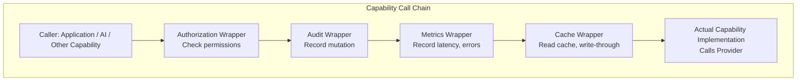
```mermaid
graph TB
    subgraph "Capability Call Chain"
        CALLER[Caller: Application / AI / Other Capability]
        AUTHZ_WRAP[Authorization Wrapper<br/>Check permissions]
        AUDIT_WRAP[Audit Wrapper<br/>Record mutation]
        METRICS_WRAP[Metrics Wrapper<br/>Record latency, errors]
        CACHE_WRAP[Cache Wrapper<br/>Read cache, write-through]
        CAPABILITY[Actual Capability Implementation<br/>Calls Provider]

        CALLER --> AUTHZ_WRAP
        AUTHZ_WRAP --> AUDIT_WRAP
        AUDIT_WRAP --> METRICS_WRAP
        METRICS_WRAP --> CACHE_WRAP
        CACHE_WRAP --> CAPABILITY
    end
```

Each wrapper is optional and configurable. If a capability is called from a context that already performed authorization (e.g., internal AI Orchestrator), the authorization wrapper is skipped.

---

## 6. Provider Layer Deep Dive

### 6.1 Provider Packaging (`.cosp`)

Every provider is distributed as a `.cosp` (CloudOS Plugin) package — a tar.gz archive with a manifest:

```
my-provider.cosp
├── manifest.yaml            # Required: name, version, capabilities, permissions
├── provider.wasm            # WASM binary (or native binary for system plugins)
├── config.schema.json       # JSON Schema for provider configuration
├── ui/                      # Optional: custom dashboard panels
│   ├── panel.js
│   └── panel.css
├── assets/                  # Icons, screenshots
│   ├── icon.svg
│   └── screenshot.png
├── permissions.yaml         # Required: declared permissions
├── signature.sig            # GPG signature (required for marketplace plugins)
└── checksums.txt            # SHA-256 checksums for all files
```

### 6.2 Provider Types

| Type | Runtime | Security Isolation | Performance | Best For |
|------|---------|-------------------|-------------|----------|
| **System** | Native (Go) | Process-level | Native speed | Built-in capabilities shipped with CloudOS |
| **Official** | WASM | Memory-sandboxed, no filesystem | Near-native (WASI) | CloudOS-maintained providers |
| **Community** | WASM | Full sandbox, resource limits (CPU/memory/disk) | Moderate (WASM) | Community-contributed providers |
| **HTTP** | Remote process | Network-level | Depends on network latency | Enterprise integrations, legacy systems |
| **Enterprise** | Native or WASM | Custom security profile | Configurable | Enterprise private providers with custom audit |

### 6.3 Provider Lifecycle

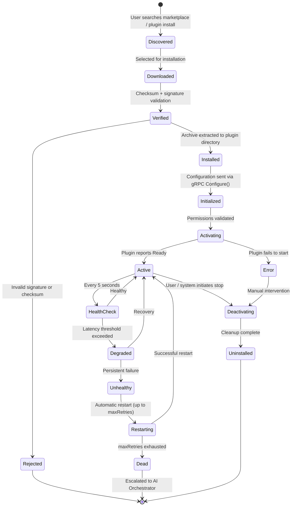
```mermaid
stateDiagram-v2
    [*] --> Discovered: User searches marketplace / plugin install
    Discovered --> Downloaded: Selected for installation
    Downloaded --> Verified: Checksum + signature validation

    Verified --> Rejected: Invalid signature or checksum
    Rejected --> [*]

    Verified --> Installed: Archive extracted to plugin directory
    Installed --> Initialized: Configuration sent via gRPC Configure()
    Initialized --> Activating: Permissions validated

    Activating --> Active: Plugin reports Ready
    Activating --> Error: Plugin fails to start

    Active --> HealthCheck: Every 5 seconds
    HealthCheck --> Active: Healthy
    HealthCheck --> Degraded: Latency threshold exceeded
    Degraded --> Active: Recovery
    Degraded --> Unhealthy: Persistent failure

    Unhealthy --> Restarting: Automatic restart (up to maxRetries)
    Restarting --> Active: Successful restart
    Restarting --> Dead: maxRetries exhausted

    Dead --> [*]: Escalated to AI Orchestrator

    Active --> Deactivating: User / system initiates stop
    Deactivating --> Uninstalled: Cleanup complete
    Uninstalled --> [*]

    Error --> Deactivating: Manual intervention
```

**Lifecycle states in detail:**

| State | Description | Timeout |
|-------|-------------|---------|
| **Discovered** | Plugin found in registry or local filesystem | — |
| **Downloaded** | `.cosp` archive fetched and cached | — |
| **Verified** | Signature and checksum validated | 2 seconds |
| **Installed** | Archive extracted to `~/.cloudos/plugins/<name>/` | — |
| **Initialized** | `Configure()` gRPC call sent with config | 30 seconds |
| **Activating** | Plugin starting up, health check pending | Configurable (default 30s) |
| **Active** | Plugin is healthy and serving | — |
| **Degraded** | Health check latency > threshold or error rate > threshold | Auto-recovery |
| **Unhealthy** | Health check failed N consecutive times | Escalation |
| **Restarting** | Process Manager re-spawning plugin | 10 seconds |
| **Dead** | Plugin failed to start after max retries | Manual intervention |
| **Deactivating** | Graceful shutdown with drain | 15 seconds |
| **Uninstalled** | Cleanup complete, files removed | — |

### 6.4 Provider Selection & Chaining

The active provider for each capability is determined by configuration:

```yaml
# config.yaml
capabilities:
  storage:
    provider: s3
    config:
      region: us-east-1
      bucket_prefix: cloudos-prod

  compute:
    primary: docker
    fallback:
      - firecracker
      - k8s
    selection_strategy: cost_optimized
    # Options: primary_only, cost_optimized, latency_optimized, random, failover

  ai:
    primary: openai
    fallback:
      - anthropic
      - gemini
      - ollama
    selection_strategy: cost_optimized
    config:
      max_retries: 3
      retry_delay: "1s"
      circuit_breaker:
        error_threshold: 5
        recovery_timeout: "30s"
```

**Selection Strategies:**

| Strategy | Behavior | Use Case |
|----------|----------|----------|
| `primary_only` | Always use the primary. No fallback. | Single-provider deployments |
| `failover` | Use primary. On error, try fallback in order. Circuit breaker per provider. | High availability |
| `cost_optimized` | Select cheapest provider that meets latency requirements. | Cost-sensitive workloads |
| `latency_optimized` | Select provider with lowest observed p50 latency. | Performance-sensitive workloads |
| `random` | Distribute load randomly across all configured providers. | Testing, load balancing |

### 6.5 Provider Catalog

CloudOS ships with the following built-in providers. Each implements one or more capability interfaces.

| Provider | Capability | Runtime | Default? | Notes |
|----------|------------|---------|----------|-------|
| `storage.local` | Storage | Native | ✅ | Local filesystem storage |
| `compute.local` | Compute | Native | ✅ | Local process execution |
| `database.sqlite` | Database | Native | ✅ | Embedded SQLite |
| `dns.builtin` | DNS | Native | ✅ | Built-in DNS server |
| `ssl.letsencrypt` | SSL/Networking | Native | ✅ | Let's Encrypt auto-provisioning |
| `monitoring.builtin` | Monitoring | Native | ✅ | Embedded metrics collection |
| `logging.builtin` | Monitoring | Native | ✅ | Embedded log aggregation |
| `auth.builtin` | Identity | Native | ✅ | Local PostgreSQL-backed auth |
| `queue.builtin` | Messaging | Native | ✅ | In-process message queue |

Additional providers can be installed from the Marketplace:

| Provider | Capability | Type | Marketplace |
|----------|------------|------|-------------|
| `storage.s3` | Storage | Official | ✅ |
| `storage.minio` | Storage | Official | ✅ |
| `storage.gcs` | Storage | Official | ✅ |
| `compute.docker` | Compute | Official | ✅ |
| `compute.firecracker` | Compute | Official | ✅ |
| `compute.k8s` | Compute | Official | ✅ |
| `database.postgresql` | Database | Official | ✅ |
| `database.mysql` | Database | Official | ✅ |
| `database.mongodb` | Database | Community | ✅ |
| `ai.openai` | AI | Official | ✅ |
| `ai.anthropic` | AI | Official | ✅ |
| `ai.gemini` | AI | Official | ✅ |
| `ai.ollama` | AI | Official | ✅ |
| `identity.oauth` | Identity | Official | ✅ |
| `identity.saml` | Identity | Official | ✅ |
| `identity.webauthn` | Identity | Official | ✅ |
| `dns.cloudflare` | DNS | Official | ✅ |
| `dns.route53` | DNS | Official | ✅ |
| `email.sendgrid` | Email | Official | ✅ |
| `email.resend` | Email | Official | ✅ |
| `billing.stripe` | Billing | Official | ✅ |

---

## 7. Plugin System

### 7.1 Plugin Manifest

Every plugin must include a `manifest.yaml` file in its `.cosp` archive:

```yaml
# manifest.yaml
apiVersion: cloudos.io/v1
kind: Plugin
metadata:
  # Identity
  name: storage.minio
  displayName: MinIO Storage
  version: 1.2.0
  author:
    name: CloudOS Team
    email: plugins@cloudos.io
    url: https://cloudos.io/authors/cloudos-team
  license: MIT
  description: >
    MinIO-compatible S3 storage provider for CloudOS.
    Supports buckets, objects, presigned URLs, and multipart uploads.
  tags:
    - storage
    - s3-compatible
    - self-hosted
    - s3

  # Visual identity
  icon: assets/icon.svg
  screenshots:
    - assets/screenshot-1.png
    - assets/screenshot-2.png

  # Links
  homepage: https://github.com/cloudos/plugins/storage-minio
  repository: https://github.com/cloudos/plugins/storage-minio
  documentation: https://docs.cloudos.io/plugins/storage-minio

spec:
  # Runtime type: wasm, native, http
  runtime: wasm

  # Which capabilities this plugin provides
  capabilities:
    - storage:
        version: ">=1.0.0, <3.0.0"
        features:
          - buckets
          - objects
          - presigned-urls
          - multipart

  # Declared permissions (user approves at install time)
  permissions:
    - network:outbound: ["*:9000", "*:443"]
    - fs:read: ["/tmp/cloudos/storage-minio"]
    - fs:write: ["/tmp/cloudos/storage-minio"]

  # Resource limits
  resources:
    cpu: "0.5"        # 0.5 cores
    memory: "128Mi"   # 128 MB RAM
    disk: "1Gi"       # 1 GB temporary disk
    network: "10mbps" # 10 Mbps bandwidth limit

  # Dependencies on other plugins or Kernel version
  dependencies:
    kernel: ">=0.1.0, <1.0.0"
    plugins:
      storage.base: ">=1.0.0"

  # Configuration schema
  config:
    schema: config.schema.json
    defaults:
      endpoint: "http://localhost:9000"
      region: "us-east-1"
      secure: false

  # Lifecycle timeouts
  lifecycle:
    startup: 30s      # Max time for Activate()
    healthInterval: 15s
    shutdown: 10s     # Max time for Deactivate()

  # Required Kernel API scopes
  apiScopes:
    - eventbus:publish: ["events.storage.*"]
    - eventbus:subscribe: ["events.config.*"]
    - secrets:read: ["storage/minio/*"]
```

### 7.2 Plugin Metadata & Versioning

Plugins follow strict SemVer 2.0 versioning:

| Version Component | Change Requires | Example |
|-------------------|-----------------|---------|
| **MAJOR** | Breaking interface change, permission increase, capability removal | `1.0.0` → `2.0.0` |
| **MINOR** | New capability, new features, optional config additions | `1.0.0` → `1.1.0` |
| **PATCH** | Bug fixes, performance improvements, no API changes | `1.0.0` → `1.0.1` |

**Version constraints** (used in `dependencies.kernel` and `dependencies.plugins`):

| Constraint | Meaning | Example |
|------------|---------|---------|
| `>=1.0.0` | 1.0.0 or higher | `kernel: ">=0.1.0"` |
| `>=1.0.0, <2.0.0` | Any 1.x version | `storage.base: ">=1.0.0, <2.0.0"` |
| `~1.2.0` | Compatible with 1.2.0 (>=1.2.0, <1.3.0) | — |
| `^1.2.0` | Compatible with 1.2.0 (>=1.2.0, <2.0.0) | — |
| `1.2.0` | Exact match | — |

### 7.3 Plugin Dependencies

Plugins can declare dependencies on:

1. **Kernel version** — Required. Minimum Kernel API version.
2. **Capability interfaces** — Which capability versions this plugin requires.
3. **Other plugins** — Optional. Plugin A requires Plugin B's capabilities.

```yaml
dependencies:
  # Kernel API compatibility
  kernel: ">=0.1.0, <1.0.0"

  # Capability interfaces this plugin needs (NOT providers — just interfaces)
  capabilities:
    - storage: ">=1.0.0"
    - compute: ">=2.0.0"

  # Other plugins (optional)
  plugins:
    storage.base: ">=1.0.0"    # Plugin must be active
    logging.builtin: ">=0.1.0" # Optional dependency
```

**Dependency resolution rules:**
- Dependencies are resolved at install time
- Circular dependencies are rejected
- Missing dependencies block installation with a clear error message
- Dependency upgrades require re-validation of the dependency graph

### 7.4 Plugin Permissions Model

Every plugin declares the permissions it requires. Users approve these at install time.

```yaml
permissions:
  # Network access — which hosts and ports the plugin can reach
  - network:outbound: ["*:443", "api.minio.io:443"]

  # Network access — which ports the plugin can listen on
  - network:inbound: ["8080"]

  # Filesystem access — read paths
  - fs:read: ["/tmp/cloudos/plugins/storage-minio"]

  # Filesystem access — write paths
  - fs:write: ["/tmp/cloudos/plugins/storage-minio"]

  # Process execution
  - process:exec: []  # Empty = no exec allowed

  # Capability registration
  - capability:register: ["storage"]

  # Event publishing
  - event:publish: ["events.storage.*"]

  # Event subscription
  - event:subscribe: ["events.config.*", "events.health.*"]

  # Secret reading
  - secrets:read: ["storage/minio/*"]

  # HTTP plugin: outbound only
  - network:outbound: ["*:443"]
```

**Permission levels:**

| Level | Description | Example |
|-------|-------------|---------|
| **None** | Plugin has no access | Community plugins for non-networked features |
| **Restricted** | Declared, specific access | Network to specific hosts, FS to specific paths |
| **Full** | Broad access within a domain | `network:outbound: ["*:*"]` |
| **System** | Kernel-level access | Built-in plugins only |

### 7.5 Plugin Lifecycle

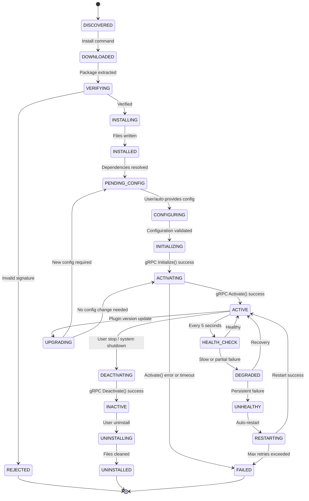
```mermaid
stateDiagram-v2
    [*] --> DISCOVERED

    DISCOVERED --> DOWNLOADED: Install command
    DOWNLOADED --> VERIFYING: Package extracted
    VERIFYING --> REJECTED: Invalid signature
    VERIFYING --> INSTALLING: Verified

    REJECTED --> [*]

    INSTALLING --> INSTALLED: Files written
    INSTALLED --> PENDING_CONFIG: Dependencies resolved
    PENDING_CONFIG --> CONFIGURING: User/auto provides config
    CONFIGURING --> INITIALIZING: Configuration validated
    INITIALIZING --> ACTIVATING: gRPC Initialize() success

    ACTIVATING --> ACTIVE: gRPC Activate() success
    ACTIVATING --> FAILED: Activate() error or timeout

    ACTIVE --> HEALTH_CHECK: Every 5 seconds
    HEALTH_CHECK --> ACTIVE: Healthy
    HEALTH_CHECK --> DEGRADED: Slow or partial failure
    DEGRADED --> ACTIVE: Recovery
    DEGRADED --> UNHEALTHY: Persistent failure

    UNHEALTHY --> RESTARTING: Auto-restart
    RESTARTING --> ACTIVE: Restart success
    RESTARTING --> FAILED: Max retries exceeded

    ACTIVE --> UPGRADING: Plugin version update
    UPGRADING --> PENDING_CONFIG: New config required
    UPGRADING --> ACTIVATING: No config change needed

    ACTIVE --> DEACTIVATING: User stop / system shutdown
    DEACTIVATING --> INACTIVE: gRPC Deactivate() success
    INACTIVE --> UNINSTALLING: User uninstall
    UNINSTALLING --> UNINSTALLED: Files cleaned
    UNINSTALLED --> [*]

    FAILED --> [*]
```

### 7.6 Plugin Configuration

Every plugin defines its configuration schema as a JSON Schema:

```json
{
  "$schema": "https://json-schema.org/draft/2020-12/schema",
  "type": "object",
  "properties": {
    "endpoint": {
      "type": "string",
      "format": "uri",
      "description": "MinIO server endpoint",
      "default": "http://localhost:9000"
    },
    "region": {
      "type": "string",
      "description": "Storage region",
      "default": "us-east-1",
      "enum": ["us-east-1", "us-west-2", "eu-west-1", "ap-southeast-1"]
    },
    "access_key": {
      "type": "string",
      "description": "MinIO access key (or use secrets manager)"
    },
    "secret_key": {
      "type": "string",
      "description": "MinIO secret key (or use secrets manager)",
      "writeOnly": true
    },
    "secure": {
      "type": "boolean",
      "description": "Use TLS connection",
      "default": true
    }
  },
  "required": ["endpoint"],
  "if": {
    "properties": { "secure": { "const": true } }
  },
  "then": {
    "properties": {
      "endpoint": { "pattern": "^https://" }
    }
  }
}
```

**Configuration sources** (resolved in order, later sources override earlier):
1. Plugin manifest defaults
2. Platform-level config (`/etc/cloudos/plugins/<name>.yaml`)
3. Organization-level config
4. Project-level config
5. User-provided config (CLI, dashboard, AI)
6. Environment variables (`CLOUDOS_PLUGIN_<NAME>_<KEY>`)

### 7.7 Plugin Events

Plugins can publish and subscribe to events through the Event Bus:

**Event naming convention:**
```
events.plugins.<plugin-name>.<event-type>
```

**Examples:**
```
events.plugins.storage-minio.bucket.created
events.plugins.storage-minio.bucket.deleted
events.plugins.storage-minio.object.uploaded
events.plugins.deployment-github.push.detected
events.plugins.monitoring-prometheus.alert.fired
```

**Event structure:**
```json
{
  "specversion": "1.0",
  "type": "events.plugins.storage-minio.bucket.created",
  "source": "/plugins/storage.minio",
  "id": "a234-1234-5678",
  "time": "2026-06-29T12:00:00Z",
  "subject": "buckets/my-app-assets",
  "datacontenttype": "application/json",
  "data": {
    "bucket": "my-app-assets",
    "region": "us-east-1",
    "created_by": "user-abc"
  }
}
```

**Subscription rules:**
- Plugins can only subscribe to subjects they declared in `permissions.event:subscribe`
- Wildcards allowed: `events.storage.*` matches all storage events
- Plugins cannot subscribe to kernel-internal subjects (`audit.*`, `health.*`) without special permission

### 7.8 Plugin API

Plugins communicate with the Kernel via gRPC over Unix domain sockets (local) or mTLS TCP (remote):

```protobuf
// Plugin Lifecycle — Kernel → Plugin
service PluginLifecycle {
  rpc Initialize(InitializeRequest) returns (InitializeResponse);
  rpc Activate(ActivateRequest) returns (ActivateResponse);
  rpc Deactivate(DeactivateRequest) returns (DeactivateResponse);
  rpc Configure(ConfigureRequest) returns (ConfigureResponse);
  rpc Health(HealthRequest) returns (HealthResponse);
}

// Kernel Services — Plugin → Kernel
service KernelServices {
  rpc GetConfig(GetConfigRequest) returns (GetConfigResponse);
  rpc PublishEvent(PublishEventRequest) returns (PublishEventResponse);
  rpc SubscribeEvents(SubscribeEventsRequest) returns (stream Event);
  rpc ReadSecret(ReadSecretRequest) returns (ReadSecretResponse);
  rpc QueryState(QueryStateRequest) returns (QueryStateResponse);
  rpc GetLogger(GetLoggerRequest) returns (stream LogEntry);
}

// Capability Registration — Plugin → Kernel
service CapabilityRegistry {
  rpc RegisterCapability(RegisterCapabilityRequest) returns (RegisterCapabilityResponse);
  rpc UnregisterCapability(UnregisterCapabilityRequest) returns (UnregisterCapabilityResponse);
}
```

**Communication rules:**
- All gRPC calls include auth metadata (plugin ID, capability scopes)
- Plugins cannot initiate connections to other plugins
- Plugins cannot initiate connections to the Kernel — the Kernel connects to plugins
- Streaming responses for logs, events, and large result sets
- Every gRPC call has a configurable timeout (default 30s)

### 7.9 Plugin Health

The Kernel health-checks every plugin every 5 seconds:

```protobuf
message HealthRequest {
  string plugin_id = 1;
  // Kernel sends the current time for clock sync
  int64 kernel_timestamp = 2;
}

message HealthResponse {
  enum Status {
    HEALTHY = 0;
    DEGRADED = 1;
    UNHEALTHY = 2;
  }
  Status status = 1;
  // Human-readable status message
  string message = 2;
  // Current resource usage
  ResourceUsage usage = 3;
  // Timestamp for latency measurement
  int64 plugin_timestamp = 4;
}
```

**Health state machine:**

| Consecutive Failures | State | Action |
|----------------------|-------|--------|
| 0 | Healthy | Normal operation |
| 1 | Healthy (warning) | Log warning, continue |
| 2 | Degraded | Log degradation, increase check frequency to 2s |
| 3 | Degraded | Notify AI Orchestrator |
| 5 | Unhealthy | Initiate restart |
| 3 restarts within 5 minutes | Dead | Escalate to human operator |

### 7.10 Plugin Isolation & Sandboxing

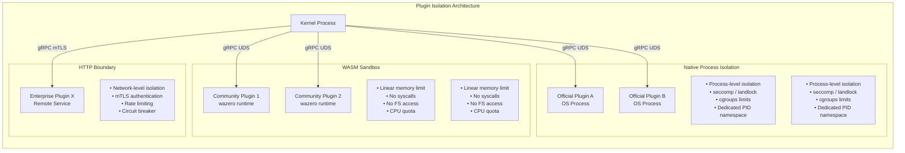
```mermaid
graph TB
    subgraph "Plugin Isolation Architecture"
        direction TB

        KERNEL[Kernel Process]

        subgraph "WASM Sandbox"
            W1[Community Plugin 1<br/>wazero runtime]
            W2[Community Plugin 2<br/>wazero runtime]
            W1_NOTE["• Linear memory limit<br/>• No syscalls<br/>• No FS access<br/>• CPU quota"]
            W2_NOTE["• Linear memory limit<br/>• No syscalls<br/>• No FS access<br/>• CPU quota"]
        end

        subgraph "Native Process Isolation"
            N1[Official Plugin A<br/>OS Process]
            N2[Official Plugin B<br/>OS Process]
            N1_NOTE["• Process-level isolation<br/>• seccomp / landlock<br/>• cgroups limits<br/>• Dedicated PID namespace"]
            N2_NOTE["• Process-level isolation<br/>• seccomp / landlock<br/>• cgroups limits<br/>• Dedicated PID namespace"]
        end

        subgraph "HTTP Boundary"
            H1[Enterprise Plugin X<br/>Remote Service]
            H1_NOTE["• Network-level isolation<br/>• mTLS authentication<br/>• Rate limiting<br/>• Circuit breaker"]
        end

        KERNEL -->|gRPC UDS| W1
        KERNEL -->|gRPC UDS| W2
        KERNEL -->|gRPC UDS| N1
        KERNEL -->|gRPC UDS| N2
        KERNEL -->|gRPC mTLS| H1
    end
```

| Runtime | Sandbox Technology | Memory Limit | CPU Limit | FS Access | Network Access |
|---------|-------------------|-------------|-----------|-----------|---------------|
| **WASM** | wazero (memory-safe) | Configurable (default 128MB) | Configurable | None (except declared paths via WASI) | None (except declared outbound) |
| **Native (Linux)** | seccomp + landlock + cgroups | Configurable (cgroups) | Configurable (cgroups) | Declared paths only (landlock) | Declared hosts only (seccomp) |
| **Native (macOS)** | sandbox-exec | Configurable | Configurable | Declared paths only | Declared hosts only |
| **Native (Windows)** | AppContainer | Configurable | Configurable | Declared paths only | Declared hosts only |
| **HTTP** | Network boundary | N/A | Rate limiting | Provider-side only | Provider-side only |

### 7.11 Plugin Communication

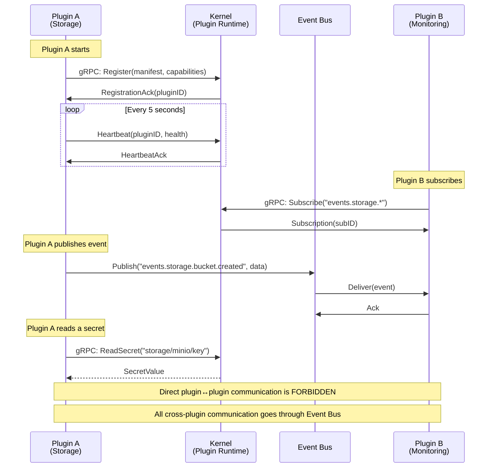
```mermaid
sequenceDiagram
    participant PluginA as Plugin A<br/>(Storage)
    participant Kernel as Kernel<br/>(Plugin Runtime)
    participant EB as Event Bus
    participant PluginB as Plugin B<br/>(Monitoring)

    Note over PluginA: Plugin A starts
    PluginA->>Kernel: gRPC: Register(manifest, capabilities)
    Kernel->>PluginA: RegistrationAck(pluginID)

    loop Every 5 seconds
        PluginA->>Kernel: Heartbeat(pluginID, health)
        Kernel->>PluginA: HeartbeatAck
    end

    Note over PluginB: Plugin B subscribes
    PluginB->>Kernel: gRPC: Subscribe("events.storage.*")
    Kernel->>PluginB: Subscription(subID)

    Note over PluginA: Plugin A publishes event
    PluginA->>EB: Publish("events.storage.bucket.created", data)
    EB->>PluginB: Deliver(event)
    PluginB->>EB: Ack

    Note over PluginA: Plugin A reads a secret
    PluginA->>Kernel: gRPC: ReadSecret("storage/minio/key")
    Kernel-->>PluginA: SecretValue

    Note over PluginA, PluginB: Direct plugin↔plugin communication is FORBIDDEN
    Note over PluginA, PluginB: All cross-plugin communication goes through Event Bus
```

**Communication rules:**
1. **No direct plugin↔plugin communication.** All cross-plugin communication goes through the Event Bus.
2. **No shared memory** between plugins.
3. **No shared filesystem** between plugins (except declared temp directories).
4. **Plugins cannot initiate connections to the Kernel** — the Kernel connects to plugins.
5. **Plugins cannot initiate connections to other plugins.**
6. **All gRPC calls include auth metadata** (plugin ID, capability scopes).

### 7.12 Plugin Discovery

Plugins can be discovered through:

| Method | Description | Latency |
|--------|-------------|---------|
| **Local filesystem** | Scan `~/.cloudos/plugins/` for installed plugins | Instant |
| **Registry API** | Query marketplace registry at `registry.cloudos.io` | Network |
| **Local cache** | Cached registry index for offline operation | Instant |
| **Air-gapped import** | Manual `.cosp` file import | Instant |
| **Network scan** | LAN multicast discovery for enterprise deployments | Seconds |

### 7.13 Plugin Categories

| Category | Description | Examples |
|----------|-------------|----------|
| **Storage** | Object storage, block storage, filesystem | S3, MinIO, GCS, R2, LocalFS |
| **Database** | Relational, document, key-value, vector | PostgreSQL, MySQL, MongoDB, Redis, SQLite |
| **AI** | LLM inference, embeddings, model hosting | OpenAI, Anthropic, Gemini, Ollama |
| **Authentication** | OAuth, SAML, LDAP, WebAuthn | Google OAuth, GitHub OAuth, Azure AD |
| **Deployment** | Compute runtimes, orchestration | Docker, Firecracker, K8s, Fly Machines |
| **Monitoring** | Metrics, logs, traces, alerts | Prometheus, Grafana, Loki, Datadog |
| **Networking** | DNS, CDN, firewall, load balancer | Cloudflare, Route53, CoreDNS |
| **Security** | Secrets, encryption, compliance | Vault, SOPS, custom CA |
| **Automation** | CI/CD, workflows, scheduling | GitHub Actions, GitLab CI, custom |
| **Templates** | Starter kits, project blueprints | Laravel, Next.js, Django, Rails |
| **Messaging** | Email, SMS, push, pub/sub | SendGrid, Twilio, Firebase, NATS |
| **Analytics** | Product analytics, business intelligence | PostHog, Plausible, custom |
| **Billing** | Payments, invoicing, metering | Stripe, Lemon Squeezy, Paddle |
| **Developer Tools** | IDE integration, debugging, testing | VS Code extension, debugger, test runner |

### 7.14 Plugin Signing & Verification

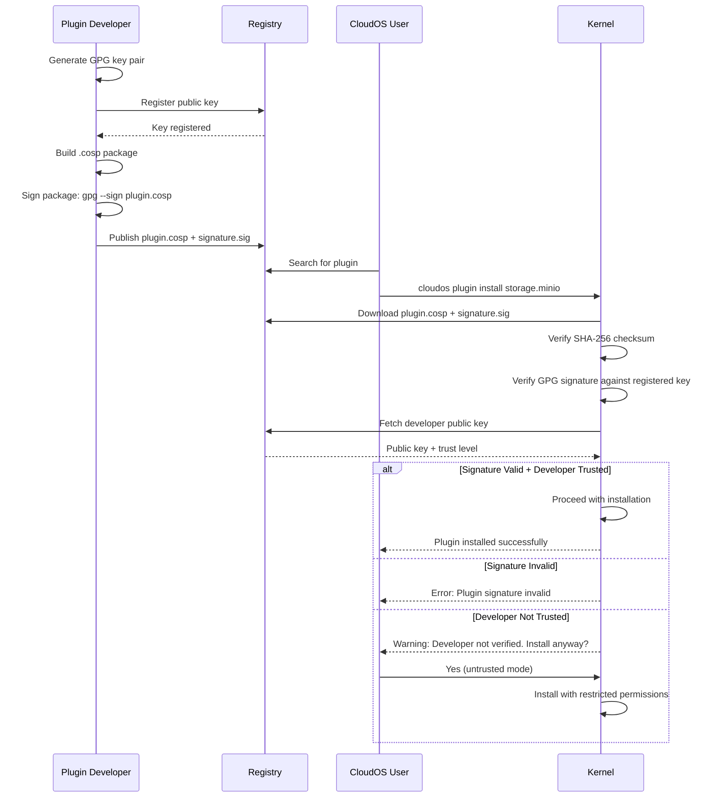
```mermaid
sequenceDiagram
    participant DEV as Plugin Developer
    participant REG as Registry
    participant USER as CloudOS User
    participant KRNL as Kernel

    DEV->>DEV: Generate GPG key pair
    DEV->>REG: Register public key
    REG-->>DEV: Key registered

    DEV->>DEV: Build .cosp package
    DEV->>DEV: Sign package: gpg --sign plugin.cosp
    DEV->>REG: Publish plugin.cosp + signature.sig

    USER->>REG: Search for plugin
    USER->>KRNL: cloudos plugin install storage.minio

    KRNL->>REG: Download plugin.cosp + signature.sig
    KRNL->>KRNL: Verify SHA-256 checksum
    KRNL->>KRNL: Verify GPG signature against registered key
    KRNL->>REG: Fetch developer public key
    REG-->>KRNL: Public key + trust level

    alt Signature Valid + Developer Trusted
        KRNL->>KRNL: Proceed with installation
        KRNL-->>USER: Plugin installed successfully
    else Signature Invalid
        KRNL-->>USER: Error: Plugin signature invalid
    else Developer Not Trusted
        KRNL-->>USER: Warning: Developer not verified. Install anyway?
        USER->>KRNL: Yes (untrusted mode)
        KRNL->>KRNL: Install with restricted permissions
    end
```

### 7.15 Plugin Trust Model

| Trust Level | Source | Verification | Permissions Default | Audit Frequency |
|-------------|--------|-------------|---------------------|-----------------|
| **System** | Shipped with CloudOS | Built-in | Full system access | Continuous |
| **Verified** | CloudOS-signed official plugins | GPG + registry key | Declared permissions | Every publish |
| **Community** | Community developers | GPG + registry key | Declared, restricted by default | Every publish |
| **Untrusted** | Manual `.cosp` import | No signature | Minimum permissions, sandboxed | Every operation |
| **Enterprise** | Enterprise license | Custom CA | Custom policy | Organization-defined |

**Trust decisions:**
1. **System plugins** are implicitly trusted (shipped with binary)
2. **Verified plugins** are signed by CloudOS or verified partners
3. **Community plugins** are signed but carry a "community" trust badge
4. **Untrusted plugins** run with maximum sandboxing and minimum permissions
5. **Enterprise plugins** follow the organization's custom trust policy

---

## 8. The Intent-Driven Flow

### 8.1 From Service-Oriented to Intent-Driven

Traditional cloud platforms:

```
User → UI → API (EC2, S3, RDS) → Infrastructure
```

Most open-source platforms:

```
User → API → Plugin → Database
```

CloudOS's intent-driven flow:

```
User → AI → Intent Engine → Capability Engine → Provider → Execution → Events → UI
```

### 8.2 The Complete Flow

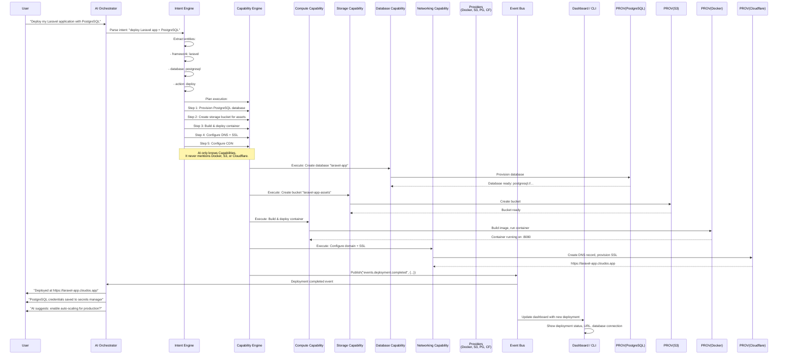
```mermaid
sequenceDiagram
    participant USER as User
    participant AIO as AI Orchestrator
    participant IE as Intent Engine
    participant CE as Capability Engine
    participant COMP as Compute Capability
    participant STOR as Storage Capability
    participant DB as Database Capability
    participant NET as Networking Capability
    participant PROV as Providers<br/>(Docker, S3, PG, CF)
    participant EB as Event Bus
    participant UI as Dashboard / CLI

    USER->>AIO: "Deploy my Laravel application with PostgreSQL"

    AIO->>IE: Parse intent: "deploy Laravel app + PostgreSQL"

    IE->>IE: Extract entities:
    IE->>IE:   - framework: laravel
    IE->>IE:   - database: postgresql
    IE->>IE:   - action: deploy

    IE->>CE: Plan execution:
    IE->>CE:   Step 1: Provision PostgreSQL database
    IE->>CE:   Step 2: Create storage bucket for assets
    IE->>CE:   Step 3: Build & deploy container
    IE->>CE:   Step 4: Configure DNS + SSL
    IE->>CE:   Step 5: Configure CDN

    Note over IE,CE: AI only knows Capabilities.<br/>It never mentions Docker, S3, or Cloudflare.

    CE->>DB: Execute: Create database "laravel-app"
    DB->>PROV(PostgreSQL): Provision database
    PROV(PostgreSQL)-->>DB: Database ready: postgresql://...

    CE->>STOR: Execute: Create bucket "laravel-app-assets"
    STOR->>PROV(S3): Create bucket
    PROV(S3)-->>STOR: Bucket ready

    CE->>COMP: Execute: Build & deploy container
    COMP->>PROV(Docker): Build image, run container
    PROV(Docker)-->>COMP: Container running on :8080

    CE->>NET: Execute: Configure domain + SSL
    NET->>PROV(Cloudflare): Create DNS record, provision SSL
    PROV(Cloudflare)-->>NET: https://laravel-app.cloudos.app

    CE->>EB: Publish("events.deployment.completed", {...})

    EB->>AIO: Deployment completed event
    AIO->>USER: "Deployed at https://laravel-app.cloudos.app"
    AIO->>USER: "PostgreSQL credentials saved to secrets manager"
    AIO->>USER: "AI suggests: enable auto-scaling for production?"

    EB->>UI: Update dashboard with new deployment
    UI->>UI: Show deployment status, URL, database connection
```

### 8.3 Example: Deploy Laravel Application

**Traditional approach (e.g., AWS):**

> User needs to know: EC2, RDS, S3, CloudFront, Route53, ACM, IAM, VPC, Security Groups, CloudWatch, Elastic Beanstalk or ECS...

```text
User → Learns AWS → Creates IAM user → Configures CLI →
Launches EC2 → Configures security group → Installs PHP/Composer →
Sets up RDS → Configures S3 for assets → Sets up CloudFront →
Configures Route53 → Requests ACM cert → Configures monitoring → ...
```

**CloudOS approach:**

```text
User → "Deploy my Laravel application"

Flow:
  AI understands intent: "deploy laravel with postgresql"
  → Intent Engine parses: { framework: laravel, database: postgresql }
  → Capability Engine plans:
    → Database Capability: provision PostgreSQL
    → Storage Capability: create bucket for file uploads
    → Compute Capability: build container, run with Laravel
    → Networking Capability: configure CDN, SSL, domain
  → Providers execute:
    → PostgreSQL provider provisions database
    → S3 provider creates bucket
    → Docker provider builds and runs container
    → Cloudflare provider configures DNS + SSL
  → Events flow back:
    → AI receives completion
    → Dashboard updates
    → User gets URL + credentials

Result: User never touches Docker, S3, Cloudflare, or PostgreSQL directly.
```

### 8.4 Why This Architecture Matters

**1. Provider swaps are invisible to the AI:**

If `docker` is replaced with `firecracker`:
- Only the Compute Capability → Firecracker Provider changes
- The AI Orchestrator never knew about Docker → no change needed
- The user's intent ("deploy my app") doesn't change

**2. AI provider swaps are invisible to capabilities:**

If `openai` is replaced with `ollama`:
- Only the AI Capability → Ollama Provider changes
- All capabilities that use AI (deployment, monitoring, debugging) continue unchanged
- The AI Orchestrator routes to the new model automatically

**3. Capabilities can be composed:**

A deployment involves:
- Compute Capability (run the app)
- Database Capability (provision DB)
- Storage Capability (store assets)
- Networking Capability (DNS, SSL)
- Monitoring Capability (health checks)
- AI Capability (generate deployment suggestions)

Each capability is independent. None knows about the others. The AI Orchestrator coordinates them.

**4. Community extensibility without Kernel changes:**

A community member can write a new provider for any capability:
- `storage.backblaze` for Backblaze B2 storage
- `compute.nomad` for HashiCorp Nomad
- `ai.mistral` for Mistral AI
- `database.cockroachdb` for CockroachDB

None of these require Kernel changes. None require AI re-training. None require application code changes.

---

## 9. Dependency Rules & Enforcement

### 9.1 Dependency Direction


```mermaid
graph TB
    subgraph "Dependency Direction — Strictly Inward"
        direction TB

        AI[AI Orchestrator]
        APPS[Applications<br/>Dashboard, CLI, Mobile, Desktop]
        SDK[Plugin SDK]

        CAPS[Capability Interfaces<br/>Abstract Contracts]

        KRN[Kernel Subsystems<br/>Runtime Core]

        PROVS[Providers<br/>Concrete Implementations]

        AI --> CAPS
        APPS --> CAPS
        SDK --> CAPS

        CAPS --> KRN

        KRN --> KRN_SELF[Only itself]

        PROVS --> CAPS

        AI -.->|reads events| KRN
        APPS -.->|consumes API| KRN
    end

    style KRN fill:#1a1a2e,stroke:#e94560,stroke-width:3px
    style CAPS fill:#16213e,stroke:#0f3460,stroke-width:2px
    style PROVS fill:#1e3a5f,stroke:#4a90d9,stroke-width:2px
```

**The rules are absolute:**

| # | Rule | Description | Enforcement |
|---|------|-------------|-------------|
| 1 | **Kernel cannot depend on Providers** | The Kernel never imports any provider package. Providers are loaded dynamically via the Plugin Runtime. | Go import vetting, runtime loading only |
| 2 | **Kernel cannot depend on Capabilities** | The Kernel defines capability interfaces but does not import them from a capability package. Interfaces live in the Kernel. | Go package structure |
| 3 | **Providers cannot depend on Applications** | A provider never imports dashboard, CLI, or mobile packages. Providers only depend on the SDK and capability interfaces. | Go import vetting |
| 4 | **Applications cannot bypass Capabilities** | Applications must go through the API Gateway → Capability chain. No direct calls to provider APIs. | API Gateway enforces routing |
| 5 | **Plugins cannot modify the Kernel** | Plugins cannot register new Kernel subsystems, modify Kernel behavior, or access Kernel internals. | gRPC-only API surface |
| 6 | **AI only communicates through Capabilities** | The AI Orchestrator never calls provider APIs directly. It sends commands to capabilities and reads state through capability queries. | Capability wrapper enforcement |
| 7 | **Plugins cannot communicate directly** | All cross-plugin communication goes through the Event Bus. No direct gRPC, shared memory, or filesystem. | Sandbox restrictions, gRPC gateway |
| 8 | **SDK does not depend on Kernel** | The Plugin SDK can be used independently. It only requires the capability interface definitions. | SDK package isolation |

### 9.2 Enforcement Mechanisms

| Enforcement Layer | Mechanism | Violation Consequence |
|-------------------|-----------|----------------------|
| **Compile time** | Go import rules, `go vet`, custom lint rules | Build failure |
| **Plugin install time** | Manifest validation, permission declaration | Installation rejected |
| **Plugin runtime** | gRPC API gateway, sandbox restrictions | Call blocked, error returned |
| **Kernel startup** | Subsystem dependency graph validation | Kernel fails to start with clear error |
| **CI/CD pipeline** | `go vet`, import linting, architecture validation | Pipeline failure |
| **Code review** | Architecture change review checklist | PR rejected |

### 9.3 Common Violations & Prevention

| Anti-Pattern | Why It's a Violation | How to Prevent |
|--------------|---------------------|----------------|
| Provider importing a dashboard component | Provider depends on Application layer | SDK restricts imports; code review catches this |
| Kernel importing a PostgreSQL driver directly | Kernel would depend on a specific provider | Kernel uses SQLite only; PostgreSQL is a Database Provider |
| AI calling Docker API directly | AI bypasses Capabilities | AI wrapper enforces capability-only calls |
| Plugin writing to Kernel PID namespace | Plugin modifies Kernel state | WASM sandbox blocks syscalls; native plugins have restricted seccomp profiles |
| Capability importing another capability's provider | Cross-provider coupling | Capability interfaces are the only contract; provider selection is config |
| Application reading Secrets Manager directly | Bypasses API Gateway auth layer | Secrets Manager only accessible through Kernel API via gRPC |

---

## 10. Marketplace Architecture

### 10.1 Registry Design

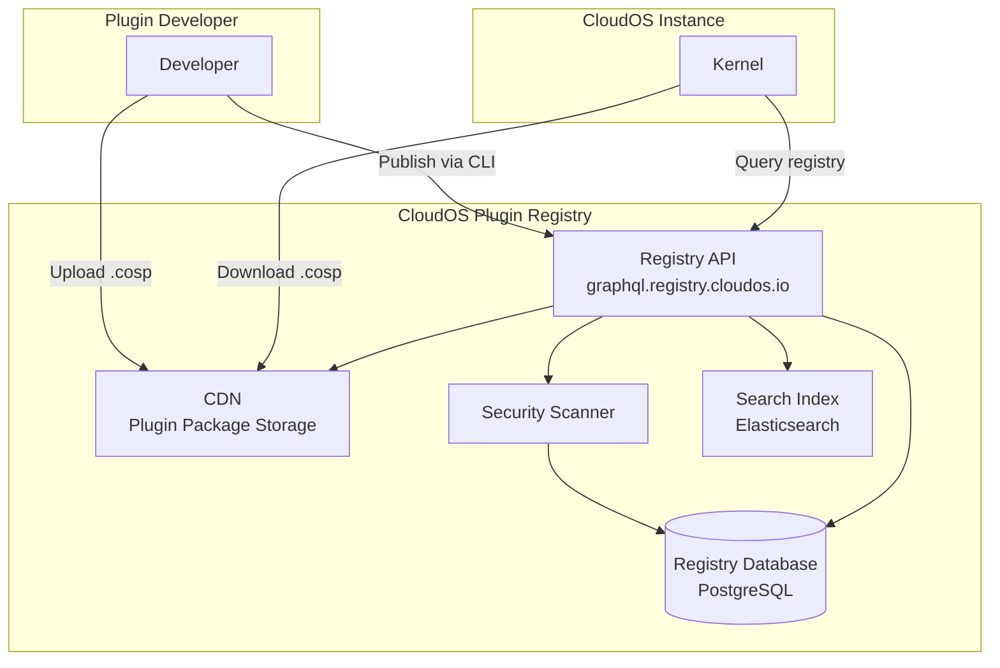
```mermaid
graph TB
    subgraph "CloudOS Plugin Registry"
        direction TB

        API[Registry API<br/>graphql.registry.cloudos.io]
        DB[(Registry Database<br/>PostgreSQL)]
        CDN[CDN<br/>Plugin Package Storage]
        SCAN[Security Scanner]
        INDEX[Search Index<br/>Elasticsearch]

        API --> DB
        API --> CDN
        API --> SCAN
        API --> INDEX
        SCAN --> DB
    end

    subgraph "CloudOS Instance"
        KRNL[Kernel]
        KRNL -->|Query registry| API
        KRNL -->|Download .cosp| CDN
    end

    subgraph "Plugin Developer"
        DEV[Developer]
        DEV -->|Publish via CLI| API
        DEV -->|Upload .cosp| CDN
    end
```

**Registry API endpoints:**

```
# Search plugins
GET  /v1/plugins?q=storage&capability=storage&sort=downloads

# Get plugin details
GET  /v1/plugins/storage.minio

# Get plugin versions
GET  /v1/plugins/storage.minio/versions

# Download plugin package
GET  /v1/plugins/storage.minio/versions/1.2.0/download

# Publish plugin (authenticated)
POST /v1/plugins
Content-Type: multipart/form-data

# Update plugin
PUT  /v1/plugins/storage.minio/versions/1.2.1

# Delete plugin version
DELETE /v1/plugins/storage.minio/versions/1.0.0

# Rate plugin
POST /v1/plugins/storage.minio/ratings

# Review plugin
POST /v1/plugins/storage.minio/reviews
```

### 10.2 Publishing Pipeline

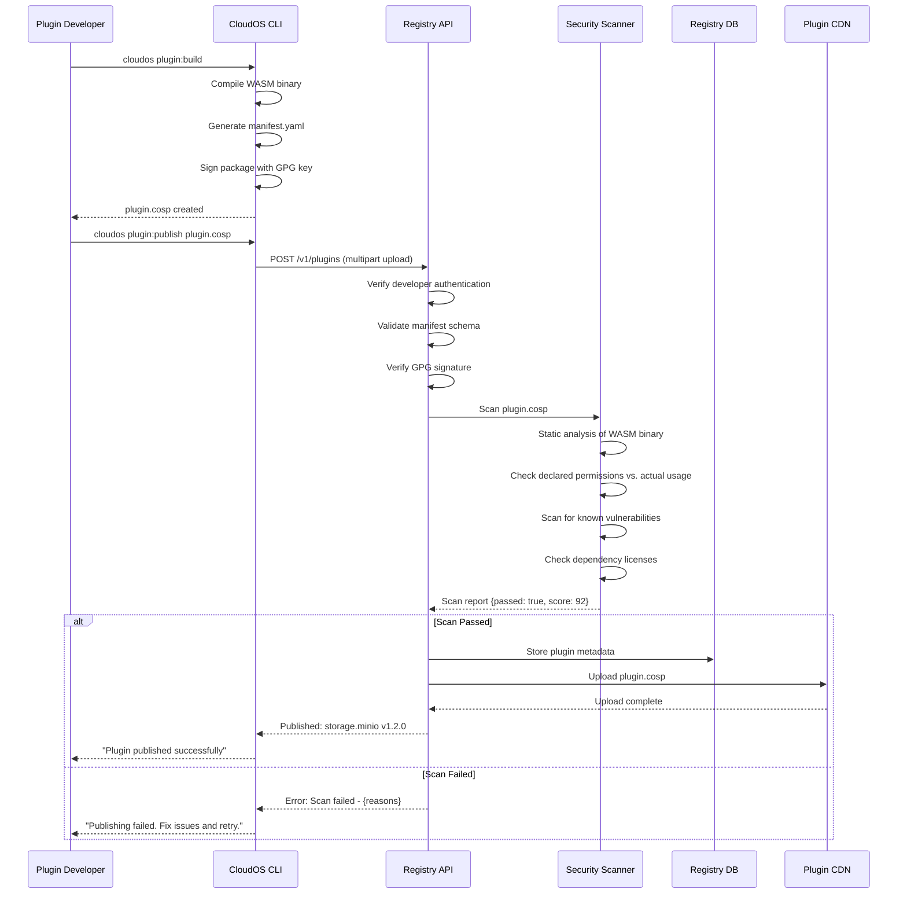
```mermaid
sequenceDiagram
    participant DEV as Plugin Developer
    participant CLI as CloudOS CLI
    participant REG as Registry API
    participant SCAN as Security Scanner
    participant DB as Registry DB
    participant CDN as Plugin CDN

    DEV->>CLI: cloudos plugin:build
    CLI->>CLI: Compile WASM binary
    CLI->>CLI: Generate manifest.yaml
    CLI->>CLI: Sign package with GPG key
    CLI-->>DEV: plugin.cosp created

    DEV->>CLI: cloudos plugin:publish plugin.cosp
    CLI->>REG: POST /v1/plugins (multipart upload)

    REG->>REG: Verify developer authentication
    REG->>REG: Validate manifest schema
    REG->>REG: Verify GPG signature
    REG->>SCAN: Scan plugin.cosp

    SCAN->>SCAN: Static analysis of WASM binary
    SCAN->>SCAN: Check declared permissions vs. actual usage
    SCAN->>SCAN: Scan for known vulnerabilities
    SCAN->>SCAN: Check dependency licenses
    SCAN-->>REG: Scan report {passed: true, score: 92}

    alt Scan Passed
        REG->>DB: Store plugin metadata
        REG->>CDN: Upload plugin.cosp
        CDN-->>REG: Upload complete
        REG-->>CLI: Published: storage.minio v1.2.0
        CLI-->>DEV: "Plugin published successfully"
    else Scan Failed
        REG-->>CLI: Error: Scan failed - {reasons}
        CLI-->>DEV: "Publishing failed. Fix issues and retry."
    end
```

### 10.3 Installation & Updates

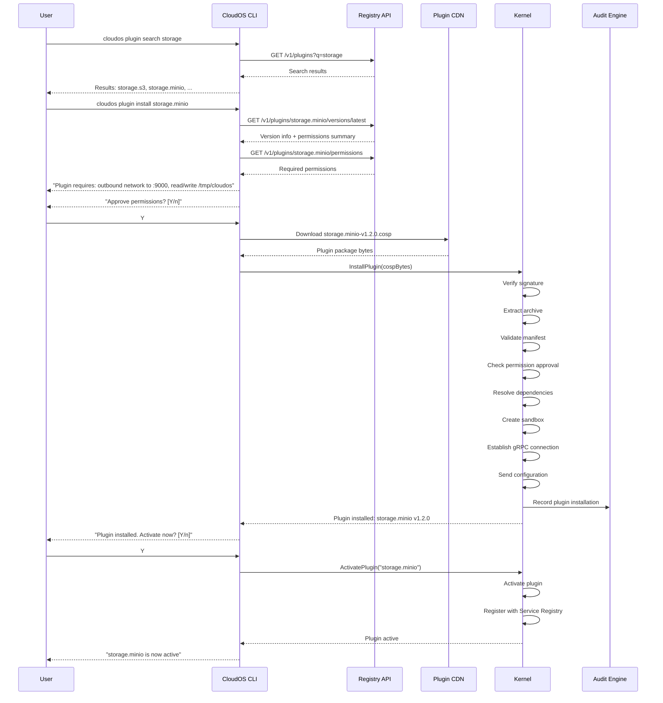
```mermaid
sequenceDiagram
    participant USER as User
    participant CLI as CloudOS CLI
    participant REG as Registry API
    participant CDN as Plugin CDN
    participant KRNL as Kernel
    participant AUDIT as Audit Engine

    USER->>CLI: cloudos plugin search storage
    CLI->>REG: GET /v1/plugins?q=storage
    REG-->>CLI: Search results
    CLI-->>USER: Results: storage.s3, storage.minio, ...

    USER->>CLI: cloudos plugin install storage.minio
    CLI->>REG: GET /v1/plugins/storage.minio/versions/latest
    REG-->>CLI: Version info + permissions summary

    CLI->>REG: GET /v1/plugins/storage.minio/permissions
    REG-->>CLI: Required permissions

    CLI-->>USER: "Plugin requires: outbound network to :9000, read/write /tmp/cloudos"
    CLI-->>USER: "Approve permissions? [Y/n]"
    USER->>CLI: Y

    CLI->>CDN: Download storage.minio-v1.2.0.cosp
    CDN-->>CLI: Plugin package bytes

    CLI->>KRNL: InstallPlugin(cospBytes)
    KRNL->>KRNL: Verify signature
    KRNL->>KRNL: Extract archive
    KRNL->>KRNL: Validate manifest
    KRNL->>KRNL: Check permission approval
    KRNL->>KRNL: Resolve dependencies
    KRNL->>KRNL: Create sandbox
    KRNL->>KRNL: Establish gRPC connection
    KRNL->>KRNL: Send configuration
    KRNL->>AUDIT: Record plugin installation

    KRNL-->>CLI: Plugin installed: storage.minio v1.2.0
    CLI-->>USER: "Plugin installed. Activate now? [Y/n]"
    USER->>CLI: Y

    CLI->>KRNL: ActivatePlugin("storage.minio")
    KRNL->>KRNL: Activate plugin
    KRNL->>KRNL: Register with Service Registry
    KRNL-->>CLI: Plugin active
    CLI-->>USER: "storage.minio is now active"
```

### 10.4 Security Scanning

Every plugin published to the Marketplace undergoes automated security scanning:

| Scan Type | What It Checks | Enforced For |
|-----------|---------------|--------------|
| **Static Analysis** | WASM binary analysis: suspicious syscalls, hardcoded secrets | All plugins |
| **Permission Audit** | Declared permissions vs. actual binary behavior | All plugins |
| **Vulnerability Scan** | Known CVEs in dependencies | All plugins |
| **License Compliance** | Open source license compatibility | All plugins |
| **Supply Chain** | Dependency chain integrity, no known malicious packages | All plugins |
| **Behavioral Analysis** | Sandboxed execution: network calls, file access patterns | Community + Untrusted |
| **Manual Review** | Code review by CloudOS security team | Official + Verified |

**Scan result levels:**

| Level | Score | Description | Marketplace Badge |
|-------|-------|-------------|------------------|
| **Excellent** | 90-100 | No issues found, best practices followed | ✅ Verified |
| **Good** | 70-89 | Minor recommendations, no security issues | ⚡ Community |
| **Warning** | 50-69 | Moderate issues requiring attention | ⚠️ Review |
| **Failed** | <50 | Security issues blocking publication | ❌ Blocked |

### 10.5 Ratings & Reviews

```json
{
  "plugin": "storage.minio",
  "version": "1.2.0",
  "stats": {
    "downloads": 15234,
    "installs": 8756,
    "active_installs": 7201,
    "average_rating": 4.5,
    "rating_distribution": {
      "5": 120,
      "4": 45,
      "3": 12,
      "2": 3,
      "1": 2
    },
    "reviews_count": 42
  },
  "reviews": [
    {
      "user": "alex_dev",
      "rating": 5,
      "title": "Works flawlessly",
      "body": "Switched from S3 to MinIO in 10 seconds. Just changed one config value.",
      "date": "2026-06-28T10:00:00Z",
      "helpful_count": 15,
      "version": "1.2.0"
    }
  ]
}
```

### 10.6 Enterprise vs Community Plugins

| Feature | Community | Verified | Enterprise |
|---------|-----------|----------|------------|
| **Publication** | Any developer | CloudOS team + partners | Enterprise license holders |
| **Security scan** | Automated | Automated + manual review | Custom security profile |
| **Support** | Community (GitHub Issues) | CloudOS team | SLA-backed support |
| **License** | Any OSS license | MIT / Apache 2.0 | Custom license |
| **Source** | Public repository | Public or private | Private |
| **Trust level** | Community | Verified | Enterprise |
| **Permissions** | Restricted defaults | Declared permissions | Organization policy |
| **Sandbox** | WASM (maximum) | WASM or Native | Native or HTTP |
| **Updates** | Auto-update opt-in | Auto-update recommended | Manual approval |

---

## 11. SDK Design

### 11.1 SDK Languages

| Language | Status | Best For | WASM Support |
|----------|--------|----------|--------------|
| **Go** | ✅ Primary | Official plugins, compute-heavy providers | TinyGo compilation |
| **Rust** | 🚧 Beta | Performance-critical, system-level plugins | Rust → WASM |
| **TypeScript** | 🚧 Beta | Community plugins, simple integrations | AssemblyScript / wasm-pack |
| **Python** | 🔮 Planned | AI/ML plugins, data processing | Pyodide / WASM |
| **Zig** | 🔮 Future | System plugins, cross-compilation | Native WASM support |

### 11.2 Core Plugin Interface

```go
package cloudos

// Plugin is the main interface every plugin must implement.
type Plugin interface {
    // Metadata returns plugin identity information.
    Metadata() PluginMetadata

    // Initialize is called after installation, before activation.
    // Use for one-time setup: connecting to external services, loading data.
    Initialize(ctx Context) error

    // Activate is called to start the plugin.
    // The plugin should start serving capability requests after this returns.
    Activate(ctx Context) error

    // Deactivate is called to stop the plugin.
    // The plugin should gracefully shut down all operations.
    Deactivate(ctx Context) error

    // Health returns the current health status of the plugin.
    Health() HealthStatus
}

// Context provides access to CloudOS Kernel services.
type Context interface {
    // Config returns the plugin's configuration (parsed from config.schema.json).
    Config() Config

    // Logger returns a structured logger with plugin context pre-attached.
    Logger() Logger

    // Events returns an event publisher for publishing to the Event Bus.
    Events() EventPublisher

    // Store returns a KV store scoped to this plugin's namespace.
    Store() KVStore

    // HTTPClient returns a pre-configured HTTP client with:
    // - Default timeout (30s)
    // - Proxy configuration (if applicable)
    // - TLS configuration (if applicable)
    // - User-agent set to cloudos-plugin/<name>/<version>
    HTTPClient() *http.Client

    // Secrets returns a secret reader scoped to this plugin's namespace.
    Secrets() SecretReader

    // RegisterCapability registers this plugin as a provider for a capability.
    RegisterCapability(name string, provider interface{})
}
```

### 11.3 Capability Registrar

```go
package cloudos

// Registrar is the interface for registering capabilities with the Kernel.
// The Kernel's Plugin Runtime implements this and provides it to plugins.
type Registrar interface {
    // RegisterCapability tells the Kernel that this plugin implements
    // the specified capability interface.
    RegisterCapability(capability CapabilityName, provider interface{}) error

    // UnregisterCapability removes a capability registration.
    UnregisterCapability(capability CapabilityName) error

    // ListCapabilities returns all capabilities this plugin has registered.
    ListCapabilities() []CapabilityRegistration
}

// CapabilityName identifies a capability interface by its canonical name.
type CapabilityName string

const (
    CapabilityCompute     CapabilityName = "compute"
    CapabilityStorage     CapabilityName = "storage"
    CapabilityDatabase    CapabilityName = "database"
    CapabilityAI          CapabilityName = "ai"
    CapabilityIdentity    CapabilityName = "identity"
    CapabilityNetworking  CapabilityName = "networking"
    CapabilityDNS         CapabilityName = "dns"
    CapabilityMonitoring  CapabilityName = "monitoring"
    CapabilitySearch      CapabilityName = "search"
    CapabilityMessaging   CapabilityName = "messaging"
    CapabilityEmail       CapabilityName = "email"
    CapabilityBilling     CapabilityName = "billing"
)

// CapabilityRegistration describes a registered capability instance.
type CapabilityRegistration struct {
    Name       CapabilityName
    Version    string
    Features   []string
    ProviderID string
}
```

### 11.4 Development Workflow

```mermaid
graph LR
    subgraph "Plugin Development Workflow"
        INIT[cloudos plugin:init] --> CODE[Write plugin code]
        CODE --> BUILD[cloudos plugin:build]
        BUILD --> TEST[cloudos plugin:test]
        TEST --> PUBLISH[cloudos plugin:publish]
        PUBLISH --> VERIFY[Verify in Marketplace]
        VERIFY --> INSTALL[Install on CloudOS instance]
    end
```

**Commands:**

```
# Initialize a new plugin project
cloudos plugin:init storage.minio
  → Creates plugin directory with manifest.yaml, main.go, config.schema.json

# Build the plugin
cloudos plugin:build
  → Compiles to WASM, packages .cosp archive

# Test the plugin locally
cloudos plugin:test
  → Runs plugin in local sandbox, executes capability tests

# Publish to Marketplace
cloudos plugin:publish
  → Signs package, uploads to registry

# Install a local plugin for development
cloudos plugin:install ./storage.minio.cosp
```

---

## 12. Plugin Categories

| # | Category | Description | Capability | Example Providers |
|---|----------|-------------|------------|-------------------|
| 1 | **Storage** | Object storage, block storage, filesystem | Storage | S3, MinIO, GCS, R2, LocalFS, Backblaze |
| 2 | **Database** | Relational, document, key-value, vector | Database | PostgreSQL, MySQL, MongoDB, Redis, SQLite, Turso |
| 3 | **Compute** | Containers, VMs, serverless functions | Compute | Docker, Firecracker, K8s, Nomad, Fly Machines |
| 4 | **AI** | LLM inference, embeddings, model hosting | AI | OpenAI, Anthropic, Gemini, Ollama, DeepSeek, Mistral |
| 5 | **Identity** | Authentication providers | Identity | Google OAuth, GitHub OAuth, Azure AD, Okta, Keycloak |
| 6 | **Networking** | DNS, CDN, firewall, load balancer | Networking, DNS | Cloudflare, Route53, CoreDNS, Fastly, Bunny CDN |
| 7 | **Monitoring** | Metrics, logs, traces, alerts | Monitoring | Prometheus, Grafana, Loki, Datadog, New Relic |
| 8 | **Search** | Full-text, vector, faceted search | Search | Elasticsearch, MeiliSearch, Typesense, Algolia |
| 9 | **Messaging** | Email, SMS, push, pub/sub | Messaging, Email | SendGrid, Resend, Twilio, Firebase, Mailgun |
| 10 | **Billing** | Payments, invoicing, metering | Billing | Stripe, Lemon Squeezy, Paddle, Chargebee |
| 11 | **Security** | Secrets, encryption, compliance | — | Vault, SOPS, custom CA, KMS providers |
| 12 | **Automation** | CI/CD, workflows, scheduling | — | GitHub Actions, GitLab CI, Jenkins, ArgoCD |
| 13 | **Analytics** | Product analytics, BI | — | PostHog, Plausible, Amplitude, Mixpanel |
| 14 | **Templates** | Starter kits, blueprints | — | Laravel, Next.js, Django, Rails, Astro |
| 15 | **Dev Tools** | IDE extensions, debugging, testing | — | VS Code, JetBrains, debugger, load tester |
| 16 | **Compliance** | SOC 2, HIPAA, GDPR, PCI | — | Audit report generators, policy enforcers |

---

## 13. Future Strategy

### 13.1 Phase 2: Plugin Hot-Reload (2026 Q4)

- Swap plugin binaries without traffic interruption
- Blue-green plugin deployment: load new version alongside old, drain old, switch traffic
- Configuration changes trigger hot-reload without deactivation

### 13.2 Phase 3: Multi-Region Plugin Sync (2027 Q1)

- Plugins installed in one region automatically sync to others
- Plugin state replication across cluster
- Geo-aware plugin selection (closest provider endpoint)

### 13.3 Phase 4: Plugin Dependency Graphs (2027 Q2)

- Visual dependency mapping between plugins
- Impact analysis before upgrades ("upgrading X will affect Y and Z")
- Automatic dependency resolution with conflict detection
- Plugin composition: combine multiple plugins into a meta-plugin

### 13.4 Phase 5: Decentralized Plugin Registry (2027 Q3)

- Self-hosted registry mirrors for air-gapped deployments
- P2P plugin distribution using IPFS or similar
- Organization-specific registries with custom review policies
- Federation between registries for cross-organization sharing

### 13.5 Phase 6: AI-Generated Plugins (2028+)

```mermaid
graph TB
    subgraph "AI-Generated Plugins"
        USER[User] --> AI[AI Orchestrator]
        AI --> INTENT["I need a custom storage provider<br/>for Backblaze B2"]
        INTENT --> GEN[Plugin Generator]
        GEN --> CODE[Generated plugin code]
        CODE --> BUILD[Auto-build .cosp]
        BUILD --> INSTALL[Install & activate]
        INSTALL --> VERIFY[AI validates operation]
    end
```

- Natural language plugin creation: "Create a storage provider for Backblaze B2"
- AI generates the plugin code, manifest, and configuration schema
- AI validates the plugin against capability interface contracts
- AI tests the plugin in a sandbox before activation
- Human review optional for security-sensitive plugins

---

## 14. Connection to Other Documents

| Document | Relationship |
|----------|-------------|
| [01_MASTER_SPEC.md](./01_MASTER_SPEC.md) | Defines the plugin strategy goals (G5: 1000+ community plugins), principle #3 (Everything is a Plugin), and feature requirements for plugin lifecycle management |
| [05_SYSTEM_ARCHITECTURE.md](./05_SYSTEM_ARCHITECTURE.md) | Defines the system layers, Kernel subsystems, capability interfaces, and provider layer that this document extends with the detailed plugin architecture |
| [12_UI_SYSTEM.md](./12_UI_SYSTEM.md) | Defines how UI plugins register dashboard panels, settings forms, and custom components |
| [13_PLUGIN_SYSTEM.md](./13_PLUGIN_SYSTEM.md) | Contains the plugin manifest specification, SDK API reference, and packaging format — this document defines the architectural principles |
| [07_AI_OPERATING_SYSTEM.md](./07_AI_OPERATING_SYSTEM.md) | Defines how the AI Orchestrator uses capabilities (not providers) for natural language operations — this document explains why that architecture matters |
| [15_API.md](./15_API.md) | Defines the GraphQL API that all applications use to interact with capabilities and the Kernel |
| [16_SECURITY.md](./16_SECURITY.md) | Defines the security model that plugin authentication, authorization, audit, and sandboxing are built upon |
| [17_DEPLOYMENT.md](./17_DEPLOYMENT.md) | Defines the 7 deployment tiers that affect which plugin runtimes are available (e.g., WASM-only on Raspberry Pi) |
| [18_DEVELOPER_GUIDE.md](./18_DEVELOPER_GUIDE.md) | Defines the engineering workflow that plugin developers follow |
| [20_ROADMAP.md](./20_ROADMAP.md) | Defines the phased delivery timeline for plugin system features (Phase 1: Foundation, Phase 2: Ecosystem, Phase 3: Marketplace) |

---

> **Next:** [12_UI_SYSTEM.md](./12_UI_SYSTEM.md) — Design language, components, mobile/desktop UX
