# CloudOS AI Operating System

> **Document ID:** CLOUDOS-AI-001  
> **Status:** v1.0 — Approved  
> **Classification:** Public — Open Source  
> **Last Updated:** 2026-06-29  
> **Audience:** Engineers, Architects, AI/ML Engineers, Product Managers, Contributors, Investors  
> **Depends On:** [01_MASTER_SPEC.md](./01_MASTER_SPEC.md), [05_SYSTEM_ARCHITECTURE.md](./05_SYSTEM_ARCHITECTURE.md), [06_KERNEL_AND_PLUGIN_ARCHITECTURE.md](./06_KERNEL_AND_PLUGIN_ARCHITECTURE.md)

---

## Table of Contents

1. [AI Philosophy](#1-ai-philosophy)
2. [Architecture Overview](#2-architecture-overview)
3. [The AI Engine](#3-the-ai-engine)
   - [3.1 Intent Parser](#31-intent-parser)
   - [3.2 Planner](#32-planner)
   - [3.3 Reasoner](#33-reasoner)
   - [3.4 Task Manager](#34-task-manager)
   - [3.5 Execution Engine](#35-execution-engine)
   - [3.6 Workflow Builder](#36-workflow-builder)
   - [3.7 Capability Resolver](#37-capability-resolver)
   - [3.8 Provider Resolver](#38-provider-resolver)
   - [3.9 Risk Analyzer](#39-risk-analyzer)
   - [3.10 Cost Optimizer](#310-cost-optimizer)
   - [3.11 Security Advisor](#311-security-advisor)
   - [3.12 Performance Advisor](#312-performance-advisor)
   - [3.13 Learning Engine](#313-learning-engine)
4. [The Multi-Agent System](#4-the-multi-agent-system)
   - [4.1 Agent Architecture](#41-agent-architecture)
   - [4.2 Agent Catalog](#42-agent-catalog)
   - [4.3 Agent Communication Model](#43-agent-communication-model)
   - [4.4 Agent Coordination](#44-agent-coordination)
   - [4.5 Agent Lifecycle](#45-agent-lifecycle)
5. [AI Provider System](#5-ai-provider-system)
   - [5.1 Provider Abstraction](#51-provider-abstraction)
   - [5.2 AI Provider Interface](#52-ai-provider-interface)
   - [5.3 Provider Roadmap](#53-provider-roadmap)
   - [5.4 Model Selection & Routing](#54-model-selection--routing)
6. [Context System](#6-context-system)
   - [6.1 Hierarchical Context Model](#61-hierarchical-context-model)
   - [6.2 Context Resolution](#62-context-resolution)
   - [6.3 Context Providers](#63-context-providers)
7. [AI Memory Architecture](#7-ai-memory-architecture)
   - [7.1 Memory Types](#71-memory-types)
   - [7.2 Memory Hierarchy](#72-memory-hierarchy)
   - [7.3 Memory Persistence](#73-memory-persistence)
   - [7.4 Knowledge Graph](#74-knowledge-graph)
8. [Intent-Driven Computing](#8-intent-driven-computing)
   - [8.1 The Intent Flow](#81-the-intent-flow)
   - [8.2 From Intent to Execution](#82-from-intent-to-execution)
   - [8.3 Example Flows](#83-example-flows)
9. [Natural Language Infrastructure](#9-natural-language-infrastructure)
   - [9.1 What Users Can Say](#91-what-users-can-say)
   - [9.2 Prompt-Driven Operations](#92-prompt-driven-operations)
   - [9.3 Goal-Oriented Computing](#93-goal-oriented-computing)
   - [9.4 Autonomous Automation](#94-autonomous-automation)
10. [AI Safety & Guardrails](#10-ai-safety--guardrails)
    - [10.1 Permission System](#101-permission-system)
    - [10.2 Human Approval](#102-human-approval)
    - [10.3 Dry Run Mode](#103-dry-run-mode)
    - [10.4 Rollback](#104-rollback)
    - [10.5 Confirmation Rules](#105-confirmation-rules)
    - [10.6 Security Policies](#106-security-policies)
    - [10.7 Sensitive Operations](#107-sensitive-operations)
    - [10.8 Audit & Observability](#108-audit--observability)
11. [Voice Interface](#11-voice-interface)
12. [Visual AI](#12-visual-ai)
13. [AI-First User Experience](#13-ai-first-user-experience)
14. [Future Vision](#14-future-vision)
15. [Connection to Other Documents](#15-connection-to-other-documents)

---

## 1. AI Philosophy

### 1.1 The Core Belief

> **CloudOS is NOT an application with AI.**
> **CloudOS IS an AI Operating System.**

This is not a marketing statement. It is an architectural truth that dictates every design decision in this document.

| Traditional Cloud Platforms | CloudOS |
|-----------------------------|---------|
| AI is a chatbot bolted onto the dashboard | AI is the primary operating interface |
| Users navigate service menus | Users describe goals in natural language |
| Infrastructure knowledge is required | Infrastructure knowledge is optional |
| AI is a separate feature tab | AI is woven into every surface |
| The dashboard is the main interface | The dashboard is one of many AI clients |
| Users manage resources | Users manage outcomes |

### 1.2 The Five Pillars

| # | Pillar | Description |
|---|--------|-------------|
| 1 | **Intent over Infrastructure** | Users describe what they want, not how to build it |
| 2 | **AI-Native, Not AI-Added** | Every operation passes through AI by default, not as an alternative path |
| 3 | **Provider Independence** | The AI system is model-agnostic; no lock-in to any LLM provider |
| 4 | **Proactive Intelligence** | AI doesn't just respond — it anticipates, suggests, and optimizes |
| 5 | **Progressive Autonomy** | Users choose how much autonomy AI has, from read-only to fully autonomous |

### 1.3 What This Means for Every Surface


```mermaid
graph TB
    subgraph "All Roads Lead Through AI"
        USER[User]

        GUI[GUI / Web Dashboard]
        CLI[CLI / Terminal]
        VOICE[Voice / Speech]
        API[REST / GraphQL API]
        MOBILE[Mobile App]
        DESKTOP[Desktop App]
        AUTO[Automation / Scripts]
        CHAT[Chat / Messaging]

        AI_OS[AI Operating System<br/>Intent → Planning → Execution]

        GUI --> AI_OS
        CLI --> AI_OS
        VOICE --> AI_OS
        API --> AI_OS
        MOBILE --> AI_OS
        DESKTOP --> AI_OS
        AUTO --> AI_OS
        CHAT --> AI_OS
    end

    style AI_OS fill:#1a1a2e,stroke:#e94560,stroke-width:3px
```

**The Dashboard is NOT the interface. The AI is the interface.**

The Web Dashboard, CLI, Mobile App, Desktop App, Voice, REST API, and Chat are all **different frontends to the same AI**. Every single one of them sends requests to the AI Operating System, which understands intent and orchestrates capabilities.

---

## 2. Architecture Overview


```mermaid
graph TB
    subgraph "CloudOS AI Operating System — Complete Architecture"
        direction TB

        subgraph "User Surfaces"
            GUI[Web Dashboard<br/>React 19]
            CLI[CLI<br/>Go + Cobra]
            VOICE[Voice<br/>Speech-to-Text]
            API[REST / GraphQL API]
            MOBILE[React Native]
            CHAT[AI Chat Interface]
            DESKTOP[Tauri Desktop]
        end

        subgraph "Surface Gateway"
            SG[Surface Gateway<br/>Auth + Routing + Rate Limiting]
        end

        subgraph "AI Operating System"
            direction TB

            subgraph "1. Reception"
                IP[Intent Parser]
                CLASS[Intent Classifier]
                EXTRACT[Entity Extractor]
                SENT[Sentiment / Urgency Analysis]
            end

            subgraph "2. Reasoning"
                PLAN[Planner]
                REASON[Reasoner]
                RISK[Risk Analyzer]
                COST[Cost Optimizer]
            end

            subgraph "3. Orchestration"
                TM[Task Manager]
                WB[Workflow Builder]
                CR[Capability Resolver]
                PR[Provider Resolver]
            end

            subgraph "4. Execution"
                EE[Execution Engine]
                SAFE[Safety Layer]
                ROL[Rollback Manager]
                AUDIT[Audit Recorder]
            end

            subgraph "5. Memory & Context"
                MEM[AI Memory<br/>Short / Long / Vector]
                CTX[Context Manager<br/>Hierarchical]
                KG[Knowledge Graph]
            end

            subgraph "6. Multi-Agent System"
                AGENTS[17 Specialized Agents]
                COORD[Agent Coordinator]
            end

            subgraph "7. AI Provider Layer"
                ROUTER[Model Router]
                OAI[OpenAI Provider]
                ANTH[Anthropic Provider]
                GEM[Gemini Provider]
                DS[DeepSeek Provider]
                OLL[Ollama Provider]
                LOCAL[Local Models]
                FUTURE[Future Providers]
            end

            IP --> PLAN
            CLASS --> PLAN
            EXTRACT --> PLAN
            SENT --> PLAN

            PLAN --> REASON
            REASON --> RISK
            RISK --> COST

            COST --> TM
            TM --> WB
            WB --> CR
            CR --> PR

            PR --> EE
            EE --> SAFE
            SAFE --> ROL
            ROL --> AUDIT

            REASON --> MEM
            PLAN --> CTX
            MEM --> KG

            TM --> COORD
            COORD --> AGENTS

            REASON --> ROUTER
            ROUTER --> OAI
            ROUTER --> ANTH
            ROUTER --> GEM
            ROUTER --> DS
            ROUTER --> OLL
            ROUTER --> LOCAL
            ROUTER --> FUTURE
        end

        subgraph "Capability Layer"
            COMP[Compute Capability]
            STOR[Storage Capability]
            DB[Database Capability]
            AI_CAP[AI Capability]
            ID[Identity Capability]
            NET[Networking Capability]
            MON[Monitoring Capability]
            SRCH[Search Capability]
        end

        subgraph "Kernel"
            KRN[Kernel Runtime]
        end

        subgraph "Provider Layer"
            DOCKER[Docker]
            S3[AWS S3]
            PG[PostgreSQL]
            CF[Cloudflare]
        end

        GUI --> SG
        CLI --> SG
        VOICE --> SG
        API --> SG
        MOBILE --> SG
        CHAT --> SG
        DESKTOP --> SG

        SG --> IP

        SAFE --> COMP
        SAFE --> STOR
        SAFE --> DB
        SAFE --> AI_CAP
        SAFE --> ID
        SAFE --> NET
        SAFE --> MON
        SAFE --> SRCH

        COMP --> KRN
        STOR --> KRN
        DB --> KRN
        AI_CAP --> KRN
        ID --> KRN
        NET --> KRN
        MON --> KRN
        SRCH --> KRN

        COMP --> DOCKER
        STOR --> S3
        DB --> PG
        NET --> CF
    end

    style AI_OS fill:#1a1a2e,stroke:#e94560,stroke-width:3px
```

### Layer Responsibilities

| Layer | Responsibility |
|-------|---------------|
| **User Surfaces** | 7 different interfaces to the same AI — all equal, all first-class |
| **Surface Gateway** | Authentication, routing, rate limiting, surface detection |
| **AI Operating System** | Intent parsing, planning, reasoning, orchestration, execution, memory, multi-agent coordination, AI provider routing |
| **Capability Layer** | Abstract interfaces that the AI orchestrates through — the AI never sees providers |
| **Kernel** | Minimal runtime — process management, event bus, security, audit |
| **Provider Layer** | Concrete implementations — Docker, S3, PostgreSQL, Cloudflare — the AI never talks to these directly |

---

## 3. The AI Engine

The AI Engine is the core reasoning component of CloudOS. It processes user intent, plans execution, manages tasks, and coordinates all AI activity.


```mermaid
graph TB
    subgraph "AI Engine — Component Architecture"
        direction TB

        INPUT[User Intent]

        INTENT_PARSER[Intent Parser]
        INTENT_CLASSIFIER[Intent Classifier]
        ENTITY_EXTRACTOR[Entity Extractor]
        SENTIMENT[Sentiment & Urgency]

        PLANNER[Planner]
        REASONER[Reasoner]

        TASK_MGR[Task Manager]
        WORKFLOW[Workflow Builder]

        CAP_RESOLVER[Capability Resolver]
        PROV_RESOLVER[Provider Resolver]

        RISK_ANALYZER[Risk Analyzer]
        COST_OPT[Cost Optimizer]
        SEC_ADVISOR[Security Advisor]
        PERF_ADVISOR[Performance Advisor]

        EXEC_ENGINE[Execution Engine]

        LEARN_ENGINE[Learning Engine]

        INPUT --> INTENT_PARSER
        INPUT --> INTENT_CLASSIFIER
        INPUT --> ENTITY_EXTRACTOR
        INPUT --> SENTIMENT

        INTENT_PARSER --> PLANNER
        INTENT_CLASSIFIER --> PLANNER
        ENTITY_EXTRACTOR --> PLANNER
        SENTIMENT --> PLANNER

        PLANNER --> REASONER
        REASONER --> CAP_RESOLVER
        REASONER --> PROV_RESOLVER
        REASONER --> RISK_ANALYZER
        REASONER --> COST_OPT
        REASONER --> SEC_ADVISOR
        REASONER --> PERF_ADVISOR

        CAP_RESOLVER --> TASK_MGR
        PROV_RESOLVER --> TASK_MGR
        RISK_ANALYZER --> TASK_MGR
        COST_OPT --> TASK_MGR

        TASK_MGR --> WORKFLOW
        WORKFLOW --> EXEC_ENGINE

        EXEC_ENGINE -.->|feedback| LEARN_ENGINE
        LEARN_ENGINE -.->|improves| PLANNER
        LEARN_ENGINE -.->|improves| REASONER
    end

    style EXEC_ENGINE fill:#1a1a2e,stroke:#e94560,stroke-width:2px
```

### 3.1 Intent Parser

**Purpose:** The Intent Parser is the first point of contact for all user input. It translates natural language, voice, CLI commands, API requests, and automated triggers into structured intent objects that the rest of the AI Engine can process.

**Responsibilities:**
- Parse natural language queries into structured intent
- Extract entities (frameworks, services, resources, actions)
- Classify intent type (deploy, diagnose, optimize, query, manage, create, destroy)
- Detect urgency level (casual, normal, urgent, critical)
- Identify the target surface (which UI/CLI/API the user is on)
- Detect language and locale for i18n routing
- Handle ambiguous input with clarification requests

**Input Examples:**

| Raw Input | Parsed Intent |
|-----------|---------------|
| "Deploy my Laravel application" | `{ type: "deploy", framework: "laravel", action: "create" }` |
| "Why is my API returning 503?" | `{ type: "diagnose", resource: "api", symptom: "503" }` |
| "Show me my most expensive resources" | `{ type: "query", domain: "cost", aggregation: "descending" }` |
| "Scale the database to 16GB RAM" | `{ type: "manage", resource: "database", action: "scale", target: "16GB" }` |
| "Backup everything before the deploy" | `{ type: "protect", action: "backup", trigger: "pre-deploy" }` |
| "Create a staging environment" | `{ type: "create", resource: "environment", name: "staging" }` |
| "Set up a CRM with PostgreSQL" | `{ type: "deploy", stack: "crm", database: "postgresql" }` |

### 3.2 Planner

**Purpose:** The Planner takes a parsed intent and creates a step-by-step execution plan. It determines what needs to happen, in what order, which capabilities are needed, and what dependencies exist between steps.

**Responsibilities:**
- Decompose high-level intent into discrete steps
- Determine step ordering (parallel vs sequential)
- Identify capability requirements per step
- Detect dependencies and prerequisites
- Estimate execution time and complexity
- Generate alternative plans (fast, balanced, thorough)
- Present plan to user for approval (configurable)

**Planning Strategies:**

| Strategy | Behavior | When Used |
|----------|----------|-----------|
| **Fast** | Parallel execution where possible, minimal validation | Simple operations, trusted users |
| **Balanced** | Default — reasonable parallelism with validation | Most operations |
| **Thorough** | Sequential execution with full validation at every step | Destructive operations, production changes |
| **Dry Run** | Full plan generation, zero execution | Preview mode, compliance review |

### 3.3 Reasoner

**Purpose:** The Reasoner evaluates the plan against context, history, policies, and best practices. It identifies potential issues, optimizations, and alternatives before any execution begins.

**Responsibilities:**
- Validate plan against security policies
- Check resource availability and quotas
- Identify conflicting operations
- Detect suboptimal configurations
- Suggest alternative approaches
- Evaluate cost implications
- Assess blast radius of each step
- Apply learning from past operations

### 3.4 Task Manager

**Purpose:** The Task Manager tracks the lifecycle of every task generated by the Planner. It maintains task state, handles dependencies, manages retries, and reports progress.

**Responsibilities:**
- Create task records for each execution step
- Track task state (pending, running, completed, failed, rolled back)
- Manage task dependencies (task B runs after task A)
- Handle parallel execution of independent tasks
- Implement retry logic with exponential backoff
- Report progress to user in real-time
- Maintain task history for audit and learning
- Handle task cancellation (user interrupts an operation)

**Task States:**

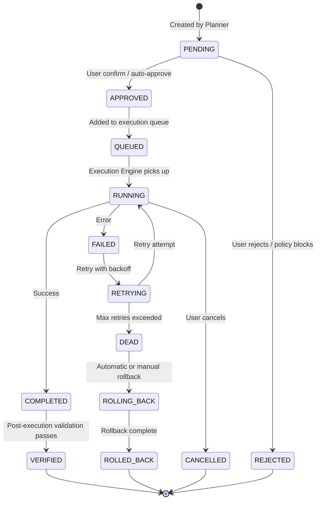
```mermaid
stateDiagram-v2
    [*] --> PENDING: Created by Planner

    PENDING --> APPROVED: User confirm / auto-approve
    PENDING --> REJECTED: User rejects / policy blocks

    APPROVED --> QUEUED: Added to execution queue
    QUEUED --> RUNNING: Execution Engine picks up

    RUNNING --> COMPLETED: Success
    RUNNING --> FAILED: Error
    RUNNING --> CANCELLED: User cancels

    COMPLETED --> VERIFIED: Post-execution validation passes
    VERIFIED --> [*]

    FAILED --> RETRYING: Retry with backoff
    RETRYING --> RUNNING: Retry attempt
    RETRYING --> DEAD: Max retries exceeded

    DEAD --> ROLLING_BACK: Automatic or manual rollback
    ROLLING_BACK --> ROLLED_BACK: Rollback complete
    ROLLED_BACK --> [*]

    CANCELLED --> [*]
    REJECTED --> [*]
```

### 3.5 Execution Engine

**Purpose:** The Execution Engine is the only component that actually calls capability interfaces. It takes approved, planned tasks and executes them through the Capability Layer, enforcing safety checks, recording results, and handling failures.

**Responsibilities:**
- Execute tasks through the appropriate capability interface
- Enforce all safety and permission checks before execution
- Stream execution results back to the user in real-time
- Handle partial failures (some tasks succeed, some fail)
- Coordinate cross-capability transactions (deploy involves compute + database + networking)
- Record every execution result for audit and learning
- Implement circuit breakers for repeated failures
- Support dry-run mode (validate without executing)

### 3.6 Workflow Builder

**Purpose:** The Workflow Builder creates reusable, multi-step workflows from successful execution patterns. It allows users (and the AI itself) to save, share, and automate complex operations.

**Responsibilities:**
- Record successful multi-step operations as workflows
- Parameterize workflows (inputs, variables, conditions)
- Support conditional branching (if X fails, do Y)
- Enable workflow sharing across the organization
- Trigger workflows on events (deploy on git push)
- Integrate with the Scheduler for time-based execution
- Allow manual workflows (user steps through each stage)
- Version workflows with change tracking

**Workflow examples:**

| Name | Steps | Trigger |
|------|-------|---------|
| **Standard Deploy** | Build → Test → Deploy → Health Check → Enable CDN | Git push |
| **Emergency Rollback** | Stop traffic → Restore DB → Revert deploy → Resume traffic | Incident |
| **Nightly Backup** | Snapshot DB → Archive logs → Sync to S3 → Verify | Cron (2 AM) |
| **Cost Report** | Query all resources → Calculate costs → Generate PDF → Email | Weekly |
| **Security Scan** | Scan dependencies → Check configs → Audit IAM → Report | Daily |

### 3.7 Capability Resolver

**Purpose:** The Capability Resolver determines which capabilities are needed to fulfill each step of a plan. It is the bridge between the AI's understanding of what needs to happen and the abstract capability interfaces.

**Responsibilities:**
- Map intent steps to capability interfaces
- Validate that required capabilities are registered and active
- Check capability version compatibility
- Resolve capability chains (deploy requires compute + database + networking)
- Handle optional capabilities (deploy with CDN if available)
- Report missing capabilities to the user with installation suggestions

**Resolution examples:**

| Intent Step | Capabilities Resolved |
|-------------|----------------------|
| "Run a container" | Compute Capability |
| "Create a PostgreSQL database" | Database Capability |
| "Deploy with custom domain" | Compute Capability + DNS Capability + Networking Capability |
| "Backup and send notification" | Database Capability + Monitoring Capability + Email Capability |

### 3.8 Provider Resolver

**Purpose:** The Provider Resolver determines which specific provider to use for each capability based on configuration, cost optimization, latency requirements, and availability.

**Responsibilities:**
- Look up the configured provider for each capability
- Apply selection strategy (primary, failover, cost-optimized, latency-optimized)
- Check provider health status
- Handle provider failover transparently
- Report provider selection decisions for audit
- Support per-step provider overrides

**The Provider Resolver is the ONLY component that knows about specific providers.** The rest of the AI system operates purely at the capability level.

### 3.9 Risk Analyzer

**Purpose:** The Risk Analyzer evaluates every planned action for potential negative impact before execution begins.

**Responsibilities:**
- Calculate blast radius (what else is affected?)
- Detect destructive operations (deletion, data loss)
- Identify compliance violations
- Flag sensitive operations (production, customer-facing)
- Evaluate rollback complexity (can this be undone?)
- Assign risk score (low, medium, high, critical)
- Suggest risk mitigations (pre-backup, gradual rollout, canary)

**Risk Scoring:**

| Level | Score | Examples | Required Action |
|-------|-------|----------|-----------------|
| **Low** | 0-25 | Restarting a non-critical service | Logged only |
| **Medium** | 26-50 | Scaling a staging environment | Brief confirmation |
| **High** | 51-75 | Production database migration | Detailed confirmation + dry run |
| **Critical** | 76-100 | Deleting a production database | Multi-party approval + backup verification |

### 3.10 Cost Optimizer

**Purpose:** The Cost Optimizer analyzes operations for cost efficiency and suggests optimizations.

**Responsibilities:**
- Estimate cost of planned operations
- Compare provider pricing for the same capability
- Suggest right-sizing (is the planned instance size appropriate?)
- Detect idle resources that could be stopped
- Recommend reserved capacity vs on-demand
- Alert on budget threshold crossings
- Generate cost comparison reports

### 3.11 Security Advisor

**Purpose:** The Security Advisor continuously evaluates the security posture of every operation and configuration.

**Responsibilities:**
- Scan configurations for security best practices
- Detect exposed secrets or hardcoded credentials
- Validate firewall rules against least-privilege principle
- Check TLS/SSL configuration
- Audit IAM and RBAC policies
- Flag unusual access patterns
- Recommend security improvements
- Integrate with OWASP Top 10 checks

### 3.12 Performance Advisor

**Purpose:** The Performance Advisor analyzes infrastructure performance and recommends optimizations.

**Responsibilities:**
- Analyze resource utilization patterns
- Detect bottlenecks (CPU, memory, I/O, network)
- Recommend auto-scaling thresholds
- Suggest database query optimizations
- Identify CDN and caching opportunities
- Compare performance against benchmarks
- Generate performance reports

### 3.13 Learning Engine

**Purpose:** The Learning Engine improves the AI system over time by recording outcomes, user feedback, and operational patterns.

**Responsibilities:**
- Record every operation outcome (success, failure, rollback)
- Collect user feedback (thumbs up/down, ratings, corrections)
- Learn user preferences (verbosity, confirmation level, default regions)
- Identify common failure patterns
- Suggest improvements to workflows
- Update intent classification models
- Maintain operation history for context
- Detect drift (config changes, performance degradation)

**What the Learning Engine learns:**

| Learning Domain | What It Learns | How It Improves |
|-----------------|----------------|-----------------|
| **User Preferences** | Verbosity, timezone, confirmation level | Personalizes responses |
| **Operational Patterns** | Common workflows, deployment times | Predicts next actions |
| **Failure Modes** | Recurring errors, misconfigurations | Prevents known failures |
| **Performance Baselines** | Normal CPU/memory ranges | Detects anomalies |
| **Cost Patterns** | Spending trends, optimization opportunities | Proactive cost alerts |

---

## 4. The Multi-Agent System

### 4.1 Agent Architecture

CloudOS uses a **specialized multi-agent architecture** where each agent has a specific domain of expertise. Agents collaborate through the Agent Coordinator to fulfill complex intents.


```mermaid
graph TB
    subgraph "Multi-Agent System"
        direction TB

        COORD[Agent Coordinator]

        subgraph "Infrastructure Agents"
            ARCH[Architect Agent]
            DEVOPS[DevOps Agent]
            DB_AGENT[Database Agent]
            NET_AGENT[Networking Agent]
            INFRA[Infrastructure Agent]
        end

        subgraph "Development Agents"
            DEV[Developer Agent]
            TEST[Testing Agent]
            DOCS[Documentation Agent]
        end

        subgraph "Security & Compliance"
            SEC_AGENT[Security Agent]
            COMPLIANCE[Compliance Agent]
        end

        subgraph "Operations Agents"
            MON_AGENT[Monitoring Agent]
            BILLING[Billing Agent]
            AUTO[Automation Agent]
        end

        subgraph "Ecosystem Agents"
            RESEARCH[Research Agent]
            PLUGIN[Plugin Agent]
            MARKET[Maketplace Agent]
        end

        subgraph "User-Facing Agents"
            SUPPORT[Support Agent]
        end

        COORD --> ARCH
        COORD --> DEVOPS
        COORD --> DB_AGENT
        COORD --> NET_AGENT
        COORD --> INFRA

        COORD --> DEV
        COORD --> TEST
        COORD --> DOCS

        COORD --> SEC_AGENT
        COORD --> COMPLIANCE

        COORD --> MON_AGENT
        COORD --> BILLING
        COORD --> AUTO

        COORD --> RESEARCH
        COORD --> PLUGIN
        COORD --> MARKET

        COORD --> SUPPORT
    end

    style COORD fill:#1a1a2e,stroke:#e94560,stroke-width:3px
```

### 4.2 Agent Catalog

#### 4.2.1 Architect Agent

**Purpose:** Designs and plans infrastructure architecture, converting user requirements into optimal deployment topologies.

| Attribute | Detail |
|-----------|--------|
| **Capabilities** | Architecture design, topology planning, framework auto-detection, scaling strategy |
| **Permissions** | Read all resources, suggest configurations (no write) |
| **Communication** | Receives intent from Coordinator, sends topology plans to DevOps and Database agents |
| **Escalation** | Complex architecture decisions → human architect |
| **Failure Recovery** | Falls back to template-based architecture |

**Example interactions:**
- User: "I need a high-availability API with PostgreSQL"
- Architect: Designs multi-region topology with read replicas, CDN, auto-scaling

#### 4.2.2 Developer Agent

**Purpose:** Assists with application configuration, build optimization, deployment preparation, and code-level concerns.

| Attribute | Detail |
|-----------|--------|
| **Capabilities** | Framework detection, build configuration, environment variable management, dependency analysis |
| **Permissions** | Read project files, suggest build config changes, set environment variables |
| **Communication** | Sends build specs to DevOps Agent |
| **Escalation** | Unsupported framework → create GitHub issue, notify developer relations |
| **Failure Recovery** | Falls back to generic build configuration |

#### 4.2.3 DevOps Agent

**Purpose:** Manages the deployment pipeline — building, testing, deploying, and monitoring application releases.

| Attribute | Detail |
|-----------|--------|
| **Capabilities** | CI/CD pipeline creation, deployment execution, health check configuration, rollback management |
| **Permissions** | Execute deployments, manage deployment configs, trigger rollbacks |
| **Communication** | Coordinates with Compute, Database, and Networking capabilities |
| **Escalation** | Failed deployment → Security Agent (if security-related) or Database Agent (if DB-related) |
| **Failure Recovery** | Automatic rollback to previous known-good version |

#### 4.2.4 Database Agent

**Purpose:** Manages all database operations — provisioning, migration, optimization, backup, and recovery.

| Attribute | Detail |
|-----------|--------|
| **Capabilities** | Database provisioning, schema migration, query optimization, backup orchestration, replication setup, failover |
| **Permissions** | Create/modify databases, run migrations, manage backups, read query metrics |
| **Communication** | Receives DB specs from Architect, sends migration plans to DevOps |
| **Escalation** | Data loss risk → human confirmation required |
| **Failure Recovery** | Point-in-time recovery, read replica promotion |

#### 4.2.5 Security Agent

**Purpose:** Continuously monitors for security threats, misconfigurations, and compliance violations.

| Attribute | Detail |
|-----------|--------|
| **Capabilities** | Vulnerability scanning, configuration audit, access review, threat detection, compliance checking |
| **Permissions** | Read all resources, recommend changes, block operations (quarantine) |
| **Communication** | Alerts Support Agent on incidents, coordinates with Compliance Agent |
| **Escalation** | Critical vulnerability → immediate human notification |
| **Failure Recovery** | Automated mitigation for known threats (block IP, rotate key) |

#### 4.2.6 Monitoring Agent

**Purpose:** Collects, analyzes, and alerts on infrastructure and application health metrics.

| Attribute | Detail |
|-----------|--------|
| **Capabilities** | Metric collection, log analysis, alert evaluation, dashboard creation, anomaly detection |
| **Permissions** | Read all metrics and logs, create alerts and dashboards |
| **Communication** | Alerts DevOps Agent on deployment health, alerts Billing Agent on cost anomalies |
| **Escalation** | Critical alert not acknowledged → page on-call human |
| **Failure Recovery** | Self-healing: restart unhealthy services, scale up under load |

#### 4.2.7 Testing Agent

**Purpose:** Automates testing of infrastructure changes, deployments, and configurations before production rollout.

| Attribute | Detail |
|-----------|--------|
| **Capabilities** | Load testing, integration testing, configuration validation, canary analysis, rollback testing |
| **Permissions** | Deploy to staging/preview environments, run tests |
| **Communication** | Reports test results to DevOps Agent |
| **Escalation** | Test failures → block deployment, notify Developer Agent |
| **Failure Recovery** | Re-run tests with different parameters |

#### 4.2.8 Documentation Agent

**Purpose:** Generates, updates, and maintains documentation for infrastructure, configurations, and operations.

| Attribute | Detail |
|-----------|--------|
| **Capabilities** | Documentation generation, changelog creation, runbook authoring, architecture diagram generation |
| **Permissions** | Read all resources and configurations, write to documentation store |
| **Communication** | Receives change events from all agents |
| **Escalation** | N/A (read-mostly agent) |
| **Failure Recovery** | Regenerates documentation from source of truth |

#### 4.2.9 Research Agent

**Purpose:** Searches for best practices, latest versions, security advisories, and optimal configurations.

| Attribute | Detail |
|-----------|--------|
| **Capabilities** | Web search, documentation search, version lookup, best practice retrieval, CVE database query |
| **Permissions** | Read external resources, read internal documentation |
| **Communication** | Provides context to all agents |
| **Escalation** | N/A |
| **Failure Recovery** | Falls back to cached knowledge |

#### 4.2.10 Infrastructure Agent

**Purpose:** Manages the underlying infrastructure resources — compute, storage, networking — as abstract resources.

| Attribute | Detail |
|-----------|--------|
| **Capabilities** | Resource provisioning, capacity planning, resource tagging, inventory management |
| **Permissions** | Create/modify infrastructure resources, read utilization metrics |
| **Communication** | Receives specs from Architect, provisions through Capability Layer |
| **Escalation** | Resource quota exceeded → notify Billing Agent and human |
| **Failure Recovery** | Replace failed resources, migrate workloads |

#### 4.2.11 Networking Agent

**Purpose:** Manages network configuration, DNS, SSL/TLS, CDN, firewall rules, and load balancing.

| Attribute | Detail |
|-----------|--------|
| **Capabilities** | DNS management, SSL certificate provisioning, CDN configuration, firewall rule management, load balancer setup |
| **Permissions** | Create/modify network resources, read traffic metrics |
| **Communication** | Coordinates with DNS and Networking capabilities |
| **Escalation** | SSL certificate failure → immediate notification (users affected) |
| **Failure Recovery** | Automatic DNS failover, CDN fallback origin |

#### 4.2.12 Plugin Agent

**Purpose:** Manages the plugin lifecycle — discovery, installation, updates, compatibility, and dependency resolution.

| Attribute | Detail |
|-----------|--------|
| **Capabilities** | Plugin search, compatibility check, dependency resolution, installation orchestration, upgrade management |
| **Permissions** | Install/update/remove plugins, read plugin registry and marketplace |
| **Communication** | Coordinates with Marketplace Agent for registry operations |
| **Escalation** | Plugin compatibility conflict → block installation, suggest alternatives |
| **Failure Recovery** | Rollback to previous plugin version |

#### 4.2.13 Marketplace Agent

**Purpose:** Manages plugin marketplace operations — publishing, discovery, ratings, security scanning.

| Attribute | Detail |
|-----------|--------|
| **Capabilities** | Plugin publishing, security scanning orchestration, rating management, featured plugin curation |
| **Permissions** | Manage marketplace listings, trigger security scans |
| **Communication** | Coordinates with Plugin Agent and Security Agent |
| **Escalation** | Malicious plugin detected → immediate delisting, notify all users |
| **Failure Recovery** | Revert to previous listing state |

#### 4.2.14 Automation Agent

**Purpose:** Creates, manages, and executes automated workflows and scheduled tasks.

| Attribute | Detail |
|-----------|--------|
| **Capabilities** | Workflow creation, schedule management, event-triggered automation, webhook integration |
| **Permissions** | Create/execute workflows, manage schedules, set up webhooks |
| **Communication** | Coordinates with all agents for workflow steps |
| **Escalation** | Workflow failure → retry with backoff, then notify |
| **Failure Recovery** | Pause automation, human intervention |

#### 4.2.15 Billing Agent

**Purpose:** Monitors costs, manages budgets, predicts spending, and optimizes resource utilization for cost efficiency.

| Attribute | Detail |
|-----------|--------|
| **Capabilities** | Cost tracking, budget management, usage analysis, cost forecasting, spending anomaly detection |
| **Permissions** | Read all billing data, recommend cost-saving changes, enforce spending caps |
| **Communication** | Alerts Infrastructure Agent on cost anomalies, reports to user |
| **Escalation** | Budget threshold crossed → alert user, suggest optimizations |
| **Failure Recovery** | Fall back to last known budget state |

#### 4.2.16 Compliance Agent

**Purpose:** Ensures infrastructure and operations comply with regulatory requirements and organizational policies.

| Attribute | Detail |
|-----------|--------|
| **Capabilities** | Policy evaluation, compliance reporting, audit log analysis, certification readiness checking |
| **Permissions** | Read all resources and configurations, generate reports, block non-compliant operations |
| **Communication** | Reports to Security Agent, alerts on violations |
| **Escalation** | Compliance violation → block operation, notify compliance officer |
| **Failure Recovery** | Revert to last compliant state |

#### 4.2.17 Support Agent

**Purpose:** Provides user assistance, answers questions, guides operations, and handles error recovery.

| Attribute | Detail |
|-----------|--------|
| **Capabilities** | Natural conversation, documentation lookup, error explanation, guided troubleshooting, ticket creation |
| **Permissions** | Read all resources (with user context), suggest actions (no direct write) |
| **Communication** | Coordinates with all agents to resolve user requests |
| **Escalation** | Cannot resolve → create support ticket, route to human |
| **Failure Recovery** | Escalate to human, provide full context |

### 4.3 Agent Communication Model

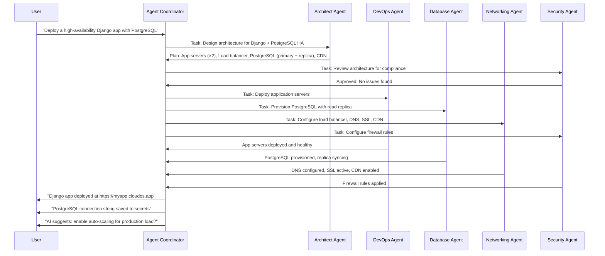
```mermaid
sequenceDiagram
    participant USER as User
    participant COORD as Agent Coordinator
    participant ARCH as Architect Agent
    participant DEVOPS as DevOps Agent
    participant DB_AG as Database Agent
    participant NET as Networking Agent
    participant SEC as Security Agent

    USER->>COORD: "Deploy a high-availability Django app with PostgreSQL"

    COORD->>ARCH: Task: Design architecture for Django + PostgreSQL HA
    ARCH->>COORD: Plan: App servers (×2), Load balancer, PostgreSQL (primary + replica), CDN

    COORD->>SEC: Task: Review architecture for compliance
    SEC->>COORD: Approved: No issues found

    COORD->>DEVOPS: Task: Deploy application servers
    COORD->>DB_AG: Task: Provision PostgreSQL with read replica
    COORD->>NET: Task: Configure load balancer, DNS, SSL, CDN
    COORD->>SEC: Task: Configure firewall rules

    DEVOPS->>COORD: App servers deployed and healthy
    DB_AG->>COORD: PostgreSQL provisioned, replica syncing
    NET->>COORD: DNS configured, SSL active, CDN enabled
    SEC->>COORD: Firewall rules applied

    COORD->>USER: "Django app deployed at https://myapp.cloudos.app"
    COORD->>USER: "PostgreSQL connection string saved to secrets"
    COORD->>USER: "AI suggests: enable auto-scaling for production load?"
```

**Communication rules:**
1. Agents never communicate directly — all communication goes through the Coordinator
2. The Coordinator decomposes intents and assigns sub-tasks to agents
3. Agents return results to the Coordinator (success, failure, partial result)
4. The Coordinator handles cross-agent dependencies (e.g., DNS must be configured before SSL)
5. Agents can request additional context from the Coordinator (e.g., "What database engine?")
6. The Coordinator handles all user-facing communication

### 4.4 Agent Coordination

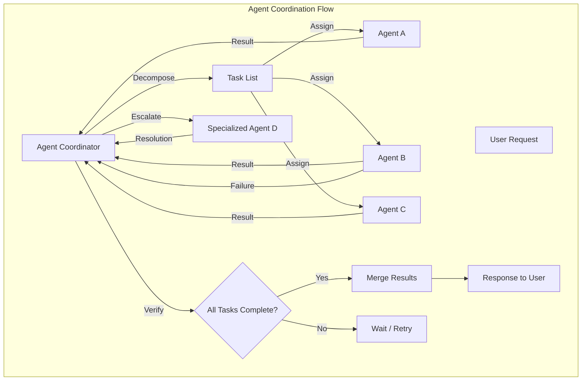
```mermaid
graph TB
    subgraph "Agent Coordination Flow"
        USER[User Request]

        COORD[Agent Coordinator]

        COORD -->|Decompose| TASKS[Task List]

        TASKS -->|Assign| AGENT1[Agent A]
        TASKS -->|Assign| AGENT2[Agent B]
        TASKS -->|Assign| AGENT3[Agent C]

        AGENT1 -->|Result| COORD
        AGENT2 -->|Result| COORD
        AGENT3 -->|Result| COORD

        COORD -->|Verify| TASK_STATUS{All Tasks Complete?}

        TASK_STATUS -->|Yes| MERGE[Merge Results]
        TASK_STATUS -->|No| WAIT[Wait / Retry]

        MERGE --> RESPOND[Response to User]

        AGENT2 -->|Failure| COORD
        COORD -->|Escalate| AGENT4[Specialized Agent D]
        AGENT4 -->|Resolution| COORD
    end
```

### 4.5 Agent Lifecycle

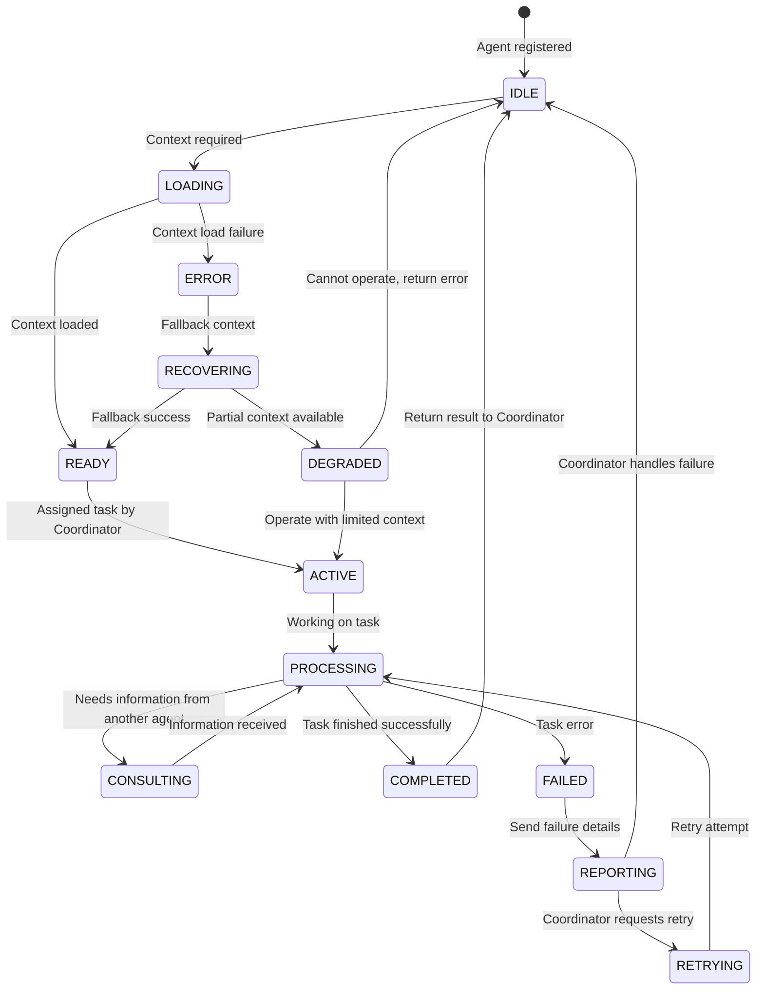
```mermaid
stateDiagram-v2
    [*] --> IDLE: Agent registered

    IDLE --> LOADING: Context required
    LOADING --> READY: Context loaded

    READY --> ACTIVE: Assigned task by Coordinator
    ACTIVE --> PROCESSING: Working on task

    PROCESSING --> CONSULTING: Needs information from another agent
    CONSULTING --> PROCESSING: Information received

    PROCESSING --> COMPLETED: Task finished successfully
    PROCESSING --> FAILED: Task error

    COMPLETED --> IDLE: Return result to Coordinator
    FAILED --> REPORTING: Send failure details
    REPORTING --> RETRYING: Coordinator requests retry
    RETRYING --> PROCESSING: Retry attempt
    REPORTING --> IDLE: Coordinator handles failure

    LOADING --> ERROR: Context load failure
    ERROR --> RECOVERING: Fallback context
    RECOVERING --> READY: Fallback success
    RECOVERING --> DEGRADED: Partial context available

    DEGRADED --> ACTIVE: Operate with limited context
    DEGRADED --> IDLE: Cannot operate, return error
```

---

## 5. AI Provider System

### 5.1 Provider Abstraction

CloudOS does **not** depend on any single AI provider. The AI Provider System provides a unified interface that multiple providers implement. The rest of CloudOS never knows which model is being used.


```mermaid
graph TB
    subgraph "AI Provider Abstraction"
        AI_OS[AI Operating System]

        AI_CAP[AI Capability Interface<br/>Abstract API]

        ROUTER[Model Router<br/>Selection Logic]

        OAI[OpenAI Provider<br/>GPT-4o, o3, o4-mini]
        ANTH[Anthropic Provider<br/>Claude 4, Sonnet, Haiku]
        GEM[Google Gemini Provider<br/>Gemini 2.5 Pro, Flash]
        DS[DeepSeek Provider<br/>DeepSeek-V3, R1]
        OLL[Ollama Provider<br/>Llama 4, Mistral, Qwen]
        LM[LM Studio Provider<br/>Any local model]
        ENT[Enterprise Provider<br/>Custom models]

        AI_OS --> AI_CAP

        AI_CAP --> ROUTER

        ROUTER --> OAI
        ROUTER --> ANTH
        ROUTER --> GEM
        ROUTER --> DS
        ROUTER --> OLL
        ROUTER --> LM
        ROUTER --> ENT
    end

    style AI_CAP fill:#16213e,stroke:#0f3460,stroke-width:3px
    style ROUTER fill:#1a1a2e,stroke:#e94560,stroke-width:2px
```

### 5.2 AI Provider Interface

The AI Provider Interface defines the contracts that every provider must implement. The AI Operating System never talks to providers directly — it goes through this interface.

**Core operations:**
- Chat completions (streaming and non-streaming)
- Structured output generation
- Embedding generation
- Function/tool calling
- Model metadata (capabilities, pricing, context window)

**Routing criteria:**
| Criterion | Evaluated By | Example |
|-----------|-------------|---------|
| **Task type** | Intent Parser | Code generation → Claude, Analysis → GPT-4o |
| **Cost constraints** | Cost Optimizer | Budget-friendly → DeepSeek, Free → Ollama |
| **Latency requirements** | Performance Advisor | Real-time → Gemini Flash |
| **Privacy requirements** | Security Advisor | Sensitive data → Local Ollama |
| **Context window needed** | Planner | Large codebase → Gemini 2M context |
| **Provider availability** | Health Monitor | Primary down → failover chain |
| **User preference** | Memory | User prefers Claude → bias selection |

### 5.3 Provider Roadmap

| Provider | Models | Status | Target | Notes |
|----------|--------|--------|--------|-------|
| **OpenAI** | GPT-4o, GPT-4o-mini, o3, o4-mini, embeddings | ✅ P0 | v0.1 | Primary chat + reasoning |
| **Anthropic** | Claude 4, Claude 3.5 Sonnet, Haiku | ✅ P0 | v0.1 | Code generation, analysis |
| **Google Gemini** | Gemini 2.5 Pro, Flash, Nano, embeddings | ✅ P0 | v0.1 | Large context, multimodal |
| **DeepSeek** | DeepSeek-V3, DeepSeek-R1 | 🚧 P1 | v0.2 | Cost-effective reasoning |
| **Ollama** | Llama 4, Mistral, Qwen, Phi-4, DeepSeek | 🚧 P1 | v0.2 | Local deployment, air-gapped |
| **OpenRouter** | 300+ models via unified API | 🚧 P1 | v0.3 | One API to all models |
| **LM Studio** | Any local GGUF model | 🔮 P2 | v0.4 | Bring your own model |
| **Mistral AI** | Mistral Large, Small, Codestral | 🔮 P2 | v0.4 | European provider option |
| **xAI** | Grok-3, Grok-3-mini | 🔮 P3 | v0.5 | Alternative reasoning |
| **Enterprise** | Custom fine-tuned models | 🔮 P3 | v1.0 | BYO model for enterprises |

### 5.4 Model Selection & Routing

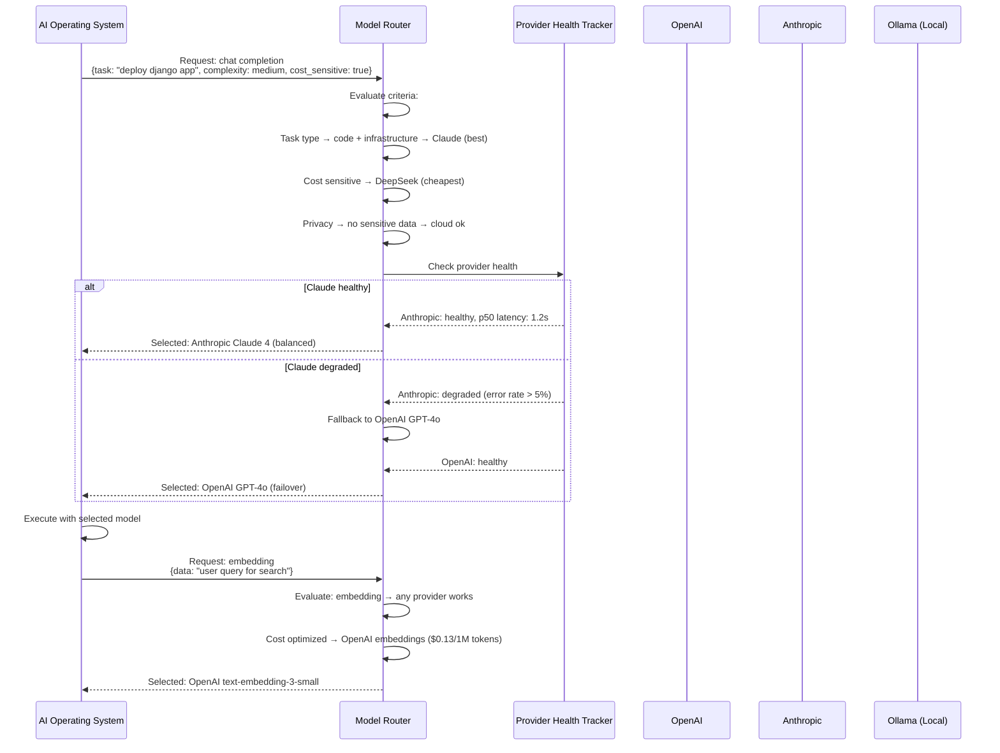
```mermaid
sequenceDiagram
    participant AIOS as AI Operating System
    participant ROUTER as Model Router
    participant TRACKER as Provider Health Tracker
    participant OAI as OpenAI
    participant ANTH as Anthropic
    participant LOCAL as Ollama (Local)

    AIOS->>ROUTER: Request: chat completion<br/>{task: "deploy django app", complexity: medium, cost_sensitive: true}

    ROUTER->>ROUTER: Evaluate criteria:
    ROUTER->>ROUTER:   Task type → code + infrastructure → Claude (best)
    ROUTER->>ROUTER:   Cost sensitive → DeepSeek (cheapest)
    ROUTER->>ROUTER:   Privacy → no sensitive data → cloud ok

    ROUTER->>TRACKER: Check provider health

    alt Claude healthy
        TRACKER-->>ROUTER: Anthropic: healthy, p50 latency: 1.2s
        ROUTER-->>AIOS: Selected: Anthropic Claude 4 (balanced)
    else Claude degraded
        TRACKER-->>ROUTER: Anthropic: degraded (error rate > 5%)
        ROUTER->>ROUTER: Fallback to OpenAI GPT-4o
        TRACKER-->>ROUTER: OpenAI: healthy
        ROUTER-->>AIOS: Selected: OpenAI GPT-4o (failover)
    end

    AIOS->>AIOS: Execute with selected model

    AIOS->>ROUTER: Request: embedding<br/>{data: "user query for search"}

    ROUTER->>ROUTER: Evaluate: embedding → any provider works
    ROUTER->>ROUTER: Cost optimized → OpenAI embeddings ($0.13/1M tokens)
    ROUTER-->>AIOS: Selected: OpenAI text-embedding-3-small
```

**Routing strategies:**

| Strategy | Behavior | Config |
|----------|----------|--------|
| **cost_optimized** | Select cheapest compliant provider | `ai.routing: cost` |
| **latency_optimized** | Select fastest provider | `ai.routing: latency` |
| **quality_optimized** | Select highest-quality model for task | `ai.routing: quality` |
| **privacy_first** | Route to local models only | `ai.routing: privacy` |
| **failover** | Primary with fallback chain | `ai.routing: failover` |
| **round_robin** | Distribute across providers | `ai.routing: round_robin` |

---

## 6. Context System

### 6.1 Hierarchical Context Model

The Context System maintains a hierarchical understanding of the user's world. Each level inherits from its parent and adds specificity.

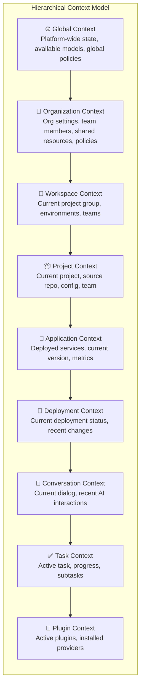
```mermaid
graph TB
    subgraph "Hierarchical Context Model"
        direction TB

        GLOBAL[🌐 Global Context<br/>Platform-wide state, available models, global policies]

        ORG[🏢 Organization Context<br/>Org settings, team members, shared resources, policies]

        WORKSPACE[📁 Workspace Context<br/>Current project group, environments, teams]

        PROJECT[📦 Project Context<br/>Current project, source repo, config, team]

        APP[🚀 Application Context<br/>Deployed services, current version, metrics]

        DEPLOY[🔁 Deployment Context<br/>Current deployment status, recent changes]

        CONV[💬 Conversation Context<br/>Current dialog, recent AI interactions]

        TASK[✅ Task Context<br/>Active task, progress, subtasks]

        PLUGIN[🧩 Plugin Context<br/>Active plugins, installed providers]

        GLOBAL --> ORG
        ORG --> WORKSPACE
        WORKSPACE --> PROJECT
        PROJECT --> APP
        APP --> DEPLOY
        DEPLOY --> CONV
        CONV --> TASK
        TASK --> PLUGIN
    end
```

### 6.2 Context Resolution

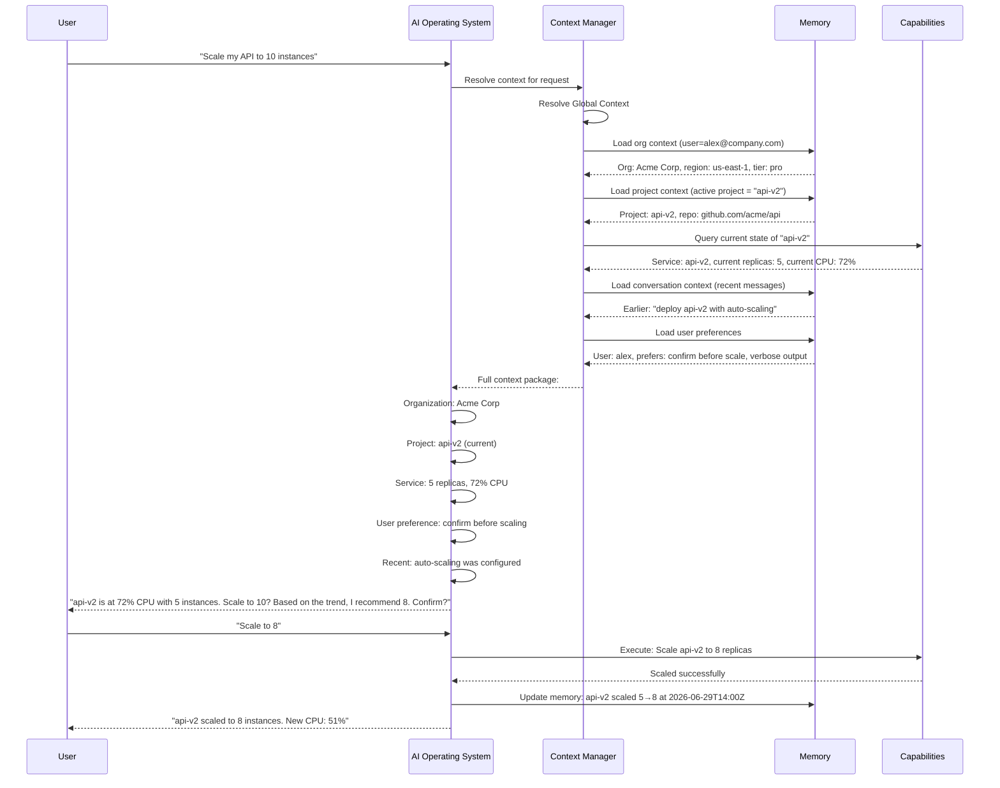
```mermaid
sequenceDiagram
    participant USER as User
    participant AIOS as AI Operating System
    participant CTX as Context Manager
    participant MEM as Memory
    participant CAPS as Capabilities

    USER->>AIOS: "Scale my API to 10 instances"

    AIOS->>CTX: Resolve context for request

    CTX->>CTX: Resolve Global Context
    CTX->>MEM: Load org context (user=alex@company.com)
    MEM-->>CTX: Org: Acme Corp, region: us-east-1, tier: pro

    CTX->>MEM: Load project context (active project = "api-v2")
    MEM-->>CTX: Project: api-v2, repo: github.com/acme/api

    CTX->>CAPS: Query current state of "api-v2"
    CAPS-->>CTX: Service: api-v2, current replicas: 5, current CPU: 72%

    CTX->>MEM: Load conversation context (recent messages)
    MEM-->>CTX: Earlier: "deploy api-v2 with auto-scaling"

    CTX->>MEM: Load user preferences
    MEM-->>CTX: User: alex, prefers: confirm before scale, verbose output

    CTX-->>AIOS: Full context package:
    AIOS->>AIOS: Organization: Acme Corp
    AIOS->>AIOS: Project: api-v2 (current)
    AIOS->>AIOS: Service: 5 replicas, 72% CPU
    AIOS->>AIOS: User preference: confirm before scaling
    AIOS->>AIOS: Recent: auto-scaling was configured

    AIOS-->>USER: "api-v2 is at 72% CPU with 5 instances. Scale to 10? Based on the trend, I recommend 8. Confirm?"
    USER->>AIOS: "Scale to 8"

    AIOS->>CAPS: Execute: Scale api-v2 to 8 replicas
    CAPS-->>AIOS: Scaled successfully

    AIOS->>MEM: Update memory: api-v2 scaled 5→8 at 2026-06-29T14:00Z
    AIOS-->>USER: "api-v2 scaled to 8 instances. New CPU: 51%"
```

### 6.3 Context Providers

| Context Provider | Data Source | Refresh Rate | Example Data |
|-----------------|-------------|--------------|--------------|
| **Identity Provider** | Auth Engine | Per request | User ID, roles, permissions, org |
| **Project Provider** | State Store | On change | Active project, environments, services |
| **Resource Provider** | Capability Layer | On change | Current state of all resources |
| **Memory Provider** | AI Memory | On demand | Past operations, user preferences, patterns |
| **Conversation Provider** | Session Store | Real-time | Conversation history, pending tasks |
| **Knowledge Provider** | Knowledge Graph | On query | Best practices, documentation, relationships |
| **Plugin Provider** | Plugin Runtime | On change | Active plugins, available capabilities |
| **Time Provider** | System clock | Each request | Current time, timezone, business hours |

---

## 7. AI Memory Architecture

### 7.1 Memory Types

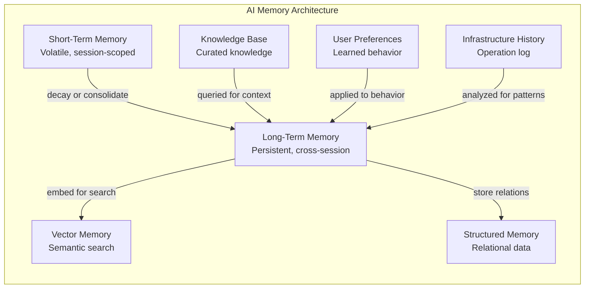
```mermaid
graph TB
    subgraph "AI Memory Architecture"
        direction TB

        STM[Short-Term Memory<br/>Volatile, session-scoped]

        LTM[Long-Term Memory<br/>Persistent, cross-session]

        VM[Vector Memory<br/>Semantic search]

        SM[Structured Memory<br/>Relational data]

        KB[Knowledge Base<br/>Curated knowledge]

        PREF[User Preferences<br/>Learned behavior]

        HIST[Infrastructure History<br/>Operation log]

        STM -->|decay or consolidate| LTM
        LTM -->|embed for search| VM
        LTM -->|store relations| SM
        KB -->|queried for context| LTM
        PREF -->|applied to behavior| LTM
        HIST -->|analyzed for patterns| LTM
    end
```

### 7.2 Memory Hierarchy

| Memory Type | Storage | Retention | Capacity | Access Pattern | Example |
|-------------|---------|-----------|----------|---------------|---------|
| **Short-Term** | In-memory (Redis) | Session (15 min TTL) | 1000 entries | Fast read/write, LRU eviction | Current conversation, pending task |
| **Long-Term** | PostgreSQL | Indefinite | Unlimited | CRUD by ID, time-range queries | Past deployments, user preferences |
| **Vector** | pgvector / Qdrant | Indefinite | Unlimited | Semantic similarity search | "How did I fix this error last time?" |
| **Structured** | PostgreSQL | Indefinite | Unlimited | SQL queries, relationships | Resource hierarchy, user-org mappings |
| **Knowledge** | PostgreSQL + vector | Curated | Unlimited | Hybrid (SQL + vector) | Documentation, best practices, runbooks |
| **Preferences** | PostgreSQL | Indefinite | Per user | Key-value lookup | Verbosity, timezone, confirmation level |
| **History** | PostgreSQL (append-only) | Configurable (90d-7yr) | Unlimited | Time-range queries, aggregation | "Show me all deployments this month" |

### 7.3 Memory Persistence

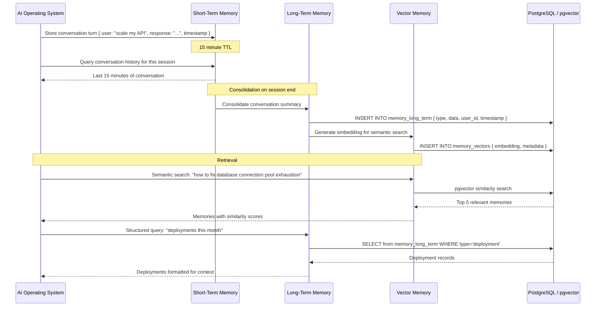
```mermaid
sequenceDiagram
    participant AIOS as AI Operating System
    participant STM as Short-Term Memory
    participant LTM as Long-Term Memory
    participant VM as Vector Memory
    participant DB as PostgreSQL / pgvector

    AIOS->>STM: Store conversation turn { user: "scale my API", response: "...", timestamp }

    Note over STM: 15 minute TTL

    AIOS->>STM: Query conversation history for this session
    STM-->>AIOS: Last 15 minutes of conversation

    Note over STM, LTM: Consolidation on session end

    STM->>LTM: Consolidate conversation summary
    LTM->>DB: INSERT INTO memory_long_term { type, data, user_id, timestamp }

    LTM->>VM: Generate embedding for semantic search
    VM->>DB: INSERT INTO memory_vectors { embedding, metadata }

    Note over AIOS, VM: Retrieval

    AIOS->>VM: Semantic search: "how to fix database connection pool exhaustion"
    VM->>DB: pgvector similarity search
    DB-->>VM: Top 5 relevant memories
    VM-->>AIOS: Memories with similarity scores

    AIOS->>LTM: Structured query: "deployments this month"
    LTM->>DB: SELECT from memory_long_term WHERE type='deployment'
    DB-->>LTM: Deployment records
    LTM-->>AIOS: Deployments formatted for context
```

### 7.4 Knowledge Graph

The Knowledge Graph maintains relationships between all entities in the CloudOS ecosystem.

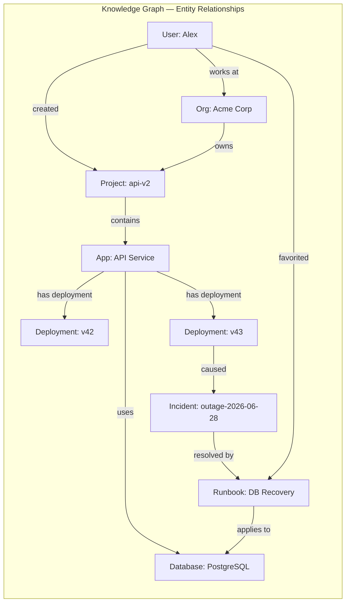
```mermaid
graph LR
    subgraph "Knowledge Graph — Entity Relationships"
        USER[User: Alex]
        ORG[Org: Acme Corp]
        PROJ[Project: api-v2]
        APP[App: API Service]
        DB[Database: PostgreSQL]
        DEPLOY[Deployment: v42]
        DEPLOY2[Deployment: v43]
        INCIDENT[Incident: outage-2026-06-28]
        RUNBOOK[Runbook: DB Recovery]

        USER -- "works at" --> ORG
        USER -- "created" --> PROJ
        ORG -- "owns" --> PROJ
        PROJ -- "contains" --> APP
        APP -- "uses" --> DB
        APP -- "has deployment" --> DEPLOY
        APP -- "has deployment" --> DEPLOY2
        DEPLOY2 -- "caused" --> INCIDENT
        INCIDENT -- "resolved by" --> RUNBOOK
        RUNBOOK -- "applies to" --> DB
        USER -- "favorited" --> RUNBOOK
    end
```

**What the Knowledge Graph stores:**
- User-organization-project relationships
- Service dependencies (app → database, app → cache)
- Deployment history with rollback links
- Incident → root cause → resolution mappings
- Runbooks linked to specific resource types
- Configuration change history
- Cost allocation (resource → project → organization)
- Security findings (vulnerability → affected resource)

---

## 8. Intent-Driven Computing

### 8.1 The Intent Flow

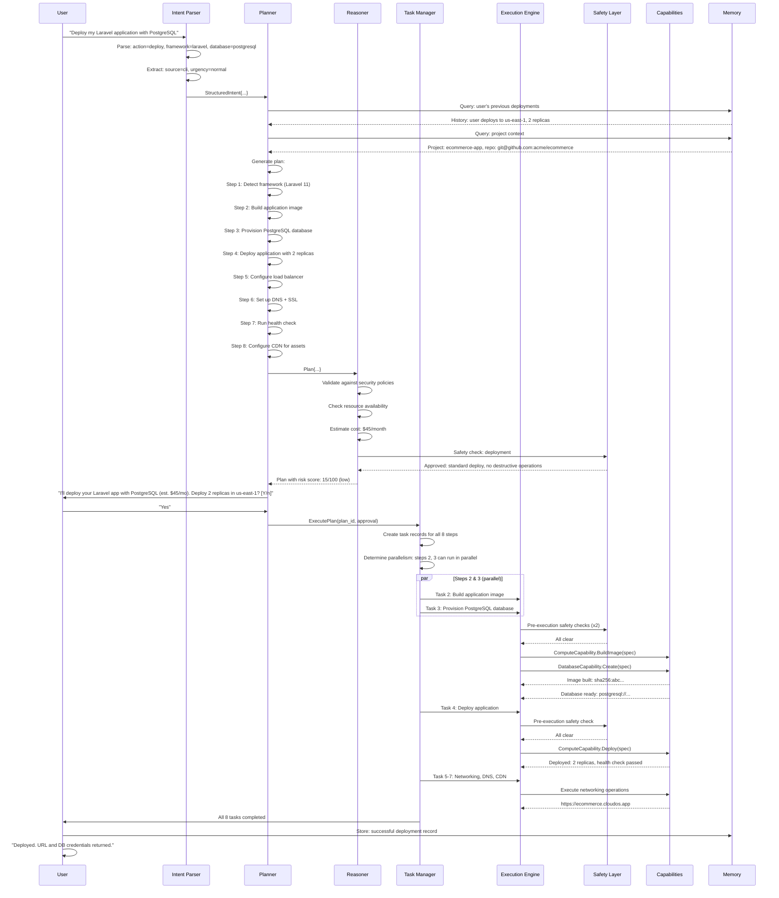
```mermaid
sequenceDiagram
    participant USER as User
    participant IP as Intent Parser
    participant PLAN as Planner
    participant REASON as Reasoner
    participant TM as Task Manager
    participant EE as Execution Engine
    participant SAFE as Safety Layer
    participant CAPS as Capabilities
    participant MEM as Memory

    USER->>IP: "Deploy my Laravel application with PostgreSQL"

    IP->>IP: Parse: action=deploy, framework=laravel, database=postgresql
    IP->>IP: Extract: source=cli, urgency=normal

    IP->>PLAN: StructuredIntent{...}

    PLAN->>MEM: Query: user's previous deployments
    MEM-->>PLAN: History: user deploys to us-east-1, 2 replicas
    PLAN->>MEM: Query: project context
    MEM-->>PLAN: Project: ecommerce-app, repo: git@github.com:acme/ecommerce

    PLAN->>PLAN: Generate plan:
    PLAN->>PLAN:   Step 1: Detect framework (Laravel 11)
    PLAN->>PLAN:   Step 2: Build application image
    PLAN->>PLAN:   Step 3: Provision PostgreSQL database
    PLAN->>PLAN:   Step 4: Deploy application with 2 replicas
    PLAN->>PLAN:   Step 5: Configure load balancer
    PLAN->>PLAN:   Step 6: Set up DNS + SSL
    PLAN->>PLAN:   Step 7: Run health check
    PLAN->>PLAN:   Step 8: Configure CDN for assets

    PLAN->>REASON: Plan{...}

    REASON->>REASON: Validate against security policies
    REASON->>REASON: Check resource availability
    REASON->>REASON: Estimate cost: $45/month

    REASON->>SAFE: Safety check: deployment
    SAFE-->>REASON: Approved: standard deploy, no destructive operations

    REASON-->>PLAN: Plan with risk score: 15/100 (low)

    PLAN->>USER: "I'll deploy your Laravel app with PostgreSQL (est. $45/mo). Deploy 2 replicas in us-east-1? [Y/n]"

    USER->>PLAN: "Yes"

    PLAN->>TM: ExecutePlan(plan_id, approval)

    TM->>TM: Create task records for all 8 steps
    TM->>TM: Determine parallelism: steps 2, 3 can run in parallel

    par Steps 2 & 3 (parallel)
        TM->>EE: Task 2: Build application image
        TM->>EE: Task 3: Provision PostgreSQL database
    end

    EE->>SAFE: Pre-execution safety checks (x2)
    SAFE-->>EE: All clear

    EE->>CAPS: ComputeCapability.BuildImage(spec)
    EE->>CAPS: DatabaseCapability.Create(spec)

    CAPS-->>EE: Image built: sha256:abc...
    CAPS-->>EE: Database ready: postgresql://...

    TM->>EE: Task 4: Deploy application
    EE->>SAFE: Pre-execution safety check
    SAFE-->>EE: All clear
    EE->>CAPS: ComputeCapability.Deploy(spec)
    CAPS-->>EE: Deployed: 2 replicas, health check passed

    TM->>EE: Task 5-7: Networking, DNS, CDN
    EE->>CAPS: Execute networking operations
    CAPS-->>EE: https://ecommerce.cloudos.app

    TM->>USER: All 8 tasks completed
    USER->>MEM: Store: successful deployment record

    USER->>USER: "Deployed. URL and DB credentials returned."
```

### 8.2 From Intent to Execution

```
                    User Intent
                        │
                        ▼
            ┌───────────────────────┐
            │    Intent Parser      │  ← "Deploy my Laravel app"
            │   (NLP → Structured)  │
            └──────────┬────────────┘
                       │ { type: "deploy", framework: "laravel", database: "postgresql" }
                       ▼
            ┌───────────────────────┐
            │       Planner         │  ← 8-step plan with dependencies
            │   (Decomposition)     │
            └──────────┬────────────┘
                       │ Plan{ steps: [...], dependencies: {...} }
                       ▼
            ┌───────────────────────┐
            │      Reasoner         │  ← Security, cost, risk assessment
            │   (Validation)        │
            └──────────┬────────────┘
                       │ Approved plan (risk score: 15/100)
                       ▼
            ┌───────────────────────┐
            │    Capability         │  ← Map steps to Compute, Database,
            │    Resolver           │     Networking, DNS capabilities
            └──────────┬────────────┘
                       │ Step 2 → Compute, Step 3 → Database
                       ▼
            ┌───────────────────────┐
            │    Provider           │  ← Docker for Compute,
            │    Resolver           │     PostgreSQL for Database
            └──────────┬────────────┘
                       │ Provider selected by config / routing strategy
                       ▼
            ┌───────────────────────┐
            │   Safety Layer        │  ← Permission check, dry-run?,
            │   (Guardrails)        │     destructive action warning
            └──────────┬────────────┘
                       │ All checks passed
                       ▼
            ┌───────────────────────┐
            │   Execution Engine    │  ← Calls capability interfaces
            │   (Capability Calls)  │
            └──────────┬────────────┘
                       │ gRPC calls to Compute, Database, DNS
                       ▼
            ┌───────────────────────┐
            │      Providers        │  ← Docker, PostgreSQL, Cloudflare
            │   (Actual Work)       │     (AI never sees these)
            └──────────┬────────────┘
                       │ Results, events, status
                       ▼
            ┌───────────────────────┐
            │     Event Bus         │  ← State changes published
            │   (Event Stream)      │
            └──────────┬────────────┘
                       │ events.deployment.completed
                       ▼
            ┌───────────────────────┐
            │   AI → User Response  │  ← "Deployed at https://..."
            │   (Natural Language)  │
            └───────────────────────┘
```

### 8.3 Example Flows

**Flow 1: Create a PostgreSQL Database**

> User: "Create a PostgreSQL database for my analytics app"

| Step | Component | Action |
|------|-----------|--------|
| 1 | Intent Parser | `{ type: "create", resource: "database", engine: "postgresql", purpose: "analytics" }` |
| 2 | Context | Resolve project: "analytics-app", user's default region: us-east-1 |
| 3 | Memory | User's previous DB: 2GB RAM, 50GB storage, automated backups |
| 4 | Planner | Plan: Create DB → Configure backup → Set up monitoring → Generate credentials |
| 5 | Reasoner | Validate against policy: DB creation allowed, cost: $15/mo |
| 6 | Safety | Non-destructive → auto-approved |
| 7 | Execution | `DatabaseCapability.Create({ engine: "postgresql", version: 16, resources: "2GB", storage: "50GB" })` |
| 8 | Provider | PostgreSQL provider provisions database |
| 9 | Response | "PostgreSQL database 'analytics-db' created. Connection string saved to secrets. Daily backup at 2 AM configured." |

**Flow 2: Diagnose a Production Issue**

> User: "Why is my API returning 503 errors?"

| Step | Component | Action |
|------|-----------|--------|
| 1 | Intent Parser | `{ type: "diagnose", resource: "api", symptom: "503", urgency: "high" }` |
| 2 | Context | Resolve: project "ecommerce", service "api-gateway" |
| 3 | Memory | Recent: deployment v43 deployed 30 min ago |
| 4 | Diagnosis | Query metrics: CPU 95%, memory 88%, error rate spike correlates with deploy |
| 5 | Analysis | Check logs: connection pool exhausted after v43 increased traffic |
| 6 | Recommendation | "v43 increased request rate by 300%. Database connection pool is exhausted. Options: 1) Roll back to v42 (30s), 2) Increase connection pool (no restart), 3) Scale DB. Which?" |

**Flow 3: Optimize Costs**

> User: "Reduce my monthly cloud costs"

| Step | Component | Action |
|------|-----------|--------|
| 1 | Intent Parser | `{ type: "optimize", domain: "cost", goal: "reduce" }` |
| 2 | Context | Full billing access, last 30 days cost data |
| 3 | Analysis | Identify top 3 cost drivers: staging DB (idle 80% of time), oversized compute instances, unused storage |
| 4 | Recommendations | "1) Downsize staging DB from 8GB to 2GB (save $45/mo) — no performance impact. 2) Reduce staging compute from 4 to 2 replicas (save $30/mo). 3) Delete 15 unused storage snapshots (save $5/mo). Total savings: ~$80/mo (18%). Apply?" |

**Flow 4: Build a Complete Application**

> User: "Build me a CRM with PostgreSQL and Redis caching"

| Step | Component | Action |
|------|-----------|--------|
| 1 | Intent Parser | `{ type: "build", stack: "crm", database: "postgresql", cache: "redis" }` |
| 2 | Architect Agent | Design topology: Web (×2) + API (×2) + PostgreSQL + Redis + CDN |
| 3 | Developer Agent | Select CRM template (Twenty / SuiteCRM / custom), configure build |
| 4 | Database Agent | Provision PostgreSQL + Redis, run initial schema migration |
| 5 | DevOps Agent | Deploy frontend + backend, configure load balancer |
| 6 | Networking Agent | Set up DNS, SSL, CDN for static assets |
| 7 | Security Agent | Configure firewall, enable WAF, set up backup encryption |
| 8 | Monitoring Agent | Enable health checks, create dashboards, set up alerts |
| 9 | Response | "CRM deployed at https://crm.cloudos.app. Admin credentials sent to your email. PostgreSQL and Redis connection strings saved to secrets." |

---

## 9. Natural Language Infrastructure

### 9.1 What Users Can Say

CloudOS understands a wide range of natural language operations across all domains:

**Deployment & Compute:**

| User Says | What Happens |
|-----------|-------------|
| "Deploy my app" | Auto-detects framework, builds, deploys, returns URL |
| "Deploy from GitHub" | Connects to GitHub, selects repo, deploys |
| "Scale up the API" | Increases replica count for the API service |
| "Restart the worker" | Gracefully restarts worker processes |
| "Roll back to the previous version" | Triggers rollback to last deployment |
| "Show me deployment history" | Queries and displays deployment timeline |
| "Blue-green deploy my frontend" | Creates new deployment, swaps traffic, keeps old as fallback |

**Databases:**

| User Says | What Happens |
|-----------|-------------|
| "Create a PostgreSQL database" | Provisions PostgreSQL with sensible defaults |
| "Add a read replica" | Creates a read-only replica for query scaling |
| "Run a backup" | Triggers immediate backup |
| "Restore from backup" | Lists available backups, restores selected |
| "Optimize slow queries" | Analyzes query performance, suggests indexes |
| "Migrate to MySQL" | Migrates schema and data to MySQL |

**Storage:**

| User Says | What Happens |
|-----------|-------------|
| "Upload the logo to my bucket" | Uploads file, returns public URL |
| "Make the assets folder public" | Sets bucket/prefix to public access |
| "Generate a download link for the report" | Creates presigned URL with expiry |
| "How much storage am I using?" | Shows storage usage breakdown |
| "Move my files to S3" | Changes storage provider, migrates data |

**Networking:**

| User Says | What Happens |
|-----------|-------------|
| "Set up my domain" | Configures DNS, provisions SSL |
| "Add a firewall rule to block IP" | Creates firewall deny rule |
| "Enable CDN for my app" | Configures CDN for static and dynamic content |
| "Set up a VPN to my VPC" | Creates VPN tunnel to private network |
| "Show me traffic patterns" | Displays real-time traffic analytics |

**Monitoring & Observability:**

| User Says | What Happens |
|-----------|-------------|
| "Why is my app slow?" | Analyzes metrics, logs, traces, identifies bottleneck |
| "Show me error logs for today" | Queries and displays error log aggregation |
| "Alert me when CPU exceeds 80%" | Creates alert rule with notification |
| "Create a dashboard for my API" | Generates pre-built API dashboard |
| "Run a health check" | Executes health checks on all services |

**Security:**

| User Says | What Happens |
|-----------|-------------|
| "Audit my security settings" | Scans all configurations for vulnerabilities |
| "Rotate all my API keys" | Triggers key rotation for all services |
| "Who has access to my database?" | Lists all users and their permissions |
| "Run a vulnerability scan" | Scans containers, dependencies, configurations |
| "Enable two-factor authentication" | Enables MFA for the account |

**Cost Management:**

| User Says | What Happens |
|-----------|-------------|
| "How much did I spend this month?" | Shows cost breakdown by service and project |
| "Set a budget of $100" | Creates monthly budget alert |
| "Show me my most expensive resources" | Lists top cost drivers |
| "Optimize my costs" | Analyzes usage, suggests savings |
| "Forecast next month's spending" | Predicts costs based on current usage patterns |

**Cross-Domain Operations:**

| User Says | What Happens |
|-----------|-------------|
| "Build me a CRM with PostgreSQL" | Full-stack: creates project, provisions infra, deploys |
| "Clone my production environment to staging" | Copies infrastructure, configures staging |
| "Backup everything before the deploy" | Sequences backup → deploy → verify |
| "Move my app from AWS to DigitalOcean" | Migrates all resources between providers |
| "Set up CI/CD for my monorepo" | Configures build pipeline for monorepo structure |

### 9.2 Prompt-Driven Operations

Every operation in CloudOS can be triggered by a prompt. There are no hidden operations that only exist in the UI.

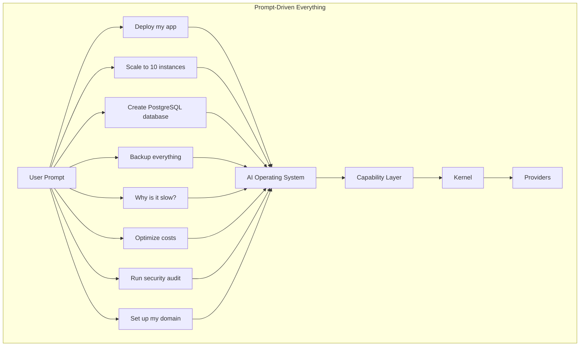
```mermaid
graph TB
    subgraph "Prompt-Driven Everything"
        PROMPT[User Prompt]

        DEPLOY["Deploy my app"]
        SCALE["Scale to 10 instances"]
        DB["Create PostgreSQL database"]
        BACKUP["Backup everything"]
        DIAG["Why is it slow?"]
        COST["Optimize costs"]
        SEC["Run security audit"]
        NET["Set up my domain"]

        PROMPT --> DEPLOY
        PROMPT --> SCALE
        PROMPT --> DB
        PROMPT --> BACKUP
        PROMPT --> DIAG
        PROMPT --> COST
        PROMPT --> SEC
        PROMPT --> NET

        DEPLOY --> AI[AI Operating System]
        SCALE --> AI
        DB --> AI
        BACKUP --> AI
        DIAG --> AI
        COST --> AI
        SEC --> AI
        NET --> AI

        AI --> CAP[Capability Layer]
        CAP --> K[Kernel]
        K --> P[Providers]
    end
```

### 9.3 Goal-Oriented Computing

Users describe **goals**, not **resources**.

| Goal-Based (CloudOS) | Resource-Based (Traditional) |
|-----------------------|------------------------------|
| "Deploy my app" | "Create an EC2 instance, configure security group, install nginx, set up load balancer..." |
| "Create a database" | "Provision an RDS instance, select instance class, configure VPC, set up parameter group..." |
| "Set up my domain" | "Create hosted zone, add A record, request ACM certificate, validate via email..." |
| "Backup my data" | "Create backup plan, select resources, configure retention, set schedule..." |
| "Monitor my app" | "Enable CloudWatch, create metric filter, set up alarm, configure SNS topic..." |

### 9.4 Autonomous Automation

CloudOS supports progressive levels of autonomy, from read-only to fully autonomous:

| Level | Name | Behavior | Who Approves? | User Base |
|-------|------|----------|---------------|-----------|
| 0 | **Manual** | AI suggests, user manually executes all operations | User | Beginners, compliance |
| 1 | **Suggest** | AI suggests actions, user confirms each | User | Default |
| 2 | **Auto-Confirm** | AI executes low-risk ops, asks for medium, blocks high | Configurable rules | Power users |
| 3 | **Semi-Autonomous** | AI executes routine ops, reports on exceptions | Pre-approved rules | DevOps teams |
| 4 | **Autonomous** | AI runs operations with defined guardrails | Policy boundaries | Enterprise |
| 5 | **Fully Autonomous** | AI manages infrastructure independently | Board-level policy | Future vision |

**Example: Level progression for database backup**

| Level | Behavior |
|-------|----------|
| 0 | AI: "It's time for the daily backup. Run: `cloudos db backup --name production`" → User types it manually |
| 1 | AI: "Ready to back up the production database. Confirm?" → User: "Yes" |
| 2 | AI: Auto-runs backup (low-risk, scheduled). Reports: "Backup completed in 45s, 2.3 GB stored" |
| 3 | AI: Auto-runs backup. Only reports if it fails. |
| 4 | AI: Runs backup. Also checks restore integrity, rotates backup logs, adjusts retention. |
| 5 | AI: Decides backup timing based on usage patterns, tests restores, maintains DR policy. |

---

## 10. AI Safety & Guardrails

### 10.1 Permission System

Every AI action is checked against the user's permissions before execution:

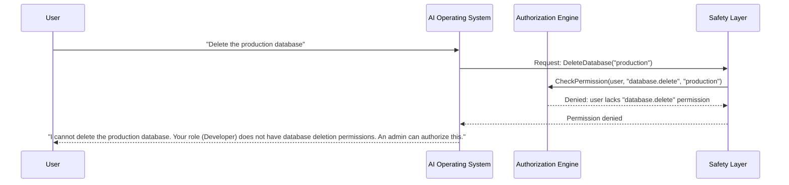
```mermaid
sequenceDiagram
    participant USER as User
    participant AIOS as AI Operating System
    participant AUTHZ as Authorization Engine
    participant SAFE as Safety Layer

    USER->>AIOS: "Delete the production database"

    AIOS->>SAFE: Request: DeleteDatabase("production")

    SAFE->>AUTHZ: CheckPermission(user, "database.delete", "production")
    AUTHZ-->>SAFE: Denied: user lacks "database.delete" permission

    SAFE-->>AIOS: Permission denied

    AIOS-->>USER: "I cannot delete the production database. Your role (Developer) does not have database deletion permissions. An admin can authorize this."
```

**Permission levels:**
| Level | Permissions | Example Operations |
|-------|-------------|-------------------|
| **Read** | View all resources | List deployments, view metrics, read logs |
| **Operate** | Manage non-destructive operations | Restart services, scale instances (within limits) |
| **Admin** | Full management within environment | Create/delete resources, manage configs |
| **Owner** | Full access including billing and users | Manage team, billing, organization settings |
| **Super Admin** | System-level access | Global policies, audit log management, provider configuration |

### 10.2 Human Approval

Certain operations always require human approval, regardless of autonomy level:

| Operation Category | Examples | Required Approval |
|--------------------|----------|------------------|
| **Data Destruction** | DELETE database, DROP table, DELETE bucket | Multi-party (2+ approvers) |
| **Security Changes** | Disable firewall, open public access, bypass auth | Security team |
| **Billing Changes** | Upgrade plan, increase spending cap | Finance / Owner |
| **Infrastructure Changes** | Delete production environment, change provider | Team lead |
| **Access Changes** | Add admin user, modify roles, disable MFA | Org admin |
| **Plugin Operations** | Install untrusted plugin, grant broad permissions | Security review |

### 10.3 Dry Run Mode

Every operation can be previewed before execution:

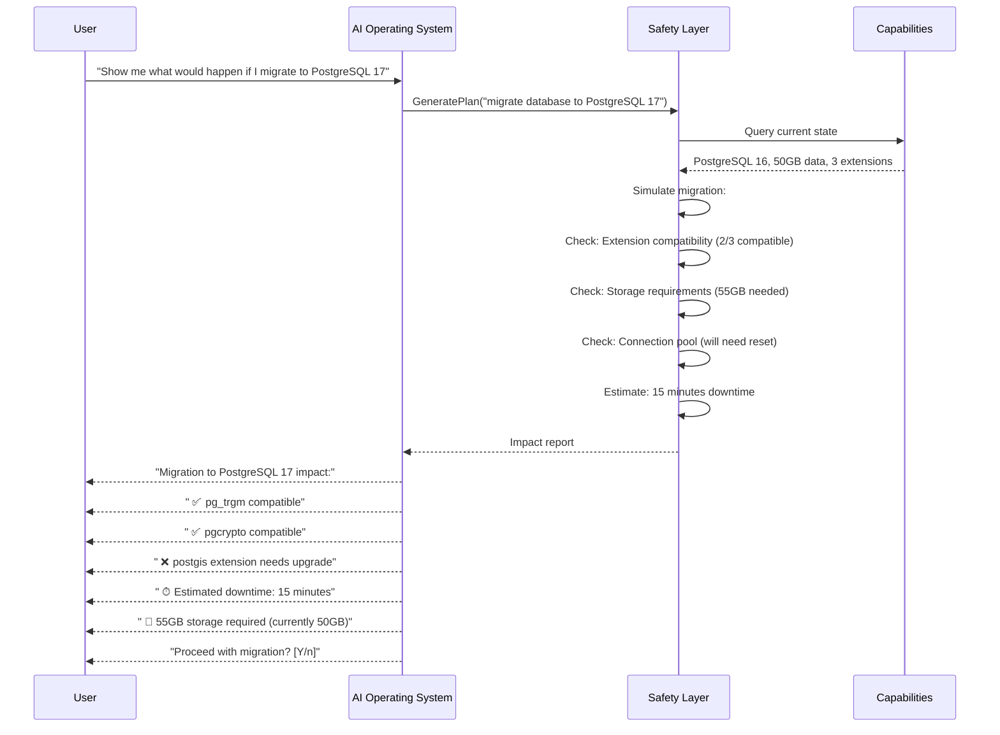
```mermaid
sequenceDiagram
    participant USER as User
    participant AIOS as AI Operating System
    participant SAFE as Safety Layer
    participant CAPS as Capabilities

    USER->>AIOS: "Show me what would happen if I migrate to PostgreSQL 17"

    AIOS->>SAFE: GeneratePlan("migrate database to PostgreSQL 17")

    SAFE->>CAPS: Query current state
    CAPS-->>SAFE: PostgreSQL 16, 50GB data, 3 extensions

    SAFE->>SAFE: Simulate migration:
    SAFE->>SAFE:   Check: Extension compatibility (2/3 compatible)
    SAFE->>SAFE:   Check: Storage requirements (55GB needed)
    SAFE->>SAFE:   Check: Connection pool (will need reset)
    SAFE->>SAFE:   Estimate: 15 minutes downtime

    SAFE-->>AIOS: Impact report

    AIOS-->>USER: "Migration to PostgreSQL 17 impact:"
    AIOS-->>USER: "  ✅ pg_trgm compatible"
    AIOS-->>USER: "  ✅ pgcrypto compatible"
    AIOS-->>USER: "  ❌ postgis extension needs upgrade"
    AIOS-->>USER: "  ⏱  Estimated downtime: 15 minutes"
    AIOS-->>USER: "  💾 55GB storage required (currently 50GB)"
    AIOS-->>USER: "Proceed with migration? [Y/n]"
```

### 10.4 Rollback

Every mutating operation has a rollback plan:

| Operation | Rollback Strategy | Recovery Time |
|-----------|-------------------|---------------|
| Deployment | Previous deployment is preserved, traffic switch | 10 seconds |
| Database migration | Transactional migration, can COMMIT or ROLLBACK | 30 seconds |
| Configuration change | Previous config is versioned, hot-reload revert | 1 second |
| Resource deletion | Soft-delete with configurable retention period | Instant |
| Provider change | Old provider kept active until new one is verified | 5 minutes |
| Plugin install | Previous version preserved, swap back | 2 seconds |

### 10.5 Confirmation Rules

The AI asks for confirmation based on configurable rules:

```yaml
# Confirmation configuration
ai:
  confirmations:
    # Always confirm these operations
    always_confirm:
      - database.delete
      - database.drop_table
      - storage.bucket.delete
      - compute.delete_environment
      - security.disable_firewall
      - billing.change_plan
      - auth.change_roles

    # Confirm based on environment
    environment_rules:
      production:
        confirm_all: true  # Confirm every operation in production
        require_approver: true  # Second person approval for mutations
      staging:
        confirm_destructive: true
      development:
        confirm_none: true  # No confirmation needed in dev

    # Confirm based on risk score
    risk_thresholds:
      confirm_at: 25  # Ask confirmation for risk >= 25
      block_at: 75    # Block and escalate for risk >= 75
      require_review_at: 90  # Require human review at 90+
```

### 10.6 Security Policies

```yaml
# Security policies enforced by the AI
ai:
  security:
    # Read-only mode for sensitive environments
    read_only_environments:
      - production
      - compliance

    # Prohibited operations
    prohibited_operations:
      - "DELETE FROM * WHERE 1=1"
      - "GRANT ALL PRIVILEGES"
      - public internet access to databases

    # Required checks before any mutation
    pre_mutation_checks:
      - verify_backup_exists
      - verify_capacity
      - verify_no_active_incidents
      - verify_maintenance_window

    # AI behavior restrictions
    restrictions:
      max_autonomous_actions_per_hour: 10
      max_approval_skip_for_same_operation: 3
      require_approval_escalation_after: 3  # 3rd same request needs manager
```

### 10.7 Sensitive Operations

| Sensitivity Level | Examples | AI Behavior |
|-------------------|----------|-------------|
| **Safe** | Read metrics, list resources, search logs | No confirmation, immediate |
| **Low Risk** | Restart service (non-production), scale down staging | Brief "OK?" confirmation |
| **Medium Risk** | Deploy to production, scale production, config change | Detailed plan → approval |
| **High Risk** | Delete resource, database migration, firewall change | Dry run → multi-party approval |
| **Critical** | Production database delete, security policy change, billing change | Offline approval, time delay |

### 10.8 Audit & Observability

Every AI interaction is recorded immutably:

```json
{
  "audit_id": "aud_abc123",
  "timestamp": "2026-06-29T14:00:00Z",
  "user": {
    "id": "user_xyz",
    "email": "alex@company.com",
    "role": "admin"
  },
  "request": {
    "surface": "cli",
    "input": "scale api to 10 instances",
    "parsed_intent": {
      "type": "manage",
      "resource": "compute",
      "action": "scale",
      "target": 10
    }
  },
  "plan": {
    "steps": [
      {
        "id": 1,
        "capability": "compute",
        "action": "Scale",
        "parameters": { "service": "api", "replicas": 10 }
      }
    ],
    "risk_score": 12,
    "estimated_cost": "$0.50/day increase"
  },
  "approval": {
    "required": true,
    "given_by": "auto_rule_low_risk",
    "timestamp": "2026-06-29T14:00:01Z"
  },
  "execution": {
    "status": "completed",
    "started_at": "2026-06-29T14:00:02Z",
    "completed_at": "2026-06-29T14:00:08Z",
    "result": "Service api scaled from 5 to 10 replicas"
  },
  "ai_model": {
    "provider": "anthropic",
    "model": "claude-4",
    "tokens_used": 1245,
    "latency_ms": 2340
  }
}
```

---

## 11. Voice Interface

CloudOS supports full voice-based cloud management.

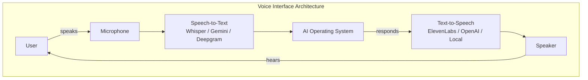
```mermaid
graph TB
    subgraph "Voice Interface Architecture"
        USER[User]
        MIC[Microphone]
        STT[Speech-to-Text<br/>Whisper / Gemini / Deepgram]
        AI_OS[AI Operating System]
        TTS[Text-to-Speech<br/>ElevenLabs / OpenAI / Local]
        SPEAKER[Speaker]

        USER -->|speaks| MIC
        MIC --> STT
        STT --> AI_OS
        AI_OS -->|responds| TTS
        TTS --> SPEAKER
        SPEAKER -->|hears| USER
    end
```

**Voice commands:**
- "Deploy my app" → builds and deploys
- "Scale up" → increases resources
- "What's the status?" → reads current state
- "Any alerts?" → reads active alerts
- "Run backup" → triggers backup
- "Why is it slow?" → diagnosis + recommendation

**Voice confirmation:**
- "Delete the staging database" → AI: "This will delete the staging database permanently. Say 'confirm' to proceed."
- User: "Confirm" → AI: "Staging database deleted. All associated backups have been cleaned up."

**Voice-first mobile experience:**
- Full parity with dashboard and CLI
- Optimized for one-handed operation
- Contextual suggestions based on current state
- Push-to-talk or always-listening mode (configurable)

---

## 12. Visual AI

CloudOS can understand screenshots, diagrams, logs, and architecture visuals.

### 12.1 Screenshot Understanding

Users can share screenshots and ask the AI to understand them:

| User Action | AI Response |
|-------------|-------------|
| Upload error screenshot | "I can see a database connection timeout error. PostgreSQL port 5432 is not responding. Here's how to fix it..." |
| Upload architecture diagram | "I can see your architecture: React frontend → Express API → PostgreSQL. Your load balancer is missing health check configuration." |
| Upload monitoring dashboard | "Your CPU is at 85% on API servers. The spike correlates with a deployment 20 minutes ago." |

### 12.2 Log Analysis

The AI can analyze log output, error messages, and stack traces:

```
User: "Here's my error log: [paste]
       What's wrong?"

AI: "I found the issue. Your database connection pool is exhausted:
    - 50 concurrent connections (max pool: 20)
    - 15 connections are stuck in 'idle in transaction'
    - This is likely caused by missing .end() calls in your API routes
    Recommendation: fix connection leaks in order-service.js, lines 45-78"
```

### 12.3 Diagram Understanding

The AI can generate and understand infrastructure diagrams:

```
User: "Generate an architecture diagram for my current setup"
AI: "Here's your architecture:
     [Mermaid diagram generated from actual infrastructure state]
     Your setup has:
     - 2 API servers behind a load balancer
     - 1 PostgreSQL primary with 2 read replicas
     - Redis cache cluster (3 nodes)
     - CDN for static assets
     Note: your database is at 78% CPU — consider adding a read replica."
```

### 12.4 Configuration Understanding

The AI can visualize and explain complex configurations:

```
User: "Explain my current deployment configuration"
AI: "Here's your deployment configuration visualized:
     [Auto-generated diagram]
     Key findings:
     - Auto-scaling threshold is 70% CPU (industry standard: 60-80% ✓)
     - Health check interval is 30s (recommended: 10-15s for production)
     - You have canary deployments enabled (5% traffic to new versions)
     - Rollback is automatic on health check failure
     Want me to adjust the health check interval?"
```

---

## 13. AI-First User Experience

### 13.1 Every Surface, One AI

```mermaid
graph TB
    subgraph "AI-First User Experience"
        AI_OS[AI Operating System]

        WEB[Web Dashboard<br/>Visual + AI chat embedded]
        CLI[CLI<br/>Interactive + batch commands]
        MOBILE[Mobile<br/>Voice + touch + push]
        DESKTOP[Desktop<br/>Native + system tray + AI]
        API[REST/GraphQL<br/>Programmatic AI access]

        WEB -->|"Deploy my app"| AI_OS
        CLI -->|"cloudos deploy"| AI_OS
        MOBILE -->|"Deploy my app"| AI_OS
        DESKTOP -->|"Deploy"| AI_OS
        API -->|"POST /ai/execute"| AI_OS

        AI_OS -->|"Deployed at url"| WEB
        AI_OS -->|"Deployed at url"| CLI
        AI_OS -->|"Deployed at url"| MOBILE
        AI_OS -->|"Deployed at url"| DESKTOP
        AI_OS -->|JSON response| API
    end
```

### 13.2 The Command Bar

Every surface has a command bar that accepts natural language. It is always accessible, always visible, and always the fastest way to do anything.

**Web Dashboard:** The command bar is the center of the top navigation. Type anything to deploy, diagnose, manage, or query.

**CLI:** The command bar IS the CLI. `cloudos` with no arguments opens an interactive prompt.

**Mobile:** The command bar is accessible by tapping the bottom center button. Supports voice input.

**Desktop:** The command bar pops up with Cmd+K (macOS) / Ctrl+K (Windows/Linux), just like Spotlight.

### 13.3 Progressive Disclosure

The AI shows beginners the minimum viable interface. Advanced features are progressively disclosed as needed:

```mermaid
graph LR
    subgraph "Progressive Disclosure"
        BEGINNER[Beginners see]
        BEGINNER_CONTENT["Command bar + 3 quick actions: Deploy, Database, Monitor"]

        INTERMEDIATE[Regular users see]
        INTERMEDIATE_CONTENT["Command bar + resource list + AI suggestions + basic metrics"]

        EXPERT[Power users see]
        EXPERT_CONTENT["Full dashboard + CLI + API access + advanced config + audit log + custom workflows"]

        BEGINNER -->|more experience| INTERMEDIATE
        INTERMEDIATE -->|more complexity| EXPERT
    end
```

### 13.4 AI-Assisted Everything

| Surface | AI Integration |
|---------|----------------|
| **Dashboard** | Every page has an AI assistant. Every action can be done via natural language. Every event has AI context. |
| **CLI** | `cloudos` with no args opens AI prompt. `cloudos deploy` auto-completes. Errors include AI-suggested fixes. |
| **Mobile** | Voice-first. Push notifications with AI context. Quick actions via widgets. |
| **Desktop** | System tray AI assistant. Cmd+K global command bar. Offline AI for basic operations. |
| **API** | Every API response includes `ai_suggestions` field. AI-generated summaries for list endpoints. |

---

## 14. Future Vision

### 14.1 Phase 2: Intelligent Operations (2027)

- **Predictive autoscaling**: AI predicts traffic patterns and scales proactively
- **Automated incident response**: AI diagnoses, triages, and resolves common incidents without human intervention
- **Cost forecasting**: AI predicts future costs with 95%+ accuracy and suggests optimizations
- **Multi-agent coordination**: Agents collaborate autonomously on complex workflows

### 14.2 Phase 3: Proactive Intelligence (2027-2028)

- **Anomaly detection**: AI learns normal patterns and alerts on deviations before they cause issues
- **Self-healing infrastructure**: AI detects and resolves common failure modes automatically
- **Capacity planning**: AI predicts resource needs 30/60/90 days ahead
- **Security threat hunting**: AI proactively scans for vulnerabilities and exploits
- **Voice becomes primary interface**: 50%+ of operations via voice

### 14.3 Phase 4: Autonomous Operations (2028-2029)

- **Autonomous day-to-day management**: AI handles 90%+ of routine operations
- **AI-generated runbooks**: AI creates, tests, and maintains operational runbooks
- **Cross-cloud optimization**: AI automatically distributes workloads across providers for optimal cost/performance
- **Natural language compliance**: AI understands compliance requirements and enforces them automatically
- **Contextual collaboration**: AI understands team context and coordinates team workflows

### 14.4 Phase 5: Organization-Level AI (2029-2030)

- **Multi-instance AI coordination**: AI coordinates across multiple CloudOS instances (multi-region, multi-org)
- **AI-driven architecture decisions**: AI suggests architectural improvements based on operational patterns
- **Self-evolving infrastructure**: infrastructure adapts to changing patterns without human input
- **Cross-organizational optimization**: AI finds optimization patterns across organizations and shares them (anonymized)

### 14.5 Phase 6: The Autonomous Cloud (2030+)

```mermaid
graph TB
    subgraph "2030+ — The Autonomous Cloud"
        USER[User: "Run my business"]
        AI[AI Operating System]
        OPTIMIZE[Self-Optimizing Infrastructure]
        PREDICT[Predictive Operations]
        HEAL[Self-Healing]
        EVOLVE[Self-Evolving Architecture]
        LEARN[Continuous Learning]
        ORCH[Cross-Cloud Orchestration]

        USER --> AI
        AI --> AI

        AI --> OPTIMIZE
        OPTIMIZE -->|learns| PREDICT
        PREDICT -->|prevents| HEAL
        HEAL -->|adapts| EVOLVE
        EVOLVE -->|improves| LEARN
        LEARN -->|spans| ORCH
        ORCH -->|feeds| AI
    end
```

**The end state:** A user describes their business goals in natural language. The AI Operating System:
- Designs the architecture
- Provisions the infrastructure
- Deploys the applications
- Monitors everything
- Optimizes costs continuously
- Heals failures automatically
- Evolves the architecture as needs change
- Spans multiple cloud providers
- Learns from every operation
- Reports only what matters

**The user's job is to describe what they want. The AI's job is to make it happen.**

---

## 15. Connection to Other Documents

| Document | Relationship |
|----------|-------------|
| [01_MASTER_SPEC.md](./01_MASTER_SPEC.md) | Defines AI as the primary interface (Principle #6), AI strategy (Section 15), and AI provider roadmap |
| [05_SYSTEM_ARCHITECTURE.md](./05_SYSTEM_ARCHITECTURE.md) | Defines the AI Orchestrator layer (Section 5.5), AI↔Capability communication (Section 11.3), and the AI request flow (Section 12.7) |
| [06_KERNEL_AND_PLUGIN_ARCHITECTURE.md](./06_KERNEL_AND_PLUGIN_ARCHITECTURE.md) | Defines the intent-driven flow (Section 8), dependency rules (AI only through Capabilities, Rule #6), and plugin system that AI agents use |
| [12_UI_SYSTEM.md](./12_UI_SYSTEM.md) | Defines the surfaces through which users interact with the AI Operating System — the dashboard is one of many AI clients |
| [13_PLUGIN_SYSTEM.md](./13_PLUGIN_SYSTEM.md) | Defines the plugin format that AI agents install, configure, and manage on behalf of users |
| [14_DATABASE.md](./14_DATABASE.md) | Defines the database storage that supports AI memory (PostgreSQL for structured, pgvector for vector) |
| [15_API.md](./15_API.md) | Defines the GraphQL API that the AI Operating System exposes to all surfaces |
| [16_SECURITY.md](./16_SECURITY.md) | Defines the security model that AI guardrails enforce — zero trust, RBAC, encryption, audit |
| [17_DEPLOYMENT.md](./17_DEPLOYMENT.md) | Defines the deployment tiers that affect which AI providers are available (e.g., local-only on air-gapped) |
| [20_ROADMAP.md](./20_ROADMAP.md) | Defines the phased delivery of AI features across all 6 phases |

---

> **Next:** [12_UI_SYSTEM.md](./12_UI_SYSTEM.md) — Design language, components, mobile/desktop UX
