# CloudOS Kernel

> **Document ID:** CLOUDOS-KERN-001  
> **Status:** v1.0 — Approved  
> **Classification:** Public — Open Source  
> **Last Updated:** 2026-06-29  
> **Audience:** Kernel Engineers, Platform Engineers, Systems Architects, Contributors, DevOps  
> **Depends On:** [01_MASTER_SPEC.md](./01_MASTER_SPEC.md), [05_SYSTEM_ARCHITECTURE.md](./05_SYSTEM_ARCHITECTURE.md), [06_KERNEL_AND_PLUGIN_ARCHITECTURE.md](./06_KERNEL_AND_PLUGIN_ARCHITECTURE.md), [07_AI_OPERATING_SYSTEM.md](./07_AI_OPERATING_SYSTEM.md)

---

## Table of Contents

1. [Mission & Design Goals](#1-mission--design-goals)
2. [Architecture Overview](#2-architecture-overview)
3. [Kernel Responsibilities](#3-kernel-responsibilities)
4. [What the Kernel Does NOT Do](#4-what-the-kernel-does-not-do)
5. [Kernel Subsystems](#5-kernel-subsystems)
   - [5.1 Kernel Process Manager (KPM)](#51-kernel-process-manager-kpm)
   - [5.2 Event Bus](#52-event-bus)
   - [5.3 Command Bus](#53-command-bus)
   - [5.4 Query Bus](#54-query-bus)
   - [5.5 Configuration Manager](#55-configuration-manager)
   - [5.6 Secrets Manager](#56-secrets-manager)
   - [5.7 Authentication Engine](#57-authentication-engine)
   - [5.8 Authorization Engine](#58-authorization-engine)
   - [5.9 Audit Engine](#59-audit-engine)
   - [5.10 Service Registry](#510-service-registry)
   - [5.11 Capability Registry](#511-capability-registry)
   - [5.12 Plugin Loader](#512-plugin-loader)
   - [5.13 Health Manager](#513-health-manager)
   - [5.14 Scheduler](#514-scheduler)
   - [5.15 Job Manager](#515-job-manager)
   - [5.16 Workflow Engine](#516-workflow-engine)
   - [5.17 State Manager](#517-state-manager)
   - [5.18 Resource Manager](#518-resource-manager)
   - [5.19 AI Coordinator](#519-ai-coordinator)
   - [5.20 Notification Manager](#520-notification-manager)
   - [5.21 Metrics & Telemetry](#521-metrics--telemetry)
   - [5.22 Logging Manager](#522-logging-manager)
   - [5.23 Network Manager](#523-network-manager)
   - [5.24 Deployment Coordinator](#524-deployment-coordinator)
   - [5.25 Permission Manager](#525-permission-manager)
   - [5.26 Dependency Injection Container](#526-dependency-injection-container)
6. [Kernel Lifecycle](#6-kernel-lifecycle)
   - [6.1 Boot Sequence](#61-boot-sequence)
   - [6.2 Startup Sequence](#62-startup-sequence)
   - [6.3 Initialization](#63-initialization)
   - [6.4 Plugin Discovery & Loading](#64-plugin-discovery--loading)
   - [6.5 Provider & Capability Registration](#65-provider--capability-registration)
   - [6.6 Health Checks & Ready State](#66-health-checks--ready-state)
   - [6.7 Shutdown Sequence](#67-shutdown-sequence)
   - [6.8 Recovery Mode](#68-recovery-mode)
   - [6.9 Safe Mode](#69-safe-mode)
   - [6.10 Maintenance Mode](#610-maintenance-mode)
7. [Kernel Communication](#7-kernel-communication)
   - [7.1 Internal Events](#71-internal-events)
   - [7.2 Commands](#72-commands)
   - [7.3 Queries](#73-queries)
   - [7.4 Signals](#74-signals)
   - [7.5 Notifications](#75-notifications)
   - [7.6 Message Bus Topology](#76-message-bus-topology)
   - [7.7 Async Jobs](#77-async-jobs)
   - [7.8 Synchronization](#78-synchronization)
8. [Configuration System](#8-configuration-system)
   - [8.1 Configuration Hierarchy](#81-configuration-hierarchy)
   - [8.2 Configuration Sources](#82-configuration-sources)
   - [8.3 Configuration Resolution](#83-configuration-resolution)
   - [8.4 Hot-Reload](#84-hot-reload)
9. [Security Model](#9-security-model)
   - [9.1 Kernel Security Principles](#91-kernel-security-principles)
   - [9.2 Permission Model](#92-permission-model)
   - [9.3 Isolation Boundaries](#93-isolation-boundaries)
   - [9.4 Sandbox Architecture](#94-sandbox-architecture)
   - [9.5 Audit Chain](#95-audit-chain)
   - [9.6 Plugin Signing & Verification](#96-plugin-signing--verification)
10. [Failure Recovery](#10-failure-recovery)
    - [10.1 Crash Recovery](#101-crash-recovery)
    - [10.2 Fallback Chains](#102-fallback-chains)
    - [10.3 Rollback Manager](#103-rollback-manager)
    - [10.4 Degraded Modes](#104-degraded-modes)
    - [10.5 Self-Healing](#105-self-healing)
    - [10.6 Data Integrity](#106-data-integrity)
11. [Performance Architecture](#11-performance-architecture)
    - [11.1 Memory Management](#111-memory-management)
    - [11.2 Caching Strategy](#112-caching-strategy)
    - [11.3 Concurrency Model](#113-concurrency-model)
    - [11.4 Background Processing](#114-background-processing)
    - [11.5 Performance Targets](#115-performance-targets)
12. [Kernel API](#12-kernel-api)
13. [Future Kernel Evolution](#13-future-kernel-evolution)
14. [Connection to Other Documents](#14-connection-to-other-documents)

---

## 1. Mission & Design Goals

### 1.1 Mission

The CloudOS Kernel is the **heart of the platform**. Everything else depends on it. Like the Linux kernel, it provides foundational services — process management, communication, configuration, security, and health — but has no awareness of what capabilities are running on top of it.

The Kernel is **not a backend**. The Kernel is an **operating system kernel** for cloud infrastructure.

```
Dashboard        CLI        Mobile        Desktop        Voice        REST API
    │             │           │              │             │              │
    └─────────────┴───────────┴──────────────┴─────────────┴──────────────┘
                                    │
                          CloudOS Kernel
                                    │
                             Capabilities
                                    │
                              Providers
                                    │
                              Execution
```

### 1.2 Design Goals

| # | Goal | Description | Target |
|---|------|-------------|--------|
| 1 | **Small** | Minimal trusted computing base — only what nothing else can provide | < 50MB binary |
| 2 | **Fast** | Boot in milliseconds, respond in microseconds | Boot < 500ms, IPC < 1ms |
| 3 | **Modular** | Every subsystem is swappable via interfaces | All subsystems use Go interfaces |
| 4 | **Cross-Platform** | Same binary runs on 7 platform tiers | Linux, macOS, Windows, ARM |
| 5 | **Plugin-First** | Everything beyond Kernel primitives is a plugin | Kernel has zero plugin imports |
| 6 | **Provider-Agnostic** | Kernel never knows about specific providers | No PostgreSQL, Docker, AWS references |
| 7 | **Secure** | Zero trust, defense in depth, encryption everywhere | SOC 2 / HIPAA ready |
| 8 | **Event-Driven** | All state changes flow through typed events | Event Bus is the nervous system |
| 9 | **AI-Native** | Kernel exposes hooks for AI coordination | AI Orchestrator is a first-class consumer |
| 10 | **Cloud-Native** | Designed for distributed, multi-node operation | NATS cluster, horizontal scaling |

---

## 2. Architecture Overview

```mermaid
graph TB
    subgraph "CloudOS Kernel — Complete Architecture"
        direction TB

        subgraph "Application & API Layer"
            API_GW[API Gateway<br/>GraphQL / REST / WebSocket]
            CLI[CLI]
            DASH[Dashboard]
            AI_OS[AI Operating System]
        end

        subgraph "Kernel — Internal Subsystems"
            direction TB

            subgraph "Lifecycle & Runtime"
                KPM[Kernel Process Manager]
                PL[Plugin Loader]
                HM[Health Manager]
                RM[Resource Manager]
            end

            subgraph "Communication"
                EB[Event Bus<br/>NATS JetStream]
                CB[Command Bus]
                QB[Query Bus]
                NB[Notification Bus]
            end

            subgraph "Configuration & State"
                CFG[Configuration Manager]
                SEC[Secrets Manager]
                SM[State Manager]
                DI[Dependency Injection Container]
            end

            subgraph "Security"
                AUTH[Authentication Engine]
                AUTHZ[Authorization Engine]
                PERM[Permission Manager]
                AUDIT[Audit Engine]
            end

            subgraph "Registry"
                SR[Service Registry]
                CR[Capability Registry]
            end

            subgraph "Scheduling & Workflow"
                SCHED[Scheduler]
                JM[Job Manager]
                WE[Workflow Engine]
            end

            subgraph "Coordination"
                AI_COORD[AI Coordinator]
                DEPLOY_COORD[Deployment Coordinator]
                NET_MGR[Network Manager]
                NOTIF_MGR[Notification Manager]
            end

            subgraph "Observability"
                METRICS[Metrics & Telemetry]
                LOG[Logging Manager]
            end
        end

        subgraph "Capability Layer"
            COMP[Compute Capability]
            STOR[Storage Capability]
            DB[Database Capability]
            AI_CAP[AI Capability]
            ID[Identity Capability]
            NET[Networking Capability]
        end

        subgraph "Provider Layer"
            DOCKER[Docker Provider]
            S3[S3 Provider]
            PG[PostgreSQL Provider]
            OAI[OpenAI Provider]
            CF[Cloudflare Provider]
        end

        subgraph "Platform Tiers"
            PI[Raspberry Pi]
            LAP[Laptop / VPS]
            BM[Bare Metal]
            K8S[Kubernetes]
        end

        API_GW --> KPM
        CLI --> KPM
        DASH --> KPM
        AI_OS --> KPM

        KPM --> HM
        KPM --> PL
        HM --> RM

        KPM --> EB
        EB --> CB
        EB --> QB
        EB --> NB

        CFG --> SEC
        CFG --> DI

        AUTH --> AUTHZ
        AUTHZ --> PERM
        PERM --> AUDIT

        PL --> SR
        PL --> CR

        SCHED --> JM
        JM --> WE

        CB --> AI_COORD
        CB --> DEPLOY_COORD
        NET_MGR --> EB
        NOTIF_MGR --> EB

        EB --> METRICS
        EB --> LOG

        CR --> COMP
        CR --> STOR
        CR --> DB
        CR --> AI_CAP
        CR --> ID
        CR --> NET

        COMP --> DOCKER
        STOR --> S3
        DB --> PG
        AI_CAP --> OAI
        NET --> CF

        KPM -.->|runs on| PI
        KPM -.->|runs on| LAP
        KPM -.->|runs on| BM
        KPM -.->|runs on| K8S
    end

    style KPM fill:#1a1a2e,stroke:#e94560,stroke-width:3px
    style EB fill:#1a1a2e,stroke:#e94560,stroke-width:2px
    style DI fill:#1a1a2e,stroke:#e94560,stroke-width:2px
    style CR fill:#16213e,stroke:#0f3460,stroke-width:2px
    style SR fill:#16213e,stroke:#0f3460,stroke-width:2px
```

---

## 3. Kernel Responsibilities

The Kernel is responsible for exactly these things — nothing more:

| # | Responsibility | Description | Subsystem |
|---|---------------|-------------|-----------|
| 1 | **Process Management** | Start, stop, restart all Kernel subsystems and external processes | Kernel Process Manager |
| 2 | **Event Distribution** | Typed, ordered, durable event delivery between all components | Event Bus |
| 3 | **Command Routing** | Route imperative commands to the correct handler | Command Bus |
| 4 | **Query Handling** | Route read-only queries to the correct data source | Query Bus |
| 5 | **Configuration** | Hierarchical, hot-reloadable configuration management | Configuration Manager |
| 6 | **Secrets Management** | Encrypted storage and injection of sensitive values | Secrets Manager |
| 7 | **Authentication** | Identity verification — JWT, OAuth, WebAuthn, API keys | Authentication Engine |
| 8 | **Authorization** | Permission evaluation — RBAC with ABAC extensions | Authorization Engine |
| 9 | **Audit Logging** | Immutable, cryptographically linked audit trail | Audit Engine |
| 10 | **Service Discovery** | Real-time directory of all active services and endpoints | Service Registry |
| 11 | **Capability Registration** | Registry of all registered capability interfaces and providers | Capability Registry |
| 12 | **Plugin Loading** | Plugin discovery, verification, loading, sandboxing | Plugin Loader |
| 13 | **Health Monitoring** | Continuous health checks of all subsystems and plugins | Health Manager |
| 14 | **Resource Limits** | CPU, memory, disk, and network quota enforcement | Resource Manager |
| 15 | **Scheduling** | Cron jobs, delayed tasks, recurring operations | Scheduler |
| 16 | **Job Management** | Async job queue, progress tracking, retries | Job Manager |
| 17 | **Workflows** | Multi-step workflow orchestration, state machines | Workflow Engine |
| 18 | **State Management** | Persistence of Kernel state — PostgreSQL primary, SQLite fallback | State Manager |
| 19 | **AI Coordination** | Bridge between AI Orchestrator and Kernel capabilities | AI Coordinator |
| 20 | **Notifications** | Internal and external notification delivery | Notification Manager |
| 21 | **Metrics** | OpenTelemetry metrics, traces, and structured logging | Metrics & Telemetry |
| 22 | **Logging** | Structured log collection, aggregation, routing | Logging Manager |
| 23 | **Network Management** | Internal networking primitives — sockets, ports, interfaces | Network Manager |
| 24 | **Deployment Coordination** | Coordinate multi-step deployment operations | Deployment Coordinator |
| 25 | **Permission Management** | Role and policy management for all actors | Permission Manager |
| 26 | **Dependency Injection** | Service lifecycle and dependency resolution | DI Container |

---

## 4. What the Kernel Does NOT Do

This list is as important as what the Kernel does. Every item below is explicitly **outside** the Kernel's responsibility:

| Not in Kernel | Where It Lives | Why |
|---------------|---------------|-----|
| Run user workloads (containers, functions, VMs) | Compute Capability → Provider | Workloads change rapidly; Kernel must be stable |
| Store user files or application data | Storage Capability → Provider | Storage providers change; Kernel must be agnostic |
| Provision databases | Database Capability → Provider | Database engines proliferate; Kernel should not track them |
| Execute AI model inference | AI Capability → Provider | AI providers evolve weekly; Kernel should not couple |
| Send emails or SMS | Email Capability / Messaging Capability → Provider | Communication services are external integrations |
| Render dashboard UI panels | Application Layer / UI Extensions | UI changes at a different cadence than Kernel |
| Process payments or billing invoices | Billing Capability → Provider | Payment processing is a business domain |
| Implement business logic for any domain | Capability interfaces → Providers | Business logic changes independently of Kernel |
| Import any plugin, capability, or provider code | Plugin Loader loads dynamically | Kernel must remain import-free of extensions |
| Know about any specific cloud provider (AWS, GCP, Azure) | Provider Layer | Kernel has zero cloud-provider awareness |
| Know about any specific database (PostgreSQL, MySQL) | Database Capability → Provider | Kernel uses SQLite for its own state only |
| Know about any specific AI model (GPT-4, Claude) | AI Capability → Provider | AI is abstracted behind the AI Capability |
| Serve user-facing web pages | API Gateway / Dashboard | User-facing concerns belong in applications |
| Handle user sessions beyond authentication tokens | Auth Engine only manages tokens | Session management belongs in applications |

---

## 5. Kernel Subsystems

### 5.1 Kernel Process Manager (KPM)

**Purpose:** The KPM is the Kernel's orchestrator. It manages the lifecycle of all Kernel subsystems and external processes. It ensures components start in the correct order during boot, shut down gracefully during termination, and are restarted automatically on failure.

**Responsibilities:**
- Bootstrap all Kernel subsystems in dependency order
- Spawn, monitor, and restart plugin processes
- Enforce resource limits (CPU, memory, file descriptors) on child processes
- Detect crashes via process exit signals and gRPC heartbeat failures
- Implement automatic restart with exponential backoff
- Escalate persistent failures to Health Manager → AI Orchestrator
- Coordinate graceful shutdown with drain timeouts

**Dependency graph at boot:**

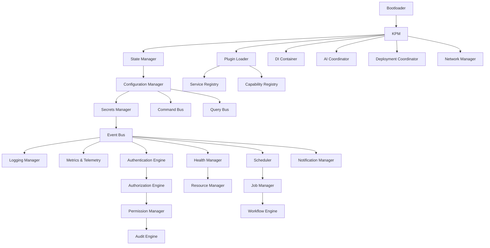

**Restart policy:**

| Failure Count | Window | Action |
|---------------|--------|--------|
| 1 | 60s | Immediate restart |
| 2 | 60s | Restart after 1s delay |
| 3 | 60s | Restart after 5s delay |
| 4 | 60s | Restart after 15s delay |
| 5 | 60s | Escalate to Health Manager → mark plugin as dead |

### 5.2 Event Bus

**Purpose:** The Event Bus is the central nervous system of CloudOS. All asynchronous communication between components flows through it — state changes, lifecycle events, audit signals, health updates. It provides at-least-once delivery, ordered delivery per partition, and durable storage for replay.

**Responsibilities:**
- Publish typed events from any component to named subjects
- Support push and pull consumer models
- Durable message storage with configurable retention
- At-least-once delivery with exactly-once semantics for critical streams
- Ordered delivery within a subject partition
- Dead-letter queues for failed message processing
- Schema validation against Schema Registry

**Event structure:**

```json
{
  "specversion": "1.0",
  "id": "evt_abc123",
  "source": "/kernel/event-bus",
  "type": "kernel.subsystem.started",
  "subject": "Configuration Manager",
  "time": "2026-06-29T12:00:00Z",
  "datacontenttype": "application/json",
  "data": { "subsystem": "config-manager", "status": "ready", "duration_ms": 45 },
  "kernelmeta": {
    "node_id": "node-1",
    "cluster_id": "cls-prod",
    "trace_id": "trace_xyz",
    "span_id": "span_abc"
  }
}
```

**Subject namespaces:**

| Namespace | Purpose | Retention | Example |
|-----------|---------|-----------|---------|
| `kernel.lifecycle.*` | Kernel boot/shutdown/health events | 7 days | `kernel.lifecycle.boot.complete` |
| `kernel.config.*` | Configuration changes | 90 days | `kernel.config.changed` |
| `kernel.auth.*` | Authentication and authorization events | 1 year | `kernel.auth.login.failed` |
| `kernel.audit.*` | Audit events (immutable) | 7 years | `kernel.audit.mutation.recorded` |
| `kernel.scheduler.*` | Scheduled task events | 30 days | `kernel.scheduler.task.started` |
| `kernel.health.*` | Health state transitions | 30 days | `kernel.health.degraded` |
| `capability.*` | Capability-level events | 30 days | `capability.compute.deployment.completed` |
| `plugin.*` | Plugin lifecycle events | 30 days | `plugin.loaded`, `plugin.crashed` |

### 5.3 Command Bus

**Purpose:** The Command Bus routes imperative commands from any source (AI Orchestrator, API Gateway, CLI, Scheduler) to the appropriate capability or Kernel subsystem. Commands represent requests for action.

**Responsibilities:**
- Route commands to registered handlers
- Validate commands against schema before routing
- Support synchronous (request-response) and asynchronous (fire-and-forget) commands
- Implement command idempotency keys for safe retries
- Track command status (received, processing, completed, failed)
- Provide command history for audit and debugging

**Command structure:**

```json
{
  "specversion": "1.0",
  "id": "cmd_def456",
  "type": "command.deploy.application",
  "source": "/ai-orchestrator",
  "time": "2026-06-29T12:05:00Z",
  "idempotency_key": "dep_789_20260629",
  "datacontenttype": "application/json",
  "data": {
    "application_id": "app_789",
    "version": "v43",
    "environment": "production"
  },
  "auth": {
    "actor": "user_abc",
    "session_id": "sess_xyz",
    "permissions_checked": ["application.deploy"]
  }
}
```

### 5.4 Query Bus

**Purpose:** The Query Bus routes read-only queries to the appropriate data source. Queries never cause side effects.

**Responsibilities:**
- Route queries to registered query handlers
- Validate query structure
- Support caching with TTL-based invalidation
- Enforce read-only execution (no mutations allowed)
- Paginate and filter results
- Provide query latency metrics

### 5.5 Configuration Manager

**Purpose:** Provides a unified, hierarchical configuration system. Configuration is validated against JSON Schema, hot-reloaded on change, and audited for every mutation.

**Responsibilities:**
- Store and retrieve configuration values
- Hierarchical resolution (global → org → project → app → plugin)
- JSON Schema validation for every configuration key
- Hot-reload: publish change events on update
- Change history with who-changed-what-and-when
- Default injection for unset values
- Export/import for backup and migration

**Configuration levels:**

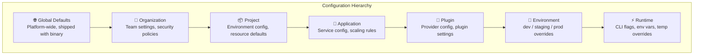

**Resolution rule:** More specific levels override less specific ones. A value set at `runtime` overrides `environment`, which overrides `plugin`, and so on.

### 5.6 Secrets Manager

**Purpose:** Provides secure storage, rotation, and injection of sensitive values (API keys, passwords, tokens, certificates). Secrets are encrypted at rest and in transit, and are never logged or displayed after creation.

**Responsibilities:**
- Encrypted storage using AES-256-GCM
- Automatic secret rotation on configurable schedules
- Secret injection into plugin environments at startup
- Access audit logging for every read
- Version tracking with rollback support
- Integration with external vaults (HashiCorp Vault, AWS Secrets Manager)

### 5.7 Authentication Engine

**Purpose:** Verifies identity. Supports multiple authentication methods through the Identity Capability interface.

**Responsibilities:**
- Verify credentials against configured identity providers
- Issue JWT access tokens (short-lived, 15 min default)
- Issue refresh tokens (long-lived, 7 day default, rotation on use)
- Validate tokens on every API request
- Rate-limit failed login attempts
- Session management — list, revoke, audit

### 5.8 Authorization Engine

**Purpose:** Determines whether an authenticated actor is permitted to perform an action on a resource. Implements RBAC with ABAC extensions.

**Responsibilities:**
- Evaluate access requests against policies
- Role-based permissions (roles → permissions)
- Attribute-based conditions (time, IP, resource tags)
- Policy inheritance (organization → project → resource)
- Deny by default
- Policy caching for fast evaluation

### 5.9 Audit Engine

**Purpose:** Provides an immutable, cryptographically verifiable record of every significant operation.

**Responsibilities:**
- Record all mutation events from the Event Bus
- Append-only storage with cryptographic chaining
- Integrity verification (detect tampering)
- Search and export via API
- Configurable retention policies
- Real-time stream to SIEM systems

**Audit record structure:**

```json
{
  "audit_id": "aud_001",
  "prev_hash": "sha256:abc123...",
  "hash": "sha256:def456...",
  "timestamp": "2026-06-29T12:00:00Z",
  "type": "config.update",
  "actor": { "id": "user_abc", "type": "user" },
  "resource": { "type": "config", "id": "capabilities.storage.provider" },
  "action": "update",
  "changes": { "from": "local", "to": "s3" },
  "result": "success",
  "node_id": "node-1"
}
```

### 5.10 Service Registry

**Purpose:** Maintains a real-time directory of all active services, plugins, and their network endpoints within a CloudOS Kernel instance.

**Responsibilities:**
- Register services with gRPC/HTTP endpoints and capabilities
- Deregister on graceful shutdown
- Health-aware lookups (only return healthy instances)
- Watch-based subscription for change notifications
- Metadata storage (version, capabilities, labels)

### 5.11 Capability Registry

**Purpose:** The central registry of all capability interfaces and their registered providers. The Kernel uses this to resolve capability requests to the correct provider.

**Responsibilities:**
- Register capability interfaces (define what a capability can do)
- Register provider implementations (who implements it)
- Resolve capability requests to active providers
- Track capability versions and compatibility
- Manage provider priority and failover chains
- Validate capability contracts at registration time

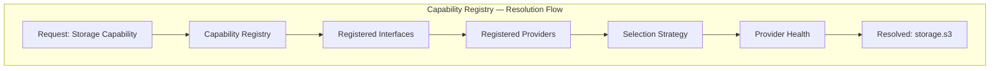

**Registration record:**

```json
{
  "capability": "storage",
  "version": "2.0.0",
  "providers": [
    {
      "name": "storage.s3",
      "status": "active",
      "health": "healthy",
      "version": "1.2.0",
      "features": ["buckets", "presigned-urls", "multipart", "lifecycle"],
      "priority": 1,
      "config": { "region": "us-east-1", "bucket_prefix": "cloudos" }
    },
    {
      "name": "storage.local",
      "status": "active",
      "health": "healthy",
      "version": "1.0.0",
      "features": ["buckets", "objects"],
      "priority": 100,
      "config": { "path": "/var/cloudos/storage" }
    }
  ],
  "selection_strategy": "failover"
}
```

### 5.12 Plugin Loader

**Purpose:** Discovers, verifies, loads, and manages plugins. Plugins are the packaging format for capabilities and providers.

**Responsibilities:**
- Scan plugin directories for `.cosp` packages
- Verify plugin signatures against the trust store
- Parse plugin manifests
- Create sandboxed execution environments (WASM / Native / HTTP)
- Establish gRPC communication channels
- Register plugin-provided capabilities with the Capability Registry
- Monitor plugin resource usage
- Unload plugins gracefully

### 5.13 Health Manager

**Purpose:** Provides continuous health checking for all Kernel subsystems, plugins, and infrastructure dependencies.

**Responsibilities:**
- Periodic health checks (gRPC ping, TCP, HTTP) every 5 seconds
- Health status aggregation into a cluster-wide view
- Degradation detection (latency spikes, error rate increases)
- Alert triggering via Event Bus
- Self-healing coordination (auto-restart unhealthy plugins)
- Health data exposure for dashboard and AI

### 5.14 Scheduler

**Purpose:** Handles time-based execution of tasks — cron jobs, one-time delayed tasks, recurring maintenance, workflow triggers.

**Responsibilities:**
- Cron expression parsing and validation
- Task scheduling with timezone support
- Execution history and status tracking
- Missed execution detection and recovery
- Task dependency management

### 5.15 Job Manager

**Purpose:** Manages asynchronous job execution with progress tracking, retries, and dead-letter handling.

**Responsibilities:**
- Queue jobs for async execution
- Track job progress and status
- Retry failed jobs with exponential backoff
- Dead-letter queue for permanently failed jobs
- Job cancellation and timeout
- Job history for audit

**Job states:**

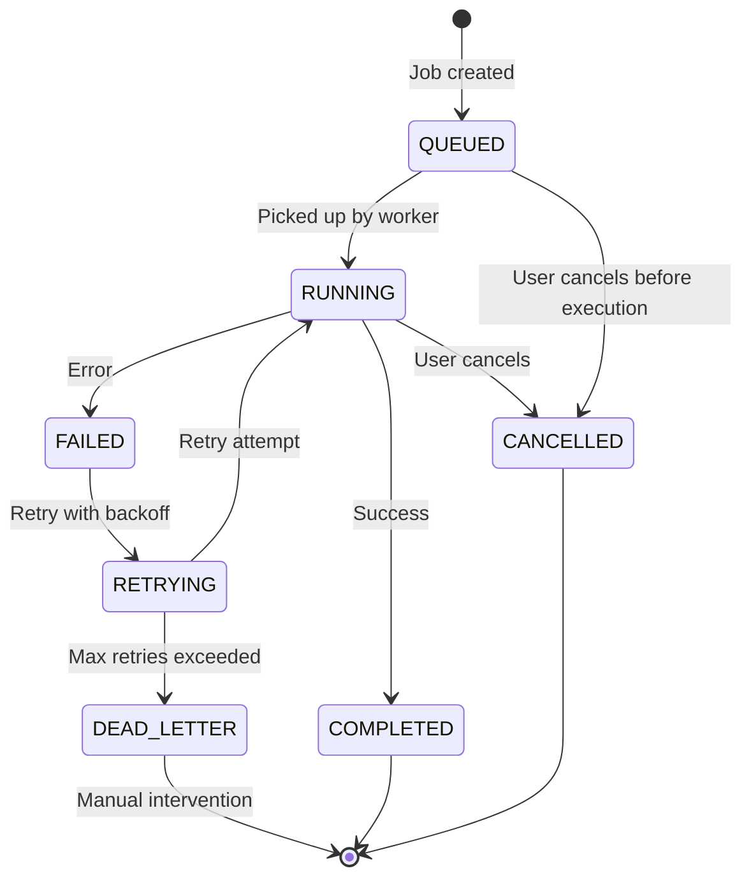

### 5.16 Workflow Engine

**Purpose:** Orchestrates multi-step workflows — sequences of operations that span multiple capabilities and require coordination.

**Responsibilities:**
- Define workflows as step sequences with dependencies
- Execute steps in order (parallel where possible)
- Handle step failures with configurable rollback
- Maintain workflow state for long-running operations
- Support human-in-the-loop approval steps
- Provide real-time workflow progress

### 5.17 State Manager

**Purpose:** Manages persistent Kernel state. PostgreSQL is the primary store; SQLite is the embedded fallback for single-node and resource-constrained deployments.

**Responsibilities:**
- ACID-compliant persistence for all Kernel state
- Connection pooling for concurrent access
- Schema migration management
- Read replica support for query scaling
- Automatic failover between PostgreSQL and SQLite

### 5.18 Resource Manager

**Purpose:** Tracks and enforces resource limits across all Kernel subsystems and plugins.

**Responsibilities:**
- Track CPU, memory, disk, and network usage per plugin
- Enforce configured resource limits
- Report resource pressure to Health Manager
- Handle out-of-memory scenarios gracefully
- Provide resource usage metrics

### 5.19 AI Coordinator

**Purpose:** Bridges the AI Operating System to the Kernel. The AI Coordinator exposes Kernel operations as structured tools that the AI can call, while maintaining the abstraction that the AI never calls providers directly.

**Responsibilities:**
- Expose Kernel operations as AI-callable tools
- Translate AI-decided actions into Kernel commands
- Provide AI with real-time Kernel state and context
- Enforce AI permission boundaries
- Log all AI-initiated Kernel operations

**Tools exposed to AI:**

| Tool | Description | Permission Required |
|------|-------------|-------------------|
| `read_config` | Read configuration values | Read |
| `list_resources` | List all resources | Read |
| `get_health` | Get system health status | Read |
| `execute_command` | Execute a Kernel command | Depends on command |
| `schedule_task` | Create a scheduled task | Schedule |
| `install_plugin` | Install a new plugin | Plugin Manage |
| `update_config` | Update configuration values | Config Manage |

### 5.20 Notification Manager

**Purpose:** Delivers notifications to users through configured channels — in-app, email, push, SMS, webhook.

**Responsibilities:**
- Route notifications through configured channels
- Template-based notification rendering
- Delivery status tracking
- Rate limiting per channel
- Channel failover (email fails → SMS)
- Notification preferences per user

### 5.21 Metrics & Telemetry

**Purpose:** Collects, aggregates, and exports metrics, traces, and structured logs from all Kernel subsystems.

**Responsibilities:**
- OpenTelemetry instrumentation for all subsystems
- metrics collection (counters, gauges, histograms)
- Distributed tracing with trace context propagation
- Structured log emission
- Export to configured backends (Prometheus, Grafana, Datadog)

**Default metrics emitted:**

| Metric | Type | Description |
|--------|------|-------------|
| `kernel.boot.duration_ms` | Histogram | Time to reach ready state |
| `kernel.subsystem.status` | Gauge | 1=healthy, 0=degraded, -1=down |
| `kernel.eventbus.messages_published` | Counter | Total events published |
| `kernel.eventbus.messages_delivered` | Counter | Total events delivered |
| `kernel.eventbus.latency_ms` | Histogram | Event delivery latency |
| `kernel.auth.login_success` | Counter | Successful logins |
| `kernel.auth.login_failure` | Counter | Failed logins |
| `kernel.config.changes` | Counter | Configuration mutations |
| `kernel.plugin.health_status` | Gauge | Per-plugin health score |
| `kernel.scheduler.tasks_executed` | Counter | Scheduled task executions |

### 5.22 Logging Manager

**Purpose:** Provides structured, leveled logging for all Kernel components with log aggregation and routing.

**Responsibilities:**
- Structured JSON log emission
- Log levels: debug, info, warn, error, fatal
- Log routing to stdout/file/network
- Log aggregation and deduplication
- Correlation IDs for request tracing
- PII redaction

### 5.23 Network Manager

**Purpose:** Manages Kernel-level networking — socket allocation, port management, internal service mesh, and network policy enforcement.

**Responsibilities:**
- Allocate and manage ports for plugins
- Configure internal service mesh for plugin↔Kernel communication
- Enforce network policies (which plugins can communicate)
- Manage Unix domain sockets for local plugin communication
- Configure mTLS for remote plugin communication

### 5.24 Deployment Coordinator

**Purpose:** Coordinates multi-step deployment operations that span multiple capabilities (compute + database + networking + DNS).

**Responsibilities:**
- Receive deployment commands
- Decompose into capability-level operations
- Orchestrate parallel capability operations
- Handle partial failures with rollback
- Provide real-time deployment status

### 5.25 Permission Manager

**Purpose:** Manages roles, permissions, and policies for all actors in the system (users, plugins, services, agents).

**Responsibilities:**
- Define permission schemas per resource type
- Manage role definitions and assignments
- Evaluate policy inheritance
- Support custom policies per organization
- Validate permission declarations at plugin install time

### 5.26 Dependency Injection Container

**Purpose:** Manages the lifecycle and dependency graph of all Kernel subsystems and registered services.

**Responsibilities:**
- Resolve subsystem dependencies at boot
- Ensure singleton lifecycle for Kernel subsystems
- Support scoped lifetimes for per-request services
- Detect circular dependencies at boot
- Provide service locator for dynamic resolution

---

## 6. Kernel Lifecycle

### 6.1 Boot Sequence

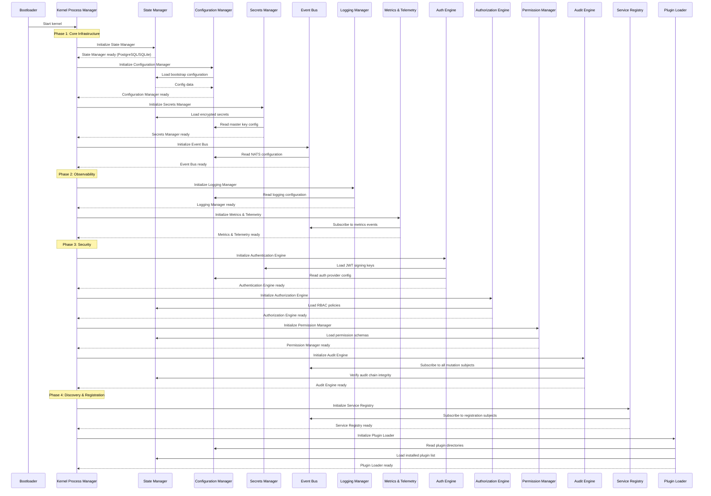

### 6.2 Startup Sequence

Following the boot sequence, the startup sequence loads plugins, registers capabilities, and transitions to ready state:

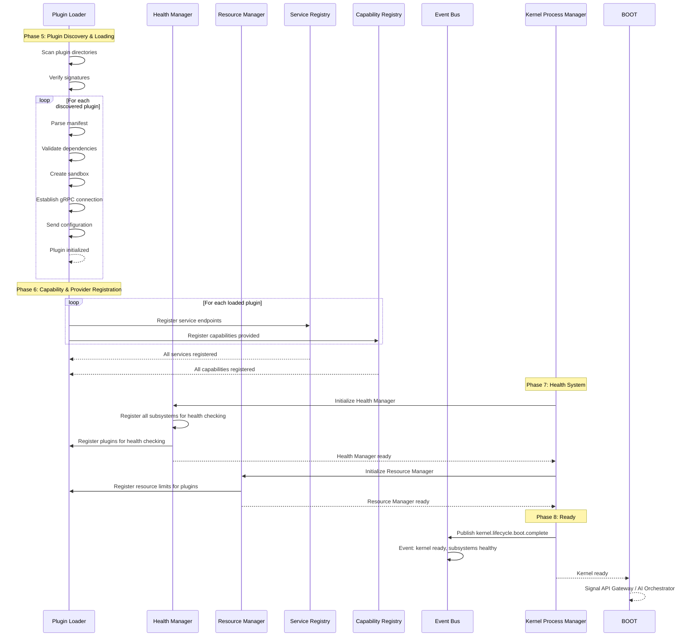

### 6.3 Initialization

The initialization phase covers the period from kernel process start to the ready state. During this phase:

1. **Subsystems initialize** in strict dependency order
2. **State migrations** run (schema versioning, auto-migrate on upgrade)
3. **Plugin manifests** are parsed and validated
4. **Capability contracts** are verified
5. **Health checks** are registered

**Initialization timeout:** 30 seconds total. If any critical subsystem fails to initialize within this window, the Kernel enters Recovery Mode.

### 6.4 Plugin Discovery & Loading

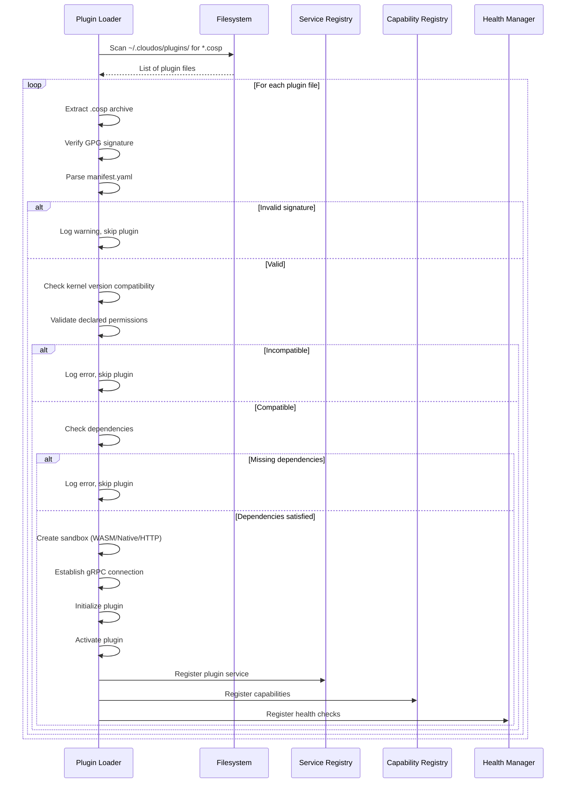

### 6.5 Provider & Capability Registration

After plugins are loaded, each plugin registers its capabilities with the Capability Registry:

```json
// Registration request from plugin to Kernel
{
  "plugin_id": "storage.minio",
  "capabilities": [
    {
      "name": "storage",
      "version": "2.0.0",
      "features": ["buckets", "objects", "presigned-urls", "multipart"],
      "contract": {
        "methods": ["CreateBucket", "PutObject", "GetObject", "DeleteObject", "PresignURL"],
        "version_compatibility": ">=1.0.0, <3.0.0"
      }
    }
  ],
  "endpoints": {
    "grpc": "unix:///tmp/cloudos/plugins/storage.minio.sock",
    "health": "unix:///tmp/cloudos/plugins/storage.minio.health"
  }
}
```

### 6.6 Health Checks & Ready State

Once all subsystems and plugins are loaded and health-checked, the Kernel enters the **Ready** state:

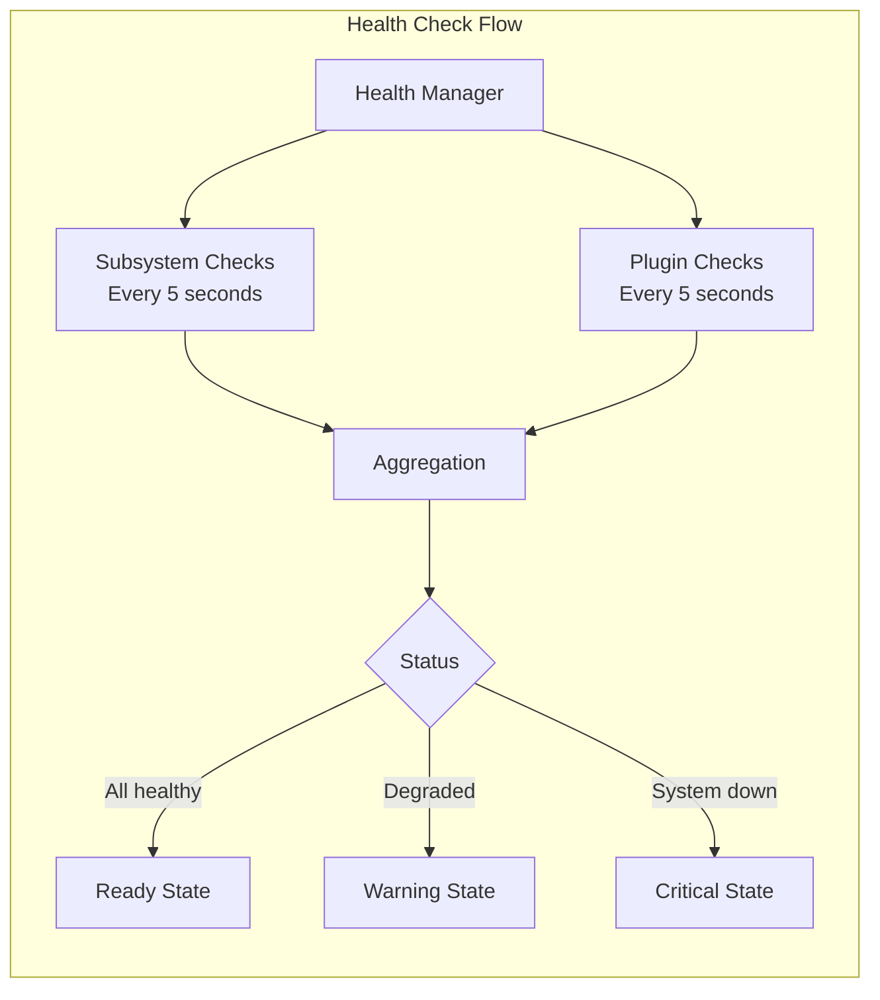

**Ready state conditions:**
- All 26 Kernel subsystems initialized and healthy
- All configured plugins loaded and healthy
- Event Bus connected to NATS cluster
- State Store connected
- API Gateway is accepting connections

### 6.7 Shutdown Sequence

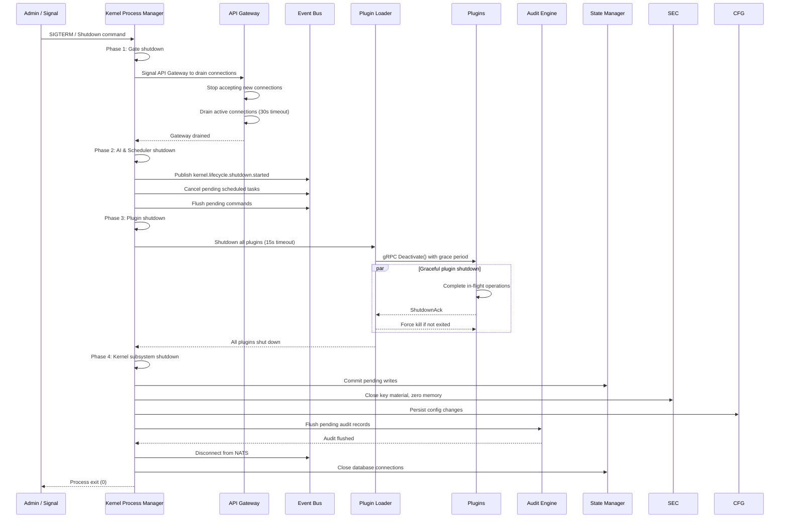

**Shutdown guarantees:**
| Resource | Guarantee | Timeout |
|----------|-----------|---------|
| API connections | Drained gracefully, no in-flight requests lost | 30s |
| Plugin operations | Complete in-flight, graceful deactivation | 15s |
| Audit records | All pending records flushed | 5s |
| Config changes | Persisted before exit | 5s |
| Event Bus | Published shutdown event before disconnect | 2s |
| Secrets | Key material zeroed in memory | Immediate |

### 6.8 Recovery Mode

The Kernel enters Recovery Mode when it detects corruption or inconsistency during boot:

**Triggers:**
- Audit chain integrity check fails (tamper detected)
- State Store migration fails
- Configuration schema validation fails
- Secrets decryption fails

**Recovery Mode behavior:**
- Load minimal subsystems only (State Manager, Config, Secrets, Audit)
- Do not load plugins
- Do not start API Gateway
- Publish `kernel.lifecycle.recovery` event
- Expose recovery API on localhost only
- Allow administrator to inspect and repair state
- Manual `cloudos kernel repair` commands available
- Once repaired, restart into normal boot

### 6.9 Safe Mode

The Kernel enters Safe Mode when non-critical failures occur during boot:

**Triggers:**
- Plugin fails to load (non-critical)
- Optional subsystem fails (e.g., Metrics exporter)
- Non-essential configuration is missing

**Safe Mode behavior:**
- Load all critical subsystems
- Skip failed optional components
- Log warnings for each skipped component
- Continue to ready state with degraded status
- AI Orchestrator is notified of degradation
- Auto-retry failed components on configurable interval

### 6.10 Maintenance Mode

The Kernel enters Maintenance Mode for planned updates:

**Triggers:**
- `cloudos kernel maintenance --on` command
- Scheduled maintenance window
- Plugin update batch operation

**Maintenance Mode behavior:**
- API Gateway returns 503 with maintenance notice
- Active operations are allowed to complete
- New operations are queued
- In-flight AI requests complete
- After drain, Kernel performs maintenance
- On completion, normal mode resumes
- AI Orchestrator notifies users of completed maintenance

---

## 7. Kernel Communication

### 7.1 Internal Events

Internal events are typed messages published to the Event Bus by Kernel subsystems. They represent facts about things that have already happened.

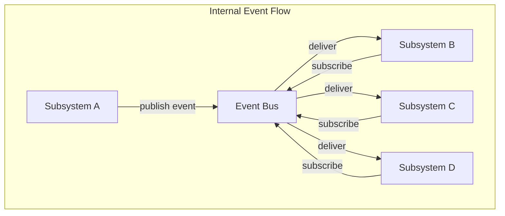

**Key internal events:**

| Event | Publisher | Subscribers | Description |
|-------|-----------|-------------|-------------|
| `kernel.lifecycle.boot.started` | KPM | All | Kernel boot has begun |
| `kernel.lifecycle.boot.complete` | KPM | All, AI | Kernel is ready |
| `kernel.lifecycle.shutdown.started` | KPM | All | Shutdown in progress |
| `kernel.lifecycle.shutdown.complete` | KPM | All | Kernel exited |
| `kernel.subsystem.started` | KPM | Health, Audit | A subsystem initialized |
| `kernel.subsystem.failed` | KPM | Health, Audit, AI | A subsystem failed to start |
| `kernel.config.changed` | Config Mgr | All subscribers | A config value changed |
| `kernel.secret.rotated` | Secrets Mgr | Audit, plugins | A secret was rotated |
| `kernel.auth.login` | Auth Engine | Audit | Login attempt (success/failure) |
| `kernel.authz.decision` | Authz Engine | Audit | Authorization decision |
| `kernel.health.degraded` | Health Mgr | AI, Notifications | A component health degraded |
| `kernel.health.restored` | Health Mgr | AI, Notifications | A component health restored |
| `kernel.plugin.loaded` | Plugin Loader | SR, CR, Audit | A plugin was loaded |
| `kernel.plugin.crashed` | Plugin Loader | KPM, Health, AI | A plugin crashed |
| `kernel.scheduler.task.fired` | Scheduler | Job Manager | A scheduled task was triggered |

### 7.2 Commands

Commands are imperative requests for action. They are routed through the Command Bus.

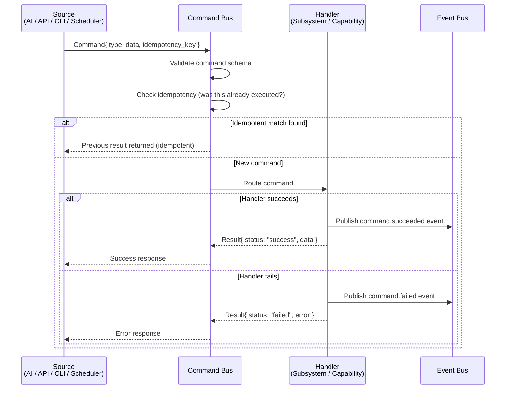

**Command categories:**

| Category | Examples | Delivery |
|----------|----------|----------|
| **Lifecycle** | Start plugin, stop plugin, reload config | Synchronous |
| **Security** | Create user, revoke token, rotate secret | Synchronous |
| **Resource** | Create resource, delete resource, scale | Asynchronous |
| **Plugin** | Install plugin, update plugin, uninstall | Asynchronous |
| **Deployment** | Deploy app, rollback, promote | Asynchronous |
| **Schedule** | Create schedule, cancel schedule | Synchronous |
| **Workflow** | Start workflow, cancel workflow, retry step | Asynchronous |

### 7.3 Queries

Queries are read-only requests for information. They are routed through the Query Bus and never cause side effects.

**Query categories:**

| Category | Examples | Cache TTL |
|----------|----------|-----------|
| **Status** | Get kernel health, list subsystems | 5s |
| **Configuration** | Get config value, list config keys | 30s |
| **Registry** | List capabilities, list providers | 10s |
| **State** | Get resource state, list resources | 5s |
| **History** | Get audit log, deployment history | 60s |
| **Metrics** | Get CPU usage, request rates | 1s |

### 7.4 Signals

Signals are lightweight, low-latency notifications between Kernel subsystems. They are delivered through Unix signals or in-process channels (not the Event Bus).

| Signal | Purpose | Latency |
|--------|---------|---------|
| `SIGTERM` | Graceful shutdown requested | Immediate |
| `SIGINT` | Interrupt (Ctrl+C) | Immediate |
| `SIGQUIT` | Emergency shutdown | Immediate |
| `SIGHUP` | Reload configuration | Immediate |
| `SIGUSR1` | Dump goroutine stack traces | Immediate |
| `SIGUSR2` | Toggle debug logging | Immediate |
| `kernel.reload` (internal) | Hot-reload triggered | In-process |
| `kernel.oom` (internal) | Memory pressure detected | In-process |

### 7.5 Notifications

Notifications are user-facing messages delivered through the Notification Manager.

| Notification Type | Channel | Urgency | Examples |
|-------------------|---------|---------|----------|
| **Alert** | Push, Email, SMS | High | Plugin crashed, resource exhausted |
| **Warning** | In-app, Email | Medium | Budget threshold, disk near capacity |
| **Info** | In-app | Low | Deployment completed, backup verified |
| **Digest** | Email | Low | Weekly cost report, security summary |

### 7.6 Message Bus Topology

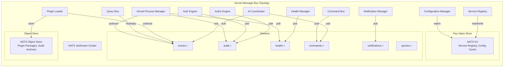

### 7.7 Async Jobs

Long-running operations are executed as async jobs through the Job Manager.

| Job Type | Queue | Timeout | Retries | Example |
|----------|-------|---------|---------|---------|
| **Deployment** | `jobs.deployment` | 10 min | 2 | Deploy application, rollback |
| **Backup** | `jobs.backup` | 60 min | 3 | Database backup, storage backup |
| **Plugin Operation** | `jobs.plugin` | 5 min | 3 | Install plugin, update plugin |
| **Migration** | `jobs.migration` | 30 min | 1 | Database migration, data migration |
| **Workflow** | `jobs.workflow` | 60 min | 0 (manual) | Multi-step workflow execution |
| **Maintenance** | `jobs.maintenance` | 30 min | 2 | Log rotation, cleanup, optimization |

### 7.8 Synchronization

For operations that require synchronized state across processes or nodes:

| Mechanism | Use Case | Consistency Model |
|-----------|----------|-------------------|
| **NATS Key-Value Store** | Service Registry, Configuration | Linearizable (Raft) |
| **PostgreSQL Transactions** | State Manager, Audit Chain | ACID |
| **gRPC Bidirectional Stream** | Plugin ↔ Kernel communication | Ordered |
| **Distributed Lock (NATS)** | Leader election, exclusive operations | Lease-based |
| **WaitGroup (in-process)** | Subsystem synchronization within single Kernel | Internal |

---

## 8. Configuration System

### 8.1 Configuration Hierarchy

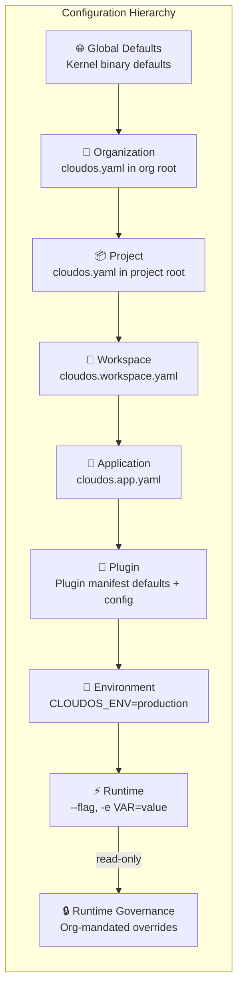

### 8.2 Configuration Sources

| Source | Priority | Format | Example |
|--------|----------|--------|---------|
| Kernel defaults | 0 (lowest) | Compiled Go structs | `DefaultConfig()` in code |
| Global config file | 1 | YAML | `/etc/cloudos/cloudos.yaml` |
| Organization config | 2 | YAML | `.cloudos/org.yaml` |
| Project config | 3 | YAML | `cloudos.yaml` |
| Workspace config | 4 | YAML | `.cloudos/workspace.yaml` |
| Application config | 5 | YAML | `app.cloudos.yaml` |
| Plugin config | 6 | YAML | Plugin manifest + `config.schema.json` |
| Environment variable | 7 | `KEY=VALUE` | `CLOUDOS_STORAGE_PROVIDER=s3` |
| CLI flag | 8 | `--key=value` | `--storage-provider s3` |
| Governance override | 9 (highest) | Org-enforced | Immutable org policies |

### 8.3 Configuration Resolution

```yaml
# Example resolved configuration for a deploy operation
kernel:
  node_name: "node-1"
  environment: "production"

capabilities:
  storage:
    provider: s3
    config:
      region: us-east-1
      bucket_prefix: "cloudos-prod"
  compute:
    provider: docker
    config:
      socket: /var/run/docker.sock
  database:
    provider: postgresql
    config:
      default_engine: postgresql
      default_version: 16

security:
  auth:
    jwt_expiry: 15m
    refresh_token_expiry: 7d
  audit:
    retention_days: 365

ai:
  default_provider: anthropic
  fallback_provider: openai
  routing_strategy: cost_optimized
```

### 8.4 Hot-Reload

Configuration changes are applied without restarting the Kernel:

1. User updates config via API, CLI, or AI
2. Configuration Manager validates against JSON Schema
3. If valid, new value is persisted to State Store
4. Configuration Manager publishes `kernel.config.changed` event
5. All subscribers receive the event and apply the new value
6. If a subscriber rejects the change, they publish a `kernel.config.rejected` event

**Hot-reload guarantees:**
- Zero-downtime for all configuration changes
- Change is atomic (all-or-nothing across subscribers)
- If any subscriber rejects, the change is rolled back
- Audit record for every change

---

## 9. Security Model

### 9.1 Kernel Security Principles

| # | Principle | Description |
|---|-----------|-------------|
| 1 | **Minimal Surface Area** | The Kernel exposes only well-defined IPC interfaces. No unnecessary open ports, no unused subsystems. |
| 2 | **Defense in Depth** | Multiple layers of security: network → API gateway → auth → authorization → audit |
| 3 | **Least Privilege** | Every subsystem and plugin gets exactly the permissions it needs, nothing more. |
| 4 | **Secure by Default** | Default configuration is the most secure. Users explicitly opt-in to less secure options. |
| 5 | **Fail Secure** | On any security check failure, deny access. Never default to allow. |
| 6 | **Never Trust the Plugin** | Plugins are untrusted by default. All plugin input is validated, all capabilities are checked. |
| 7 | **Encrypt Everything** | Data at rest: AES-256-GCM. Data in transit: TLS 1.3. Secrets: encrypted before storage. |
| 8 | **Immutable Audit** | Every security-relevant event is recorded immutably. Tampering is detectable. |

### 9.2 Permission Model

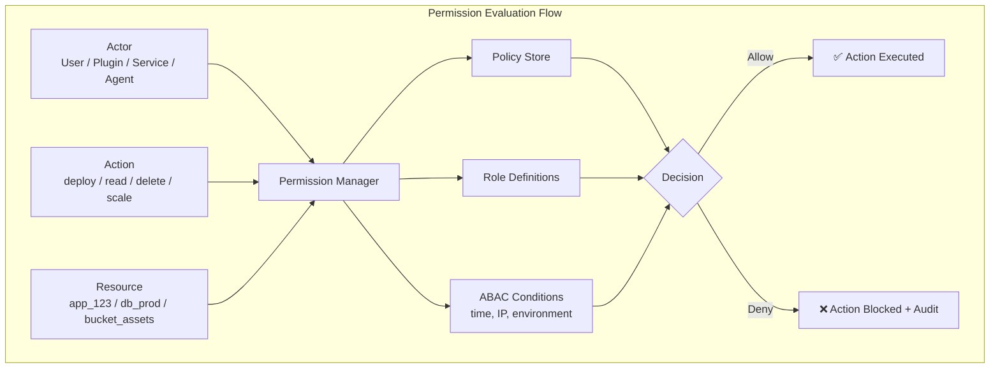

**Permission levels per actor type:**

| Actor Type | Default Level | Max Level | Audit Level |
|------------|--------------|-----------|-------------|
| Human User | Depends on role | Super Admin | All actions |
| Plugin (System) | Full system | System | All actions |
| Plugin (Official) | Declared permissions | Declared | All capability calls |
| Plugin (Community) | Minimal sandboxed | Restricted | All capability calls |
| Plugin (Untrusted) | Read-only, sandboxed | Read | Every operation |
| AI Orchestrator | Read-only by default | Configurable | All tool calls |
| Internal Service | Full internal | Internal | All mutations |

### 9.3 Isolation Boundaries

```mermaid
graph TB
    subgraph "Kernel Isolation Boundaries"
        direction TB

        KERNEL[Kernel Process<br/>Single Go binary]

        subgraph "Boundary 1: Process Isolation"
            NATIVE1[Native Plugin A<br/>OS Process]
            NATIVE2[Native Plugin B<br/>OS Process]
            KERNEL -.->|gRPC UDS| NATIVE1
            KERNEL -.->|gRPC UDS| NATIVE2
            NATIVE1 -.-|no direct communication| NATIVE2
        end

        subgraph "Boundary 2: WASM Sandbox"
            WASM1[WASM Plugin C<br/>wazero Runtime]
            WASM2[WASM Plugin D<br/>wazero Runtime]
            KERNEL -.->|gRPC UDS| WASM1
            KERNEL -.->|gRPC UDS| WASM2
        end

        subgraph "Boundary 3: Network Isolation"
            HTTP1[HTTP Plugin E<br/>Remote Service]
            KERNEL -.->|gRPC mTLS| HTTP1
        end
    end

    style KERNEL fill:#1a1a2e,stroke:#e94560,stroke-width:3px
```

### 9.4 Sandbox Architecture

| Isolation Dimension | WASM Plugin | Native Plugin (Linux) | Native Plugin (macOS) | HTTP Plugin |
|---------------------|-------------|----------------------|----------------------|-------------|
| **Memory** | Linear memory limit | cgroups memory limit | launchd memory limit | N/A |
| **CPU** | Interpreter budget | cgroups CPU quota | thread limit | Rate limiting |
| **Filesystem** | No FS (WASI only) | Landlock restrictions | sandbox-exec | Provider-side |
| **Network** | Declared outbound only | seccomp + iptables | socket filter | mTLS only |
| **Syscalls** | None (WASM) | seccomp allowlist | sandbox-exec | N/A |
| **Process** | Cannot spawn | No fork/exec | No fork/exec | N/A |
| **IPC** | gRPC only to Kernel | gRPC only to Kernel | gRPC only to Kernel | gRPC only to Kernel |

### 9.5 Audit Chain

The audit chain is a cryptographically linked list of immutable records:

```mermaid
graph LR
    R1[Audit Record 1<br/>hash: abc<br/>prev: 000] --> R2[Audit Record 2<br/>hash: def<br/>prev: abc]
    R2 --> R3[Audit Record 3<br/>hash: ghi<br/>prev: def]
    R3 --> R4[Audit Record 4<br/>hash: jkl<br/>prev: ghi]
    R4 --> RN[...]

    style R1 fill:#1a1a2e,stroke:#e94560
    style R2 fill:#1a1a2e,stroke:#e94560
    style R3 fill:#1a1a2e,stroke:#e94560
    style R4 fill:#1a1a2e,stroke:#e94560
```

**Chain verification:**
- Each record includes the hash of the previous record
- Tampering with any record breaks the chain
- The Kernel verifies chain integrity at boot
- Integrity check results are recorded in the chain itself

### 9.6 Plugin Signing & Verification

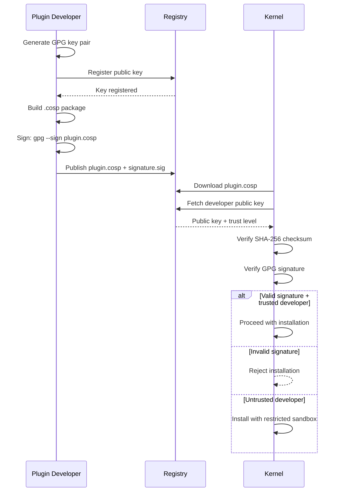

---

## 10. Failure Recovery

### 10.1 Crash Recovery

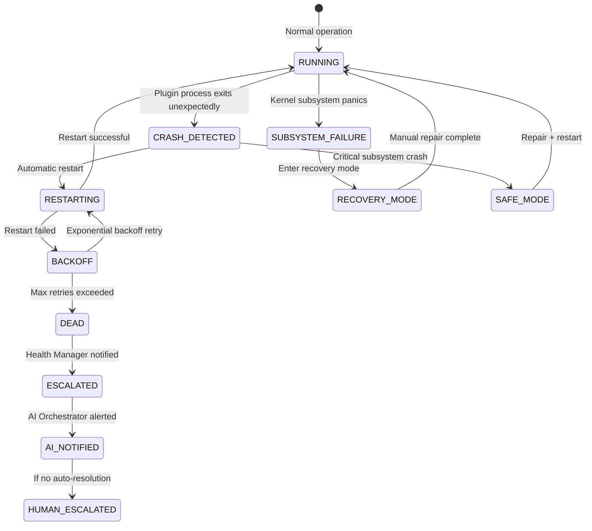

### 10.2 Fallback Chains

Every critical dependency has a fallback:

| Primary | Fallback 1 | Fallback 2 | Trigger |
|---------|-----------|-----------|---------|
| PostgreSQL | SQLite (embedded) | In-memory (ephemeral) | Connection failure |
| NATS JetStream | In-memory event buffer | — | NATS cluster unavailable |
| External AI provider | Secondary AI provider | Local Ollama | API outage |
| Primary DNS provider | Secondary DNS provider | Built-in DNS | API rate limit |
| S3 Storage | Local filesystem | — | Provider outage |
| External Auth provider | Local password auth | — | IdP unavailable |

### 10.3 Rollback Manager

Every mutating operation has a rollback plan:

| Operation Type | Rollback Strategy | Recovery Time | Verification |
|---------------|-------------------|---------------|--------------|
| **Configuration change** | Previous config versioned, hot-reload revert | < 1s | Config revert published to event bus |
| **Plugin install** | Previous version preserved, swap back | < 2s | Plugin health check before activation |
| **Plugin update** | Old binary cached, gRPC restart with old version | < 3s | Version comparison + health check |
| **Deployment** | Previous deployment retained, traffic switch | < 10s | Health check on rollback target |
| **Database migration** | Transactional, COMMIT or ROLLBACK | < 30s | Schema version check |
| **Resource deletion** | Soft-delete with configurable retention | Instant | Resource in trash, restore available |
| **Provider change** | Old provider kept active until new one verified | < 5 min | Capability test on new provider |

### 10.4 Degraded Modes

| Degraded Condition | Kernel Behavior | User Experience |
|--------------------|----------------|-----------------|
| State Store unavailable (PostgreSQL down) | Fallback to SQLite; publish health event | Read operations use cached data; writes queued |
| Event Bus unavailable (NATS down) | In-memory event buffer; reconnect loop | Async operations delayed; publish health event |
| AI provider unavailable | Failover to secondary; fallback to local model | AI responses may be slower or use less capable model |
| Plugin crash | Auto-restart; escalate if persistent | Single capability degraded temporarily |
| Configuration source unreachable | Use cached config; deny config changes | Settings appear read-only |
| Secrets source unreachable | Use cached secrets (encrypted) | New secrets cannot be created |

### 10.5 Self-Healing

| Scenario | Detection | Action | Success Rate Target |
|----------|-----------|--------|-------------------|
| Plugin crashed | Process exit signal | Auto-restart (up to 5 attempts) | 95% |
| Plugin unresponsive | Health check timeout | Restart with graceful shutdown | 90% |
| Out of memory | Resource Manager alert | Restart plugin with same limits | 80% |
| Resource leak | Memory growth pattern | Restart plugin, adjust limits | 85% |
| Connection leak | File descriptor count | Restart plugin, report to AI | 75% |
| Configuration drift | Config hash mismatch | Auto-revert to known good config | 99% |
| Certificate expiry | Pre-expiry check | Auto-renew via Let's Encrypt | 99.9% |

### 10.6 Data Integrity

| Mechanism | Description | Frequency |
|-----------|-------------|-----------|
| **Checksum verification** | Every stored record includes SHA-256 checksum | On write |
| **Audit chain integrity** | Verify linked hash chain | On boot, hourly |
| **State Store backup** | Automated database snapshots | Daily |
| **Write-ahead log** | All mutations logged before application | Continuous |
| **Point-in-time recovery** | WAL-based restore to any timestamp | On demand |
| **Snapshot verification** | Restore snapshot to test environment and verify | Weekly |

---

## 11. Performance Architecture

### 11.1 Memory Management

| Strategy | Description | Target |
|----------|-------------|--------|
| **Fixed memory budget** | Kernel reserves memory at startup; plugins have separate budgets | Kernel < 256MB baseline |
| **Memory pooling** | Reuse buffers for gRPC messages, event payloads | Reduce GC pressure by 80% |
| **Slab allocation** | Fixed-size allocations for high-frequency objects (events, audit records) | Sub-μs allocation |
| **No per-request GC** | Kernel subsystems use object pools, not per-request allocation | GC pause < 1ms |
| **Plugin memory limits** | Each plugin has a hard memory limit enforced by sandbox | Configurable per plugin |

### 11.2 Caching Strategy

| Cache | What | Where | TTL | Invalidation |
|-------|------|-------|-----|--------------|
| **Config cache** | Resolved configuration values | In-memory (LRU) | 30s or on event | Config change event |
| **Auth cache** | JWT public keys, session validity | In-memory (TTL) | 5 min | Key rotation event |
| **Authz cache** | Policy evaluation results | In-memory (LRU) | 1 min | Policy change event |
| **Service Registry cache** | Service endpoints | In-memory (TTL) | 10s | Registration event |
| **Capability Registry cache** | Capability→provider mappings | In-memory (TTL) | 30s | Capability registration event |
| **Audit write buffer** | Pending audit records | In-memory ring buffer | Flush every 100ms | Timer + count |
| **Plugin manifest cache** | Parsed manifest data | In-memory (LRU) | Until plugin change | Plugin lifecycle event |

### 11.3 Concurrency Model

| Pattern | Used By | Details |
|---------|---------|---------|
| **Goroutines** | All subsystems | Lightweight concurrency; one goroutine per active task |
| **WaitGroup** | KPM for startup/shutdown | Coordinate subsystem initialization order |
| **Mutex (sync.RWMutex)** | Configuration, Registry | Read-heavy workloads with infrequent writes |
| **Channel** | In-process event passing | Subsystem-internal communication |
| **Atomic operations** | Counters, metrics | Lock-free metrics collection |
| **Ring buffer** | Audit write buffer | Lock-free producer-consumer |
| **Worker pool** | Job Manager, Command Bus | Bounded concurrency for task execution |

### 11.4 Background Processing

| Worker Pool | Queue | Workers | Max Queue | Priority |
|-------------|-------|---------|-----------|----------|
| **Command execution** | Command Bus | 50 | 10,000 | High |
| **Async jobs** | Job Manager | 20 | 100,000 | Medium |
| **Event delivery** | Event Bus (core) | 100 | 1,000,000 | High |
| **Audit writing** | Audit Engine | 10 | 500,000 | Low (batch) |
| **Health checks** | Health Manager | 50 | N/A | High |
| **Plugin communication** | Plugin Runtime | Per-plugin (5) | 1,000 | Medium |
| **Scheduled tasks** | Scheduler | 10 | 10,000 | Medium |

### 11.5 Performance Targets

| Metric | Target | Measurement |
|--------|--------|-------------|
| Kernel binary size | < 50MB | `ls -lh` |
| Cold boot to ready | < 3 seconds | Event timestamp |
| Warm restart | < 1 second | Event timestamp |
| IPC latency (local plugin) | < 1ms (p99) | gRPC timing |
| Event delivery (within Kernel) | < 5ms (p99) | Event Bus timing |
| Event delivery (to plugin) | < 10ms (p99) | Event Bus timing |
| Configuration lookup | < 100μs (p99) | In-memory cache |
| Authorization check | < 5ms (p99) | Authz Engine timing |
| Audit record write | < 1ms (p99) | Batch write timing |
| Concurrent plugins supported | 1,000+ | Plugin Runtime |
| Concurrent connections | 50,000+ | API Gateway |
| Memory per idle plugin | < 5MB (WASM), < 20MB (Native) | Resource Manager |

---

## 12. Kernel API

The Kernel exposes a limited, well-defined API for internal and external consumers:

| Endpoint | Protocol | Consumers | Description |
|----------|----------|-----------|-------------|
| `kernel.lifecycle.*` | Event Bus | All | Lifecycle events |
| `kernel.config.*` | Event Bus + gRPC | All | Configuration read/write |
| `kernel.secrets.*` | gRPC (authenticated) | Authorized plugins | Secret read/manage |
| `kernel.auth.*` | gRPC | API Gateway | Authentication |
| `kernel.authz.*` | gRPC | API Gateway, AI | Authorization |
| `kernel.registry.*` | gRPC | Plugins, AI | Service/Capability registry |
| `kernel.scheduler.*` | gRPC | AI, Users | Task scheduling |
| `kernel.jobs.*` | gRPC + Event Bus | AI, Plugins | Job management |
| `kernel.health.*` | gRPC | Monitor, AI | Health status |
| `kernel.metrics.*` | gRPC + Prometheus | Monitoring stack | Metrics export |
| `kernel.audit.*` | gRPC | Audit tooling, SIEM | Audit query/export |
| `kernel.plugin.*` | gRPC (authenticated) | Plugins | Plugin registration |

---

## 13. Future Kernel Evolution

### Phase 2: Distributed Kernel (2027 Q1)

- Multi-node clustering: multiple Kernel instances form a cluster
- Distributed State Store (CockroachDB for multi-region)
- Cross-node Event Bus federation
- Plugin distribution across cluster nodes
- Single-node failure does not affect cluster

### Phase 3: Hot-Patch Kernel (2027 Q3)

- Live Kernel updates without reboot
- Subsystem hot-swap (replace one subsystem while Kernel runs)
- Plugin hot-reload (swap binary without traffic loss)
- Schema migration without downtime

### Phase 4: Unikernel Kernel (2028)

- Kernel compiled as a unikernel for bare-metal deployments
- No OS layer between Kernel and hardware
- Direct device access for storage and networking
- Sub-10ms boot time
- Sub-10MB binary size

### Phase 5: Adaptive Kernel (2028-2029)

- Kernel self-tunes based on workload patterns
- Adaptive resource allocation between subsystems
- Automatic cache sizing
- Predictive health (ML models forecast failures)
- Self-optimizing concurrency

### Phase 6: Autonomous Kernel (2030+)

- Kernel manages its own lifecycle end-to-end
- Self-healing architecture decisions
- Cross-cluster optimization
- Automatic capacity planning
- Kernel evolves its own subsystems (AI-generated optimization patches)

---

## 14. Connection to Other Documents

| Document | Relationship |
|----------|-------------|
| [01_MASTER_SPEC.md](./01_MASTER_SPEC.md) | Defines Kernel requirements (FR-05 through FR-10), non-functional requirements (NFR-19 through NFR-33) |
| [05_SYSTEM_ARCHITECTURE.md](./05_SYSTEM_ARCHITECTURE.md) | Defines the overall system layers that the Kernel sits at the bottom of (Section 5.1), Kernel subsystems (Section 6), and design principles |
| [06_KERNEL_AND_PLUGIN_ARCHITECTURE.md](./06_KERNEL_AND_PLUGIN_ARCHITECTURE.md) | Defines the Kernel↔Plugin relationship, dependency rules, and plugin lifecycle that this document implements |
| [07_AI_OPERATING_SYSTEM.md](./07_AI_OPERATING_SYSTEM.md) | Defines the AI Orchestrator that consumes Kernel services through the AI Coordinator subsystem (Section 5.19) |
| [10_CAPABILITIES.md](./10_CAPABILITIES.md) | Defines the abstract capability interfaces that the Kernel's Capability Registry (Section 5.11) manages |
| [11_PROVIDER_ARCHITECTURE.md](./11_PROVIDER_ARCHITECTURE.md) | Defines providers that are loaded by the Plugin Loader (Section 5.12) and registered with the Capability Registry |
| [12_PLUGIN_SYSTEM.md](./12_PLUGIN_SYSTEM.md) | Defines the plugin format (.cosp) that the Plugin Loader processes |
| [13_DATABASE.md](./13_DATABASE.md) | Defines the database strategy that the State Manager (Section 5.17) uses — PostgreSQL primary, SQLite fallback |
| [14_API.md](./14_API.md) | Defines the external API that runs on top of the Kernel's internal APIs |
| [15_SECURITY.md](./15_SECURITY.md) | Defines the security model that the Kernel's Authentication (5.7), Authorization (5.8), Audit (5.9), and Permission (5.25) subsystems enforce |
| [20_ROADMAP.md](./20_ROADMAP.md) | Defines the phased delivery of Kernel features across all 6 phases |

---

> **Next:** [10_CAPABILITIES.md](./10_CAPABILITIES.md) — Abstract capability interfaces, contracts, versioning
