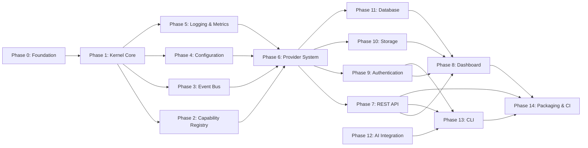

# CloudOS Implementation Blueprint

> **Document ID:** CLOUDOS-BLUE-001  
> **Status:** v1.0 — Approved  
> **Classification:** Public — Open Source  
> **Last Updated:** 2026-06-29  
> **Audience:** All Engineers — Platform, Backend, Frontend, AI, QA, DevOps, Security  
> **Depends On:** All docs 01-08 (master spec through kernel internals)

---

## Table of Contents

1. [Executive Summary](#1-executive-summary)
2. [MVP Scope](#2-mvp-scope)
3. [Development Phases](#3-development-phases)
4. [Milestones](#4-milestones)
5. [Engineering Tasks](#5-engineering-tasks)
6. [Folder Ownership](#6-folder-ownership)
7. [Team Roles](#7-team-roles)
8. [Coding Sequence](#8-coding-sequence)
9. [Definition of Done](#9-definition-of-done)
10. [Release Plan](#10-release-plan)
11. [Technical Debt Strategy](#11-technical-debt-strategy)

---

## 1. Executive Summary

### 1.1 Purpose

This document is the **bridge between architecture and implementation**. It tells every engineer exactly what to build, in what order, why it matters, and how to know when it's done.

### 1.2 Guiding Principles

| # | Principle | Implication |
|---|-----------|-------------|
| 1 | **Build the smallest possible thing first** | MVP Kernel does one thing well: boot, register built-in providers, serve a health endpoint |
| 2 | **Spec-first, code-second** | Every task begins with reading the relevant spec doc before writing code |
| 3 | **Test alongside code** | No implementation task is complete without a passing test |
| 4 | **One subsystem at a time** | No parallel development across subsystems until the Kernel is stable |
| 5 | **Commit early, commit often** | Every task produces at least one commit |
| 6 | **No premature optimization** | Build for correctness first, profile later |
| 7 | **Architecture decisions are documented** | Every significant decision gets an ADR in `/decisions/` |
| 8 | **AI-assisted, human-guided** | Tasks are implemented with AI assistance but reviewed by humans |

### 1.3 Total Engineering Estimate

| Phase | Tasks | Estimated Engineer-Days |
|-------|-------|------------------------|
| Phase 0: Foundation | 4 | 1 |
| Phase 1: Kernel Core | 8 | 5 |
| Phase 2: Capability Registry | 4 | 3 |
| Phase 3: Event Bus | 5 | 3 |
| Phase 4: Configuration | 4 | 2 |
| Phase 5: Logging & Metrics | 4 | 2 |
| Phase 6: Provider System | 6 | 4 |
| Phase 7: REST API | 4 | 3 |
| Phase 8: Dashboard | 6 | 5 |
| Phase 9: Authentication | 5 | 3 |
| Phase 10: Storage Capability | 5 | 3 |
| Phase 11: Database Capability | 5 | 3 |
| Phase 12: AI Integration | 5 | 4 |
| Phase 13: CLI | 4 | 3 |
| Phase 14: Packaging & CI | 4 | 2 |
| **Total** | **73** | **~46** |

---

## 2. MVP Scope

### 2.1 What is CloudOS v0.1?

CloudOS v0.1 is a **single-node Cloud Operating System** that can:

1. Boot and initialize all Kernel subsystems
2. Register built-in providers (compute.local, storage.local, database.sqlite)
3. Accept authenticated API requests via REST
4. Deploy a simple container from an image
5. Store and retrieve objects
6. Show system status in a web dashboard
7. Provide a CLI for common operations

### 2.2 IN Scope (v0.1)

| Category | What's In | Why |
|----------|-----------|-----|
| **Kernel** | Boot sequence, process manager, event bus (in-memory), config manager, secrets manager, health manager, logging | Minimum viable platform |
| **Capabilities** | Compute (local exec), Storage (local FS), Database (SQLite) — v1 interfaces only | Three capabilities demonstrate the pattern |
| **Providers** | `compute.local`, `storage.local`, `database.sqlite` — built-in, native runtime only | No WASM/HTTP runtimes yet |
| **API** | REST API (Go `net/http`), JSON request/response | GraphQL comes in v0.2 |
| **Auth** | JWT-based authentication, API keys, password login | Minimum viable security |
| **Authz** | RBAC with admin/user roles | Simple, sufficient |
| **Dashboard** | React SPA with login, deploy, status pages | Read-only monitoring + deploy action |
| **CLI** | `cloudos login`, `cloudos deploy`, `cloudos status`, `cloudos ps` | Core user operations |
| **State** | SQLite for single-node, PostgreSQL schema ready | SQLite = zero config |
| **Deployment** | Docker single-command, `docker-compose` | One command to run |

### 2.3 OUT of Scope (v0.1)

| Category | What's Out | When |
|----------|------------|------|
| **Kernel** | NATS JetStream, multi-node clustering, distributed state | v0.2+ |
| **Capabilities** | AI, Identity (external), Networking, DNS, Monitoring, Search, Messaging, Email, Billing — only interface stubs | v0.3+ |
| **Providers** | WASM runtime, HTTP runtime, plugin marketplace, `.cosp` packaging | v0.3+ |
| **API** | GraphQL, WebSocket, gRPC | v0.2 |
| **Auth** | OAuth, SSO, MFA, WebAuthn, LDAP, SAML | v0.4+ |
| **Dashboard** | Real-time updates, team management, billing, analytics | v0.3+ |
| **CLI** | Plugin management, `cloudos plugin install`, `cloudos logs` | v0.3+ |
| **AI** | AI Orchestrator, intent engine, multi-agent system, LLM integration | v0.5+ |
| **Deployment** | Kubernetes, Terraform, multi-region, auto-scaling | v0.4+ |
| **Marketplace** | Plugin registry, publishing pipeline, security scanning | v0.5+ |
| **Testing** | Performance/load testing, fuzzing, chaos engineering | v0.2+ |
| **Security** | SOC 2, HIPAA, penetration testing, audit certifications | v1.0+ |

### 2.4 Why This Scope?

Every feature in v0.1 is chosen to **validate the architecture**:

- **Three capabilities** proves the Capability-Provider pattern works with different domains (compute, storage, database)
- **Built-in providers only** avoids the complexity of plugin packaging, sandboxing, and WASM compilation
- **In-memory event bus** proves the event-driven architecture without NATS operational overhead
- **SQLite state** proves state management with zero configuration
- **REST-only API** proves the API layer without GraphQL schema generation complexity
- **JWT auth** proves security patterns without OAuth redirect flows
- **Single binary** deployment proves the "one command to run" promise

---

## 3. Development Phases

### 3.1 Phase Overview

```
Phase 0: Foundation     (Day 1)     — Repository, tooling, Go module
Phase 1: Kernel Core    (Days 2-4)  — KPM, boot sequence, subsystems
Phase 2: Capability Registry (Day 5) — Register, query, version capabilities
Phase 3: Event Bus      (Days 6-7)  — In-memory pub/sub, typed events
Phase 4: Configuration  (Day 8)     — YAML config, hot-reload, validation
Phase 5: Logging & Metrics (Day 9)  — Structured logging, basic metrics
Phase 6: Provider System (Days 10-12) — Provider interface, lifecycle, built-in providers
Phase 7: REST API       (Days 13-14) — HTTP server, routes, middleware, handlers
Phase 8: Dashboard      (Days 15-18) — React app, login, deploy, status pages
Phase 9: Authentication (Days 19-20) — JWT, login, API keys, RBAC
Phase 10: Storage       (Days 21-22) — storage.local provider, file upload/download
Phase 11: Database      (Days 23-24) — database.sqlite provider, schema management
Phase 12: AI Integration (Days 25-27) — AI capability stub, OpenAI provider
Phase 13: CLI           (Days 28-29) — Go CLI, login, deploy, status commands
Phase 14: Packaging     (Day 30)     — Dockerfile, docker-compose, CI
```

### 3.2 Phase Dependencies



### 3.3 Phase Descriptions

#### Phase 0: Foundation (1 day)

**Purpose:** Establish the repository structure, Go module, build tooling, and development conventions so every subsequent phase has a consistent foundation.

**Key deliverables:** Go module initialized, directory structure created, linter/formatter configured, pre-commit hooks, CI skeleton.

#### Phase 1: Kernel Core (3 days)

**Purpose:** Build the minimum Kernel that can boot, initialize subsystems, and report health. This is the substrate everything else runs on.

**Key deliverables:** Kernel Process Manager, subsystem interface, boot sequence, health manager, graceful shutdown.

#### Phase 2: Capability Registry (1 day)

**Purpose:** Define the capability interface pattern and build the registry that stores, version-matches, and discovers capabilities.

**Key deliverables:** Capability interface, CapabilityRegistry, version matching, introspection API.

#### Phase 3: Event Bus (2 days)

**Purpose:** Build the in-memory event bus that connects all subsystems via typed events. Proves the event-driven architecture.

**Key deliverables:** Event types, publisher/subscriber interfaces, in-memory implementation, event streaming.

#### Phase 4: Configuration (1 day)

**Purpose:** Build the hierarchical, hot-reloadable configuration system.

**Key deliverables:** Config interface, YAML loader, environment variable interpolation, config watcher, validation.

#### Phase 5: Logging & Metrics (1 day)

**Purpose:** Instrument all subsystems with structured logging and basic metrics.

**Key deliverables:** Structured logger, log levels, subsystem metrics, OpenTelemetry export.

#### Phase 6: Provider System (3 days)

**Purpose:** Build the provider interface, lifecycle manager, and the three built-in providers (compute.local, storage.local, database.sqlite).

**Key deliverables:** Provider interface, PluginLoader, compute.local, storage.local, database.sqlite.

#### Phase 7: REST API (2 days)

**Purpose:** Expose Kernel capabilities as REST endpoints.

**Key deliverables:** HTTP server, router, middleware (auth, logging, recovery), capability handlers, OpenAPI spec.

#### Phase 8: Dashboard (4 days)

**Purpose:** Build the React web dashboard as the primary user interface.

**Key deliverables:** React app scaffold, login page, deploy page, status page, API client.

#### Phase 9: Authentication (2 days)

**Purpose:** Secure the API with JWT authentication and RBAC authorization.

**Key deliverables:** Auth engine, JWT issuance/validation, login endpoint, API key auth, RBAC middleware.

#### Phase 10: Storage (2 days)

**Purpose:** Implement the `storage.local` provider with file upload, download, and listing.

**Key deliverables:** Local storage provider, upload/download endpoints, dashboard file browser.

#### Phase 11: Database (2 days)

**Purpose:** Implement the `database.sqlite` provider with create, connect, and backup operations.

**Key deliverables:** SQLite provider, database provisioning endpoint, connection string generation.

#### Phase 12: AI Integration (3 days)

**Purpose:** Stub the AI capability interface and build a simple OpenAI provider for chat completion.

**Key deliverables:** AI capability interface, OpenAI provider, chat endpoint, basic prompt templates.

#### Phase 13: CLI (2 days)

**Purpose:** Build the `cloudos` CLI for login, deploy, status, and process management.

**Key deliverables:** Cobra CLI app, login flow, deploy command, status command, ps command.

#### Phase 14: Packaging (1 day)

**Purpose:** Package CloudOS as a single Docker image with one-command deployment.

**Key deliverables:** Dockerfile (multi-stage), docker-compose.yaml, CI workflow, README quickstart.

---

## 4. Milestones

### 4.1 Milestone Map

```
M0: Repository Ready
  ↓
M1: Kernel Boots                     ← Phase 1 complete
  ↓
M2: Capabilities Register            ← Phases 2-5 complete
  ↓
M3: Providers Run                    ← Phase 6 complete
  ↓
M4: API Serves Requests              ← Phase 7 complete
  ↓
M5: User Can Log In                  ← Phase 9 complete
  ↓
M6: Dashboard Shows Status           ← Phase 8 complete
  ↓
M7: User Can Deploy                  ← Phases 10-11 complete
  ↓
M8: CLI Works                        ← Phase 13 complete
  ↓
M9: AI Can Respond                   ← Phase 12 complete
  ↓
M10: v0.1 Released                   ← Phase 14 complete
```

### 4.2 M0: Repository Ready

| Field | Detail |
|-------|--------|
| **Purpose** | Establish the development foundation |
| **Deliverables** | Go module, directory structure, linters, CI, `.gitignore`, CLA, contributing guide |
| **Success Criteria** | `go build ./...` succeeds, linter passes, CI green |
| **Risks** | None |
| **Dependencies** | None |

### 4.3 M1: Kernel Boots

| Field | Detail |
|-------|--------|
| **Purpose** | Prove the Kernel can start and report health |
| **Deliverables** | KPM, subsystem interface, boot sequence, health checks, graceful shutdown |
| **Success Criteria** | Kernel binary starts, boot completes in < 1s, health endpoint returns 200, graceful shutdown drains in < 5s |
| **Risks** | Subsystem dependency ordering may need iteration |
| **Dependencies** | M0 |

### 4.4 M2: Capabilities Register

| Field | Detail |
|-------|--------|
| **Purpose** | Prove capabilities can be defined, registered, and discovered |
| **Deliverables** | Capability interface, registry, version matching, event bus integration, config loading, structured logging |
| **Success Criteria** | Capability registers successfully, version constraint matching works, registry returns correct results, events are published on registration |
| **Risks** | Interface design may need refinement after provider implementation |
| **Dependencies** | M1 |

### 4.5 M3: Providers Run

| Field | Detail |
|-------|--------|
| **Purpose** | Prove providers can be loaded, initialized, and respond to capability calls |
| **Deliverables** | Provider interface, PluginLoader, compute.local, storage.local, database.sqlite |
| **Success Criteria** | All three providers initialize, capability calls return correct results, provider health checks report healthy, provider can be stopped and restarted |
| **Risks** | SQLite integration complexity, local process management edge cases |
| **Dependencies** | M2 |

### 4.6 M4: API Serves Requests

| Field | Detail |
|-------|--------|
| **Purpose** | Prove the REST API can route requests to capability handlers |
| **Deliverables** | HTTP server, router, middleware chain, capability handlers, JSON encoding, error responses |
| **Success Criteria** | API serves requests on port 8080, capability operations succeed via HTTP, errors are returned as structured JSON, middleware chain executes (logging, recovery) |
| **Risks** | None significant |
| **Dependencies** | M3 |

### 4.7 M5: User Can Log In

| Field | Detail |
|-------|--------|
| **Purpose** | Prove authentication and authorization work end-to-end |
| **Deliverables** | JWT auth engine, login endpoint, API key auth, RBAC middleware, user/role management |
| **Success Criteria** | Login returns valid JWT, authenticated requests succeed, unauthenticated requests are rejected, RBAC blocks unauthorized actions, API key auth works |
| **Risks** | JWT secret management, token expiration edge cases |
| **Dependencies** | M4 |

### 4.8 M6: Dashboard Shows Status

| Field | Detail |
|-------|--------|
| **Purpose** | Prove the web UI connects to the API and displays system state |
| **Deliverables** | React SPA, login page, status page, API client, system health display |
| **Success Criteria** | Dashboard loads, login flow works end-to-end, status page shows system health, deploy page renders, API client handles auth and errors |
| **Risks** | CORS configuration, API contract mismatches |
| **Dependencies** | M5 |

### 4.9 M7: User Can Deploy

| Field | Detail |
|-------|--------|
| **Purpose** | Prove the complete deploy flow: user → dashboard → API → compute capability → provider → execution |
| **Deliverables** | Deploy endpoint, compute.local container execution, storage upload/download, dashboard deploy page, status updates |
| **Success Criteria** | User uploads a Dockerfile via dashboard, compute.local builds and runs it, container status is visible in dashboard, container logs are streamable |
| **Risks** | Container build/run edge cases, resource management |
| **Dependencies** | M6 |

### 4.10 M8: CLI Works

| Field | Detail |
|-------|--------|
| **Purpose** | Prove the CLI provides the same capabilities as the dashboard |
| **Deliverables** | Cobra CLI app, `cloudos login`, `cloudos deploy`, `cloudos status`, `cloudos ps` |
| **Success Criteria** | All CLI commands work, login flow caches credentials, deploy reports progress, status matches dashboard, `cloudos ps` lists running containers |
| **Risks** | Terminal UX, credential storage on different platforms |
| **Dependencies** | M7 |

### 4.11 M9: AI Can Respond

| Field | Detail |
|-------|--------|
| **Purpose** | Prove the AI capability interface works with a real provider |
| **Deliverables** | AI capability interface, OpenAI provider, chat endpoint, streaming response |
| **Success Criteria** | Chat completion returns valid response, streaming works, model list is available, API key is configurable via secrets |
| **Risks** | OpenAI API dependency, streaming implementation complexity |
| **Dependencies** | M5 |

### 4.12 M10: v0.1 Released

| Field | Detail |
|-------|--------|
| **Purpose** | Package and release CloudOS v0.1 |
| **Deliverables** | Docker image, docker-compose.yaml, CI release workflow, quickstart guide, changelog |
| **Success Criteria** | `docker compose up` starts CloudOS, health check passes, deploy flow works end-to-end, release tags in git, Docker image on registry |
| **Risks** | Cross-platform Docker build issues |
| **Dependencies** | All prior milestones |

---

## 5. Engineering Tasks

### 5.1 Task ID Convention

```
{PHASE}-{SEQUENCE}: {Title}
```

| Prefix | Phase |
|--------|-------|
| FOUND- | Phase 0: Foundation |
| KERN- | Phase 1: Kernel Core |
| CREG- | Phase 2: Capability Registry |
| EBUS- | Phase 3: Event Bus |
| CONF- | Phase 4: Configuration |
| LOGM- | Phase 5: Logging & Metrics |
| PROV- | Phase 6: Provider System |
| RAPI- | Phase 7: REST API |
| DSHD- | Phase 8: Dashboard |
| AUTH- | Phase 9: Authentication |
| STOR- | Phase 10: Storage |
| DBCP- | Phase 11: Database |
| AICP- | Phase 12: AI Integration |
| CLI- | Phase 13: CLI |
| PKG- | Phase 14: Packaging & CI |

### 5.2 Task Complexity Ratings

| Rating | Meaning | Typical Effort |
|--------|---------|---------------|
| 🟢 Trivial | Simple, well-defined, few dependencies | < 1 hour |
| 🟡 Small | One file or concern, clear boundaries | 1-3 hours |
| 🟠 Medium | Multiple files, integration needed | 3-8 hours |
| 🔴 Large | Cross-cutting, multiple subsystems | 1-3 days |
| ⚫ Unknown | Research needed before estimation | Variable |

### 5.3 Phase 0: Foundation Tasks

#### FOUND-001: Initialize Go Module

| Field | Detail |
|-------|--------|
| **Description** | Initialize the Go module at `core/cloudos` with `go mod init`. Set Go 1.24 minimum. Create root `go.work` for multi-module workspace. |
| **Priority** | 🔴 Critical |
| **Dependencies** | None |
| **Complexity** | 🟢 Trivial |
| **Acceptance Criteria** | `go build ./...` succeeds in root and `core/cloudos/...`. `go mod tidy` succeeds. |

#### FOUND-002: Create Directory Structure

| Field | Detail |
|-------|--------|
| **Description** | Create the complete directory structure matching the architecture: `core/cloudos/cmd/`, `core/cloudos/internal/kernel/`, `core/cloudos/internal/capability/`, `core/cloudos/internal/eventbus/`, `core/cloudos/internal/config/`, `core/cloudos/internal/providers/`, `core/cloudos/pkg/`, `apps/dashboard/`, `cli/`, etc. |
| **Priority** | 🔴 Critical |
| **Dependencies** | FOUND-001 |
| **Complexity** | 🟢 Trivial |
| **Acceptance Criteria** | All directories exist. `go build ./...` passes with empty packages. |

#### FOUND-003: Configure Linting & Formatting

| Field | Detail |
|-------|--------|
| **Description** | Configure `golangci-lint` with Go 1.24 rules, `.editorconfig`, pre-commit hooks (gofumpt, goimports, whitespace), and `Taskfile.yml` or `Makefile` for common commands. |
| **Priority** | 🟡 High |
| **Dependencies** | FOUND-002 |
| **Complexity** | 🟢 Trivial |
| **Acceptance Criteria** | `make lint` passes on empty project. Pre-commit hooks run. CI workflow runs lint. |

#### FOUND-004: Bootstrap CI Pipeline

| Field | Detail |
|-------|--------|
| **Description** | Create GitHub Actions CI workflow: build, lint, test on push/PR to main. Cache Go modules. Add status badge to README. |
| **Priority** | 🟡 High |
| **Dependencies** | FOUND-003 |
| **Complexity** | 🟡 Small |
| **Acceptance Criteria** | CI pipeline runs on push. Build, lint, test stages pass. Status badge visible in README. |

---

### 5.4 Phase 1: Kernel Core Tasks

#### KERN-001: Define Subsystem Interface

| Field | Detail |
|-------|--------|
| **Description** | Define the `Subsystem` interface that every Kernel subsystem implements: `Init(ctx, config) error`, `Start(ctx) error`, `Stop(ctx) error`, `Health(ctx) (*HealthStatus, error)`. Define the `HealthStatus` struct. Define `SubsystemState` enum (uninitialized, initializing, initialized, starting, running, stopping, stopped, failed). |
| **Priority** | 🔴 Critical |
| **Dependencies** | FOUND-002 |
| **Complexity** | 🟡 Small |
| **Acceptance Criteria** | Interface compiles. Go doc comments on every method. Example mock implementation works. |

#### KERN-002: Build Kernel Process Manager

| Field | Detail |
|-------|--------|
| **Description** | Implement `KernelProcessManager` (KPM). It holds a registry of subsystems with dependency ordering. `Boot()` initializes subsystems in order. `Start()` starts them. `Shutdown()` stops them in reverse order with drain timeouts. `Crash()` handles unrecoverable failures. Support `Restart()` for individual subsystems. |
| **Priority** | 🔴 Critical |
| **Dependencies** | KERN-001 |
| **Complexity** | 🟠 Medium |
| **Acceptance Criteria** | KPM boots subsystems in declared dependency order. Subsystem startup failures are handled gracefully. Shutdown drains in reverse order. Restart works. Unit tests cover all state transitions. |

#### KERN-003: Implement Boot Sequence

| Field | Detail |
|-------|--------|
| **Description** | Implement the `Boot()` method: parse CLI flags, load config, initialize KPM, register built-in subsystems, call KPM.Boot(). Publish `kernel.boot.started` and `kernel.boot.complete` events. Log boot duration. |
| **Priority** | 🔴 Critical |
| **Dependencies** | KERN-002, CONF-001 (config module) |
| **Complexity** | 🟠 Medium |
| **Acceptance Criteria** | Boot sequence logs each step. Boot duration is measured. Events are published. Boot failure produces clear error message. |

#### KERN-004: Build Health Manager

| Field | Detail |
|-------|--------|
| **Description** | Implement `HealthManager`. Runs periodic health checks on all registered subsystems at configurable interval (default 5s). Tracks health state transitions (healthy → degraded → unhealthy). Publishes health events on state change. Exposes `Health()` that returns aggregate system health. Supports `RegisterSubsystem(name, checker)` and `UnregisterSubsystem(name)`. |
| **Priority** | 🔴 Critical |
| **Dependencies** | KERN-001, EBUS-001 (event bus) |
| **Complexity** | 🟠 Medium |
| **Acceptance Criteria** | Health checks run on schedule. State transitions are detected and published. Aggregate health correctly reflects all subsystems. Concurrent access is safe. |

#### KERN-005: Implement Graceful Shutdown

| Field | Detail |
|-------|--------|
| **Description** | Handle `SIGTERM`, `SIGINT` signals. Initiate graceful shutdown: publish `kernel.shutdown.started` event, drain event bus, stop subsystems in reverse order, close connections. Support configurable drain timeout (default 30s). Force exit after timeout + 5s. |
| **Priority** | 🟡 High |
| **Dependencies** | KERN-002 |
| **Complexity** | 🟡 Small |
| **Acceptance Criteria** | SIGTERM triggers graceful shutdown. All subsystems stop in reverse order. Shutdown completes within timeout. Force exit after timeout. |

#### KERN-006: Create Kernel Main Entry Point

| Field | Detail |
|-------|--------|
| **Description** | Create `cmd/cloudos/main.go` that parses flags (--config, --port), initializes all subsystems via dependency injection, calls boot sequence, blocks on signal, calls shutdown. Target: single binary, sub-50MB. |
| **Priority** | 🔴 Critical |
| **Dependencies** | KERN-003 through KERN-005 |
| **Complexity** | 🟡 Small |
| **Acceptance Criteria** | Binary builds at `cmd/cloudos/`. Binary size < 50MB. Boot completes in < 1s. Health check returns 200. Shutdown completes cleanly. |

#### KERN-007: Add Kernel-Level Metrics

| Field | Detail |
|-------|--------|
| **Description** | Add basic metrics to KPM: boot duration, subsystem state counts, health check durations, uptime. Expose via a `Metrics()` method on KPM. Integrate with Phase 5 metrics system. |
| **Priority** | 🟢 Medium |
| **Dependencies** | KERN-002, LOGM-001 |
| **Complexity** | 🟡 Small |
| **Acceptance Criteria** | Metrics are collected. Metrics are accessible via API. Uptime is accurate. Subsystem state counts match actual states. |

#### KERN-008: Write Kernel Integration Tests

| Field | Detail |
|-------|--------|
| **Description** | Write integration tests: boot with all subsystems, verify health, trigger failure in one subsystem, verify health state change, trigger shutdown, verify clean stop. Test race conditions with concurrent subsystem operations. |
| **Priority** | 🟡 High |
| **Dependencies** | KERN-006 |
| **Complexity** | 🟠 Medium |
| **Acceptance Criteria** | All integration tests pass. Race detector is clean (`go test -race`). Tests cover normal boot, failure recovery, and shutdown. |

---

### 5.5 Phase 2: Capability Registry Tasks

#### CREG-001: Define Capability Interface Types

| Field | Detail |
|-------|--------|
| **Description** | Define `Capability` interface, `CapabilityInfo` struct (name, version, features, providerID, methods, health, registeredAt), `CapabilityRegistration` struct, `VersionConstraint` type with parsing/matching logic (`>=1.0.0, <2.0.0`). |
| **Priority** | 🔴 Critical |
| **Dependencies** | KERN-001 |
| **Complexity** | 🟡 Small |
| **Acceptance Criteria** | Types compile. Version constraint parsing works for all formats. Constraint matching is correct. Tests cover edge cases (wildcard, exact, range). |

#### CREG-002: Implement CapabilityRegistry

| Field | Detail |
|-------|--------|
| **Description** | Implement `CapabilityRegistry`: `Register(info) error`, `Unregister(name, version) error`, `Get(name, constraint) (Capability, error)`, `List(filter) []CapabilityInfo`, `HasFeature(name, feature) bool`. Thread-safe. Publish events on register/unregister (`capability.registered`, `capability.unregistered`). Support multiple versions of same capability. |
| **Priority** | 🔴 Critical |
| **Dependencies** | CREG-001, EBUS-001 |
| **Complexity** | 🟠 Medium |
| **Acceptance Criteria** | Register and unregister work. Get returns best matching version. List supports filtering. Thread safety verified with race detector. Events are published. Multiple versions coexist correctly. |

#### CREG-003: Implement Capability Introspection

| Field | Detail |
|-------|--------|
| **Description** | Add introspection: `GetCapabilityMeta(name) *CapabilityMeta` returns detailed metadata (methods, parameters, errors, provider info). `ListCapabilities() []CapabilityInfo` returns all registered. Used by API Gateway for dynamic schema generation. |
| **Priority** | 🟢 Medium |
| **Dependencies** | CREG-002 |
| **Complexity** | 🟡 Small |
| **Acceptance Criteria** | Introspection returns complete metadata. API can serve capability list endpoint. Methods, features, and errors are documented. |

#### CREG-004: Write Capability Registry Tests

| Field | Detail |
|-------|--------|
| **Description** | Unit tests for registry operations. Integration tests with event bus. Concurrency tests with parallel registrations. Version constraint edge cases. |
| **Priority** | 🟡 High |
| **Dependencies** | CREG-002 |
| **Complexity** | 🟡 Small |
| **Acceptance Criteria** | All tests pass. Race detector clean. Coverage > 80% for registry logic. |

---

### 5.6 Phase 3: Event Bus Tasks

#### EBUS-001: Define Event Types and Interfaces

| Field | Detail |
|-------|--------|
| **Description** | Define `Event` struct (id, type, source, timestamp, payload, metadata). Define `Publisher` interface (`Publish(event)`). Define `Subscriber` interface (`Subscribe(subject, handler)`, `Unsubscribe(subject, id)`). Define `EventBus` interface combining both. Define subject naming convention: `kernel.{subsystem}.{action}`, `capability.{name}.{action}`, `provider.{name}.{action}`, `system.{action}`. |
| **Priority** | 🔴 Critical |
| **Dependencies** | KERN-001 |
| **Complexity** | 🟡 Small |
| **Acceptance Criteria** | Interfaces compile. Subject naming convention is documented. Event struct has all required fields. |

#### EBUS-002: Implement In-Memory Event Bus

| Field | Detail |
|-------|--------|
| **Description** | Implement `InMemoryEventBus`: thread-safe, supports wildcard subjects (`*`, `>`), fan-out to multiple subscribers, subscriber timeouts (default 5s), dead letter handling for failed deliveries. Support ordered delivery per subject. Support buffered channels with configurable size. |
| **Priority** | 🔴 Critical |
| **Dependencies** | EBUS-001 |
| **Complexity** | 🔴 Large |
| **Acceptance Criteria** | Pub/sub works for exact subjects. Wildcard subscriptions match correctly. Multiple subscribers all receive events. Slow subscribers are detected and logged. Thread safety verified with race detector. Events are delivered in order per subject. |

#### EBUS-003: Implement Event Bus Metrics

| Field | Detail |
|-------|--------|
| **Description** | Track event bus metrics: events published per subject, events delivered per subscriber, subscriber latency, dropped events, queue depth. Expose via `Metrics()` on event bus. |
| **Priority** | 🟢 Medium |
| **Dependencies** | EBUS-002, LOGM-001 |
| **Complexity** | 🟡 Small |
| **Acceptance Criteria** | Metrics are collected for all operations. High-throughput events don't block publishers. Metrics are accessible. |

#### EBUS-004: Add Event Serialization

| Field | Detail |
|-------|--------|
| **Description** | Implement JSON serialization/deserialization for events. Support `events.Encoder` and `events.Decoder` interfaces for pluggable formats. Include schema version in event envelope. |
| **Priority** | 🟢 Medium |
| **Dependencies** | EBUS-001 |
| **Complexity** | 🟡 Small |
| **Acceptance Criteria** | Events serialize to JSON and back. Schema version is preserved. Encoder/decoder interfaces work with custom formats. |

#### EBUS-005: Write Event Bus Tests

| Field | Detail |
|-------|--------|
| **Description** | Unit tests for all pub/sub operations. Concurrency tests with 100+ concurrent publishers/subscribers. Integration tests with Kernel subsystems. Benchmark tests for throughput. |
| **Priority** | 🟡 High |
| **Dependencies** | EBUS-002 |
| **Complexity** | 🟠 Medium |
| **Acceptance Criteria** | All tests pass. Race detector clean. Benchmark shows > 100,000 events/sec throughput. No goroutine leaks in tests. |

---

### 5.7 Phase 4: Configuration Tasks

#### CONF-001: Define Config Interfaces and Types

| Field | Detail |
|-------|--------|
| **Description** | Define `ConfigProvider` interface (`Load() (*Config, error)`, `Watch() <-chan *ConfigEvent`). Define `Config` struct with sections per subsystem. Define `ConfigEvent` struct (type: created, updated, deleted; path; oldValue; newValue). Define `ConfigSchema` for validation. |
| **Priority** | 🔴 Critical |
| **Dependencies** | KERN-001 |
| **Complexity** | 🟡 Small |
| **Acceptance Criteria** | Interfaces compile. Config struct covers all v0.1 subsystems. Schema validation works. |

#### CONF-002: Implement YAML Config Loader

| Field | Detail |
|-------|--------|
| **Description** | Implement `YAMLConfigProvider`: reads config from file path, parses YAML, validates against schema, supports environment variable interpolation (`${VAR_NAME}` with default `:-` syntax), merge with defaults. Support `--config` flag and `CLOUDOS_CONFIG` env var. |
| **Priority** | 🔴 Critical |
| **Dependencies** | CONF-001 |
| **Complexity** | 🟠 Medium |
| **Acceptance Criteria** | YAML parsing works. Environment variable interpolation works with defaults. Schema validation returns clear errors. Config file path resolution follows precedence: flag > env > default. |

#### CONF-003: Implement Config Watcher

| Field | Detail |
|-------|--------|
| **Description** | Implement file watcher that monitors config file for changes. On change, validate new config, apply if valid, reject with log if invalid. Publish `config.changed` event on successful change. Support per-subsystem config sections for targeted hot-reload. |
| **Priority** | 🟡 High |
| **Dependencies** | CONF-002, EBUS-001 |
| **Complexity** | 🟠 Medium |
| **Acceptance Criteria** | Config file changes are detected within 1 second. Valid changes are applied. Invalid changes are rejected with logged error. Config changed event is published. |

#### CONF-004: Write Config Tests

| Field | Detail |
|-------|--------|
| **Description** | Unit tests for YAML parsing. Integration tests for env var interpolation. Integration tests for file watcher. Schema validation edge cases. Concurrent access safety. |
| **Priority** | 🟡 High |
| **Dependencies** | CONF-002, CONF-003 |
| **Complexity** | 🟡 Small |
| **Acceptance Criteria** | All tests pass. Race detector clean. Coverage > 85% for config loading logic. |

---

### 5.8 Phase 5: Logging & Metrics Tasks

#### LOGM-001: Implement Structured Logger

| Field | Detail |
|-------|--------|
| **Description** | Implement structured logger using `slog` (Go 1.24 standard library). Support log levels: debug, info, warn, error. Support structured fields (key-value pairs). Support multiple outputs: stdout (JSON), file (JSON with rotation). Support context fields propagation (trace ID, subsystem, request ID). |
| **Priority** | 🔴 Critical |
| **Dependencies** | KERN-001 |
| **Complexity** | 🟡 Small |
| **Acceptance Criteria** | Logger outputs JSON to stdout. All log levels work. Context fields propagate. Configurable via config. Thread-safe. |

#### LOGM-002: Implement Metrics Recorder

| Field | Detail |
|-------|--------|
| **Description** | Implement `MetricsRecorder` interface: `Counter(name, labels)`, `Gauge(name, value, labels)`, `Histogram(name, value, labels)`. In-memory implementation with configurable retention. Expose metrics via HTTP endpoint `/metrics` in Prometheus format. Support labels for subsystem, operation, status. |
| **Priority** | 🟡 High |
| **Dependencies** | LOGM-001 |
| **Complexity** | 🟠 Medium |
| **Acceptance Criteria** | Metrics recorder compiles with interface. Counters increment correctly. Gauges set correctly. Histograms record distributions. `/metrics` endpoint returns Prometheus-formatted output. Labels work correctly. |

#### LOGM-003: Integrate Logging Into All Subsystems

| Field | Detail |
|-------|--------|
| **Description** | Add logger to every subsystem via dependency injection. Log subsystem lifecycle events (init, start, stop, health). Log capability operations (call, result, error). Log API requests (method, path, status, duration). Use context fields for correlation. |
| **Priority** | 🟡 High |
| **Dependencies** | LOGM-001, all Phase 1-4 subsystems |
| **Complexity** | 🟠 Medium |
| **Acceptance Criteria** | All subsystems log lifecycle events. Capability calls are logged. API requests are logged with duration. Logs can be correlated by request ID. |

#### LOGM-004: Write Logging & Metrics Tests

| Field | Detail |
|-------|--------|
| **Description** | Unit tests for logger output at all levels. Unit tests for counter/gauge/histogram accuracy. Integration test for `/metrics` endpoint. Concurrent access tests. |
| **Priority** | 🟢 Medium |
| **Dependencies** | LOGM-002 |
| **Complexity** | 🟡 Small |
| **Acceptance Criteria** | All tests pass. Metrics output matches Prometheus text format. No race conditions. |

---

### 5.9 Phase 6: Provider System Tasks

#### PROV-001: Define Provider Interface

| Field | Detail |
|-------|--------|
| **Description** | Define `Provider` interface: `Init(ctx, *ProviderConfig) error`, `Start(ctx) error`, `Stop(ctx) error`, `HealthCheck(ctx) (*HealthStatus, error)`, `GetCapabilities(ctx) ([]*CapabilityRegistration, error)`. Define `ProviderConfig` (id, name, version, settings, secrets reader, logger, metrics, resource limits). Define `ProviderState` enum. |
| **Priority** | 🔴 Critical |
| **Dependencies** | CREG-001, KERN-004 |
| **Complexity** | 🟡 Small |
| **Acceptance Criteria** | Interface compiles. All fields documented. ProviderConfig includes all required services (secrets, logger, metrics). |

#### PROV-002: Implement PluginLoader

| Field | Detail |
|-------|--------|
| **Description** | Implement `PluginLoader`: loads built-in providers (compiled into binary), manages provider lifecycle (init → start → health → stop), tracks provider state, handles provider crashes (restart with backoff, max 3 retries), publishes provider lifecycle events, integrates with CapabilityRegistry. |
| **Priority** | 🔴 Critical |
| **Dependencies** | PROV-001, CREG-002, EBUS-002 |
| **Complexity** | 🔴 Large |
| **Acceptance Criteria** | Built-in providers load and initialize. Provider lifecycle state machine works correctly. Crash detection and restart works. Max retry limit enforced. Events are published on state transitions. Capabilities are registered/unregistered with provider lifecycle. |

#### PROV-003: Implement compute.local Provider

| Field | Detail |
|-------|--------|
| **Description** | Implement built-in `compute.local` provider. Runs containers as local OS processes. Supports: RunContainer (exec image), StopContainer (signal), GetContainer (process info), ListContainers (process list), GetContainerLogs (stdout/stderr), GetContainerMetrics (CPU/memory). Uses OS process management. Resource limits via OS limits. |
| **Priority** | 🔴 Critical |
| **Dependencies** | PROV-002 |
| **Complexity** | 🔴 Large |
| **Acceptance Criteria** | Container runs as OS process. Stop sends correct signal. Logs capture stdout/stderr. Metrics read /proc stats. List returns running processes. Resource limits enforced. Concurrent containers work. |

#### PROV-004: Implement storage.local Provider

| Field | Detail |
|-------|--------|
| **Description** | Implement built-in `storage.local` provider. Stores objects on local filesystem at `~/.cloudos/data/storage/`. Supports: CreateBucket (mkdir), PutObject (write file), GetObject (read file), DeleteObject (remove file), ListObjects (list files). Metadata stored as JSON sidecar files. |
| **Priority** | 🔴 Critical |
| **Dependencies** | PROV-002 |
| **Complexity** | 🟠 Medium |
| **Acceptance Criteria** | Objects are stored as files. Metadata is preserved. Buckets isolate objects. Path traversal attacks are prevented. Concurrent reads/writes are safe. Large files (> 1GB) work. |

#### PROV-005: Implement database.sqlite Provider

| Field | Detail |
|-------|--------|
| **Description** | Implement built-in `database.sqlite` provider. Uses `modernc.org/sqlite` (pure Go SQLite, no CGO). Supports: Create (create database file), Get (database info), Delete (remove file), List (list databases), GetConnectionString (return file path), CreateBackup (copy file), RestoreBackup (restore file). |
| **Priority** | 🔴 Critical |
| **Dependencies** | PROV-002 |
| **Complexity** | 🟠 Medium |
| **Acceptance Criteria** | Database files are created. Connection strings are valid. Backups are consistent copies. Restore works. Concurrent access is managed. No CGO dependency. |

#### PROV-006: Write Provider System Tests

| Field | Detail |
|-------|--------|
| **Description** | Unit tests for provider interface. Integration tests for PluginLoader lifecycle. Integration tests for each provider: compute.local (run, stop, logs, metrics), storage.local (create, put, get, delete, list), database.sqlite (create, connect, backup, restore). Concurrency tests. |
| **Priority** | 🟡 High |
| **Dependencies** | PROV-003, PROV-004, PROV-005 |
| **Complexity** | 🟠 Medium |
| **Acceptance Criteria** | All provider tests pass. Race detector clean. File system isolation tests pass (no path traversal). Resource limit tests pass. |

---

### 5.10 Phase 7: REST API Tasks

#### RAPI-001: Implement HTTP Server

| Field | Detail |
|-------|--------|
| **Description** | Implement HTTP server using Go `net/http`. Support configurable port (default 8080). Implement middleware chain: recovery (catch panics → 500), logging (method, path, status, duration), CORS (configurable origins), request ID (generate if missing), auth (JWT validation). Graceful shutdown with connection draining. |
| **Priority** | 🔴 Critical |
| **Dependencies** | LOGM-002 |
| **Complexity** | 🟠 Medium |
| **Acceptance Criteria** | Server starts on configurable port. All middleware executes in order. Panics return 500 with stack trace logged. CORS headers are set. Request ID propagates through the chain. Graceful shutdown drains connections. |

#### RAPI-002: Define Route Structure

| Field | Detail |
|-------|--------|
| **Description** | Define route structure using a simple router (not a framework — Go 1.24 `net/http` with pattern matching). Routes: `GET /health` (system health), `GET /api/v1/capabilities` (list capabilities), `POST /api/v1/deploy` (deploy container), `GET /api/v1/containers` (list containers), `GET /api/v1/containers/{id}` (container info), `GET /api/v1/containers/{id}/logs` (container logs), `POST /api/v1/storage/buckets`, `GET /api/v1/storage/buckets/{name}/objects`, `POST /api/v1/databases`, `POST /api/v1/auth/login`. |
| **Priority** | 🔴 Critical |
| **Dependencies** | RAPI-001 |
| **Complexity** | 🟡 Small |
| **Acceptance Criteria** | All routes defined. Route patterns use Go 1.24 syntax. Routes match expected methods. Unknown routes return 404. |

#### RAPI-003: Implement Capability Handlers

| Field | Detail |
|-------|--------|
| **Description** | Implement HTTP handlers for each capability operation. Handlers parse JSON request, validate, call capability, serialize JSON response. Error handling: capability errors → HTTP error codes with JSON error body. Implement handler for compute (deploy, list, get, logs), storage (buckets, objects), database (create, list, delete). |
| **Priority** | 🔴 Critical |
| **Dependencies** | RAPI-002, PROV-003, PROV-004, PROV-005 |
| **Complexity** | 🟠 Medium |
| **Acceptance Criteria** | All capability operations work via HTTP. Request validation returns clear 400 errors. Capability errors return correct HTTP status codes. Response format is consistent JSON. Streaming endpoints (logs) use chunked transfer encoding. |

#### RAPI-004: Write API Tests

| Field | Detail |
|-------|--------|
| **Description** | Integration tests for all API endpoints. Request/response format validation. Error handling tests (invalid JSON, missing fields, auth failures, capability errors). Streaming endpoint tests. |
| **Priority** | 🟡 High |
| **Dependencies** | RAPI-003 |
| **Complexity** | 🟠 Medium |
| **Acceptance Criteria** | All API tests pass. Coverage > 80% for handler code. Error cases are tested (400, 401, 403, 404, 500). Response JSON schema is validated. |

---

### 5.11 Phase 8: Dashboard Tasks

#### DSHD-001: Scaffold React Application

| Field | Detail |
|-------|--------|
| **Description** | Initialize React 19 + TypeScript application with Vite. Configure Tailwind CSS v4. Set up routing (react-router-dom v7), API client (fetch wrapper with auth), and component library (radix-ui primitives). Create base layout with sidebar navigation. |
| **Priority** | 🔴 Critical |
| **Dependencies** | RAPI-002 |
| **Complexity** | 🟠 Medium |
| **Acceptance Criteria** | App builds and runs. Base layout renders. Routing works. API client connects to backend. Tailwind styles apply. |

#### DSHD-002: Implement Login Page

| Field | Detail |
|-------|--------|
| **Description** | Login form with username/email and password fields. Submit to `/api/v1/auth/login`. On success, store JWT in httpOnly cookie + memory (not localStorage). On failure, display error message. Redirect to dashboard on success. Include register link. Loading state during submission. |
| **Priority** | 🔴 Critical |
| **Dependencies** | DSHD-001, AUTH-003 |
| **Complexity** | 🟠 Medium |
| **Acceptance Criteria** | Login form renders. Submission calls API. JWT is stored securely. Error messages display on failure. Redirect works on success. Form is accessible (keyboard navigation, labels, ARIA). |

#### DSHD-003: Implement Status Page

| Field | Detail |
|-------|--------|
| **Description** | System status dashboard: overall health indicator (green/yellow/red), subsystem health cards (name, status, uptime), capability list (name, version, provider), provider list (name, status, version). Auto-refresh every 10 seconds. Pull data from `/health` and `/api/v1/capabilities`. |
| **Priority** | 🟡 High |
| **Dependencies** | DSHD-001, RAPI-003 |
| **Complexity** | 🟠 Medium |
| **Acceptance Criteria** | Status page renders all sections. Health indicator is accurate. Auto-refresh works. Error state shows if API is down. Empty state shows if no capabilities registered. |

#### DSHD-004: Implement Deploy Page

| Field | Detail |
|-------|--------|
| **Description** | Deploy form: container image input (text field + "From Registry" tab), optional env vars (key-value editor), port mapping, resource limits (CPU/memory sliders). Submit to `/api/v1/deploy`. Show deployment progress (creating → running → failed). List running containers with status, uptime, resource usage. Container detail view with logs. |
| **Priority** | 🟡 High |
| **Dependencies** | DSHD-001, RAPI-003 |
| **Complexity** | 🔴 Large |
| **Acceptance Criteria** | Deploy form validates inputs. Deployment shows progress. Container list shows all running containers. Container detail shows config and logs. Logs stream in real-time. Error states are handled. |

#### DSHD-005: Implement Storage Page

| Field | Detail |
|-------|--------|
| **Description** | Storage browser: list buckets, click bucket → list objects, upload file (drag-and-drop + file picker), download file, delete file, create/delete bucket. Show storage usage metrics. |
| **Priority** | 🟢 Medium |
| **Dependencies** | DSHD-001, RAPI-003 |
| **Complexity** | 🟠 Medium |
| **Acceptance Criteria** | Bucket navigation works. File upload with drag-and-drop works. File download starts correctly. Delete confirms before action. Usage display is accurate. |

#### DSHD-006: Write Dashboard Tests

| Field | Detail |
|-------|--------|
| **Description** | Component unit tests (Vitest + Testing Library). Page integration tests with mock API. Accessibility tests (axe-core). E2E tests for login flow (Playwright). |
| **Priority** | 🟢 Medium |
| **Dependencies** | DSHD-002, DSHD-003, DSHD-004 |
| **Complexity** | 🟠 Medium |
| **Acceptance Criteria** | Component tests pass. Mock API tests verify correct endpoints are called. Accessibility scan has zero violations. E2E login test passes. |

---

### 5.12 Phase 9: Authentication Tasks

#### AUTH-001: Implement Auth Engine

| Field | Detail |
|-------|--------|
| **Description** | Implement `AuthEngine`: user registration (email + hashed password), login (validate credentials → issue JWT), JWT signing (Ed25519 or HMAC-SHA256), JWT validation (parse, verify signature, check expiry), token refresh, token revocation (blacklist). Store users in SQLite via database.sqlite provider. |
| **Priority** | 🔴 Critical |
| **Dependencies** | PROV-005 |
| **Complexity** | 🔴 Large |
| **Acceptance Criteria** | Registration creates user with hashed password. Login returns valid JWT. JWT validation passes for valid tokens. Expired tokens are rejected. Revoked tokens are rejected. Refresh tokens work. Passwords are never stored in plaintext. |

#### AUTH-002: Implement API Key Authentication

| Field | Detail |
|-------|--------|
| **Description** | Support API key authentication as alternative to JWT. API key generation (`POST /api/v1/auth/keys`), key hashing (SHA-256, store hash), key listing, key revocation. Keys have scopes/roles. Rate limiting per key. |
| **Priority** | 🟡 High |
| **Dependencies** | AUTH-001 |
| **Complexity** | 🟠 Medium |
| **Acceptance Criteria** | API keys can be generated. Keys authenticate requests. Keys can be revoked. Key hash is stored, not plaintext. Scopes are enforced. Rate limiting works. |

#### AUTH-003: Implement RBAC Authorization

| Field | Detail |
|-------|--------|
| **Description** | Implement `AuthorizationEngine`: define roles (admin, user, readonly), define permissions (create:deploy, read:containers, write:storage, admin:users), role-permission mapping, permission checking middleware. Default: admin gets all permissions, user gets create+read, readonly gets read only. |
| **Priority** | 🔴 Critical |
| **Dependencies** | AUTH-001 |
| **Complexity** | 🟠 Medium |
| **Acceptance Criteria** | Role-permission mapping loads correctly. Permission checks pass for authorized roles. Permission checks fail for unauthorized roles. Middleware returns 403 with clear message. Role can be changed at runtime. |

#### AUTH-004: Implement Login Endpoint

| Field | Detail |
|-------|--------|
| **Description** | Implement `POST /api/v1/auth/login` (email + password → JWT), `POST /api/v1/auth/register` (email + password → user), `POST /api/v1/auth/refresh` (refresh token → new JWT), `POST /api/v1/auth/logout` (revoke token). All endpoints follow REST conventions. |
| **Priority** | 🔴 Critical |
| **Dependencies** | AUTH-001, RAPI-002 |
| **Complexity** | 🟡 Small |
| **Acceptance Criteria** | All endpoints work end-to-end. Rate limiting is applied to login. Registration validates email format. Password minimum length enforced. API returns consistent JSON error format. |

#### AUTH-005: Write Auth Tests

| Field | Detail |
|-------|--------|
| **Description** | Unit tests for JWT signing/validation. Integration tests for login/register flow. Auth middleware tests (valid token, expired token, missing token, invalid token, insufficient permissions). API key tests. Rate limit tests. |
| **Priority** | 🟡 High |
| **Dependencies** | AUTH-001, AUTH-002, AUTH-003 |
| **Complexity** | 🟠 Medium |
| **Acceptance Criteria** | All tests pass. Token edge cases covered (expired, malformed, wrong key). Permission edge cases covered (admin vs user vs readonly). Rate limiter triggers correctly. No race conditions in concurrent auth requests. |

---

### 5.13 Phase 10: Storage Capability Tasks

#### STOR-001: Implement Storage API Endpoints

| Field | Detail |
|-------|--------|
| **Description** | Implement REST endpoints for storage: `POST /api/v1/storage/buckets` (create), `GET /api/v1/storage/buckets` (list), `DELETE /api/v1/storage/buckets/{name}` (delete), `PUT /api/v1/storage/buckets/{name}/objects/{key}` (upload), `GET /api/v1/storage/buckets/{name}/objects/{key}` (download), `DELETE /api/v1/storage/buckets/{name}/objects/{key}` (delete), `GET /api/v1/storage/buckets/{name}/objects` (list). Support multipart uploads. |
| **Priority** | 🟡 High |
| **Dependencies** | PROV-004, RAPI-002 |
| **Complexity** | 🟠 Medium |
| **Acceptance Criteria** | All endpoints work. File upload with multipart works. File download with correct Content-Type. Large files (>100MB) upload without timeout. List bucket supports prefix/delimiter. Delete removes object. |

#### STOR-002: Implement Dashboard Storage UI

| Field | Detail |
|-------|--------|
| **Description** | Implement storage page in dashboard: bucket list view, object list view (per bucket), upload progress bar, download button, delete confirmation dialog. File preview for images. |
| **Priority** | 🟢 Medium |
| **Dependencies** | STOR-001, DSHD-005 |
| **Complexity** | 🟡 Small |
| **Acceptance Criteria** | Storage page is functional. Uploads show progress. Downloads work. Deletion confirms. Image preview renders. |

#### STOR-003: Implement Storage Quotas

| Field | Detail |
|-------|--------|
| **Description** | Implement per-user storage quotas: max storage per user (configurable, default 1GB), quota check on upload, quota exceeded error, quota usage display. Store quota usage in SQLite. |
| **Priority** | 🟢 Medium |
| **Dependencies** | STOR-001, AUTH-003 |
| **Complexity** | 🟡 Small |
| **Acceptance Criteria** | Quotas are enforced. Uploads beyond quota return error. Quota display is accurate. Quota can be changed at runtime. |

#### STOR-004: Write Storage Tests

| Field | Detail |
|-------|--------|
| **Description** | Integration tests for all storage endpoints. Upload/download correctness. Large file handling. Quota enforcement. Concurrent access. Path traversal prevention. |
| **Priority** | 🟢 Medium |
| **Dependencies** | STOR-001, STOR-003 |
| **Complexity** | 🟡 Small |
| **Acceptance Criteria** | All tests pass. No path traversal vulnerabilities. Concurrent uploads don't corrupt data. Large files are handled correctly. |

---

### 5.14 Phase 11: Database Capability Tasks

#### DBCP-001: Implement Database API Endpoints

| Field | Detail |
|-------|--------|
| **Description** | Implement REST endpoints for database: `POST /api/v1/databases` (create), `GET /api/v1/databases` (list), `GET /api/v1/databases/{id}` (get), `DELETE /api/v1/databases/{id}` (delete), `GET /api/v1/databases/{id}/connection-string` (get connection URL), `POST /api/v1/databases/{id}/backups` (create backup), `GET /api/v1/databases/{id}/backups` (list backups). |
| **Priority** | 🟡 High |
| **Dependencies** | PROV-005, RAPI-002 |
| **Complexity** | 🟠 Medium |
| **Acceptance Criteria** | All endpoints work. Database creation creates valid SQLite file. Connection string is correct. Backup creates consistent copy. List returns correct results. |

#### DBCP-002: Implement Dashboard Database UI

| Field | Detail |
|-------|--------|
| **Description** | Implement database page in dashboard: database list view, create database form (name, engine selection), database detail view (status, connection string with copy button), backup list, trigger backup button. |
| **Priority** | 🟢 Medium |
| **Dependencies** | DBCP-001, DSHD-005 |
| **Complexity** | 🟡 Small |
| **Acceptance Criteria** | Database list renders. Create form works. Detail view shows connection string. Copy button copies to clipboard. Backup list shows recent backups. |

#### DBCP-003: Write Database Tests

| Field | Detail |
|-------|--------|
| **Description** | Integration tests for all database endpoints. Create/get/delete lifecycle. Backup and restore correctness. Connection string format. Concurrent operations. |
| **Priority** | 🟢 Medium |
| **Dependencies** | DBCP-001 |
| **Complexity** | 🟡 Small |
| **Acceptance Criteria** | All tests pass. Backup files are valid SQLite databases. Concurrent creates don't conflict. Deletion cleans up files. |

---

### 5.15 Phase 12: AI Integration Tasks

#### AICP-001: Implement AI Capability Interface

| Field | Detail |
|-------|--------|
| **Description** | Define `AICapability` interface per 10_CAPABILITIES.md: `ChatCompletion`, `ChatCompletionStream`, `GenerateEmbedding`, `ListModels`, `GetModelInfo`. Define request/response types (ChatCompletionRequest, ChatCompletionResponse, etc.). Register in CapabilityRegistry. |
| **Priority** | 🟡 High |
| **Dependencies** | CREG-002 |
| **Complexity** | 🟡 Small |
| **Acceptance Criteria** | Interface compiles. Types match spec. Capability registers correctly. |

#### AICP-002: Implement OpenAI Provider

| Field | Detail |
|-------|--------|
| **Description** | Implement `ai.openai` provider: HTTP client to OpenAI API, `ChatCompletion` (POST /v1/chat/completions), `ChatCompletionStream` (SSE streaming), `ListModels` (GET /v1/models), API key from Secrets Manager, error handling for rate limits and timeouts, configurable model, temperature, max tokens. |
| **Priority** | 🟡 High |
| **Dependencies** | AICP-001, PROV-002 |
| **Complexity** | 🟠 Medium |
| **Acceptance Criteria** | Chat completion returns valid response. Streaming works (SSE). Model list is populated. API key is read from Secrets Manager. Rate limits are handled with retry. Timeouts are respected. |

#### AICP-003: Implement Chat API Endpoint

| Field | Detail |
|-------|--------|
| **Description** | Implement REST endpoint: `POST /api/v1/ai/chat` (chat completion), `POST /api/v1/ai/chat/stream` (SSE streaming), `GET /api/v1/ai/models` (list models). Authentication required. Request validation. Error handling. |
| **Priority** | 🟡 High |
| **Dependencies** | AICP-002, RAPI-002 |
| **Complexity** | 🟠 Medium |
| **Acceptance Criteria** | Chat endpoint returns completion. Stream endpoint sends SSE events. Model list returns available models. Auth middleware enforces authentication. Input validation returns clear errors. |

#### AICP-004: Implement Dashboard AI Chat UI

| Field | Detail |
|-------|--------|
| **Description** | Chat interface in dashboard: message list (user + AI messages), text input with send button, streaming response display (markdown rendering), model selector dropdown, conversation history (stored in SQLite). |
| **Priority** | 🟢 Medium |
| **Dependencies** | AICP-003, DSHD-001 |
| **Complexity** | 🟠 Medium |
| **Acceptance Criteria** | Chat interface renders. Messages display correctly. Streaming shows tokens as they arrive. Markdown is rendered. Model selector changes model. History persists across page reload. |

#### AICP-005: Write AI Tests

| Field | Detail |
|-------|--------|
| **Description** | Unit tests for AI capability interface. Integration tests for OpenAI provider with mock HTTP server. API endpoint tests. Streaming response parsing tests. Error handling tests (timeouts, rate limits, auth failures). |
| **Priority** | 🟢 Medium |
| **Dependencies** | AICP-002, AICP-003 |
| **Complexity** | 🟡 Small |
| **Acceptance Criteria** | All tests pass. Mock server simulates OpenAI API correctly. Streaming parses SSE chunks. Errors are handled without hanging. |

---

### 5.16 Phase 13: CLI Tasks

#### CLI-001: Scaffold CLI Application

| Field | Detail |
|-------|--------|
| **Description** | Initialize Go CLI application using Cobra. Create root command with `--server` flag (default localhost:8080). Implement config file at `~/.cloudos/config.yaml` for server URL and credentials. Add `--help` output. |
| **Priority** | 🟡 High |
| **Dependencies** | FOUND-002 |
| **Complexity** | 🟡 Small |
| **Acceptance Criteria** | `cloudos --help` shows usage. `--server` flag sets server URL. Config file is created on first run. Help output is well-formatted. |

#### CLI-002: Implement Login Command

| Field | Detail |
|-------|--------|
| **Description** | `cloudos login [email]`: prompt for password (hidden input), call `/api/v1/auth/login`, store JWT in `~/.cloudos/credentials` (600 permissions), display success. `cloudos logout`: remove credentials file. `cloudos whoami`: display current user info. |
| **Priority** | 🟡 High |
| **Dependencies** | CLI-001, AUTH-004 |
| **Complexity** | 🟠 Medium |
| **Acceptance Criteria** | Login prompts for password. JWT is stored with secure permissions. Logout removes credentials. Whoami displays user info. Token refresh works transparently. |

#### CLI-003: Implement Deploy and Status Commands

| Field | Detail |
|-------|--------|
| **Description** | `cloudos deploy <image>`: deploy container, show progress, return container ID. `cloudos ps`: list running containers with status, uptime, ports. `cloudos inspect <id>`: show container details. `cloudos logs <id>`: stream container logs. `cloudos stop <id>`: stop container. |
| **Priority** | 🟡 High |
| **Dependencies** | CLI-001, RAPI-003 |
| **Complexity** | 🟠 Medium |
| **Acceptance Criteria** | Deploy reports progress. Ps shows formatted table. Inspect shows details. Logs stream in real-time. Stop confirms before action. Error handling for missing containers. |

#### CLI-004: Write CLI Tests

| Field | Detail |
|-------|--------|
| **Description** | Unit tests for command parsing. Integration tests with mock API server. Config file read/write tests. Credential storage tests. |
| **Priority** | 🟢 Medium |
| **Dependencies** | CLI-002, CLI-003 |
| **Complexity** | 🟡 Small |
| **Acceptance Criteria** | All tests pass. Command flags are parsed correctly. Mock server responses are handled. Config file operations are atomic. |

---

### 5.17 Phase 14: Packaging & CI Tasks

#### PKG-001: Create Dockerfile

| Field | Detail |
|-------|--------|
| **Description** | Multi-stage Dockerfile: Stage 1 — build Kernel binary (golang:1.24), Stage 2 — minimal runtime (distroless or alpine). Copy `cloudos` binary. Set entrypoint. Expose port 8080. Include health check. Target: < 100MB image. |
| **Priority** | 🔴 Critical |
| **Dependencies** | KERN-006 |
| **Complexity** | 🟡 Small |
| **Acceptance Criteria** | Image builds successfully. Image size < 100MB. Container starts and responds to health check. Binary is statically linked. |

#### PKG-002: Create Docker Compose

| Field | Detail |
|-------|--------|
| **Description** | `docker-compose.yaml` with single service: `cloudos` image, port 8080, volume for data persistence (`~/.cloudos/data`), environment variables for config, health check. `docker-compose.override.yaml` for development (hot-reload). |
| **Priority** | 🔴 Critical |
| **Dependencies** | PKG-001 |
| **Complexity** | 🟢 Trivial |
| **Acceptance Criteria** | `docker compose up` starts CloudOS. Data persists across restarts. Environment variables override config. Health check passes. |

#### PKG-003: Create CI Release Workflow

| Field | Detail |
|-------|--------|
| **Description** | GitHub Actions release workflow: triggered by tag push (v*.*.*), build Docker image, push to GitHub Container Registry (ghcr.io), create GitHub release with changelog, attach CLI binaries (linux-amd64, darwin-amd64, windows-amd64). |
| **Priority** | 🟡 High |
| **Dependencies** | PKG-001, all prior phases |
| **Complexity** | 🟠 Medium |
| **Acceptance Criteria** | Tag push triggers workflow. Docker image is published. Release is created with changelog. CLI binaries are attached to release. |

#### PKG-004: Write Quickstart Guide

| Field | Detail |
|-------|--------|
| **Description** | README quickstart section: prerequisites (Docker), `docker compose up`, `cloudos login`, `cloudos deploy nginx:alpine`, `cloudos ps`, dashboard at http://localhost:8080. Include screenshots. |
| **Priority** | 🟡 High |
| **Dependencies** | PKG-002 |
| **Complexity** | 🟢 Trivial |
| **Acceptance Criteria** | Quickstart is correct end-to-end. All commands work as documented. Screenshots are included. |

---

## 6. Folder Ownership

### 6.1 Root Structure

```
cloudos/
├── core/                    # Platform Team — Kernel & subsystems
│   └── cloudos/
│       ├── cmd/             # Binary entry points
│       │   └── cloudos/     # Kernel binary (Platform)
│       ├── internal/        # Internal packages (no external imports)
│       │   ├── kernel/      # KPM, boot, shutdown (Platform)
│       │   ├── capability/  # Capability interfaces & registry (Platform)
│       │   ├── eventbus/    # Event bus implementation (Platform)
│       │   ├── config/      # Configuration system (Platform)
│       │   ├── logging/     # Structured logging (Platform)
│       │   ├── metrics/     # Metrics collection (Platform)
│       │   ├── auth/        # Auth engine, JWT, RBAC (Security)
│       │   └── providers/   # Provider implementations (Backend)
│       │       ├── compute/  # compute.local (Backend)
│       │       ├── storage/  # storage.local (Backend)
│       │       └── database/ # database.sqlite (Backend)
│       └── pkg/             # Public packages (can be imported by plugins)
│           ├── types/       # Shared types (Platform)
│           ├── api/         # API client library (Backend/Frontend)
│           └── sdk/         # Provider SDK (Backend)
├── apps/                    # Frontend Team
│   └── dashboard/           # React dashboard (Frontend)
├── cli/                     # CLI Team
│   └── cloudos/             # Go CLI binary (Backend)
├── docs/                    # Documentation
├── epics/                   # Epic specs (Platform)
├── tasks/                   # Task breakdowns (Platform)
├── specs/                   # API specs (Platform)
├── tests/                   # Integration/E2E tests (QA)
│   ├── integration/
│   └── e2e/
├── deployments/             # DevOps
│   ├── docker/
│   └── ci/
├── scripts/                 # Build/dev scripts (Platform)
├── prompts/                 # AI prompts for code gen (Platform)
└── decisions/               # Architecture Decision Records (Platform)
```

### 6.2 Ownership Matrix

| Directory | Owner | Review Required By |
|-----------|-------|-------------------|
| `core/cloudos/internal/kernel/` | Platform | Architecture |
| `core/cloudos/internal/capability/` | Platform | Architecture |
| `core/cloudos/internal/eventbus/` | Platform | Architecture |
| `core/cloudos/internal/config/` | Platform | All |
| `core/cloudos/internal/logging/` | Platform | All |
| `core/cloudos/internal/metrics/` | Platform | All |
| `core/cloudos/internal/auth/` | Security | Architecture |
| `core/cloudos/internal/providers/` | Backend | Platform |
| `core/cloudos/pkg/sdk/` | Platform | Backend |
| `apps/dashboard/` | Frontend | UX |
| `cli/cloudos/` | Backend | Platform |
| `deployments/` | DevOps | Security |
| `docs/` | Documentation | All |
| `tests/` | QA | All |

---

## 7. Team Roles

### 7.1 Role Definitions

| Role | Focus | Key Responsibilities |
|------|-------|---------------------|
| **Platform Engineer** | Kernel, subsystems, SDK | Build and maintain the Kernel core. Define capability interfaces. Implement registry, event bus, config, metrics. Ensure stability and performance. |
| **Backend Engineer** | Providers, API, CLI | Implement provider interfaces (compute, storage, database, AI). Build REST API handlers and middleware. Build CLI application. |
| **Frontend Engineer** | Dashboard, UI components | Build React dashboard. Implement login, deploy, status, storage, database UI. Ensure accessibility and responsive design. |
| **AI Engineer** | AI capability, LLM integration | Implement AI capability interface. Integrate OpenAI/other providers. Build streaming chat. Design prompt templates. |
| **Security Engineer** | Auth, encryption, audit | Implement auth engine, JWT, API keys, RBAC. Review all subsystems for vulnerabilities. Set up audit logging. |
| **QA Engineer** | Testing, automation | Write integration and E2E tests. Set up test infrastructure. Automate regression testing. Track test coverage. |
| **DevOps Engineer** | CI/CD, deployment, infra | Set up CI pipelines. Create Docker images. Manage releases. Monitor deployment health. |
| **Tech Lead** | Architecture, coordination | Coordinate across teams. Review architecture decisions. Resolve cross-cutting issues. Maintain spec alignment. |

### 7.2 RACI Matrix

| Task | Platform | Backend | Frontend | AI | Security | QA | DevOps |
|------|----------|---------|----------|----|----------|----|--------|
| Kernel subsystems | **R/A** | C | — | — | C | I | C |
| Capability registry | **R/A** | C | — | C | C | I | — |
| Event bus | **R/A** | C | — | — | C | I | — |
| Configuration | **R/A** | C | — | — | C | I | — |
| Logging & metrics | **R/A** | C | C | — | C | I | C |
| Provider interface | R | **R/A** | — | C | C | I | — |
| compute.local | — | **R/A** | — | — | C | I | — |
| storage.local | — | **R/A** | — | — | C | I | — |
| database.sqlite | — | **R/A** | — | — | C | I | — |
| REST API | C | **R/A** | C | — | C | I | — |
| Dashboard | — | — | **R/A** | — | — | I | — |
| Auth engine | — | C | — | — | **R/A** | I | — |
| AI capability | — | C | — | **R/A** | C | I | — |
| CLI | — | **R/A** | — | — | C | I | — |
| Docker/CI | C | C | — | — | C | — | **R/A** |
| Integration tests | C | C | C | C | C | **R/A** | — |

**R** = Responsible (does the work), **A** = Accountable (signs off), **C** = Consulted, **I** = Informed

---

## 8. Coding Sequence

### 8.1 Why This Order

The coding sequence is designed to **validate the architecture from the bottom up**:

1. **Kernel first** — Everything depends on it. If the Kernel is unstable, nothing works.
2. **Capability Registry before providers** — Providers need to register against defined interfaces.
3. **Event Bus early** — All subsystems communicate through it. Prove the pattern before building on it.
4. **Configuration before providers** — Providers need configuration to initialize.
5. **Logging/Metrics before API** — Need observability before serving requests.
6. **Providers before API** — API needs capability operations to expose.
7. **Auth before Dashboard** — Dashboard needs login to function.
8. **Dashboard after API+Auth** — Need endpoints and auth before building UI against them.
9. **CLI after API** — CLI consumes the same API.
10. **AI near the end** — It's the least critical for v0.1 and depends on everything else.

### 8.2 Strict Implementation Order

```
Phase 0: Foundation
  1. Go module & directory structure
  2. Linting & CI

Phase 1: Kernel Core
  3. Subsystem interface
  4. Kernel Process Manager
  5. Boot sequence
  6. Health Manager
  7. Graceful shutdown

Phase 2: Capability Registry
  8. Capability interface types
  9. CapabilityRegistry implementation

Phase 3: Event Bus
  10. Event types and interfaces
  11. In-memory event bus

Phase 4: Configuration
  12. Config interfaces
  13. YAML config loader
  14. Config watcher

Phase 5: Logging & Metrics
  15. Structured logger
  16. Metrics recorder

Phase 6: Provider System
  17. Provider interface
  18. PluginLoader
  19. compute.local
  20. storage.local
  21. database.sqlite

Phase 7: REST API
  22. HTTP server & middleware
  23. Route structure
  24. Capability handlers

Phase 9: Authentication
  25. Auth engine (JWT)
  26. RBAC
  27. Login endpoints

Phase 8: Dashboard
  28. React scaffold
  29. Login page
  30. Status page
  31. Deploy page

Phase 10-11: Storage & Database
  32. Storage API + dashboard
  33. Database API + dashboard

Phase 13: CLI
  34. CLI scaffold
  35. Login command
  36. Deploy & status commands

Phase 12: AI Integration
  37. AI capability interface
  38. OpenAI provider
  39. Chat API + dashboard

Phase 14: Packaging
  40. Dockerfile
  41. Docker compose
  42. CI release workflow
  43. Quickstart guide
```

### 8.3 Parallelization Opportunities

After Phase 1 (Kernel) is stable, certain phases can proceed in parallel:

```
Phase 1 complete
  ├── Phase 2 (Capability Registry) ── Phase 3 (Event Bus) ── Phase 4 (Config) ── Phase 5 (Logging)
  │                                                                                            │
  └────────────────────────────── Phase 6 (Provider System) ◄──────────────────────────────────┘
                                            │
                              ┌─────────────┼─────────────┐
                              │             │             │
                        Phase 7 (API)  Phase 9 (Auth)  Phase 10 (Storage)
                              │             │             │
                              └──────┬──────┘             │
                                     │                    │
                               Phase 8 (Dashboard) ◄──────┘
                                     │
                               Phase 13 (CLI)
```

### 8.4 What NOT to Build Yet

These are deliberately excluded from v0.1:

| Feature | Why Not | When |
|---------|---------|------|
| WASM runtime | Complex, not needed for MVP | v0.3 |
| HTTP provider runtime | Security review required | v0.3 |
| `.cosp` packaging | External plugins not needed yet | v0.3 |
| Plugin marketplace | No plugin ecosystem yet | v0.5 |
| NATS JetStream | In-memory sufficient for single-node | v0.2 |
| GraphQL API | REST sufficient for v0.1 | v0.2 |
| WebSocket | SSE sufficient for streaming | v0.2 |
| Multi-node clustering | Single-node first | v0.4 |
| AI Orchestrator | Complex, separate process | v0.5 |
| Multi-agent system | Requires AI Orchestrator | v0.5+ |
| Terraform/K8s deployment | Docker compose sufficient | v0.4 |

---

## 9. Definition of Done

### 9.1 Per-Task DoD

A task is done when ALL of these are true:

| # | Criterion | Check |
|---|-----------|-------|
| 1 | **Code compiles** | `go build ./...` passes with zero errors |
| 2 | **Tests pass** | `go test ./...` passes with zero failures |
| 3 | **Race detector clean** | `go test -race ./...` passes |
| 4 | **Linter passes** | `golangci-lint run ./...` passes |
| 5 | **Spec aligned** | Implementation matches the relevant spec doc |
| 6 | **API documented** | If the task adds/ changes an API endpoint, the spec is updated |
| 7 | **No TODOs in production code** | All TODOs are either done or tracked as issues |
| 8 | **No secrets in code** | No hardcoded keys, passwords, or tokens |
| 9 | **Error handling** | All error paths return typed, structured errors |
| 10 | **Logged** | All significant operations are logged |
| 11 | **Metrics added** | All operations have at least a counter metric |
| 12 | **Reviewed** | Code reviewed by at least one other engineer |

### 9.2 Per-Phase DoD

A phase is done when ALL tasks in the phase meet the per-task DoD, plus:

| # | Criterion |
|---|-----------|
| 1 | All tasks in the phase are complete |
| 2 | Integration tests pass for the phase's subsystem |
| 3 | Documentation for the phase is accurate |
| 4 | No regressions in previously completed phases |
| 5 | Any ADRs for the phase have been written |

### 9.3 Release DoD

A release is done when ALL phases for the release are complete, plus:

| # | Criterion |
|---|-----------|
| 1 | All v0.1 acceptance criteria pass |
| 2 | E2E tests pass (login → deploy → verify) |
| 3 | Docker image builds and passes health check |
| 4 | `docker compose up` works with zero config |
| 5 | CHANGELOG.md is updated |
| 6 | Version tag is pushed |
| 7 | Release notes are written |
| 8 | Quickstart guide is verified end-to-end |

---

## 10. Release Plan

### 10.1 v0.1 — "Boot & Deploy" (30 days)

| Aspect | Detail |
|--------|--------|
| **Tag** | `v0.1.0` |
| **Theme** | First working system. Prove the Kernel boots, providers run, containers deploy. |
| **What ships** | Single-node CloudOS with compute.local, storage.local, database.sqlite. REST API. JWT auth. React dashboard. Go CLI. Docker one-command deployment. |
| **Who uses it** | Internal team, early alpha testers |
| **Install** | `docker compose up` |
| **Success** | User can run `cloudos deploy nginx:alpine` and see it running in the dashboard |

### 10.2 v0.2 — "Scale & Connect" (45 days)

| Aspect | Detail |
|--------|--------|
| **Tag** | `v0.2.0` |
| **Theme** | Multi-node, GraphQL, external providers |
| **What ships** | NATS JetStream event bus, multi-node clustering, GraphQL API (gRPC gateway), WebSocket support, provider hot-reload, external provider loading, PostgreSQL state store support |
| **Who uses it** | Beta testers |
| **Install** | `docker compose up` + `docker compose scale cloudos=3` |
| **Success** | 3-node cluster runs, traffic distributes, node failure doesn't lose data |

### 10.3 v0.3 — "Plugins & Providers" (45 days)

| Aspect | Detail |
|--------|--------|
| **Tag** | `v0.3.0` |
| **Theme** | Plugin system, WASM runtime, marketplace alpha |
| **What ships** | WASM runtime, `.cosp` packaging, plugin lifecycle, marketplace registry (alpha), community provider SDK, provider sandboxing |
| **Who uses it** | Plugin developers, community contributors |
| **Install** | `cloudos plugin install compute.docker` |
| **Success** | Community developer publishes a WASM provider and it runs sandboxed |

### 10.4 v0.5 — "AI Operating System" (60 days)

| Aspect | Detail |
|--------|--------|
| **Tag** | `v0.5.0` |
| **Theme** | AI Orchestrator, intent-driven ops, multi-agent system |
| **What ships** | AI Orchestrator (separate process), Intent Engine, Context Builder, Agent Framework, Safety Layer, natural language deploy (`"deploy my app"`), proactive monitoring |
| **Who uses it** | Early adopters |
| **Install** | `cloudos deploy` or just `"run my app"` |
| **Success** | User says "deploy my Laravel app" and CloudOS builds, configures, and deploys it |

### 10.5 v1.0 — "Production Ready" (90 days)

| Aspect | Detail |
|--------|--------|
| **Tag** | `v1.0.0` |
| **Theme** | Enterprise-ready, auditable, scalable |
| **What ships** | SOC 2 compliance, HIPAA BAA, penetration testing completed, 99.9% uptime SLA, Terraform provider, Helm chart, multi-region support, audit certifications, enterprise RBAC, SSO/SAML, billing & metering |
| **Who uses it** | Production users, enterprises |
| **Install** | `terraform apply` or `helm install cloudos` |
| **Success** | Enterprise deploys CloudOS in production with compliance requirements met |

---

## 11. Technical Debt Strategy

### 11.1 Philosophy

> "Make it work, make it right, make it fast."
>
> v0.1 is "make it work." v0.2+ is "make it right." v1.0 is "make it fast."

We **accept** technical debt in v0.1 when it accelerates delivery without making future changes impossible. We **track** all debt explicitly and **schedule** repayment in subsequent phases.

### 11.2 Acceptable Debt (v0.1)

| Debt | Why Accepted | Repayment Phase |
|------|-------------|-----------------|
| In-memory event bus (not NATS) | NATS adds operational complexity | v0.2 |
| SQLite only (no PostgreSQL) | Zero-config for MVP | v0.2 |
| No plugin sandboxing | All providers are built-in | v0.3 |
| No WASM runtime | Complex, not needed yet | v0.3 |
| No GraphQL | REST sufficient | v0.2 |
| No WebSocket | SSE sufficient | v0.2 |
| Simple RBAC (not ABAC) | Sufficient for MVP | v0.4 |
| Direct process execution (no Docker) | Avoid Docker dependency | v0.2+ |
| No distributed tracing | OpenTelemetry setup deferred | v0.2 |
| Single binary (no microservices) | Simpler deployment | v0.4 |

### 11.3 Unacceptable Debt (Never)

| Pattern | Why Never |
|---------|-----------|
| No tests on critical paths | Must know if Kernel boots |
| Hardcoded secrets | Security vulnerability |
| No error handling | Silent failures are dangerous |
| Global mutable state | Race conditions, untestable |
| Direct DB access from handlers | No separation of concerns |
| Skipping code review | Knowledge silo, quality risk |

### 11.4 Debt Tracking

Every piece of technical debt is tracked as a GitHub issue with:

```
Title: [TECH DEBT] Description
Labels: tech-debt, phase-{repayment-phase}
Body:
  - What: The shortcut taken
  - Why: Why it was necessary
  - Impact: What problems it causes
  - Repayment: What needs to change
  - Trigger: What event should trigger repayment
```

### 11.5 Debt Review Cadence

| Review | Frequency | Participants | Purpose |
|--------|-----------|-------------|---------|
| Sprint debt review | Every 2 weeks | All engineers | Review new debt, prioritize repayment |
| Phase debt review | End of each phase | Tech lead + architects | Decide which debt to repay before next phase |
| Release debt review | Before each release | All engineers | Ensure no critical debt in release |

### 11.6 Debt Repayment Priority

Priority for repaying debt:

1. **Security debt** (secrets, auth, encryption) — Must fix immediately
2. **Stability debt** (no tests, no error handling) — Fix before adding features
3. **Performance debt** (slow queries, no caching) — Fix when it hurts
4. **Architecture debt** (wrong abstraction, tight coupling) — Fix during planned refactors
5. **Code quality debt** (no comments, inconsistent style) — Fix opportunistically

---

## Appendix A: Dependency Graph

```mermaid
graph TB
    subgraph "Phase 0: Foundation"
        FOUND-001[Go Module Init]
        FOUND-002[Directory Structure]
        FOUND-003[Linting/Formatting]
        FOUND-004[CI Pipeline]
    end

    subgraph "Phase 1: Kernel"
        KERN-001[Subsystem Interface]
        KERN-002[Kernel Process Manager]
        KERN-003[Boot Sequence]
        KERN-004[Health Manager]
        KERN-005[Graceful Shutdown]
        KERN-006[Main Entry Point]
        KERN-007[Kernel Metrics]
        KERN-008[Kernel Integration Tests]
    end

    subgraph "Phase 2: Capability Registry"
        CREG-001[Capability Types]
        CREG-002[CapabilityRegistry]
        CREG-003[Introspection]
        CREG-004[Registry Tests]
    end

    subgraph "Phase 3: Event Bus"
        EBUS-001[Event Types/Interfaces]
        EBUS-002[InMemoryEventBus]
        EBUS-003[Event Metrics]
        EBUS-004[Event Serialization]
        EBUS-005[Event Bus Tests]
    end

    subgraph "Phase 4: Configuration"
        CONF-001[Config Interfaces]
        CONF-002[YAML Config Loader]
        CONF-003[Config Watcher]
        CONF-004[Config Tests]
    end

    subgraph "Phase 5: Logging & Metrics"
        LOGM-001[Structured Logger]
        LOGM-002[Metrics Recorder]
        LOGM-003[Integrate Logging]
        LOGM-004[Logging Tests]
    end

    subgraph "Phase 6: Provider System"
        PROV-001[Provider Interface]
        PROV-002[PluginLoader]
        PROV-003[compute.local]
        PROV-004[storage.local]
        PROV-005[database.sqlite]
        PROV-006[Provider Tests]
    end

    subgraph "Phase 7: REST API"
        RAPI-001[HTTP Server]
        RAPI-002[Route Structure]
        RAPI-003[Capability Handlers]
        RAPI-004[API Tests]
    end

    subgraph "Phase 8: Dashboard"
        DSHD-001[React Scaffold]
        DSHD-002[Login Page]
        DSHD-003[Status Page]
        DSHD-004[Deploy Page]
        DSHD-005[Storage Page]
        DSHD-006[Dashboard Tests]
    end

    subgraph "Phase 9: Authentication"
        AUTH-001[Auth Engine]
        AUTH-002[API Key Auth]
        AUTH-003[RBAC]
        AUTH-004[Login Endpoint]
        AUTH-005[Auth Tests]
    end

    subgraph "Phase 10: Storage"
        STOR-001[Storage API]
        STOR-002[Storage Dashboard]
        STOR-003[Storage Quota]
        STOR-004[Storage Tests]
    end

    subgraph "Phase 11: Database"
        DBCP-001[Database API]
        DBCP-002[Database Dashboard]
        DBCP-003[Database Tests]
    end

    subgraph "Phase 12: AI"
        AICP-001[AI Capability Interface]
        AICP-002[OpenAI Provider]
        AICP-003[Chat API]
        AICP-004[Chat UI]
        AICP-005[AI Tests]
    end

    subgraph "Phase 13: CLI"
        CLI-001[CLI Scaffold]
        CLI-002[Login Command]
        CLI-003[Deploy/Status Command]
        CLI-004[CLI Tests]
    end

    subgraph "Phase 14: Packaging"
        PKG-001[Dockerfile]
        PKG-002[Docker Compose]
        PKG-003[CI Release Workflow]
        PKG-004[Quickstart Guide]
    end

    FOUND-001 --> FOUND-002
    FOUND-002 --> FOUND-003
    FOUND-003 --> FOUND-004

    FOUND-002 --> KERN-001
    KERN-001 --> KERN-002
    KERN-002 --> KERN-003
    KERN-001 --> KERN-004
    KERN-004 --> KERN-005
    KERN-003 --> KERN-006
    KERN-005 --> KERN-006
    KERN-006 --> KERN-007
    KERN-006 --> KERN-008

    KERN-001 --> CREG-001
    CREG-001 --> CREG-002
    CREG-002 --> CREG-003
    CREG-002 --> CREG-004

    KERN-001 --> EBUS-001
    EBUS-001 --> EBUS-002
    EBUS-002 --> EBUS-003
    EBUS-002 --> EBUS-004
    EBUS-002 --> EBUS-005

    KERN-001 --> CONF-001
    CONF-001 --> CONF-002
    CONF-002 --> CONF-003
    CONF-002 --> CONF-004

    KERN-001 --> LOGM-001
    LOGM-001 --> LOGM-002
    LOGM-002 --> LOGM-003
    LOGM-002 --> LOGM-004

    CREG-001 --> PROV-001
    EBUS-002 --> PROV-002
    CONF-002 --> PROV-002
    LOGM-001 --> PROV-002
    PROV-001 --> PROV-002
    PROV-002 --> PROV-003
    PROV-002 --> PROV-004
    PROV-002 --> PROV-005
    PROV-003 --> PROV-006
    PROV-004 --> PROV-006
    PROV-005 --> PROV-006

    PROV-002 --> RAPI-001
    RAPI-001 --> RAPI-002
    RAPI-002 --> RAPI-003
    RAPI-003 --> RAPI-004

    PROV-003 --> STOR-001
    PROV-004 --> STOR-001
    RAPI-003 --> STOR-001
    STOR-001 --> STOR-002
    STOR-001 --> STOR-003
    STOR-001 --> STOR-004

    PROV-005 --> DBCP-001
    RAPI-003 --> DBCP-001
    DBCP-001 --> DBCP-002
    DBCP-001 --> DBCP-003

    PROV-002 --> AUTH-001
    AUTH-001 --> AUTH-002
    AUTH-001 --> AUTH-003
    AUTH-003 --> AUTH-004
    RAPI-002 --> AUTH-004
    AUTH-001 --> AUTH-005
    AUTH-002 --> AUTH-005
    AUTH-003 --> AUTH-005

    RAPI-003 --> DSHD-001
    AUTH-004 --> DSHD-002
    DSHD-001 --> DSHD-002
    DSHD-001 --> DSHD-003
    RAPI-003 --> DSHD-003
    DSHD-001 --> DSHD-004
    RAPI-003 --> DSHD-004
    STOR-001 --> DSHD-005
    DSHD-001 --> DSHD-005
    DSHD-002 --> DSHD-006
    DSHD-003 --> DSHD-006
    DSHD-004 --> DSHD-006

    CREG-002 --> AICP-001
    PROV-002 --> AICP-002
    AICP-001 --> AICP-002
    AICP-002 --> AICP-003
    RAPI-002 --> AICP-003
    AICP-003 --> AICP-004
    DSHD-001 --> AICP-004
    AICP-002 --> AICP-005
    AICP-003 --> AICP-005

    CLI-001 --> CLI-002
    AUTH-004 --> CLI-002
    CLI-001 --> CLI-003
    RAPI-003 --> CLI-003
    CLI-002 --> CLI-004
    CLI-003 --> CLI-004

    KERN-006 --> PKG-001
    PKG-001 --> PKG-002
    PKG-002 --> PKG-004
    KERN-006 --> PKG-003
    DSHD-001 --> PKG-003
    CLI-001 --> PKG-003
```



---

> **End of Document — CloudOS Implementation Blueprint**
