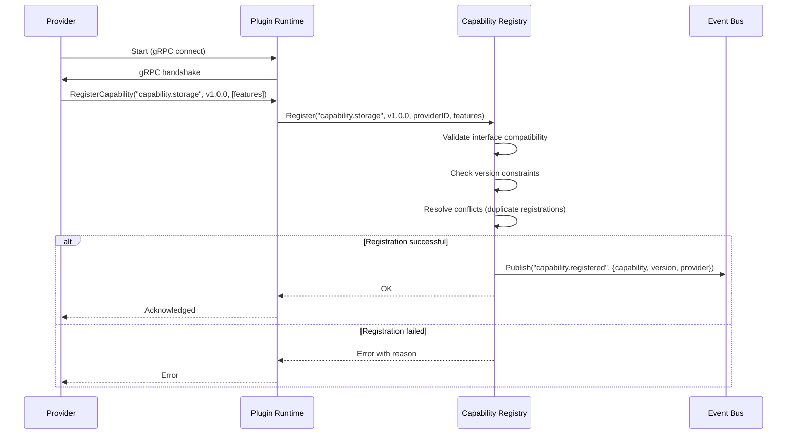

# CloudOS Capability Interfaces

> **Document ID:** CLOUDOS-CAP-001  
> **Status:** v1.0 — Approved  
> **Classification:** Public — Open Source  
> **Last Updated:** 2026-06-29  
> **Audience:** Kernel Engineers, Provider Developers, SDK Authors, AI Engine Developers, Plugin Developers  
> **Depends On:** [01_MASTER_SPEC.md](./01_MASTER_SPEC.md), [05_SYSTEM_ARCHITECTURE.md](./05_SYSTEM_ARCHITECTURE.md), [06_KERNEL_AND_PLUGIN_ARCHITECTURE.md](./06_KERNEL_AND_PLUGIN_ARCHITECTURE.md), [08_KERNEL.md](./08_KERNEL.md)

---

## Table of Contents

1. [Executive Summary](#1-executive-summary)
2. [What is a Capability?](#2-what-is-a-capability)
3. [Capability Design Principles](#3-capability-design-principles)
4. [Capability Interface Catalog](#4-capability-interface-catalog)
   - [4.1 Compute Capability](#41-compute-capability)
   - [4.2 Storage Capability](#42-storage-capability)
   - [4.3 Database Capability](#43-database-capability)
   - [4.4 AI Capability](#44-ai-capability)
   - [4.5 Identity Capability](#45-identity-capability)
   - [4.6 Networking Capability](#46-networking-capability)
   - [4.7 DNS Capability](#47-dns-capability)
   - [4.8 Monitoring Capability](#48-monitoring-capability)
   - [4.9 Search Capability](#49-search-capability)
   - [4.10 Messaging Capability](#410-messaging-capability)
   - [4.11 Email Capability](#411-email-capability)
   - [4.12 Billing Capability](#412-billing-capability)
5. [Capability Contract](#5-capability-contract)
   - [5.1 Idempotency Guarantees](#51-idempotency-guarantees)
   - [5.2 Error Contract](#52-error-contract)
   - [5.3 Context Propagation](#53-context-propagation)
   - [5.4 Timeout & Cancellation](#54-timeout--cancellation)
   - [5.5 Retry Semantics](#55-retry-semantics)
6. [Capability Versioning & Lifecycle](#6-capability-versioning--lifecycle)
   - [6.1 Versioning Scheme](#61-versioning-scheme)
   - [6.2 Interface Evolution Rules](#62-interface-evolution-rules)
   - [6.3 Deprecation & Sunset](#63-deprecation--sunset)
   - [6.4 Multi-Version Coexistence](#64-multi-version-coexistence)
7. [Cross-Cutting Wrappers](#7-cross-cutting-wrappers)
   - [7.1 Authorization Wrapper](#71-authorization-wrapper)
   - [7.2 Audit Wrapper](#72-audit-wrapper)
   - [7.3 Metrics Wrapper](#73-metrics-wrapper)
   - [7.4 Cache Wrapper](#74-cache-wrapper)
   - [7.5 Rate Limit Wrapper](#75-rate-limit-wrapper)
   - [7.6 Circuit Breaker Wrapper](#76-circuit-breaker-wrapper)
   - [7.7 Retry Wrapper](#77-retry-wrapper)
   - [7.8 Wrapper Composition](#78-wrapper-composition)
8. [Capability Registry & Discovery](#8-capability-registry--discovery)
   - [8.1 Registration Flow](#81-registration-flow)
   - [8.2 Discovery & Negotiation](#82-discovery--negotiation)
   - [8.3 Capability Introspection](#83-capability-introspection)
9. [Testing & Mocking](#9-testing--mocking)
   - [9.1 Mock Capabilities](#91-mock-capabilities)
   - [9.2 Testing Patterns](#92-testing-patterns)
10. [Connection to Other Documents](#10-connection-to-other-documents)

---

## 1. Executive Summary

Capabilities are **the central abstraction** of CloudOS. They define **what the system can do** — not how it does it. Every operation a user can perform flows through a capability interface. Capabilities sit between the Kernel (which provides runtime services) and Providers (which implement the actual work).

**The fundamental rule:**

```
Kernel → Capability Interfaces ← Providers
```

- The Kernel **defines** capability interfaces
- Capability interfaces **declare** operations, types, and contracts
- Providers **implement** capability interfaces
- The AI Orchestrator **coordinates** capability execution
- Applications **consume** capabilities through the API Gateway

This document defines every capability interface in full detail: Go interface signatures, request/response types, error semantics, versioning rules, and cross-cutting concerns. It is the contract that every provider must fulfill and every consumer can depend on.

---

## 2. What is a Capability?

### 2.1 Definition

A **Capability** is a Go interface that:

1. **Declares a set of related operations** — e.g., `RunContainer`, `StopContainer`, `Scale` for Compute
2. **Defines input/output types** — typed request and response structs
3. **Establishes error semantics** — what errors can be returned and what they mean
4. **Guarantees behavioral contracts** — idempotency, ordering, consistency
5. **Carries a version** — interfaces evolve over time with backward compatibility

### 2.2 What a Capability is NOT

| Is NOT | Why |
|--------|-----|
| A concrete implementation | That's a Provider |
| A running service | That runs in a Provider |
| Business logic | That belongs in applications |
| A Kernel subsystem | Capabilities are outside the Kernel |
| An API endpoint | Those are in the API Gateway |

### 2.3 Capability vs. Provider vs. Plugin

```
Capability  →  Abstract interface (Go interface)
Provider    →  Concrete implementation of one or more capabilities
Plugin      →  Distributable package (.cosp) containing one or more providers
```

A single plugin can contain multiple providers implementing multiple capabilities. A single capability can have multiple provider implementations.

### 2.4 Capability Naming Convention

Every capability has a reverse-DNS identifier:

```
capability.<domain>.<name>
```

| Capability | Identifier |
|------------|------------|
| Compute | `capability.compute` |
| Storage | `capability.storage` |
| Database | `capability.database` |
| AI | `capability.ai` |
| Identity | `capability.identity` |
| Networking | `capability.networking` |
| DNS | `capability.dns` |
| Monitoring | `capability.monitoring` |
| Search | `capability.search` |
| Messaging | `capability.messaging` |
| Email | `capability.email` |
| Billing | `capability.billing` |

---

## 3. Capability Design Principles

### P1: Interface Minimalism

Every capability interface contains **only the minimum operations** required to express its domain. Everything optional is additive via optional methods or feature negotiation.

```go
// BAD — too much in the interface
type StorageCapability interface {
    CreateBucket(ctx, name, opts)        // Core
    PutObject(ctx, bucket, key, data)     // Core
    GetObject(ctx, bucket, key)           // Core
    DeleteObject(ctx, bucket, key)        // Core
    PresignURL(ctx, bucket, key, expiry)  // Optional — separate interface
    SetLifecycle(ctx, bucket, rule)       // Optional — separate interface
    SetVersioning(ctx, bucket, enabled)   // Optional — separate interface
    GetMetrics(ctx, bucket)               // Monitoring concern
    GetCost(ctx, bucket)                  // Billing concern
}

// GOOD — minimal core + optional extensions
type StorageCapability interface {
    CreateBucket(ctx, bucket, opts) (BucketInfo, error)
    PutObject(ctx, bucket, key, data, opts) (ObjectInfo, error)
    GetObject(ctx, bucket, key) (Object, error)
    DeleteObject(ctx, bucket, key) error
    ListObjects(ctx, bucket, opts) ([]ObjectInfo, error)
}

type StoragePresigner interface {
    PresignURL(ctx, bucket, key, opts) (URL, error)
}

type StorageLifecycler interface {
    SetLifecycleRule(ctx, bucket, rule) error
}
```

### P2: Provider Agnosticity

No capability interface may reference a specific provider, service, or product. All types must be abstract.

```go
// BAD — tied to AWS
type GetObjectResult struct {
    Body        io.ReadCloser
    VersionID   string       // AWS S3-specific
    DeleteMarker bool         // AWS S3-specific
}

// GOOD — provider-agnostic
type GetObjectResult struct {
    Body        io.ReadCloser
    Metadata    map[string]string
    ContentType string
}
```

### P3: Context First

Every method receives a `context.Context` as its first parameter. All timeout, cancellation, tracing, and auth context flows through the context.

```go
type ComputeCapability interface {
    RunContainer(ctx context.Context, req *RunContainerRequest) (*RunContainerResponse, error)
}
```

### P4: Explicit Errors

Every error is typed, structured, and documented. No raw strings. No `fmt.Errorf` in capability contracts.

```go
var (
    ErrBucketNotFound     = &CapabilityError{Code: "BUCKET_NOT_FOUND", HTTPStatus: 404}
    ErrBucketAlreadyExists = &CapabilityError{Code: "BUCKET_ALREADY_EXISTS", HTTPStatus: 409}
    ErrObjectNotFound     = &CapabilityError{Code: "OBJECT_NOT_FOUND", HTTPStatus: 404}
    ErrAccessDenied       = &CapabilityError{Code: "ACCESS_DENIED", HTTPStatus: 403}
    ErrRateLimited        = &CapabilityError{Code: "RATE_LIMITED", HTTPStatus: 429, Retryable: true}
    ErrProviderUnavailable = &CapabilityError{Code: "PROVIDER_UNAVAILABLE", HTTPStatus: 503, Retryable: true}
)
```

### P5: Streaming for Large Payloads

Any operation that could involve large payloads or long-running execution uses streaming (server-sent, bidirectional, or chunked).

```go
type AICapability interface {
    ChatCompletionStream(ctx context.Context, req *ChatCompletionRequest) (<-chan *ChatCompletionChunk, error)
}
```

### P6: Feature Negotiation

Capabilities declare optional features. Consumers check which features a provider supports at runtime.

```go
type StorageInfo struct {
    Version string   // "1.0.0"
    Features []string // ["buckets", "objects", "presigned-urls", "multipart", "lifecycle"]
}
```

### P7: No Panics

Capability implementations must never panic. All error conditions return structured errors.

---

## 4. Capability Interface Catalog

### 4.1 Compute Capability

**Identifier:** `capability.compute`  
**Purpose:** Run, stop, scale, monitor, and manage user workloads.  
**Version:** v1.0.0  

#### Interface Definition

```go
package capability

import (
    "context"
    "io"
    "time"
)

// ComputeCapability defines the interface for running user workloads.
type ComputeCapability interface {
    // RunContainer starts a containerized workload and returns a deployment handle.
    RunContainer(ctx context.Context, req *RunContainerRequest) (*RunContainerResponse, error)

    // StopContainer stops a running container. Idempotent — returns success if already stopped.
    StopContainer(ctx context.Context, req *StopContainerRequest) error

    // RestartContainer restarts a container with optional config changes.
    RestartContainer(ctx context.Context, req *RestartContainerRequest) (*RestartContainerResponse, error)

    // GetContainer returns the current state and metadata of a container.
    GetContainer(ctx context.Context, req *GetContainerRequest) (*ContainerInfo, error)

    // ListContainers returns all containers matching the filter.
    ListContainers(ctx context.Context, req *ListContainersRequest) (*ListContainersResponse, error)

    // GetContainerLogs streams logs from a container.
    GetContainerLogs(ctx context.Context, req *GetContainerLogsRequest) (<-chan *LogLine, error)

    // GetContainerMetrics returns resource usage metrics for a container.
    GetContainerMetrics(ctx context.Context, req *GetContainerMetricsRequest) (*ContainerMetrics, error)

    // Scale sets the desired replica count for a container.
    Scale(ctx context.Context, req *ScaleRequest) (*ScaleResponse, error)

    // Exec executes a command inside a running container.
    Exec(ctx context.Context, req *ExecRequest) (*ExecResponse, error)
}

// Optional — providers that support buildpacks/image building implement this.
type ComputeBuilder interface {
    // BuildImage builds a container image from source.
    BuildImage(ctx context.Context, req *BuildImageRequest) (*BuildImageResponse, error)

    // GetBuildLogs returns the build log stream.
    GetBuildLogs(ctx context.Context, req *GetBuildLogsRequest) (<-chan *LogLine, error)
}

// Optional — providers that support serverless/scale-to-zero implement this.
type ComputeServerless interface {
    // InvokeFunction invokes a serverless function.
    InvokeFunction(ctx context.Context, req *InvokeFunctionRequest) (*InvokeFunctionResponse, error)

    // GetFunctionLogs returns function invocation logs.
    GetFunctionLogs(ctx context.Context, req *GetFunctionLogsRequest) (<-chan *LogLine, error)
}
```

#### Types

```go
type RunContainerRequest struct {
    Name       string            // Container name (unique per project)
    Image      string            // Container image reference
    Command    []string          // Entrypoint override
    Env        map[string]string // Environment variables
    Ports      []PortMapping     // Port mappings
    Resources  *ResourceLimits   // CPU, memory, disk
    Volumes    []VolumeMount     // Volume mounts
    Labels     map[string]string // Metadata labels
    Network    *NetworkConfig    // Network configuration
    Restart    RestartPolicy     // Always, OnFailure, Never
    Timeout    *time.Duration    // Max execution time
}

type RunContainerResponse struct {
    ID        string    // Container ID
    Name      string    // Container name
    Status    string    // Running, Pending, Failed
    CreatedAt time.Time
    Ports     []AssignedPort
    Endpoints []string  // Access URLs
}

type StopContainerRequest struct {
    ID     string
    Force  bool   // SIGKILL instead of SIGTERM
    Timeout *time.Duration // Grace period
}

type RestartContainerRequest struct {
    ID      string
    Config  *RunContainerRequest // Optional updates
}

type RestartContainerResponse struct {
    ID     string
    Status string
}

type GetContainerRequest struct {
    ID string
}

type ContainerInfo struct {
    ID         string
    Name       string
    Image      string
    Status     string            // Running, Stopped, Failed, Pending
    State      string            // Detailed state
    CreatedAt  time.Time
    StartedAt  *time.Time
    FinishedAt *time.Time
    Ports      []AssignedPort
    Resources  *ResourceUsage
    Labels     map[string]string
    Endpoints  []string
    ExitCode   *int32
    Error      string
}

type ListContainersRequest struct {
    Project string
    Status  string      // Filter by status
    Labels  map[string]string
    Limit   int32
    Offset  int32
}

type ListContainersResponse struct {
    Containers []ContainerInfo
    Total      int32
}

type GetContainerLogsRequest struct {
    ID       string
    Tail     int32      // Number of lines from end
    Since    *time.Time
    Follow   bool       // Stream logs
}

type LogLine struct {
    Timestamp time.Time
    Line      string
    Stream    string    // stdout, stderr
}

type GetContainerMetricsRequest struct {
    ID     string
    Period string     // 1m, 5m, 1h, 24h
}

type ContainerMetrics struct {
    CPU     []*MetricPoint
    Memory  []*MetricPoint
    Network []*MetricPoint
    Disk    []*MetricPoint
}

type MetricPoint struct {
    Timestamp time.Time
    Value     float64
    Unit      string
}

type ScaleRequest struct {
    ID       string
    Replicas int32
}

type ScaleResponse struct {
    ID         string
    Replicas   int32
    Status     string
}

type ExecRequest struct {
    ID      string
    Command []string
    WorkDir string
    Env     map[string]string
    Timeout time.Duration
}

type ExecResponse struct {
    Stdout   string
    Stderr   string
    ExitCode int32
}

type PortMapping struct {
    ContainerPort int32
    HostPort      int32
    Protocol      string   // tcp, udp
}

type AssignedPort struct {
    ContainerPort int32
    HostPort      int32
    Protocol      string
    HostIP        string
}

type ResourceLimits struct {
    CPU    string   // e.g., "0.5", "1", "2" (cores)
    Memory string   // e.g., "128Mi", "1Gi"
    Disk   string   // e.g., "1Gi", "10Gi"
}

type ResourceUsage struct {
    CPU    string
    Memory string
    Disk   string
}

type VolumeMount struct {
    Name      string
    Source    string
    Target    string
    ReadOnly  bool
}

type NetworkConfig struct {
    Mode       string   // bridge, host, none
    ExposePort []int32
}

type RestartPolicy string

const (
    RestartAlways    RestartPolicy = "always"
    RestartOnFailure RestartPolicy = "on-failure"
    RestartNever     RestartPolicy = "never"
)

// ComputeBuilder types

type BuildImageRequest struct {
    Name       string
    Source     string            // Git URL, local path, or Dockerfile content
    Dockerfile string            // Dockerfile path or content
    Env        map[string]string
    BuildArgs  map[string]string
    Tags       []string
    Timeout    time.Duration
}

type BuildImageResponse struct {
    ID        string
    ImageRef  string
    Size      int64
    CreatedAt time.Time
}

type GetBuildLogsRequest struct {
    BuildID string
    Follow  bool
}

// ComputeServerless types

type InvokeFunctionRequest struct {
    Name       string
    Payload    []byte
    Headers    map[string]string
    QueryParams map[string]string
    Timeout    time.Duration
}

type InvokeFunctionResponse struct {
    StatusCode int32
    Body       []byte
    Headers    map[string]string
    Duration   time.Duration
}

type GetFunctionLogsRequest struct {
    ID     string
    Tail   int32
    Follow bool
}
```

#### Errors

| Code | HTTP Status | Retryable | Description |
|------|-------------|-----------|-------------|
| `CONTAINER_NOT_FOUND` | 404 | No | The specified container does not exist |
| `CONTAINER_ALREADY_STOPPED` | 409 | No | Container is already in stopped state |
| `CONTAINER_FAILED` | 500 | Yes | Container exited with non-zero code |
| `IMAGE_NOT_FOUND` | 404 | No | Container image does not exist |
| `RESOURCE_EXHAUSTED` | 429 | Yes | Resource limits reached (CPU, memory, disk) |
| `PORT_CONFLICT` | 409 | No | Requested port is already in use |
| `RATE_LIMITED` | 429 | Yes | Provider rate limit exceeded |
| `PROVIDER_UNAVAILABLE` | 503 | Yes | Provider runtime is unavailable |
| `INVALID_IMAGE` | 400 | No | Image name or format is invalid |
| `TIMEOUT` | 504 | Yes | Operation exceeded timeout |

#### Features

| Feature | Description |
|---------|-------------|
| `containers` | Core container lifecycle (run, stop, restart) |
| `logs` | Container log streaming |
| `metrics` | Container resource metrics |
| `scaling` | Horizontal scaling |
| `exec` | Command execution in containers |
| `build` | Image building from source |
| `serverless` | Serverless function invocation |
| `volumes` | Persistent volume mounts |
| `networks` | Custom network configuration |

---

### 4.2 Storage Capability

**Identifier:** `capability.storage`  
**Purpose:** Object storage with S3-compatible API patterns.  
**Version:** v1.0.0  

#### Interface Definition

```go
package capability

import (
    "context"
    "io"
    "time"
)

// StorageCapability defines the interface for object storage.
type StorageCapability interface {
    // CreateBucket creates a new storage bucket.
    CreateBucket(ctx context.Context, req *CreateBucketRequest) (*BucketInfo, error)

    // DeleteBucket deletes an empty bucket. Idempotent.
    DeleteBucket(ctx context.Context, req *DeleteBucketRequest) error

    // GetBucket returns bucket metadata.
    GetBucket(ctx context.Context, req *GetBucketRequest) (*BucketInfo, error)

    // ListBuckets returns all buckets.
    ListBuckets(ctx context.Context, req *ListBucketsRequest) (*ListBucketsResponse, error)

    // PutObject uploads an object to a bucket.
    PutObject(ctx context.Context, req *PutObjectRequest) (*ObjectInfo, error)

    // GetObject downloads an object from a bucket.
    GetObject(ctx context.Context, req *GetObjectRequest) (*Object, error)

    // DeleteObject deletes an object. Idempotent.
    DeleteObject(ctx context.Context, req *DeleteObjectRequest) error

    // ListObjects returns objects in a bucket with optional prefix filter.
    ListObjects(ctx context.Context, req *ListObjectsRequest) (*ListObjectsResponse, error)

    // CopyObject copies an object within or between buckets.
    CopyObject(ctx context.Context, req *CopyObjectRequest) (*ObjectInfo, error)
}

// Optional — presigned URL support.
type StoragePresigner interface {
    PresignUpload(ctx context.Context, req *PresignUploadRequest) (*PresignedURL, error)
    PresignDownload(ctx context.Context, req *PresignDownloadRequest) (*PresignedURL, error)
}

// Optional — multipart upload for large objects.
type StorageMultipartUploader interface {
    CreateMultipartUpload(ctx context.Context, req *CreateMultipartUploadRequest) (*MultipartUpload, error)
    UploadPart(ctx context.Context, req *UploadPartRequest) (*PartInfo, error)
    CompleteMultipartUpload(ctx context.Context, req *CompleteMultipartUploadRequest) (*ObjectInfo, error)
    AbortMultipartUpload(ctx context.Context, req *AbortMultipartUploadRequest) error
    ListParts(ctx context.Context, req *ListPartsRequest) (*ListPartsResponse, error)
}

// Optional — lifecycle management.
type StorageLifecycler interface {
    SetLifecycleRule(ctx context.Context, req *SetLifecycleRuleRequest) error
    GetLifecycleRules(ctx context.Context, req *GetLifecycleRulesRequest) ([]*LifecycleRule, error)
    DeleteLifecycleRule(ctx context.Context, req *DeleteLifecycleRuleRequest) error
}

// Optional — object versioning.
type StorageVersioner interface {
    EnableVersioning(ctx context.Context, bucket string) error
    GetVersioningStatus(ctx context.Context, bucket string) (string, error)
    ListObjectVersions(ctx context.Context, req *ListObjectVersionsRequest) (*ListObjectVersionsResponse, error)
}
```

#### Types

```go
type CreateBucketRequest struct {
    Name   string
    Region string // Optional: provider region
    Labels map[string]string
}

type CreateBucketResponse struct {
    Name       string
    CreatedAt  time.Time
    Region     string
}

type BucketInfo struct {
    Name        string
    CreatedAt   time.Time
    Region      string
    ObjectCount int64
    SizeBytes   int64
    Labels      map[string]string
    Versioning  string // enabled, suspended, disabled
}

type DeleteBucketRequest struct {
    Name string
}

type GetBucketRequest struct {
    Name string
}

type ListBucketsRequest struct {
    Limit  int32
    Offset int32
}

type ListBucketsResponse struct {
    Buckets []BucketInfo
    Total   int32
}

type PutObjectRequest struct {
    Bucket      string
    Key         string
    Body        io.Reader
    ContentType string
    Metadata    map[string]string
    Size        int64  // -1 if unknown
    CacheControl string
}

type ObjectInfo struct {
    Bucket       string
    Key          string
    Size         int64
    ContentType  string
    ETag         string
    LastModified time.Time
    Metadata     map[string]string
    VersionID    string // empty if versioning disabled
}

type GetObjectRequest struct {
    Bucket    string
    Key       string
    Range     string // HTTP range header format: "bytes=0-1023"
    VersionID string // Optional: specific version
}

type Object struct {
    Body        io.ReadCloser
    Info        ObjectInfo
}

type DeleteObjectRequest struct {
    Bucket    string
    Key       string
    VersionID string
}

type ListObjectsRequest struct {
    Bucket    string
    Prefix    string
    Delimiter string
    MaxKeys   int32
    Offset    int32
}

type ListObjectsResponse struct {
    Objects      []ObjectInfo
    Prefixes     []string // Common prefixes when delimiter used
    IsTruncated  bool
    Total        int32
}

type CopyObjectRequest struct {
    SourceBucket      string
    SourceKey         string
    DestinationBucket string
    DestinationKey    string
    Metadata          map[string]string
}

type PresignUploadRequest struct {
    Bucket      string
    Key         string
    ContentType string
    Size        int64
    Expiry      time.Duration
}

type PresignDownloadRequest struct {
    Bucket string
    Key    string
    Expiry time.Duration
}

type PresignedURL struct {
    URL         string
    Method      string
    Headers     map[string]string
    ExpiresAt   time.Time
}

type CreateMultipartUploadRequest struct {
    Bucket      string
    Key         string
    ContentType string
    Metadata    map[string]string
}

type MultipartUpload struct {
    UploadID string
    Bucket   string
    Key      string
}

type UploadPartRequest struct {
    Bucket   string
    Key      string
    UploadID string
    PartNumber int32
    Body     io.Reader
    Size     int64
}

type PartInfo struct {
    PartNumber   int32
    ETag         string
    Size         int64
    LastModified time.Time
}

type CompleteMultipartUploadRequest struct {
    Bucket   string
    Key      string
    UploadID string
    Parts    []*PartInfo
}

type AbortMultipartUploadRequest struct {
    Bucket   string
    Key      string
    UploadID string
}

type ListPartsRequest struct {
    Bucket      string
    Key         string
    UploadID    string
    MaxParts    int32
    PartOffset  int32
}

type ListPartsResponse struct {
    Parts []PartInfo
    Total int32
}

type SetLifecycleRuleRequest struct {
    Bucket string
    Rule   *LifecycleRule
}

type LifecycleRule struct {
    ID          string
    Prefix      string
    Status      string // enabled, disabled
    Expiration  *LifecycleExpiration
    Transitions []*LifecycleTransition
}

type LifecycleExpiration struct {
    Days             int32
    DeleteMarkers    bool
}

type LifecycleTransition struct {
    Days    int32
    StorageClass string
}

type DeleteLifecycleRuleRequest struct {
    Bucket string
    RuleID string
}

type GetLifecycleRulesRequest struct {
    Bucket string
}
```

#### Errors

| Code | HTTP Status | Retryable | Description |
|------|-------------|-----------|-------------|
| `BUCKET_NOT_FOUND` | 404 | No | Bucket does not exist |
| `BUCKET_ALREADY_EXISTS` | 409 | No | Bucket name already taken |
| `BUCKET_NOT_EMPTY` | 409 | No | Cannot delete non-empty bucket |
| `OBJECT_NOT_FOUND` | 404 | No | Object does not exist |
| `OBJECT_ALREADY_EXISTS` | 409 | No | Object key already in use (if not overwrite) |
| `STORAGE_QUOTA_EXCEEDED` | 429 | Yes | Storage quota exceeded |
| `RATE_LIMITED` | 429 | Yes | Provider rate limit exceeded |
| `PROVIDER_UNAVAILABLE` | 503 | Yes | Storage provider unavailable |
| `INVALID_BUCKET_NAME` | 400 | No | Bucket name fails validation |
| `PRESIGN_EXPIRED` | 410 | No | Presigned URL has expired |
| `MULTIPART_INCOMPLETE` | 400 | No | Not all parts uploaded |
| `INVALID_PART` | 400 | No | Part number out of range or ETag mismatch |

#### Features

| Feature | Description |
|---------|-------------|
| `buckets` | Core bucket CRUD |
| `objects` | Core object CRUD |
| `presigned-urls` | Presigned upload/download URLs |
| `multipart` | Multipart upload for large objects |
| `lifecycle` | Object lifecycle rules |
| `versioning` | Object versioning |
| `copy` | Cross-bucket object copy |

---

### 4.3 Database Capability

**Identifier:** `capability.database`  
**Purpose:** Provision, manage, backup, scale, and monitor databases.  
**Version:** v1.0.0  

#### Interface Definition

```go
package capability

import (
    "context"
    "time"
)

// DatabaseCapability defines the interface for database provisioning and management.
type DatabaseCapability interface {
    // Create creates a new database instance.
    Create(ctx context.Context, req *CreateDatabaseRequest) (*DatabaseInfo, error)

    // Get returns database instance information.
    Get(ctx context.Context, req *GetDatabaseRequest) (*DatabaseInfo, error)

    // Delete deletes a database instance. Idempotent.
    Delete(ctx context.Context, req *DeleteDatabaseRequest) error

    // List returns all database instances matching the filter.
    List(ctx context.Context, req *ListDatabasesRequest) (*ListDatabasesResponse, error)

    // GetConnectionString returns the connection string for a database.
    GetConnectionString(ctx context.Context, req *GetConnectionStringRequest) (string, error)

    // Scale changes the resources allocated to a database.
    Scale(ctx context.Context, req *ScaleDatabaseRequest) (*DatabaseInfo, error)

    // CreateBackup initiates a backup of the database.
    CreateBackup(ctx context.Context, req *CreateBackupRequest) (*BackupInfo, error)

    // ListBackups returns all backups for a database.
    ListBackups(ctx context.Context, req *ListBackupsRequest) (*ListBackupsResponse, error)

    // RestoreBackup restores a database from a backup.
    RestoreBackup(ctx context.Context, req *RestoreBackupRequest) (*DatabaseInfo, error)

    // GetMetrics returns database performance metrics.
    GetMetrics(ctx context.Context, req *GetDatabaseMetricsRequest) (*DatabaseMetrics, error)
}

// Optional — read replica support.
type DatabaseReplicator interface {
    CreateReadReplica(ctx context.Context, req *CreateReadReplicaRequest) (*DatabaseInfo, error)
    PromoteReadReplica(ctx context.Context, req *PromoteReadReplicaRequest) (*DatabaseInfo, error)
    DeleteReadReplica(ctx context.Context, req *DeleteReadReplicaRequest) error
}

// Optional — schema migration support.
type DatabaseMigrator interface {
    RunMigration(ctx context.Context, req *RunMigrationRequest) (*MigrationResult, error)
    GetMigrationStatus(ctx context.Context, req *GetMigrationStatusRequest) (*MigrationStatus, error)
    ListMigrations(ctx context.Context, req *ListMigrationsRequest) ([]*MigrationInfo, error)
}
```

#### Types

```go
type CreateDatabaseRequest struct {
    Name       string
    Engine     string    // postgresql, mysql, mongodb, sqlite
    Version    string    // e.g., "16", "8.0", "7.0"
    Size       string    // e.g., "small", "medium", "large" or custom
    StorageGB  int32
    Region     string
    Labels     map[string]string
    Backup     *BackupConfig
    Network    *DatabaseNetworkConfig
}

type DatabaseInfo struct {
    ID            string
    Name          string
    Engine        string
    Version       string
    Status        string    // creating, active, updating, deleting, failed
    Size          string
    StorageGB     int32
    Region        string
    Host          string
    Port          int32
    Labels        map[string]string
    CreatedAt     time.Time
    UpdatedAt     time.Time
    BackupEnabled bool
    Replicas      int32
}

type GetDatabaseRequest struct {
    ID string
}

type DeleteDatabaseRequest struct {
    ID              string
    SkipFinalSnapshot bool
}

type ListDatabasesRequest struct {
    Project string
    Engine  string
    Status  string
    Limit   int32
    Offset  int32
}

type ListDatabasesResponse struct {
    Databases []DatabaseInfo
    Total     int32
}

type GetConnectionStringRequest struct {
    ID       string
    Role     string    // admin, readonly, custom
    Database string    // specific database name
}

type ScaleDatabaseRequest struct {
    ID        string
    Size      string
    StorageGB int32
}

type CreateBackupRequest struct {
    DatabaseID  string
    Name        string
    Description string
}

type BackupInfo struct {
    ID          string
    DatabaseID  string
    Name        string
    Status      string    // pending, running, completed, failed
    Size        int64
    CreatedAt   time.Time
    CompletedAt *time.Time
    Type        string    // manual, automatic
}

type ListBackupsRequest struct {
    DatabaseID string
    Limit      int32
    Offset     int32
}

type ListBackupsResponse struct {
    Backups []BackupInfo
    Total   int32
}

type RestoreBackupRequest struct {
    BackupID   string
    NewName    string    // if set, restores to a new database
    TargetID   string    // if set, restores to an existing database
}

type GetDatabaseMetricsRequest struct {
    ID     string
    Period string    // 1m, 5m, 1h, 24h
}

type DatabaseMetrics struct {
    Connections  []*MetricPoint
    CPU          []*MetricPoint
    Memory       []*MetricPoint
    DiskUsage    []*MetricPoint
    IOPS         []*MetricPoint
    QueryLatency []*MetricPoint
}

type BackupConfig struct {
    Enabled     bool
    Schedule    string  // cron expression
    Retention   int32   // days
}

type DatabaseNetworkConfig struct {
    PublicAccess bool
    AllowedIPs   []string
    PrivateOnly bool
}

type CreateReadReplicaRequest struct {
    DatabaseID string
    Region     string
    Size       string
}

type PromoteReadReplicaRequest struct {
    ReplicaID string
}

type DeleteReadReplicaRequest struct {
    ReplicaID string
}

type RunMigrationRequest struct {
    DatabaseID  string
    Name        string
    UpSQL       string
    DownSQL     string    // optional, for rollback
}

type MigrationResult struct {
    ID        string
    Status    string
    Duration  time.Duration
    Error     string
}

type GetMigrationStatusRequest struct {
    DatabaseID string
    MigrationID string
}

type MigrationStatus struct {
    ID         string
    Name       string
    Status     string    // pending, running, completed, failed, rolled_back
    AppliedAt  *time.Time
    Duration   time.Duration
    Error      string
}

type MigrationInfo struct {
    ID        string
    Name      string
    Status    string
    AppliedAt *time.Time
    Duration  time.Duration
}
```

#### Errors

| Code | HTTP Status | Retryable | Description |
|------|-------------|-----------|-------------|
| `DATABASE_NOT_FOUND` | 404 | No | Database instance does not exist |
| `DATABASE_ALREADY_EXISTS` | 409 | No | Database name already taken |
| `ENGINE_NOT_SUPPORTED` | 400 | No | Database engine is not supported |
| `INVALID_VERSION` | 400 | No | Database version is not available |
| `BACKUP_NOT_FOUND` | 404 | No | Backup does not exist |
| `BACKUP_FAILED` | 500 | Yes | Backup operation failed |
| `RESTORE_FAILED` | 500 | Yes | Restore operation failed |
| `SCALE_IN_PROGRESS` | 409 | No | A scaling operation is already in progress |
| `QUOTA_EXCEEDED` | 429 | Yes | Database quota exceeded |
| `REPLICA_LIMIT_REACHED` | 400 | No | Maximum number of read replicas reached |

#### Features

| Feature | Description |
|---------|-------------|
| `provisioning` | Create, get, delete, list databases |
| `connection-strings` | Generate connection strings |
| `scaling` | Scale database resources |
| `backups` | Manual and automatic backups |
| `restore` | Restore from backup |
| `metrics` | Database performance metrics |
| `read-replicas` | Create and manage read replicas |
| `migrations` | Run and track schema migrations |

---

### 4.4 AI Capability

**Identifier:** `capability.ai`  
**Purpose:** Unified AI inference, embeddings, model routing, and streaming.  
**Version:** v1.0.0  

#### Interface Definition

```go
package capability

import (
    "context"
    "io"
    "time"
)

// AICapability defines the interface for AI model inference.
type AICapability interface {
    // ChatCompletion sends a chat completion request and returns the response.
    ChatCompletion(ctx context.Context, req *ChatCompletionRequest) (*ChatCompletionResponse, error)

    // ChatCompletionStream sends a chat request and returns a stream of chunks.
    ChatCompletionStream(ctx context.Context, req *ChatCompletionRequest) (<-chan *ChatCompletionChunk, error)

    // GenerateEmbedding generates an embedding vector for the given input.
    GenerateEmbedding(ctx context.Context, req *EmbeddingRequest) (*EmbeddingResponse, error)

    // ListModels returns available models from the provider.
    ListModels(ctx context.Context, req *ListModelsRequest) (*ListModelsResponse, error)

    // GetModelInfo returns information about a specific model.
    GetModelInfo(ctx context.Context, req *GetModelInfoRequest) (*ModelInfo, error)
}

// Optional — image generation.
type AIImageGeneration interface {
    GenerateImage(ctx context.Context, req *ImageGenerationRequest) (*ImageGenerationResponse, error)
}

// Optional — audio transcription.
type AIAudioTranscription interface {
    TranscribeAudio(ctx context.Context, req *AudioTranscriptionRequest) (*AudioTranscriptionResponse, error)
}

// Optional — tool/function calling.
type AIToolCalling interface {
    // A provider supports tool calling if it includes both content and tool_calls in responses.
    // Support is indicated via the `tool-calling` feature flag.
}

// Optional — structured output (JSON mode).
type AIStructuredOutput interface {
    // A provider supports structured output if it can enforce response JSON schemas.
    // Support is indicated via the `structured-output` feature flag.
}
```

#### Types

```go
type ChatCompletionRequest struct {
    Model       string           // Model identifier
    Messages    []*Message       // Conversation messages
    SystemPrompt string          // System prompt override
    Temperature float32          // 0.0 - 2.0
    MaxTokens   int32            // Max tokens in response
    TopP        float32          // Nucleus sampling
    Stop        []string         // Stop sequences
    Tools       []*Tool          // Available tools (if supported)
    ToolChoice  string           // "auto", "required", or specific tool name
    ResponseFormat *ResponseFormat // JSON schema for structured output
    Stream      bool             // Enable streaming
    Metadata    map[string]string
    UserID      string           // For rate limiting per user
}

type ChatCompletionRequest struct {
    Model       string
    Messages    []*Message
    System      string
    Temperature float32
    MaxTokens   int32
    TopP        float32
    Stop        []string
    Tools       []*Tool
    ToolChoice  string
    ResponseFormat *ResponseFormat
    Stream      bool
    Metadata    map[string]string
    User        string
}

type Message struct {
    Role       string           // system, user, assistant, tool
    Content    string
    Name       string           // Optional: function name for tool responses
    ToolCallID string           // Optional: for tool response messages
    ToolCalls  []*ToolCall      // Optional: for assistant messages
}

type Tool struct {
    Type        string          // "function"
    Function    *FunctionTool
}

type FunctionTool struct {
    Name        string
    Description string
    Parameters  JSONSchema      // JSON Schema object
    Strict      bool            // Strict parameter adherence
}

type ToolCall struct {
    ID       string
    Type     string
    Function struct {
        Name      string
        Arguments string        // JSON-encoded arguments
    }
}

type ResponseFormat struct {
    Type       string           // "text", "json_object", "json_schema"
    JSONSchema *JSONSchema      // Required for json_schema type
}

type JSONSchema struct {
    Name        string
    Description string
    Schema      map[string]interface{}
    Strict      bool
}

type ChatCompletionResponse struct {
    ID                string
    Model             string
    Choices           []*Choice
    Usage             *Usage
    CreatedAt         time.Time
}

type Choice struct {
    Index        int32
    Message      *Message
    FinishReason string   // stop, length, tool_calls, content_filter
}

type ChatCompletionChunk struct {
    ID        string
    Model     string
    Choices   []*ChunkChoice
    Usage     *Usage     // Only on final chunk
}

type ChunkChoice struct {
    Index        int32
    Delta        *MessageDelta
    FinishReason string
}

type MessageDelta struct {
    Role      string
    Content   string
    ToolCalls []*ToolCallDelta
}

type ToolCallDelta struct {
    Index    int32
    ID       string
    Function struct {
        Name      string
        Arguments string
    }
}

type Usage struct {
    PromptTokens     int32
    CompletionTokens int32
    TotalTokens      int32
    CostUSD          float64 // Estimated cost (if available)
}

type EmbeddingRequest struct {
    Model  string
    Input  []string       // Batch of inputs
    User   string
}

type EmbeddingResponse struct {
    Model      string
    Embeddings []*Embedding
    Usage      *Usage
}

type Embedding struct {
    Index   int32
    Vector  []float32
}

type ListModelsRequest struct {
    // Empty — returns all available models
}

type ListModelsResponse struct {
    Models []ModelInfo
}

type ModelInfo struct {
    ID             string
    Name           string
    Provider       string
    Capabilities   []string   // chat, embedding, image, audio, tool-calling, structured-output
    ContextWindow  int32
    MaxOutput      int32
    Pricing        *ModelPricing
    IsDeprecated   bool
}

type ModelPricing struct {
    PromptPricePer1K     float64 // USD per 1K input tokens
    CompletionPricePer1K float64 // USD per 1K output tokens
}

// Image generation

type ImageGenerationRequest struct {
    Model          string
    Prompt         string
    NegativePrompt string
    Size           string           // "1024x1024", "1792x1024"
    Quality        string           // "standard", "hd"
    Style          string           // "natural", "vivid"
    N              int32            // Number of images
    ResponseFormat string           // "url", "b64_json"
}

type ImageGenerationResponse struct {
    Images []*GeneratedImage
}

type GeneratedImage struct {
    URL      string
    B64JSON  string
    RevisedPrompt string
}

// Audio transcription

type AudioTranscriptionRequest struct {
    Model    string
    Audio    io.Reader
    Format   string           // mp3, wav, ogg, flac
    Language string           // ISO 639-1 code
    Prompt   string           // Optional context
    ResponseFormat string     // json, text, srt, vtt
    Temperature float32
}

type AudioTranscriptionResponse struct {
    Text    string
    Segments []*TranscriptionSegment
    Duration float32
}

type TranscriptionSegment struct {
    ID        int32
    Start     float32
    End       float32
    Text      string
    Tokens    []int32
    AvgLogProb float32
}
```

#### Errors

| Code | HTTP Status | Retryable | Description |
|------|-------------|-----------|-------------|
| `MODEL_NOT_FOUND` | 404 | No | Model does not exist or is not available |
| `MODEL_UNAVAILABLE` | 503 | Yes | Model is temporarily unavailable |
| `CONTEXT_LENGTH_EXCEEDED` | 400 | No | Input exceeds model's context window |
| `CONTENT_FILTERED` | 400 | No | Content was filtered by safety system |
| `RATE_LIMITED` | 429 | Yes | Provider rate limit exceeded |
| `QUOTA_EXCEEDED` | 429 | Yes | API quota exceeded |
| `PROVIDER_UNAVAILABLE` | 503 | Yes | AI provider is unavailable |
| `INVALID_API_KEY` | 401 | No | Invalid or expired API key |
| `EMBEDDING_SIZE_MISMATCH` | 400 | No | Input too large for embedding model |
| `IMAGE_GENERATION_FAILED` | 500 | Yes | Image generation failed |

#### Features

| Feature | Description |
|---------|-------------|
| `chat` | Chat completion (non-streaming) |
| `chat-streaming` | Streaming chat completion |
| `embeddings` | Generate embedding vectors |
| `tool-calling` | Function/tool calling support |
| `structured-output` | JSON schema-enforced responses |
| `image-generation` | Generate images from prompts |
| `audio-transcription` | Transcribe audio to text |
| `model-list` | List available models |
| `vision` | Multimodal (image+text) input |

---

### 4.5 Identity Capability

**Identifier:** `capability.identity`  
**Purpose:** External authentication providers — OAuth, SAML, LDAP, WebAuthn.  
**Version:** v1.0.0  

#### Interface Definition

```go
package capability

import (
    "context"
    "time"
)

// IdentityCapability defines the interface for external identity providers.
// Note: CloudOS built-in auth (JWT, PostgreSQL-backed) is a Kernel subsystem,
// NOT a capability. This capability is for external identity providers.
type IdentityCapability interface {
    // Authenticate validates credentials against the identity provider.
    Authenticate(ctx context.Context, req *AuthenticateRequest) (*AuthenticateResponse, error)

    // GetUser returns user information from the identity provider.
    GetUser(ctx context.Context, req *GetUserRequest) (*UserInfo, error)

    // ListUsers returns users from the identity provider (if supported).
    ListUsers(ctx context.Context, req *ListUsersRequest) (*ListUsersResponse, error)

    // GetProviderInfo returns metadata about the identity provider.
    GetProviderInfo(ctx context.Context, req *GetProviderInfoRequest) (*ProviderInfo, error)
}

// Optional — OAuth provider.
type IdentityOAuth interface {
    GetAuthorizationURL(ctx context.Context, req *GetAuthorizationURLRequest) (string, error)
    HandleCallback(ctx context.Context, req *HandleCallbackRequest) (*AuthenticateResponse, error)
    RefreshToken(ctx context.Context, req *RefreshTokenRequest) (*AuthenticateResponse, error)
    RevokeToken(ctx context.Context, req *RevokeTokenRequest) error
}

// Optional — SAML provider.
type IdentitySAML interface {
    GetMetadata(ctx context.Context) (string, error)    // SAML metadata XML
    HandleACS(ctx context.Context, req *ACSRequest) (*AuthenticateResponse, error)
    InitiateSSO(ctx context.Context, req *InitiateSSORequest) (string, error)
}

// Optional — LDAP provider.
type IdentityLDAP interface {
    Search(ctx context.Context, req *LDAPSearchRequest) (*LDAPSearchResponse, error)
    Sync(ctx context.Context) (*SyncResult, error)  // Sync LDAP directory
}

// Optional — WebAuthn provider.
type IdentityWebAuthn interface {
    BeginRegistration(ctx context.Context, req *BeginRegistrationRequest) (*CredentialCreationOptions, error)
    FinishRegistration(ctx context.Context, req *FinishRegistrationRequest) error
    BeginAuthentication(ctx context.Context, req *BeginAuthenticationRequest) (*CredentialRequestOptions, error)
    FinishAuthentication(ctx context.Context, req *FinishAuthenticationRequest) (*AuthenticateResponse, error)
}
```

#### Types

```go
type AuthenticateRequest struct {
    Provider string            // Provider identifier
    Credentials map[string]string // Provider-specific credentials
}

type AuthenticateResponse struct {
    Provider     string
    ProviderUserID string
    Email        string
    Name         string
    RawAttributes map[string]interface{}
}

type GetUserRequest struct {
    Provider string
    UserID   string
}

type UserInfo struct {
    ID           string
    Email        string
    Name         string
    DisplayName  string
    AvatarURL    string
    Attributes   map[string]interface{}
    CreatedAt    time.Time
    LastLogin    *time.Time
}

type ListUsersRequest struct {
    Provider string
    Limit    int32
    Offset   int32
    Filter   string
}

type ListUsersResponse struct {
    Users []UserInfo
    Total int32
}

type GetProviderInfoRequest struct {
    Provider string
}

type ProviderInfo struct {
    ID            string
    Type          string   // oauth, saml, ldap, webauthn
    Name          string
    Icon          string
    Enabled       bool
    ConfigFields  []*ConfigField
}

type ConfigField struct {
    Key      string
    Label    string
    Type     string   // text, password, url, select
    Required bool
    Secret   bool     // Stored in Secrets Manager
}

// OAuth types

type GetAuthorizationURLRequest struct {
    Provider   string
    RedirectURI string
    State       string
    Scopes      []string
}

type HandleCallbackRequest struct {
    Provider    string
    Code        string
    State       string
    RedirectURI string
}

type RefreshTokenRequest struct {
    Provider     string
    RefreshToken string
}

type RevokeTokenRequest struct {
    Provider  string
    Token     string
    TokenHint string // access_token or refresh_token
}

// SAML types

type ACSRequest struct {
    Provider      string
    SAMLResponse  string
    RelayState    string
}

type InitiateSSORequest struct {
    Provider    string
    RedirectURI string
}

// LDAP types

type LDAPSearchRequest struct {
    Provider  string
    BaseDN    string
    Filter    string
    Scope     string   // base, one, sub
    Attributes []string
    Limit     int32
}

type LDAPSearchResponse struct {
    Entries []map[string][]string
    Total   int32
}

type SyncResult struct {
    Added    int32
    Updated  int32
    Removed  int32
    Failed   int32
    Errors   []string
}

// WebAuthn types

type BeginRegistrationRequest struct {
    Provider   string
    UserID     string
    UserName   string
    UserDisplayName string
}

type CredentialCreationOptions struct {
    PublicKey *PublicKeyCredentialCreationOptions
}

type FinishRegistrationRequest struct {
    Provider   string
    Credential *CredentialCreationResponse
}

type BeginAuthenticationRequest struct {
    Provider string
    UserID   string
}

type CredentialRequestOptions struct {
    PublicKey *PublicKeyCredentialRequestOptions
}

type FinishAuthenticationRequest struct {
    Provider   string
    Credential *CredentialAuthenticationResponse
}
```

#### Errors

| Code | HTTP Status | Retryable | Description |
|------|-------------|-----------|-------------|
| `PROVIDER_NOT_FOUND` | 404 | No | Identity provider not configured |
| `AUTHENTICATION_FAILED` | 401 | No | Invalid credentials |
| `USER_NOT_FOUND` | 404 | No | User does not exist in provider |
| `TOKEN_EXPIRED` | 401 | No | Token has expired |
| `TOKEN_REVOKED` | 401 | No | Token has been revoked |
| `PROVIDER_UNAVAILABLE` | 503 | Yes | Identity provider is unreachable |
| `INVALID_CALLBACK` | 400 | No | Invalid OAuth/SAML callback |
| `WEB_AUTHN_FAILED` | 400 | No | WebAuthn assertion failed |

#### Features

| Feature | Description |
|---------|-------------|
| `authenticate` | Direct credential authentication |
| `user-info` | Retrieve user profile information |
| `user-list` | List users in the identity provider |
| `oauth` | OAuth 2.0 / OIDC authorization flow |
| `saml` | SAML 2.0 SSO |
| `ldap` | LDAP directory search and sync |
| `webauthn` | Passkey/FIDO2 WebAuthn |

---

### 4.6 Networking Capability

**Identifier:** `capability.networking`  
**Purpose:** Firewalls, load balancers, VPNs, traffic routing, SSL/TLS.  
**Version:** v1.0.0  

#### Interface Definition

```go
package capability

import (
    "context"
    "time"
)

// NetworkingCapability defines the interface for network infrastructure management.
type NetworkingCapability interface {
    // CreateFirewallRule creates a new firewall rule.
    CreateFirewallRule(ctx context.Context, req *CreateFirewallRuleRequest) (*FirewallRule, error)

    // ListFirewallRules returns all firewall rules.
    ListFirewallRules(ctx context.Context, req *ListFirewallRulesRequest) (*ListFirewallRulesResponse, error)

    // DeleteFirewallRule deletes a firewall rule. Idempotent.
    DeleteFirewallRule(ctx context.Context, req *DeleteFirewallRuleRequest) error

    // ProvisionLoadBalancer creates a load balancer.
    ProvisionLoadBalancer(ctx context.Context, req *ProvisionLoadBalancerRequest) (*LoadBalancer, error)

    // GetLoadBalancer returns load balancer information.
    GetLoadBalancer(ctx context.Context, req *GetLoadBalancerRequest) (*LoadBalancer, error)

    // ListLoadBalancers returns all load balancers.
    ListLoadBalancers(ctx context.Context, req *ListLoadBalancersRequest) (*ListLoadBalancersResponse, error)

    // DeleteLoadBalancer deletes a load balancer. Idempotent.
    DeleteLoadBalancer(ctx context.Context, req *DeleteLoadBalancerRequest) error

    // ProvisionCertificate provisions an SSL/TLS certificate.
    ProvisionCertificate(ctx context.Context, req *ProvisionCertificateRequest) (*Certificate, error)

    // ListCertificates returns all certificates.
    ListCertificates(ctx context.Context, req *ListCertificatesRequest) (*ListCertificatesResponse, error)

    // DeleteCertificate deletes a certificate. Idempotent.
    DeleteCertificate(ctx context.Context, req *DeleteCertificateRequest) error
}

// Optional — VPN support.
type NetworkingVPN interface {
    CreateVPNConnection(ctx context.Context, req *CreateVPNConnectionRequest) (*VPNConnection, error)
    GetVPNConnection(ctx context.Context, req *GetVPNConnectionRequest) (*VPNConnection, error)
    DeleteVPNConnection(ctx context.Context, req *DeleteVPNConnectionRequest) error
    GetVPNConfig(ctx context.Context, req *GetVPNConfigRequest) (string, error)
}

// Optional — CDN support.
type NetworkingCDN interface {
    PurgeCache(ctx context.Context, req *PurgeCacheRequest) error
    GetCacheStats(ctx context.Context, req *GetCacheStatsRequest) (*CacheStats, error)
}
```

#### Types

```go
type CreateFirewallRuleRequest struct {
    Name        string
    Description string
    Direction   string       // inbound, outbound
    Source      string       // IP, CIDR, security-group
    Destination string       // IP, CIDR, security-group
    Port        string       // Port or range: "80", "8000-9000"
    Protocol    string       // tcp, udp, icmp, any
    Action      string       // allow, deny
    Priority    int32
    Labels      map[string]string
}

type FirewallRule struct {
    ID          string
    Name        string
    Direction   string
    Source      string
    Destination string
    Port        string
    Protocol    string
    Action      string
    Priority    int32
    Status      string
    CreatedAt   time.Time
    UpdatedAt   time.Time
}

type ListFirewallRulesRequest struct {
    Direction string
    Limit     int32
    Offset    int32
}

type ListFirewallRulesResponse struct {
    Rules []FirewallRule
    Total int32
}

type DeleteFirewallRuleRequest struct {
    ID string
}

type ProvisionLoadBalancerRequest struct {
    Name         string
    Type         string         // http, https, tcp, udp
    Port         int32
    Protocol     string
    Targets      []string       // Target addresses or service IDs
    HealthCheck  *HealthCheckConfig
    SSLEnabled   bool
    CertificateID string
    StickySessions bool
    Algorithm    string         // round_robin, least_connections, ip_hash
}

type LoadBalancer struct {
    ID           string
    Name         string
    Type         string
    Status       string
    Endpoint     string
    Port         int32
    Targets      []string
    CreatedAt    time.Time
}

type GetLoadBalancerRequest struct {
    ID string
}

type ListLoadBalancersRequest struct {
    Limit  int32
    Offset int32
}

type ListLoadBalancersResponse struct {
    LoadBalancers []LoadBalancer
    Total         int32
}

type DeleteLoadBalancerRequest struct {
    ID string
}

type HealthCheckConfig struct {
    Path     string
    Port     int32
    Interval int32      // seconds
    Timeout  int32      // seconds
    HealthyThreshold   int32
    UnhealthyThreshold int32
}

type ProvisionCertificateRequest struct {
    Name       string
    Domains    []string
    Provider   string       // lets-encrypt, custom, existing
    AutoRenew  bool
}

type Certificate struct {
    ID           string
    Name         string
    Domains      []string
    Issuer       string
    Status       string         // pending, active, expired, failed
    ExpiresAt    time.Time
    AutoRenew    bool
    Fingerprint  string
}

type ListCertificatesRequest struct {
    Limit  int32
    Offset int32
}

type ListCertificatesResponse struct {
    Certificates []Certificate
    Total        int32
}

type DeleteCertificateRequest struct {
    ID string
}

type CreateVPNConnectionRequest struct {
    Name        string
    Type        string         // wireguard, openvpn, ipsec
    Endpoint    string
    Config      map[string]string
}

type VPNConnection struct {
    ID        string
    Name      string
    Type      string
    Status    string
    Endpoint  string
    CreatedAt time.Time
}

type GetVPNConnectionRequest struct {
    ID string
}

type DeleteVPNConnectionRequest struct {
    ID string
}

type GetVPNConfigRequest struct {
    ID string
}
```

#### Errors

| Code | HTTP Status | Retryable | Description |
|------|-------------|-----------|-------------|
| `RULE_NOT_FOUND` | 404 | No | Firewall rule not found |
| `LOAD_BALANCER_NOT_FOUND` | 404 | No | Load balancer not found |
| `CERTIFICATE_NOT_FOUND` | 404 | No | Certificate not found |
| `CERTIFICATE_EXPIRED` | 400 | No | Certificate has expired |
| `CERTIFICATE_FAILED` | 500 | Yes | Certificate provisioning failed |
| `LOAD_BALANCER_FAILED` | 500 | Yes | Load balancer provisioning failed |
| `INVALID_TARGET` | 400 | No | Invalid load balancer target |
| `DOMAIN_NOT_VERIFIED` | 400 | No | Domain ownership not verified |
| `VPN_NOT_FOUND` | 404 | No | VPN connection not found |

#### Features

| Feature | Description |
|---------|-------------|
| `firewall` | Firewall rule management |
| `load-balancing` | Load balancer provisioning |
| `certificates` | SSL/TLS certificate management |
| `vpn` | VPN connection management |
| `cdn` | CDN cache management |

---

### 4.7 DNS Capability

**Identifier:** `capability.dns`  
**Purpose:** Domain name management, DNS records, propagation checks.  
**Version:** v1.0.0  

#### Interface Definition

```go
package capability

import (
    "context"
    "time"
)

// DNSCapability defines the interface for DNS management.
type DNSCapability interface {
    // CreateRecord creates a new DNS record.
    CreateRecord(ctx context.Context, req *CreateDNSRecordRequest) (*DNSRecord, error)

    // GetRecord returns a DNS record.
    GetRecord(ctx context.Context, req *GetDNSRecordRequest) (*DNSRecord, error)

    // UpdateRecord updates an existing DNS record.
    UpdateRecord(ctx context.Context, req *UpdateDNSRecordRequest) (*DNSRecord, error)

    // DeleteRecord deletes a DNS record. Idempotent.
    DeleteRecord(ctx context.Context, req *DeleteDNSRecordRequest) error

    // ListRecords returns all DNS records for a zone.
    ListRecords(ctx context.Context, req *ListDNSRecordsRequest) (*ListDNSRecordsResponse, error)

    // ListZones returns all DNS zones (domains).
    ListZones(ctx context.Context, req *ListDNSZonesRequest) (*ListDNSZonesResponse, error)

    // CheckPropagation checks DNS propagation status.
    CheckPropagation(ctx context.Context, req *CheckPropagationRequest) (*PropagationStatus, error)
}
```

#### Types

```go
type CreateDNSRecordRequest struct {
    ZoneID   string
    Name     string       // Subdomain or @ for root
    Type     string       // A, AAAA, CNAME, MX, TXT, NS, SRV, CAA
    Content  string       // Record value
    TTL      int32        // Time to live in seconds
    Priority int32        // For MX records
    Proxied  bool         // Proxy through Cloudflare (if supported)
}

type DNSRecord struct {
    ID        string
    ZoneID    string
    ZoneName  string
    Name      string
    Type      string
    Content   string
    TTL       int32
    Priority  int32
    Proxied   bool
    Status    string
    CreatedAt time.Time
    UpdatedAt time.Time
}

type GetDNSRecordRequest struct {
    ZoneID   string
    RecordID string
}

type UpdateDNSRecordRequest struct {
    ZoneID   string
    RecordID string
    Name     string
    Type     string
    Content  string
    TTL      int32
    Priority int32
    Proxied  bool
}

type DeleteDNSRecordRequest struct {
    ZoneID   string
    RecordID string
}

type ListDNSRecordsRequest struct {
    ZoneID string
    Type   string     // Optional filter by record type
    Name   string     // Optional filter by name
    Limit  int32
    Offset int32
}

type ListDNSRecordsResponse struct {
    Records []DNSRecord
    Total   int32
}

type ListDNSZonesRequest struct {
    Limit  int32
    Offset int32
}

type DNSZone struct {
    ID        string
    Name      string
    Status    string
    NameServers []string
    CreatedAt time.Time
}

type ListDNSZonesResponse struct {
    Zones []DNSZone
    Total int32
}

type CheckPropagationRequest struct {
    ZoneID   string
    RecordID string
}

type PropagationStatus struct {
    Status    string       // propagated, propagating, pending
    Nameservers []PropagationServer
}

type PropagationServer struct {
    Name     string
    Status   string       // ok, pending, mismatched
    Value    string
}
```

#### Errors

| Code | HTTP Status | Retryable | Description |
|------|-------------|-----------|-------------|
| `ZONE_NOT_FOUND` | 404 | No | DNS zone not found |
| `RECORD_NOT_FOUND` | 404 | No | DNS record not found |
| `RECORD_ALREADY_EXISTS` | 409 | No | DNS record with same name/type exists |
| `INVALID_RECORD_TYPE` | 400 | No | Unsupported DNS record type |
| `INVALID_DOMAIN` | 400 | No | Invalid domain name |
| `PROPAGATION_TIMEOUT` | 504 | Yes | DNS propagation check timed out |
| `PROVIDER_UNAVAILABLE` | 503 | Yes | DNS provider unavailable |

#### Features

| Feature | Description |
|---------|-------------|
| `zones` | List/manage DNS zones |
| `records` | DNS record CRUD |
| `propagation` | Check DNS propagation status |
| `proxy` | DDoS protection / proxy through provider |

---

### 4.8 Monitoring Capability

**Identifier:** `capability.monitoring`  
**Purpose:** Metrics collection, alerting, dashboards, logging.  
**Version:** v1.0.0  

#### Interface Definition

```go
package capability

import (
    "context"
    "time"
)

// MonitoringCapability defines the interface for monitoring and observability.
type MonitoringCapability interface {
    // RecordMetric records a metric data point.
    RecordMetric(ctx context.Context, req *RecordMetricRequest) error

    // QueryMetrics queries metric data points.
    QueryMetrics(ctx context.Context, req *QueryMetricsRequest) (*QueryMetricsResponse, error)

    // CreateAlert creates an alert rule.
    CreateAlert(ctx context.Context, req *CreateAlertRequest) (*Alert, error)

    // UpdateAlert updates an existing alert rule.
    UpdateAlert(ctx context.Context, req *UpdateAlertRequest) (*Alert, error)

    // DeleteAlert deletes an alert rule. Idempotent.
    DeleteAlert(ctx context.Context, req *DeleteAlertRequest) error

    // ListAlerts returns all alert rules.
    ListAlerts(ctx context.Context, req *ListAlertsRequest) (*ListAlertsResponse, error)

    // ListAlertEvents returns alert firing history.
    ListAlertEvents(ctx context.Context, req *ListAlertEventsRequest) (*ListAlertEventsResponse, error)

    // CreateDashboard creates a monitoring dashboard.
    CreateDashboard(ctx context.Context, req *CreateDashboardRequest) (*Dashboard, error)

    // GetDashboard returns a dashboard.
    GetDashboard(ctx context.Context, req *GetDashboardRequest) (*Dashboard, error)

    // ListDashboards returns all dashboards.
    ListDashboards(ctx context.Context, req *ListDashboardsRequest) (*ListDashboardsResponse, error)

    // DeleteDashboard deletes a dashboard. Idempotent.
    DeleteDashboard(ctx context.Context, req *DeleteDashboardRequest) error

    // PushLog ingests a log entry.
    PushLog(ctx context.Context, req *PushLogRequest) error

    // QueryLogs searches logs.
    QueryLogs(ctx context.Context, req *QueryLogsRequest) (*QueryLogsResponse, error)
}

// Optional — distributed tracing.
type MonitoringTracing interface {
    PushSpan(ctx context.Context, req *PushSpanRequest) error
    QueryTraces(ctx context.Context, req *QueryTracesRequest) (*QueryTracesResponse, error)
}

// Optional — synthetic monitoring.
type MonitoringSynthetic interface {
    CreateCheck(ctx context.Context, req *CreateCheckRequest) (*Check, error)
    GetCheckResults(ctx context.Context, req *GetCheckResultsRequest) (*CheckResults, error)
}
```

#### Types

```go
type RecordMetricRequest struct {
    Name       string
    Value      float64
    Labels     map[string]string
    Timestamp  time.Time
    Type       string       // gauge, counter, histogram
}

type QueryMetricsRequest struct {
    Name       string
    Labels     map[string]string
    StartTime  time.Time
    EndTime    time.Time
    Step       string       // Resolution: "1m", "5m", "1h"
    Aggregation string      // avg, sum, min, max, count
}

type QueryMetricsResponse struct {
    Series []*MetricSeries
}

type MetricSeries struct {
    Labels map[string]string
    Points []*MetricPoint
}

type CreateAlertRequest struct {
    Name        string
    Description string
    Severity    string       // critical, warning, info
    Condition   string       // PromQL-like expression
    Duration    string       // Must persist for this duration
    Actions     []*AlertAction
    Enabled     bool
    Labels      map[string]string
}

type Alert struct {
    ID          string
    Name        string
    Description string
    Severity    string
    Condition   string
    Duration    string
    Actions     []*AlertAction
    Enabled     bool
    Status      string       // ok, firing, pending
    Labels      map[string]string
    CreatedAt   time.Time
    UpdatedAt   time.Time
}

type AlertAction struct {
    Type    string       // email, webhook, slack, pagerduty
    Target  string
    Config  map[string]string
}

type UpdateAlertRequest struct {
    ID          string
    Name        string
    Description string
    Severity    string
    Condition   string
    Duration    string
    Actions     []*AlertAction
    Enabled     bool
}

type DeleteAlertRequest struct {
    ID string
}

type ListAlertsRequest struct {
    Limit  int32
    Offset int32
}

type ListAlertsResponse struct {
    Alerts []Alert
    Total  int32
}

type AlertEvent struct {
    ID        string
    AlertID   string
    AlertName string
    Severity  string
    Status    string       // firing, resolved
    StartedAt time.Time
    EndedAt   *time.Time
    Value     float64
    Labels    map[string]string
}

type ListAlertEventsRequest struct {
    AlertID  string
    Status   string
    StartTime time.Time
    EndTime   time.Time
    Limit    int32
    Offset   int32
}

type ListAlertEventsResponse struct {
    Events []AlertEvent
    Total  int32
}

type CreateDashboardRequest struct {
    Name        string
    Description string
    Panels      []*DashboardPanel
    Labels      map[string]string
}

type Dashboard struct {
    ID          string
    Name        string
    Description string
    Panels      []*DashboardPanel
    Labels      map[string]string
    CreatedAt   time.Time
    UpdatedAt   time.Time
}

type DashboardPanel struct {
    Title   string
    Type    string       // graph, stat, table, heatmap, logs
    Query   string
    Width   int32        // 1-12 (grid units)
    Height  int32
    Options map[string]interface{}
}

type GetDashboardRequest struct {
    ID string
}

type ListDashboardsRequest struct {
    Limit  int32
    Offset int32
}

type ListDashboardsResponse struct {
    Dashboards []Dashboard
    Total      int32
}

type DeleteDashboardRequest struct {
    ID string
}

type PushLogRequest struct {
    Message    string
    Level      string       // debug, info, warn, error
    Service    string
    Labels     map[string]string
    Timestamp  time.Time
}

type QueryLogsRequest struct {
    Query       string
    StartTime   time.Time
    EndTime     time.Time
    Limit       int32
    Offset      int32
    Order       string       // asc, desc
}

type LogEntry struct {
    Timestamp time.Time
    Message   string
    Level     string
    Service   string
    Labels    map[string]string
}

type QueryLogsResponse struct {
    Entries []LogEntry
    Total   int32
}

type PushSpanRequest struct {
    TraceID    string
    SpanID     string
    ParentSpanID string
    Name       string
    Service    string
    StartTime  time.Time
    EndTime    time.Time
    Status     string       // ok, error
    Attributes map[string]string
}

type QueryTracesRequest struct {
    TraceID string
    Service string
    StartTime time.Time
    EndTime   time.Time
    Limit    int32
}

type Trace struct {
    TraceID string
    Spans   []Span
    Duration time.Duration
    Services []string
}

type Span struct {
    SpanID     string
    ParentSpanID string
    Name       string
    Service    string
    StartTime  time.Time
    EndTime    time.Time
    Duration   time.Duration
    Status     string
    Attributes map[string]string
}

type QueryTracesResponse struct {
    Traces []Trace
    Total  int32
}
```

#### Errors

| Code | HTTP Status | Retryable | Description |
|------|-------------|-----------|-------------|
| `ALERT_NOT_FOUND` | 404 | No | Alert rule not found |
| `DASHBOARD_NOT_FOUND` | 404 | No | Dashboard not found |
| `INVALID_METRIC_QUERY` | 400 | No | Invalid metric query expression |
| `METRIC_NOT_FOUND` | 404 | No | Metric name not found |
| `ALERT_LIMIT_REACHED` | 400 | No | Maximum number of alerts reached |
| `DATA_RETENTION_EXCEEDED` | 400 | No | Query range exceeds data retention period |

#### Features

| Feature | Description |
|---------|-------------|
| `metrics` | Record and query metrics |
| `alerts` | Create and manage alert rules |
| `alert-events` | Alert firing history |
| `dashboards` | Create and manage dashboards |
| `logs` | Ingest and search logs |
| `tracing` | Distributed tracing |
| `synthetics` | Synthetic monitoring checks |

---

### 4.9 Search Capability

**Identifier:** `capability.search`  
**Purpose:** Full-text and semantic search across any indexed content.  
**Version:** v1.0.0  

#### Interface Definition

```go
package capability

import (
    "context"
    "time"
)

// SearchCapability defines the interface for search functionality.
type SearchCapability interface {
    // Index indexes a document for search.
    Index(ctx context.Context, req *IndexRequest) error

    // Search performs a search query.
    Search(ctx context.Context, req *SearchRequest) (*SearchResponse, error)

    // Delete deletes a document from the index. Idempotent.
    Delete(ctx context.Context, req *DeleteIndexRequest) error

    // GetIndex returns index metadata.
    GetIndex(ctx context.Context, req *GetIndexRequest) (*IndexInfo, error)

    // ListIndexes returns all indexes.
    ListIndexes(ctx context.Context, req *ListIndexesRequest) (*ListIndexesResponse, error)

    // ReindexAll rebuilds an index from scratch.
    ReindexAll(ctx context.Context, req *ReindexAllRequest) (*ReindexStatus, error)

    // GetReindexStatus returns the status of a reindex operation.
    GetReindexStatus(ctx context.Context, req *GetReindexStatusRequest) (*ReindexStatus, error)
}

// Optional — vector/semantic search.
type SearchVector interface {
    // IndexVector indexes a document with a vector embedding.
    IndexVector(ctx context.Context, req *IndexVectorRequest) error

    // VectorSearch performs a vector similarity search.
    VectorSearch(ctx context.Context, req *VectorSearchRequest) (*SearchResponse, error)
}

// Optional — autocomplete/suggest.
type SearchSuggest interface {
    // Suggest returns autocomplete suggestions for a partial query.
    Suggest(ctx context.Context, req *SuggestRequest) (*SuggestResponse, error)
}
```

#### Types

```go
type IndexRequest struct {
    Index     string
    ID        string
    Document  map[string]interface{}
}

type SearchRequest struct {
    Index       string
    Query       string
    Filters     map[string]interface{}
    Sort        string
    Limit       int32
    Offset      int32
    SearchFields []string
    Highlight   *HighlightConfig
}

type SearchResponse struct {
    Hits       []*SearchHit
    Total      int32
    Facets     map[string][]*FacetCount
    Took       time.Duration
}

type SearchHit struct {
    ID          string
    Score       float64
    Document    map[string]interface{}
    Highlights  map[string][]string
}

type HighlightConfig struct {
    Fields    []string
    PreTag    string
    PostTag   string
}

type FacetCount struct {
    Value string
    Count int32
}

type DeleteIndexRequest struct {
    Index  string
    ID     string
    Filter map[string]interface{} // Delete by filter (optional)
}

type GetIndexRequest struct {
    Index string
}

type IndexInfo struct {
    Name          string
    DocumentCount int32
    StorageSize   int64
    CreatedAt     time.Time
    UpdatedAt     time.Time
}

type ListIndexesRequest struct {
    Limit  int32
    Offset int32
}

type ListIndexesResponse struct {
    Indexes []IndexInfo
    Total   int32
}

type ReindexAllRequest struct {
    Index string
}

type ReindexStatus struct {
    Index        string
    Status       string    // pending, running, completed, failed
    Progress     float32   // 0.0 - 1.0
    TotalDocuments int32
    ProcessedDocuments int32
    Error        string
}

type GetReindexStatusRequest struct {
    Index string
}

type IndexVectorRequest struct {
    Index    string
    ID       string
    Vector   []float32
    Metadata map[string]interface{}
}

type VectorSearchRequest struct {
    Index      string
    Vector     []float32
    Filters    map[string]interface{}
    Limit      int32
    Offset     int32
    MinScore   float32
}

type SuggestRequest struct {
    Index  string
    Prefix string
    Limit  int32
}

type SuggestResponse struct {
    Suggestions []string
}
```

#### Errors

| Code | HTTP Status | Retryable | Description |
|------|-------------|-----------|-------------|
| `INDEX_NOT_FOUND` | 404 | No | Search index not found |
| `DOCUMENT_NOT_FOUND` | 404 | No | Document not found in index |
| `INVALID_QUERY` | 400 | No | Invalid search query syntax |
| `VECTOR_DIMENSION_MISMATCH` | 400 | No | Vector dimension doesn't match index |
| `REINDEX_IN_PROGRESS` | 409 | No | Reindex already in progress |
| `INDEX_QUOTA_EXCEEDED` | 429 | Yes | Index size quota exceeded |

#### Features

| Feature | Description |
|---------|-------------|
| `fulltext` | Full-text search with relevance scoring |
| `indexing` | Document indexing and management |
| `faceting` | Faceted search with counts |
| `highlighting` | Search result highlighting |
| `vector` | Vector/semantic search |
| `suggest` | Autocomplete suggestions |
| `reindex` | Full index rebuild |

---

### 4.10 Messaging Capability

**Identifier:** `capability.messaging`  
**Purpose:** Pub/sub messaging, event streaming, WebSocket connections.  
**Version:** v1.0.0  

#### Interface Definition

```go
package capability

import (
    "context"
    "time"
)

// MessagingCapability defines the interface for message streaming and pub/sub.
type MessagingCapability interface {
    // Publish publishes a message to a topic.
    Publish(ctx context.Context, req *PublishRequest) (*PublishResponse, error)

    // Subscribe subscribes to a topic and returns a message stream.
    Subscribe(ctx context.Context, req *SubscribeRequest) (<-chan *Message, error)

    // Unsubscribe unsubscribes from a topic.
    Unsubscribe(ctx context.Context, req *UnsubscribeRequest) error

    // CreateTopic creates a new message topic.
    CreateTopic(ctx context.Context, req *CreateTopicRequest) (*TopicInfo, error)

    // DeleteTopic deletes a topic. Idempotent.
    DeleteTopic(ctx context.Context, req *DeleteTopicRequest) error

    // ListTopics returns all topics.
    ListTopics(ctx context.Context, req *ListTopicsRequest) (*ListTopicsResponse, error)

    // QueueSubscribe subscribes to a topic with queue group semantics.
    QueueSubscribe(ctx context.Context, req *QueueSubscribeRequest) (<-chan *Message, error)
}

// Optional — dead letter queue management.
type MessagingDLQ interface {
    ListDeadLetters(ctx context.Context, req *ListDeadLettersRequest) (*ListDeadLettersResponse, error)
    ReplayDeadLetter(ctx context.Context, req *ReplayDeadLetterRequest) error
    PurgeDeadLetters(ctx context.Context, req *PurgeDeadLettersRequest) error
}

// Optional — delayed/scheduled messages.
type MessagingScheduled interface {
    PublishDelayed(ctx context.Context, req *PublishDelayedRequest) (string, error)
    CancelDelayed(ctx context.Context, id string) error
}
```

#### Types

```go
type PublishRequest struct {
    Topic       string
    Payload     []byte
    ContentType string
    Headers     map[string]string
    MessageID   string              // Client-generated for dedup
}

type PublishResponse struct {
    MessageID  string
    Sequence   int64
    PublishedAt time.Time
}

type SubscribeRequest struct {
    Topic     string
    Consumer  string
    AutoAck   bool
    MaxInflight int32
}

type QueueSubscribeRequest struct {
    Topic       string
    QueueGroup  string
    Consumer    string
    AutoAck     bool
    MaxInflight int32
}

type Message struct {
    ID          string
    Topic       string
    Payload     []byte
    ContentType string
    Headers     map[string]string
    Sequence    int64
    Timestamp   time.Time
    Ack         func() error
    Nack        func() error
}

type UnsubscribeRequest struct {
    Topic    string
    Consumer string
}

type CreateTopicRequest struct {
    Name         string
    Description  string
    MaxRetention time.Duration
    MaxSize      int64
    Partitions   int32
}

type TopicInfo struct {
    Name         string
    MessageCount int64
    Retention    time.Duration
    CreatedAt    time.Time
}

type DeleteTopicRequest struct {
    Name string
}

type ListTopicsRequest struct {
    Limit  int32
    Offset int32
}

type ListTopicsResponse struct {
    Topics []TopicInfo
    Total  int32
}

type ListDeadLettersRequest struct {
    Topic  string
    Limit  int32
    Offset int32
}

type DeadLetterMessage struct {
    ID          string
    Topic       string
    OriginalID  string
    Payload     []byte
    Error       string
    FailedCount int32
    LastFailed  time.Time
}

type ListDeadLettersResponse struct {
    Messages []DeadLetterMessage
    Total    int32
}

type ReplayDeadLetterRequest struct {
    Topic string
    ID    string
}

type PurgeDeadLettersRequest struct {
    Topic string
}

type PublishDelayedRequest struct {
    Topic    string
    Payload  []byte
    Headers  map[string]string
    Delay    time.Duration
    Time     time.Time        // Publish at specific time
}
```

#### Errors

| Code | HTTP Status | Retryable | Description |
|------|-------------|-----------|-------------|
| `TOPIC_NOT_FOUND` | 404 | No | Topic does not exist |
| `TOPIC_ALREADY_EXISTS` | 409 | No | Topic name already exists |
| `PUBLISH_FAILED` | 500 | Yes | Failed to publish message |
| `SUBSCRIPTION_LIMIT_REACHED` | 400 | No | Maximum subscriptions reached |
| `MESSAGE_TOO_LARGE` | 400 | No | Message exceeds maximum size |
| `INVALID_TOPIC_NAME` | 400 | No | Invalid topic name format |

#### Features

| Feature | Description |
|---------|-------------|
| `pub-sub` | Publish and subscribe to topics |
| `queue-groups` | Competing consumer queue subscriptions |
| `topics` | Topic CRUD management |
| `dead-letter` | Dead letter queue management and replay |
| `scheduled` | Delayed/scheduled message publishing |
| `at-least-once` | At-least-once delivery guarantees |

---

### 4.11 Email Capability

**Identifier:** `capability.email`  
**Purpose:** Transactional email sending and deliverability management.  
**Version:** v1.0.0  

#### Interface Definition

```go
package capability

import (
    "context"
    "time"
)

// EmailCapability defines the interface for sending transactional emails.
type EmailCapability interface {
    // Send sends a single email.
    Send(ctx context.Context, req *SendEmailRequest) (*SendEmailResponse, error)

    // SendTemplate sends an email using a template.
    SendTemplate(ctx context.Context, req *SendTemplateRequest) (*SendEmailResponse, error)

    // GetDeliveryStatus returns the delivery status of an email.
    GetDeliveryStatus(ctx context.Context, req *GetDeliveryStatusRequest) (*DeliveryStatus, error)

    // ListTemplates returns available email templates.
    ListTemplates(ctx context.Context, req *ListTemplatesRequest) (*ListTemplatesResponse, error)

    // CreateTemplate creates a new email template.
    CreateTemplate(ctx context.Context, req *CreateTemplateRequest) (*TemplateInfo, error)

    // UpdateTemplate updates an existing email template.
    UpdateTemplate(ctx context.Context, req *UpdateTemplateRequest) (*TemplateInfo, error)

    // DeleteTemplate deletes a template. Idempotent.
    DeleteTemplate(ctx context.Context, req *DeleteTemplateRequest) error

    // VerifyDomain initiates domain verification for sending.
    VerifyDomain(ctx context.Context, req *VerifyDomainRequest) (*DomainVerification, error)

    // GetDomainVerificationStatus checks domain verification status.
    GetDomainVerificationStatus(ctx context.Context, req *GetDomainVerificationStatusRequest) (*DomainVerification, error)
}
```

#### Types

```go
type SendEmailRequest struct {
    From        *EmailAddress
    To          []*EmailAddress
    CC          []*EmailAddress
    BCC         []*EmailAddress
    Subject     string
    TextBody    string
    HTMLBody    string
    ReplyTo     *EmailAddress
    Headers     map[string]string
    Attachments []*EmailAttachment
    Tags        map[string]string
}

type EmailAddress struct {
    Name    string
    Address string
}

type EmailAttachment struct {
    Filename    string
    Content     []byte
    ContentType string
    Disposition string   // attachment, inline
}

type SendEmailResponse struct {
    MessageID string
    Status    string    // queued, sent, deferred
}

type SendTemplateRequest struct {
    From          *EmailAddress
    To            []*EmailAddress
    TemplateID    string
    TemplateData  map[string]interface{}
    Headers       map[string]string
    Tags          map[string]string
}

type GetDeliveryStatusRequest struct {
    MessageID string
}

type DeliveryStatus struct {
    MessageID    string
    Status       string     // sent, delivered, opened, clicked, bounced, complained, failed
    SentAt       *time.Time
    DeliveredAt  *time.Time
    OpenedAt     *time.Time
    ClickedAt    *time.Time
    BounceType   string
    BounceReason string
    Error        string
}

type ListTemplatesRequest struct {
    Limit  int32
    Offset int32
}

type TemplateInfo struct {
    ID          string
    Name        string
    Subject     string
    CreatedAt   time.Time
    UpdatedAt   time.Time
}

type ListTemplatesResponse struct {
    Templates []TemplateInfo
    Total     int32
}

type CreateTemplateRequest struct {
    Name       string
    Subject    string
    TextBody   string
    HTMLBody   string
}

type UpdateTemplateRequest struct {
    TemplateID string
    Name       string
    Subject    string
    TextBody   string
    HTMLBody   string
}

type DeleteTemplateRequest struct {
    TemplateID string
}

type VerifyDomainRequest struct {
    Domain string
}

type DomainVerification struct {
    Domain          string
    Status          string     // pending, verified, failed
    VerificationDNS []*DNSRecordConfig
}

type DNSRecordConfig struct {
    Type    string
    Name    string
    Value   string
    Purpose string    // spf, dkim, dmarc, mx, verification
}

type GetDomainVerificationStatusRequest struct {
    Domain string
}
```

#### Errors

| Code | HTTP Status | Retryable | Description |
|------|-------------|-----------|-------------|
| `INVALID_EMAIL` | 400 | No | Invalid email address format |
| `TEMPLATE_NOT_FOUND` | 404 | No | Email template not found |
| `DOMAIN_NOT_VERIFIED` | 400 | No | Sending domain not verified |
| `RATE_LIMITED` | 429 | Yes | Email sending rate limit exceeded |
| `QUOTA_EXCEEDED` | 429 | Yes | Email quota exceeded |
| `BOUNCE_RATE_TOO_HIGH` | 400 | No | Bounce rate exceeded threshold |
| `PROVIDER_UNAVAILABLE` | 503 | Yes | Email provider unavailable |

#### Features

| Feature | Description |
|---------|-------------|
| `send` | Send transactional emails |
| `templates` | Email template management |
| `delivery-tracking` | Track delivery, opens, clicks |
| `domain-verification` | DKIM/SPF/DMARC domain setup |
| `attachments` | Email attachment support |

---

### 4.12 Billing Capability

**Identifier:** `capability.billing`  
**Purpose:** Usage metering, cost calculation, invoicing, payment processing.  
**Version:** v1.0.0  

#### Interface Definition

```go
package capability

import (
    "context"
    "time"
)

// BillingCapability defines the interface for billing and payment processing.
type BillingCapability interface {
    // RecordUsage records usage meter data for billing.
    RecordUsage(ctx context.Context, req *RecordUsageRequest) error

    // GetCurrentCosts returns the current billing period costs.
    GetCurrentCosts(ctx context.Context, req *GetCurrentCostsRequest) (*Costs, error)

    // GetUsageHistory returns historical usage data.
    GetUsageHistory(ctx context.Context, req *GetUsageHistoryRequest) (*UsageHistory, error)

    // CreateInvoice creates a new invoice.
    CreateInvoice(ctx context.Context, req *CreateInvoiceRequest) (*Invoice, error)

    // GetInvoice returns invoice details.
    GetInvoice(ctx context.Context, req *GetInvoiceRequest) (*Invoice, error)

    // ListInvoices returns all invoices.
    ListInvoices(ctx context.Context, req *ListInvoicesRequest) (*ListInvoicesResponse, error)

    // SetBudget sets a budget for a project or organization.
    SetBudget(ctx context.Context, req *SetBudgetRequest) (*Budget, error)

    // GetBudget returns the current budget.
    GetBudget(ctx context.Context, req *GetBudgetRequest) (*Budget, error)

    // GetBudgetAlerts returns budget threshold alerts.
    GetBudgetAlerts(ctx context.Context, req *GetBudgetAlertsRequest) ([]*BudgetAlert, error)

    // ListPaymentMethods returns available payment methods.
    ListPaymentMethods(ctx context.Context, req *ListPaymentMethodsRequest) (*ListPaymentMethodsResponse, error)

    // CreateCheckoutSession creates a checkout session for payment.
    CreateCheckoutSession(ctx context.Context, req *CreateCheckoutSessionRequest) (*CheckoutSession, error)
}

// Optional — subscription management.
type BillingSubscriptions interface {
    CreateSubscription(ctx context.Context, req *CreateSubscriptionRequest) (*Subscription, error)
    UpdateSubscription(ctx context.Context, req *UpdateSubscriptionRequest) (*Subscription, error)
    CancelSubscription(ctx context.Context, req *CancelSubscriptionRequest) error
    GetSubscription(ctx context.Context, req *GetSubscriptionRequest) (*Subscription, error)
}

// Optional — coupon/discount management.
type BillingDiscounts interface {
    ApplyCoupon(ctx context.Context, req *ApplyCouponRequest) error
    RemoveCoupon(ctx context.Context, req *RemoveCouponRequest) error
}
```

#### Types

```go
type RecordUsageRequest struct {
    CustomerID   string
    ResourceType string       // compute, storage, bandwidth, database, ai
    ResourceID   string       // Specific resource identifier
    Quantity     float64
    Unit         string       // hours, GB, requests, tokens
    Timestamp    time.Time
    Labels       map[string]string
}

type GetCurrentCostsRequest struct {
    CustomerID string
    Period     string    // current-month, last-month, custom
}

type CostBreakdown struct {
    ResourceType string
    ResourceID   string
    Usage        float64
    Unit         string
    Rate         float64
    Cost         float64
    Currency     string
}

type Costs struct {
    Total        float64
    Currency     string
    Breakdown    []*CostBreakdown
    PeriodStart  time.Time
    PeriodEnd    time.Time
}

type GetUsageHistoryRequest struct {
    CustomerID   string
    ResourceType string
    StartTime    time.Time
    EndTime      time.Time
    Granularity  string     // hour, day, month
}

type UsageRecord struct {
    Timestamp  time.Time
    Quantity   float64
    ResourceID string
    Labels     map[string]string
}

type UsageHistory struct {
    Records []*UsageRecord
    Total   float64
}

type CreateInvoiceRequest struct {
    CustomerID   string
    Items        []*InvoiceItem
    DueDate      time.Time
    Currency     string
    Metadata     map[string]string
}

type InvoiceItem struct {
    Description string
    Quantity    float64
    UnitPrice   float64
    Amount      float64
}

type Invoice struct {
    ID            string
    CustomerID    string
    Number        string
    Status        string       // draft, open, paid, overdue, cancelled
    Items         []*InvoiceItem
    Subtotal      float64
    Tax           float64
    Total         float64
    Currency      string
    DueDate       time.Time
    PaidAt        *time.Time
    PDFURL        string
}

type GetInvoiceRequest struct {
    ID string
}

type ListInvoicesRequest struct {
    CustomerID string
    Status     string
    StartDate  time.Time
    EndDate    time.Time
    Limit      int32
    Offset     int32
}

type ListInvoicesResponse struct {
    Invoices []Invoice
    Total    int32
}

type SetBudgetRequest struct {
    CustomerID string
    Amount     float64
    Currency   string
    Period     string       // monthly, quarterly, yearly
    Alerts     []*BudgetAlertThreshold
    Labels     map[string]string
}

type Budget struct {
    ID         string
    Amount     float64
    Spent      float64
    Remaining  float64
    Currency   string
    Period     string
    Status     string       // active, exceeded, near-limit
    Alerts     []*BudgetAlert
}

type GetBudgetRequest struct {
    CustomerID string
}

type BudgetAlertThreshold struct {
    ThresholdPercent float64   // 50, 80, 90, 100
    NotificationType string     // email, webhook
    Target           string
}

type BudgetAlert struct {
    ThresholdPercent float64
    CurrentSpend     float64
    TriggeredAt      time.Time
    Acknowledged     bool
}

type GetBudgetAlertsRequest struct {
    CustomerID string
}

type ListPaymentMethodsRequest struct {
    CustomerID string
}

type PaymentMethod struct {
    ID          string
    Type        string       // card, bank_transfer, crypto
    Last4       string
    Brand       string
    ExpMonth    int32
    ExpYear     int32
    IsDefault   bool
}

type ListPaymentMethodsResponse struct {
    Methods []PaymentMethod
}

type CreateCheckoutSessionRequest struct {
    CustomerID    string
    SuccessURL    string
    CancelURL     string
    Mode          string       // payment, subscription, setup
    Items         []*CheckoutItem
}

type CheckoutItem struct {
    Name     string
    Price    float64
    Quantity int32
    Interval string       // month, year, one-time
}

type CheckoutSession struct {
    ID      string
    URL     string
    Status  string
}

// Subscription types

type CreateSubscriptionRequest struct {
    CustomerID string
    PlanID     string
    Interval   string       // month, year
    Quantity   int32
}

type Subscription struct {
    ID            string
    CustomerID    string
    PlanID        string
    Status        string       // active, past_due, canceled, incomplete
    CurrentPeriodStart time.Time
    CurrentPeriodEnd   time.Time
    CanceledAt    *time.Time
    TrialEnd      *time.Time
}

type UpdateSubscriptionRequest struct {
    ID       string
    PlanID   string
    Quantity int32
}

type CancelSubscriptionRequest struct {
    ID              string
    AtPeriodEnd     bool
    Reason          string
}

type GetSubscriptionRequest struct {
    ID string
}

type ApplyCouponRequest struct {
    CustomerID string
    CouponCode string
}

type RemoveCouponRequest struct {
    CustomerID string
}
```

#### Errors

| Code | HTTP Status | Retryable | Description |
|------|-------------|-----------|-------------|
| `CUSTOMER_NOT_FOUND` | 404 | No | Customer not found |
| `INVOICE_NOT_FOUND` | 404 | No | Invoice not found |
| `PAYMENT_FAILED` | 402 | No | Payment processing failed |
| `INSUFFICIENT_FUNDS` | 402 | No | Insufficient funds |
| `INVALID_COUPON` | 400 | No | Invalid or expired coupon code |
| `SUBSCRIPTION_NOT_FOUND` | 404 | No | Subscription not found |
| `BUDGET_EXCEEDED` | 400 | No | Budget limit exceeded |
| `RATE_LIMITED` | 429 | Yes | Billing provider rate limit exceeded |

#### Features

| Feature | Description |
|---------|-------------|
| `usage-metering` | Record and query usage data |
| `cost-calculation` | Calculate and display costs |
| `invoicing` | Invoice generation and management |
| `budgets` | Budget setting and alerts |
| `payment-methods` | Payment method management |
| `checkout` | Stripe-like checkout sessions |
| `subscriptions` | Subscription plan management |
| `coupons` | Discount coupon management |

---

## 5. Capability Contract

Every capability method follows a strict contract that all providers must adhere to and all consumers can depend on.

### 5.1 Idempotency Guarantees

| Method Category | Idempotency | Idempotency Key |
|----------------|-------------|-----------------|
| **Reads** (Get, List, Query) | Always | — |
| **Creates** (Create, Run, Provision) | Safe to retry | Client-provided `RequestID` |
| **Deletes** (Delete, Stop) | Idempotent by identity | Resource `ID` |
| **Updates** (Update, Scale) | Idempotent on last-write-wins | Resource `ID` + `ExpectedVersion` |
| **Mixed** (PutObject) | Idempotent with versioning | Bucket + Key + VersionID |

**Idempotency Key Pattern:**

```go
type IdempotentRequest struct {
    RequestID string    // Client-generated UUID. Server deduplicates within TTL.
    // ... other fields
}
```

Servers MUST deduplicate requests with the same `RequestID` within a configurable TTL (default 24 hours).

### 5.2 Error Contract

All capability errors use a standard error type:

```go
type CapabilityError struct {
    Code       string            // Machine-readable error code
    Message    string            // Human-readable description
    HTTPStatus int32             // HTTP status code mapping
    Retryable  bool              // Safe to retry the operation
    RetryAfter *time.Duration    // Suggested wait before retry
    Details    map[string]interface{} // Additional context
}

func (e *CapabilityError) Error() string {
    return fmt.Sprintf("[%s] %s", e.Code, e.Message)
}
```

**Error propagation rules:**

| Layer | How Error Appears |
|-------|------------------|
| Provider | Returns `*CapabilityError` |
| Capability Wrapper | May wrap with additional context |
| API Gateway | Converts to GraphQL error / REST error response |
| Dashboard | Displays user-friendly message |
| AI Orchestrator | Receives structured error for recovery |

### 5.3 Context Propagation

Every capability method receives `context.Context`. The context carries:

| Value | Key | Description |
|-------|-----|-------------|
| Trace ID | `trace_id` | Distributed tracing identifier |
| Span ID | `span_id` | Current span for tracing |
| Auth Token | `auth_token` | Authenticated user/agent identity |
| Request ID | `request_id` | Client idempotency key |
| Timeout | `deadline` | Operation timeout |
| Locale | `locale` | User locale for error messages |

```go
// Context helpers
func WithRequestID(ctx context.Context, id string) context.Context
func GetRequestID(ctx context.Context) string

func WithAuthToken(ctx context.Context, token string) context.Context
func GetAuthToken(ctx context.Context) string
```

### 5.4 Timeout & Cancellation

1. **Client-side timeout:** Set via `context.WithTimeout` or `context.WithDeadline`
2. **Server-side timeout:** Provider MUST respect context cancellation
3. **Default timeout:** 30 seconds for most operations, configurable per capability
4. **Long-running operations:** Return a `JobID` immediately, allow polling

```go
// Long-running operation pattern
type CreateBackupResponse struct {
    JobID     string    // Return immediately
    Status    string    // "pending"
}

// Then poll:
type GetJobStatusRequest struct {
    JobID string
}
```

### 5.5 Retry Semantics

| Condition | Retry Behavior |
|-----------|---------------|
| `Retryable: true` error | Safe to retry. Use exponential backoff with jitter. |
| Network error | Safe to retry. Use context deadline for total timeout. |
| `429 Rate Limited` | Retry after `RetryAfter` duration or default 1 second. |
| `503 Unavailable` | Retry with backoff. Cap at 5 retries. |
| `4xx` non-retryable | Do NOT retry. Return to user. |
| `5xx` retryable | Retry up to 3 times with backoff. |

**Default backoff strategy:**

```
Attempt 1: 100ms + jitter(50ms)
Attempt 2: 500ms + jitter(100ms)
Attempt 3: 2s + jitter(500ms)
Attempt 4: 5s + jitter(1s)
Attempt 5: 10s + jitter(2s)
Max total: ~30 seconds
```

---

## 6. Capability Versioning & Lifecycle

### 6.1 Versioning Scheme

Capabilities follow a modified SemVer:

```
v<major>.<minor>.<patch>
```

| Bump | When | Backward Compatible |
|------|------|-------------------|
| **Major** | Breaking interface change | No |
| **Minor** | Additive interface change (new methods) | Yes |
| **Patch** | Documentation, behavior clarification | Yes |

**Major version is part of the interface name:**

```go
// v1 interface
type StorageCapabilityV1 interface { ... }

// v2 interface (adds features)
type StorageCapabilityV2 interface {
    StorageCapabilityV1    // Embeds v1
    PresignURL(...)        // New method
}
```

### 6.2 Interface Evolution Rules

| Rule | Description | Example |
|------|-------------|---------|
| **Additive only** | New methods may be added to minor/patch versions | v1.0 → v1.1: `+PresignURL` |
| **No removal** | No method may be removed in a minor version | Must wait for major |
| **No signature change** | Method parameters and returns never change | Use new method instead |
| **Option structs** | Use request/response structs for extensibility | Add fields to existing structs |
| **Deprecation** | Mark old methods with `// Deprecated:` comment | Removed after 2 major versions |

**Extending option structs:**

```go
// v1.0.0
type RunContainerRequest struct {
    Name    string
    Image   string
    Ports   []PortMapping
}

// v1.1.0 — same struct, new optional fields
type RunContainerRequest struct {
    Name    string
    Image   string
    Ports   []PortMapping
    Network *NetworkConfig   // Added in v1.1.0 — pointer = optional
    Labels  map[string]string // Added in v1.1.0 — empty map = no labels
}
```

### 6.3 Deprecation & Sunset

```go
// Deprecated: Use GetObject instead. Scheduled removal in v3.0.0.
// Deprecated in v1.2.0
FetchObject(ctx context.Context, req *FetchObjectRequest) (*Object, error)
```

**Deprecation timeline:**

```
v1.0 — Method added
v1.2 — Method deprecated (documented, warning in logs)
v2.0 — Method still present, still deprecated
v3.0 — Method removed
```

### 6.4 Multi-Version Coexistence

Multiple versions of a capability can be registered simultaneously:

```yaml
capabilities:
  compute:
    v1:  # Provider implements v1
      provider: docker-v1
    v2:  # Provider implements v2 (optional)
      provider: docker-v2
```

Consumers call the version they support:

```go
// Consumer requests v1
computeV1, _ := registry.GetCapability("capability.compute", "v1.0.0")

// Consumer requests v2
computeV2, _ := registry.GetCapability("capability.compute", "v2.0.0")
```

The Kernel routes to the appropriate provider based on version.

---

## 7. Cross-Cutting Wrappers

Cross-cutting concerns are implemented as **wrapper layers** that decorate the actual capability implementation. They are composed at startup and are entirely transparent to both the consumer and the provider.

### 7.1 Authorization Wrapper

```go
func NewAuthorizationWrapper(inner ComputeCapability, authz *AuthorizationEngine) ComputeCapability {
    return &authzWrapper{inner: inner, authz: authz}
}

func (w *authzWrapper) RunContainer(ctx context.Context, req *RunContainerRequest) (*RunContainerResponse, error) {
    if err := w.authz.CheckPermission(ctx, "compute:run", req); err != nil {
        return nil, err
    }
    return w.inner.RunContainer(ctx, req)
}
```

**Purpose:** Verify the caller has permission to perform the operation.

### 7.2 Audit Wrapper

```go
func NewAuditWrapper(inner ComputeCapability, audit *AuditEngine) ComputeCapability {
    return &auditWrapper{inner: inner, audit: audit}
}

func (w *auditWrapper) RunContainer(ctx context.Context, req *RunContainerRequest) (*RunContainerResponse, error) {
    resp, err := w.inner.RunContainer(ctx, req)
    w.log(ctx, "compute.run", req, resp, err)
    return resp, err
}
```

**Purpose:** Record all mutations in the immutable audit log.

### 7.3 Metrics Wrapper

```go
func (w *metricsWrapper) RunContainer(ctx context.Context, req *RunContainerRequest) (*RunContainerResponse, error) {
    start := time.Now()
    resp, err := w.inner.RunContainer(ctx, req)
    w.record("compute.run", time.Since(start), err)
    return resp, err
}
```

**Purpose:** Record latency, error rate, and request count for every capability operation.

### 7.4 Cache Wrapper

```go
func NewCacheWrapper(inner ComputeCapability, cache *Cache) ComputeCapability {
    return &cacheWrapper{inner: inner, cache: cache}
}

func (w *cacheWrapper) GetContainer(ctx context.Context, req *GetContainerRequest) (*ContainerInfo, error) {
    // Read through cache
    if cached, ok := w.cache.Get("container:" + req.ID); ok {
        return cached.(*ContainerInfo), nil
    }
    resp, err := w.inner.GetContainer(ctx, req)
    if err == nil {
        w.cache.Set("container:"+req.ID, resp, 30*time.Second)
    }
    return resp, err
}
```

**Purpose:** Cache read operations to reduce provider load and latency.

**Cache TTLs by method type:**

| Method Type | Default TTL | Example |
|-------------|------------|---------|
| List/Read | 30 seconds | `ListContainers`, `GetObject` |
| Status | 5 seconds | `GetContainer`, `GetDeploymentStatus` |
| Metrics | 60 seconds | `GetContainerMetrics` |
| Writes | No cache | `RunContainer`, `PutObject` |

### 7.5 Rate Limit Wrapper

```go
func NewRateLimitWrapper(inner ComputeCapability, limiter *RateLimiter) ComputeCapability {
    return &rateLimitWrapper{inner: inner, limiter: limiter}
}

func (w *rateLimitWrapper) RunContainer(ctx context.Context, req *RunContainerRequest) (*RunContainerResponse, error) {
    if err := w.limiter.Allow(ctx, "compute:run"); err != nil {
        return nil, &CapabilityError{Code: "RATE_LIMITED", HTTPStatus: 429, RetryAfter: dur}
    }
    return w.inner.RunContainer(ctx, req)
}
```

**Purpose:** Enforce rate limits per user, per project, or globally.

### 7.6 Circuit Breaker Wrapper

```go
func (w *circuitBreakerWrapper) RunContainer(ctx context.Context, req *RunContainerRequest) (*RunContainerResponse, error) {
    if !w.breaker.Allow() {
        return nil, &CapabilityError{Code: "PROVIDER_UNAVAILABLE", HTTPStatus: 503, Retryable: true}
    }
    resp, err := w.inner.RunContainer(ctx, req)
    if err != nil {
        w.breaker.Failure()
    } else {
        w.breaker.Success()
    }
    return resp, err
}
```

**Purpose:** Prevent cascading failures when a provider is unhealthy.

**Circuit breaker thresholds:**

| Setting | Default |
|---------|---------|
| Error threshold (consecutive) | 5 |
| Half-open max requests | 3 |
| Recovery timeout | 30 seconds |
| Successes to close | 2 |

### 7.7 Retry Wrapper

```go
func (w *retryWrapper) RunContainer(ctx context.Context, req *RunContainerRequest) (*RunContainerResponse, error) {
    var lastErr error
    for i := 0; i < w.maxRetries; i++ {
        resp, err := w.inner.RunContainer(ctx, req)
        if err == nil {
            return resp, nil
        }
        cerr, ok := err.(*CapabilityError)
        if !ok || !cerr.Retryable {
            return nil, err
        }
        lastErr = err
        select {
        case <-time.After(w.backoff(i)):
        case <-ctx.Done():
            return nil, ctx.Err()
        }
    }
    return nil, fmt.Errorf("max retries exceeded: %w", lastErr)
}
```

**Purpose:** Automatically retry operations on retryable errors.

### 7.8 Wrapper Composition

Wrappers are composed at Kernel startup:

```go
// Composition order: outer → inner
// 1. Rate Limit (outermost — check limits first)
// 2. Authorization
// 3. Circuit Breaker
// 4. Retry
// 5. Audit
// 6. Metrics
// 7. Cache
// 8. Actual Implementation (innermost)

compute := provider.LoadCompute()
compute = NewCacheWrapper(compute, cache)
compute = NewMetricsWrapper(compute, metrics)
compute = NewAuditWrapper(compute, audit, registry)
compute = NewRetryWrapper(compute, retryCfg)
compute = NewCircuitBreakerWrapper(compute, cbCfg)
compute = NewAuthorizationWrapper(compute, authz)
compute = NewRateLimitWrapper(compute, limiter)

capRegistry.Register("capability.compute", "v1.0.0", compute)
```

Each wrapper is optional. If the feature is disabled, the wrapper is omitted from the chain.

---

## 8. Capability Registry & Discovery

### 8.1 Registration Flow



### 8.2 Discovery & Negotiation

```go
// Registry API (internal to Kernel)
type CapabilityRegistry interface {
    // Register registers a capability implementation.
    Register(ctx context.Context, info *CapabilityInfo) error

    // Unregister removes a capability registration.
    Unregister(ctx context.Context, id string) error

    // Get returns the highest-version capability matching the constraint.
    Get(ctx context.Context, name string, constraint string) (interface{}, error)

    // List returns all registered capabilities matching filter.
    List(ctx context.Context, filter *CapabilityFilter) ([]*CapabilityInfo, error)

    // HasFeature checks if a registered capability supports a feature.
    HasFeature(ctx context.Context, name string, feature string) bool
}

type CapabilityInfo struct {
    ID          string    // Unique registration ID
    Name        string    // e.g., "capability.storage"
    Version     string    // e.g., "1.0.0"
    ProviderID  string    // Which provider registered this
    Features    []string  // Supported optional features
    Methods     []string  // Available methods
    Health      string    // healthy, degraded, unhealthy
    RegisteredAt time.Time
}
```

### 8.3 Capability Introspection

Capabilities expose metadata for AI Orchestrator and developer tooling:

```go
type CapabilityMeta struct {
    Name        string
    Version     string
    Description string
    Methods     []*MethodMeta
    Features    []string
    Provider    *ProviderMeta
}

type MethodMeta struct {
    Name        string
    Description string
    Parameters  []*ParameterMeta
    Returns     []*ReturnMeta
    Errors      []string       // Error codes this method can return
    Idempotent  bool
    Timeout     time.Duration
}

type ProviderMeta struct {
    Name        string
    Version     string
    Runtime     string         // wasm, native, http
    Health      string
}
```

This introspection data is used by:
- **AI Orchestrator:** Understands what operations are available and their contracts
- **CLI:** Auto-generates help and completion
- **Dashboard:** Dynamically renders capability-specific UI
- **API Gateway:** Generates GraphQL schema from capability metadata

---

## 9. Testing & Mocking

### 9.1 Mock Capabilities

Every capability interface ships with a mock implementation for testing:

```go
// MockStorageCapability provided in the SDK
type MockStorageCapability struct {
    MockCreateBucket func(ctx context.Context, req *CreateBucketRequest) (*BucketInfo, error)
    MockPutObject    func(ctx context.Context, req *PutObjectRequest) (*ObjectInfo, error)
    MockGetObject    func(ctx context.Context, req *GetObjectRequest) (*Object, error)
    // ... one field per interface method
}

func (m *MockStorageCapability) CreateBucket(ctx context.Context, req *CreateBucketRequest) (*BucketInfo, error) {
    if m.MockCreateBucket != nil {
        return m.MockCreateBucket(ctx, req)
    }
    return defaultBucketResponse(), nil
}
```

Usage in tests:

```go
func TestDeployFlow(t *testing.T) {
    mockStorage := &MockStorageCapability{
        MockCreateBucket: func(ctx context.Context, req *CreateBucketRequest) (*BucketInfo, error) {
            assert.Equal(t, "my-app", req.Name)
            return &BucketInfo{Name: "my-app", CreatedAt: time.Now()}, nil
        },
        MockPutObject: func(ctx context.Context, req *PutObjectRequest) (*ObjectInfo, error) {
            // Validate upload
            data, _ := io.ReadAll(req.Body)
            assert.Contains(t, string(data), "index.html")
            return &ObjectInfo{Key: req.Key, Size: int64(len(data))}, nil
        },
    }

    deployer := NewDeployer(mockStorage, mockCompute)
    result := deployer.Deploy(ctx, &DeployRequest{...})
    assert.NoError(t, result.Error)
}
```

### 9.2 Testing Patterns

**Pattern 1: Unit test with mock capability**

```go
func TestMyFeature(t *testing.T) {
    mockCap := NewMockComputeCapability()
    mockCap.On("RunContainer", mock.Anything).Return(&RunContainerResponse{ID: "test-1"}, nil)

    feature := NewMyFeature(mockCap)
    result := feature.DoSomething()

    assert.NoError(t, result)
    mockCap.AssertExpectations(t)
}
```

**Pattern 2: Integration test with test provider**

```go
func TestDatabaseBackupIntegration(t *testing.T) {
    dbProv := NewTestDatabaseProvider()
    dbProv.CreateDatabase(ctx, &CreateDatabaseRequest{Name: "test"})

    backup := dbProv.CreateBackup(ctx, &CreateBackupRequest{DatabaseID: "test-1"})
    assert.Equal(t, "completed", backup.Status)

    restored := dbProv.RestoreBackup(ctx, &RestoreBackupRequest{BackupID: backup.ID})
    assert.NotNil(t, restored)
}
```

**Pattern 3: Chaos testing — inject failures**

```go
func FuzzStorageCapability(f *testing.F) {
    // Randomly inject failures in the wrapper chain
    cap := NewStorageCapability()
    cap = NewFaultInjector(cap, 0.1)  // 10% failure rate

    f.Fuzz(func(t *testing.T, data []byte) {
        _, err := cap.PutObject(ctx, &PutObjectRequest{
            Bucket: "fuzz",
            Key:    "test",
            Body:   bytes.NewReader(data),
        })
        if err != nil {
            assert.True(t, IsRetryable(err) || !IsRetryable(err))
        }
    })
}
```

**Pattern 4: Performance benchmark**

```go
func BenchmarkComputeCapability(b *testing.B) {
    cap := NewRealComputeProvider()

    b.ResetTimer()
    for i := 0; i < b.N; i++ {
        cap.RunContainer(ctx, &RunContainerRequest{
            Name:  fmt.Sprintf("bench-%d", i),
            Image: "nginx:alpine",
        })
    }
}
```

---

## 10. Connection to Other Documents

| Document | Relationship |
|----------|-------------|
| [01_MASTER_SPEC.md](./01_MASTER_SPEC.md) | Master spec defines the capability-driven philosophy; this document implements it |
| [05_SYSTEM_ARCHITECTURE.md](./05_SYSTEM_ARCHITECTURE.md) | System architecture places capabilities in the layer diagram |
| [06_KERNEL_AND_PLUGIN_ARCHITECTURE.md](./06_KERNEL_AND_PLUGIN_ARCHITECTURE.md) | This document expands the capability catalog (Section 5) with full interface definitions |
| [08_KERNEL.md](./08_KERNEL.md) | Kernel's Capability Registry subsystem (5.11) manages the registration defined here |
| [11_PROVIDER_ARCHITECTURE.md](./11_PROVIDER_ARCHITECTURE.md) | Providers implement the interfaces defined here |
| [15_API.md](./15_API.md) | API Gateway exposes capability operations as GraphQL/REST endpoints |
| [18_DEVELOPER_GUIDE.md](./18_DEVELOPER_GUIDE.md) | Developer guide references mock capabilities for testing patterns |

---

> **End of Document — CloudOS Capability Interfaces**
